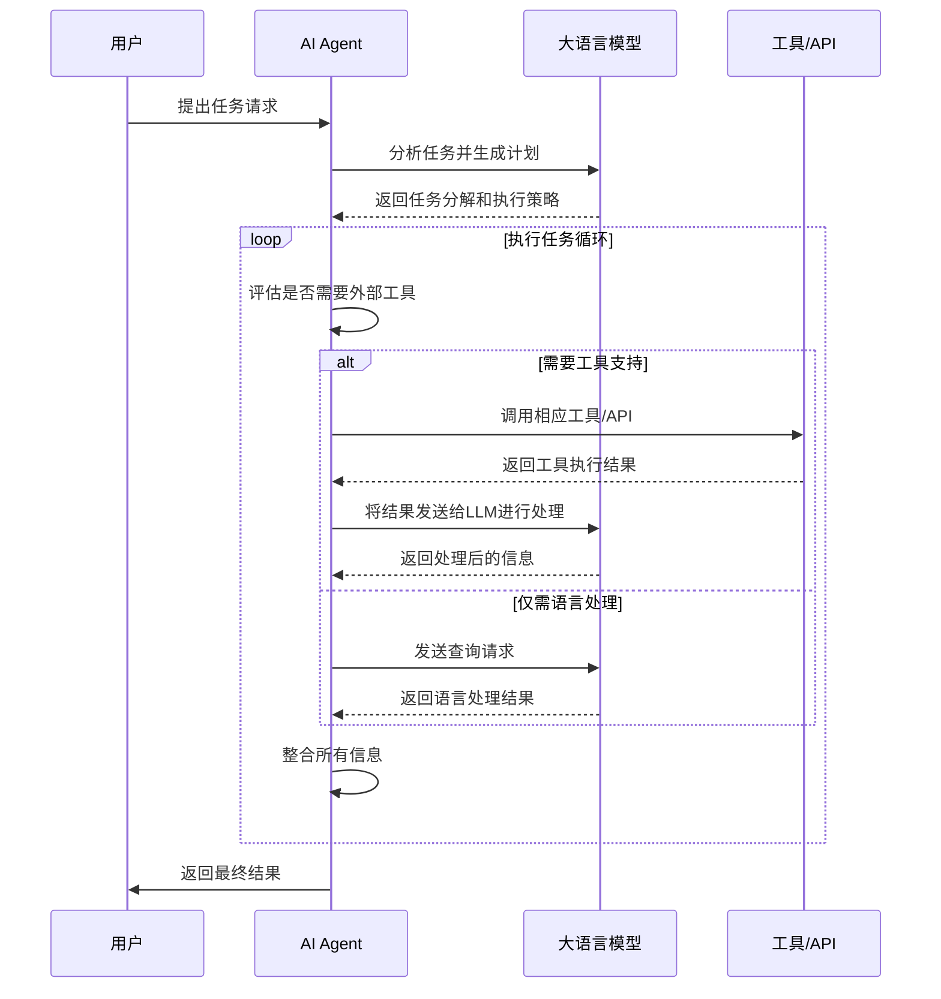
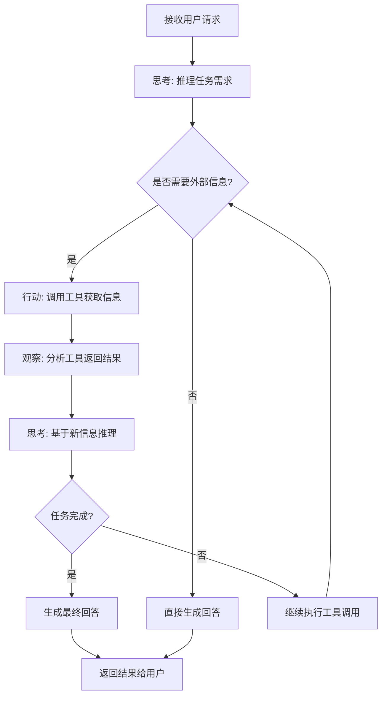
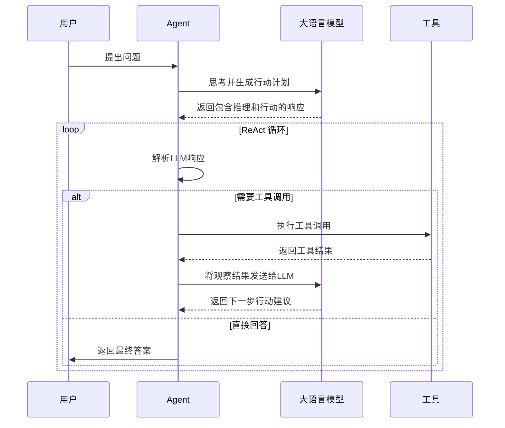
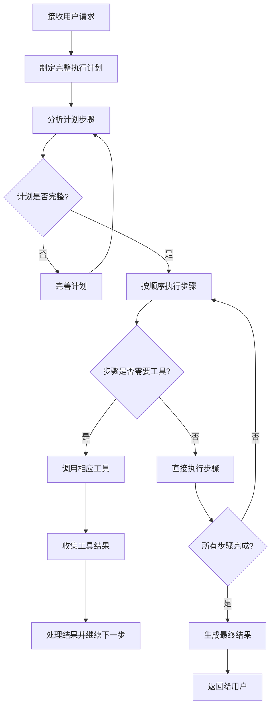
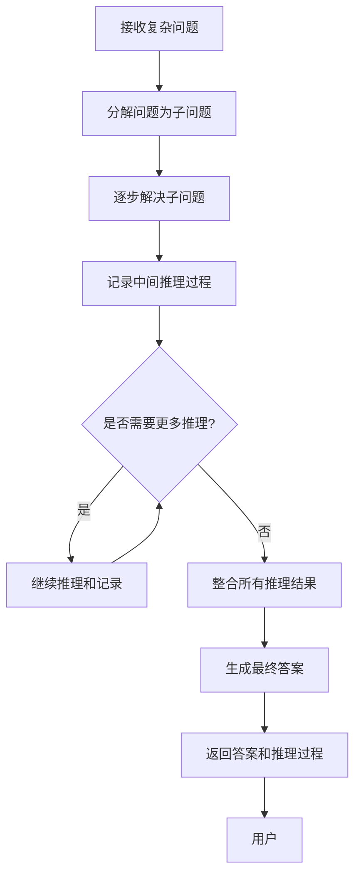
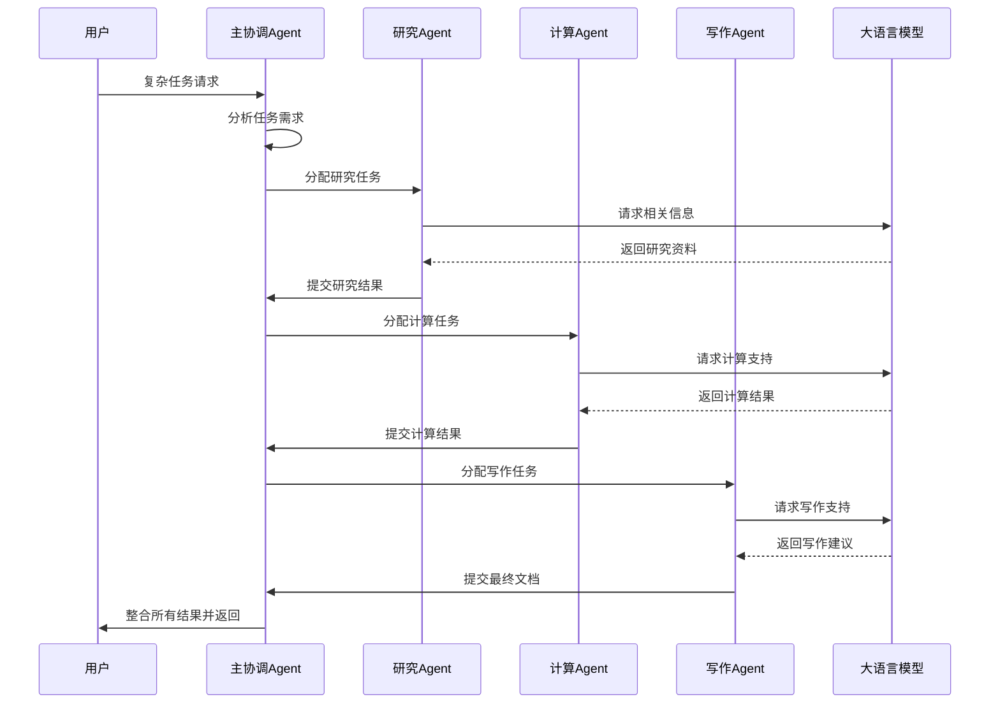
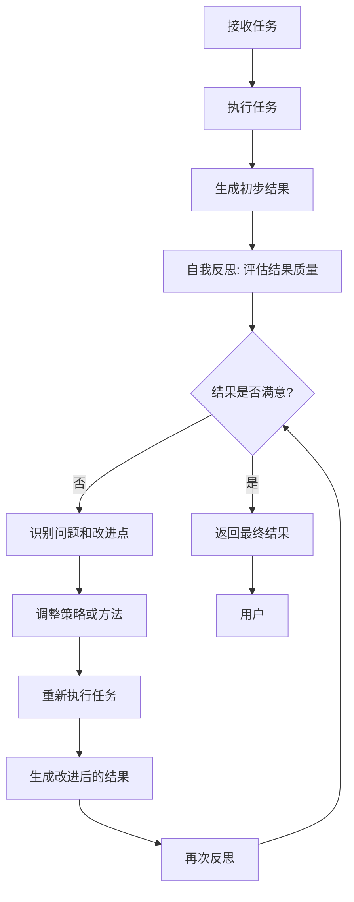

# AI Agent 与大模型协作详解 🤖

在人工智能领域，AI Agent 和大语言模型 (LLM) 正在改变我们与技术交互的方式。本文将详细介绍这些概念以及它们如何协同工作。

## 什么是大语言模型 (LLM)？ 🧠

大语言模型是基于大量文本数据训练的深度学习模型，能够理解和生成人类语言。它们具有以下特点：

- **大规模参数**：通常包含数十亿甚至数千亿参数
- **上下文理解**：能够理解复杂的语言上下文和语义
- **多任务能力**：可以执行多种自然语言处理任务
- **生成能力**：能够生成高质量的文本内容

## 什么是 AI Agent？ 🤖

AI Agent 是构建在大语言模型之上的智能实体，具有以下特征：

- **目标导向**：为特定目标或任务而设计
- **自主性**：能够在最少人工干预下执行任务
- **交互性**：能够与用户、环境和其他系统交互
- **工具使用**：可以调用各种工具和API来完成复杂任务

## Agent 的核心组件 ⚙️

一个典型的 AI Agent 通常包含以下几个核心组件：

### 1. 规划 (Planning)
- 子目标分解：将复杂任务分解为更小的子任务
- 推理与决策：基于当前状态做出决策

### 2. 记忆 (Memory)
- 短期记忆：当前任务的上下文信息
- 长期记忆：历史交互和知识存储

### 3. 工具 (Tools)
- API 调用：访问外部服务和数据
- 代码执行：运行代码片段处理数据
- 文件操作：读写文件和处理文档

### 4. 执行 (Execution)
- 动作执行：执行计划中的具体步骤
- 结果反馈：将执行结果反馈给用户或系统

## 协作流程时序图 📊

下面的时序图展示了用户、AI Agent、大语言模型和工具之间的协作流程：

## Agent 工作流程详解 🔍

### 1. 任务接收与理解
当用户提出请求时，Agent 首先需要理解任务的具体要求：
- 解析用户意图
- 识别关键信息和约束条件
- 确定任务的复杂度和所需资源

### 2. 计划制定
基于对任务的理解，Agent 制定执行计划：
- 将复杂任务分解为可执行的子任务
- 确定执行顺序和依赖关系
- 选择合适的工具和资源

### 3. 工具调用与执行
在执行过程中，Agent 可能需要调用各种工具：
- 搜索引擎：获取最新信息
- 计算工具：执行数学运算
- 文件系统：读写文件
- API接口：与其他服务交互

### 4. 结果整合与反馈
Agent 将所有执行结果整合并反馈给用户：
- 验证结果的准确性和完整性
- 以用户友好的方式呈现结果
- 根据需要提供进一步的建议或操作

## Agent 的运行模式 🔄

AI Agent 有多种运行模式，每种模式都有其特定的应用场景和优势。下面我们详细介绍几种主要的运行模式。

### 1. ReAct 模式 (Reasoning + Acting) 🤔+⚡

ReAct 模式结合了推理 (Reasoning) 和行动 (Acting)，是目前最流行的 Agent 运行模式之一。

#### ReAct 模式流程图：

#### ReAct 模式时序图：

#### ReAct 模式的优点：
- 结合了推理和行动能力
- 能够处理需要外部信息的复杂任务
- 具有良好的可解释性
- 可以动态调整执行策略

### 2. Plan-and-Execute 模式 📋+▶️

这种模式首先制定完整的计划，然后按计划执行。

#### Plan-and-Execute 流程图：

### 3. Chain-of-Thought (CoT) 模式 🔗

Chain-of-Thought 模式通过展示推理过程来提高复杂任务的准确性。

#### CoT 模式流程图：

### 4. Multi-Agent 协作模式 👥

多个 Agent 协同工作，各自负责不同的任务或专业领域。

#### Multi-Agent 协作时序图：

### 5. Reflection 模式 🪞

Agent 在执行任务后会反思自己的表现，并进行自我改进。

#### Reflection 模式流程图：

## Agent 的应用场景 💼

### 1. 智能助手
- 日程管理
- 信息查询
- 邮件撰写

### 2. 客服机器人
- 自动回答常见问题
- 处理客户投诉
- 订单跟踪

### 3. 数据分析师
- 数据收集与清洗
- 统计分析
- 报告生成

### 4. 内容创作者
- 文章撰写
- 图像生成
- 视频编辑

## 技术挑战与未来发展 🚀

### 当前挑战
1. **可靠性**：确保 Agent 的决策和执行准确可靠
2. **安全性**：防止恶意使用和数据泄露
3. **可解释性**：让用户理解 Agent 的决策过程
4. **效率优化**：减少响应时间和资源消耗

### 发展趋势
1. **多模态能力**：结合文本、图像、语音等多种模态
2. **个性化定制**：根据用户偏好和习惯定制服务
3. **持续学习**：从交互中不断学习和改进
4. **协作网络**：多个 Agent 之间的协同工作

## 总结 📝

AI Agent 与大语言模型的结合为人工智能应用开辟了新的可能性。通过合理的架构设计和工具集成，Agent 能够执行越来越复杂的任务，为用户提供更加智能和便捷的服务。

随着技术的不断发展，我们可以期待看到更多创新的 Agent 应用场景，以及更加智能和高效的协作模式。🚀

> 💡 **小贴士**：在设计和使用 AI Agent 时，始终要考虑用户体验、数据安全和系统可靠性，这样才能真正发挥 AI 技术的价值。