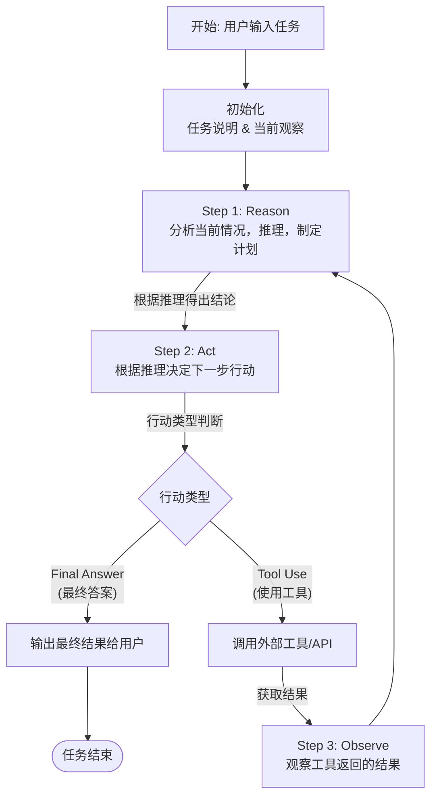

# 链接
(mcp.so)[https://mcp.so]
## prompt
- 具体场景：
- 明确需求：
- 细节描述：
- 简洁表达：
- 使用合适的提示词：
# Agent
## 什么是Agent
背景：大模型回答能力强，但无法**感知或者改变**外界环境

定义：把一个大模型和一堆工具组装起来，变成一个能感知和改变外界环境的智能程序，我们就称为Agent。

## Agent运行模式（ReAct）


```mermaid
st=>start: 开始框
```

一个简单的文本示例

**任务**: “爱因斯坦最近发表的论文是什么？” （假设大模型的训练数据截止于2023年，而现在是2024年）

- Reason: “爱因斯坦已经去世多年，不可能有新论文。用户可能想问的是关于他的论文的最新新闻或者某篇近期被讨论很多的论文。我应该先搜索一下。”

- Act: search_web("爱因斯坦 论文 最新 2024")

- Observe: 工具返回：[“2024年1月，某实验室宣布首次验证了爱因斯坦某篇预测XX现象的论文...”]

- Reason: “好的，搜索结果提到了2024年的新闻，是关于验证他的一篇旧论文。现在我需要更具体地了解是哪篇论文，以及验证了什么内容。”

- Act: search_web("爱因斯坦 论文 验证 XX现象 2024")

- Observe: 工具返回了更详细的论文名称和实验内容。

- Reason: “现在我掌握了足够的信息，可以综合这些内容为用户提供一个清晰准确的答案。”

- Act (Final Answer): “爱因斯坦本人并未在2024年发表新论文。您可能指的是2024年1月，XX团队在《自然》杂志上发表论文，宣布首次成功验证了爱因斯坦在19XX年提出的关于‘YY现象’的理论预测。该论文名为《...》。”

## Agent如何实现

# Context Engineering
是某一类技术的统称。
- Context：代表模型的输入
- Context Window：代表模型输入的上限，以token数量单位来表示
- Context Engieering：精心设计给模型的输入内容
- 实现方式
- - 保存context
- - 选择context
- - 压缩context
- - 隔离context