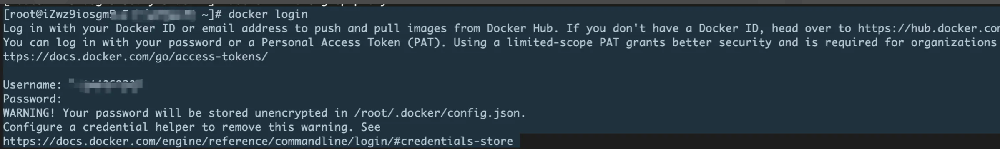

# Docker
|特性|DockerFile|docker-compose.yml|
|---|---|---|
|目的|构建一个镜像|编排多个容器|
|角色|零件清单和组件说明书|整个工厂的流水配置图|
|范围|定义单个容器的内容和环境|定义多个服务以及关系（网络、卷、依赖）|
|内容|FORM、RUN、COPY、CMD| `service`,`networks`,`volumes`等配置项 |
|命令|`docker build ...`|`docker-compose up ...`|
|使用场景|创建自定义的应用镜像|开发、测试、部署多服务引用（全栈）|


## docker-compose
docker-compose up 会按照以下逻辑处理镜像：
1. 解析compose文件：识别出每个服务所需要的镜像
2. 检查镜像是否存在
3. 自动拉取镜像
   - 不存在，自动拉取
   - 存在：使用本地
4. 构建镜像：`build .` Compose会根据DockerFile构建一个新的镜像
5. 启动容器：在所有所需要的镜像已就位之后，会根据配置创建并启动所有容器


## 命令
```shell
docker ps -a --filter id=958edf28e695
docker logs nest-app-test
docker exec -it nest-app-test sh
sudo docker exec -it 958edf28e695 /bin/bash
```

## pm2读取日志
```js
// 日志配置 - 增强版
log_date_format: 'YYYY-MM-DD HH:mm:ss',
error_file: './logs/error.log',
out_file: './logs/output.log',
merge_logs: true,
```
```shell
# 在容器内
# 查看所有应用的日志列表
pm run pm2 logs

# 查看特定应用的日志（plusecube_nest为应用名称）
pm run pm2 logs plusecube_nest

# 只查看错误日志
npm run pm2 logs plusecube_nest --err

# 只查看标准输出日志
npm run pm2 logs plusecube_nest --out

# 实时监控日志（尾部）
pm run pm2 logs plusecube_nest --lines 100
```

```shell
# 宿主内
# 查看容器内logs目录内容
docker exec -it nest-app-test ls -la /app/logs/

# 查看错误日志内容
docker exec -it nest-app-test cat /app/logs/error.log

# 查看输出日志内容
docker exec -it nest-app-test cat /app/logs/output.log

# 实时跟踪日志
docker exec -it nest-app-test tail -f /app/logs/output.log
```


## 问题处理
> 解决 docker: Error response from daemon: Get “https://registry-1.docker.io/v2/“
### 背景
在CI/CD通过docker部署前端项目，通过ssh链接云服务器后，进行docker登录，docker pull等操作时，发现连接超时。多个教程提到配置国内加速镜像，仍然失败。最后采用配置代理的方式访问。
```shell
# 连不上docker hub
docker login
```
报错信息 `Error response from daemon: Get "https://registry-1.docker.io/v2/": net/http: request canceled while waiting for connection (Client.Timeout exceeded while awaiting headers)`

### 配置
云服务器：以阿里云RHEL 系centOS为例。
```shell
# 查看服务器
cat /etc/os-release
lsb_release -a
```
#### centOS 下载 clash，启动clash
```shell
mkdir /tmp
wget https://github.com/doreamon-design/clash/releases/download/v2.0.24/clash_2.0.24_linux_amd64.tar.gz
tar -xvf clash_2.0.24_linux_amd64.tar # 下载

mv clash /usr/local/bin/clash # 移动到执行命令下

clash -v 

sudo mkdir -p /etc/clash # clash的配置位置
cd /etc/clash

sudo wget https://cdn.jsdelivr.net/gh/Dreamacro/maxmind-geoip@release/Country.mmdb  
sudo chmod 644 /etc/clash/Country.mmdb # 配置地域数据库

nano /etc/systemd/system/clash.service # 打开编辑器，复制下面clash.service的配置

# nano ctrl+o后 回车， ctrl+x 退出

# 配置节点代理信息 xxxx为自己的代理配置yaml文件，注意端口号，比如这里我是7897
sudo tee /etc/clash/config.yaml <<-'EOF'
xxxx
EOF

sudo systemctl daemon-reload  # 重新加载systemd配置
sudo systemctl enable clash  # 设置开机自启
sudo systemctl start clash   # 立即启动Clash

export http_proxy=http://127.0.0.1:7897 # 设置代理，本次会话，端口请查看自己的代理配置文件yaml
export https_proxy=http://127.0.0.1:7897 # 同上

systemctl status clash # 其他帮助命令
sudo systemctl restart clash # 其他帮助命令
sudo systemctl start clash # 其他帮助命令

curl -I https://www.google.com # 验证代理是否能通
```

`/etc/systemd/system/clash.service 文件内容`
```yaml
[Unit]
Description=Clash Proxy Service
After=network.target
[Service]
Type=simple
User=root
ExecStart=/usr/local/bin/clash -d /etc/clash
Restart=on-failure
[Install]
WantedBy=multi-user.target
```

#### 配置docker的代理（关键）
docker下载操作（这里不列出）
编辑 `/etc/docker/daemon.json` 提供一份配置，注意端口与上文的`export http_proxy=http://127.0.0.1:7897`要一致
```json
  {"registry-mirrors" : [
    "https://docker.m.daocloud.io",
    "https://mirror.aliyuncs.com"
  ],
  "insecure-registries" : [
    "docker.mirrors.ustc.edu.cn"
  ],
    "proxies": {
    "http-proxy": "http://127.0.0.1:7897",
    "https-proxy": "http://127.0.0.1:7897",
    "no-proxy": "localhost,127.0.0.1,192.168.0.0/16,10.0.0.0/8"
  },
  "debug": true,
  "experimental": false
}
```
配置完docker代理后
```shell
sudo systemctl daemon-reload #更新
sudo systemctl start docker #启动
docker login #尝试登录
```
docker成功连接上docker hub
