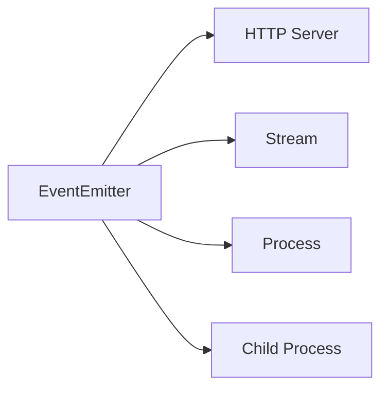

# 后端

后端部分以 node、nest 为主

## Node 是什么？优缺点？应用场景？

`Node.js`是一个开源`JavaScript`运行环境。在浏览器外，利用事件驱动，非阻塞和异步输入输出模型来提升性能。

### 优缺点

优点：

- 处理高并发场景性能更佳
- 适合 io 密集型应用，指的是应用在运行极限时，CPU 占用率仍然很低。大部分时间在做 io 硬盘内存操作

缺点：
因为 node 是单线程

- 不适合 CPU 密集型应用
- 只支持单核 cpu，不能充分利用 cpu
- 可靠性低，一旦代码某个环节崩溃，整个系统都奔溃。

### 应用场景

- 善于 I/O。不善于计算。因为 Nodejs 是单线程，如果计算（同步）太多。则会阻塞线程
- 大量并发 I/O。应用程序内部程序并不需要进行非常复杂的处理。

## Node 的核心特性

### 1. 核心特性一：非阻塞 I/O 模型（Node.js 高性能的基石）

**核心原理：**Node.js 基于 libuv（跨平台 I/O 库）实现非阻塞 I/O：
当发起 I/O 操作（如文件读写、数据库查询、网络请求）时，主线程不会「阻塞等待」结果，而是将 I/O 任务交给 libuv 维护的线程池（默认 4 个线程）处理；待 I/O 完成后，线程池会将结果封装成「事件」，通过「事件循环」通知主线程，最终执行对应的回调函数。

**解决的问题 & 优势：**对比传统「阻塞 I/O 模型」（如 Java 早期的 Tomcat，每个请求对应一个线程，线程切换开销大、内存占用高）：

实际应用场景

- 高并发 I/O 密集型业务：如 API 服务（用户登录、订单查询）、即时通讯（WebSocket 消息转发）、日志收集系统（大量文件读写）。

### 核心特性二：事件驱动模型

核心原理：Node.js 以「事件」为核心调度单元，整个运行流程围绕 事件循环（Event Loop） 展开：

1. 主线程启动后，初始化事件循环，加载核心模块 / 用户代码；
2. 监听各类事件（如 I/O 完成事件、定时器事件、网络连接事件）；
3. 事件触发时，对应的「回调函数」会被加入「回调队列」；
4. 事件循环按固定顺序（6 个阶段）遍历回调队列，依次执行回调，直到队列清空。

事件循环 6 阶段：

1. timers：执行 setTimeout/setInterval 的回调；
2. pending callbacks：执行延迟的 I/O 回调（如 TCP 连接错误回调）；
3. idle/prepare：Node.js 内部使用，开发者无需关注；
4. poll：等待新的 I/O 事件（如文件读取完成、HTTP 请求到达），是事件循环的核心阶段；
5. check：执行 setImmediate 的回调；
6. close callbacks：执行关闭事件的回调（如 socket.on('close', ...)）。

场景：

- HTTP 服务器（监听 request 事件处理请求）、TCP 服务（监听 connection 事件建立连接）。

### 核心特性三：单线程模型（+ 多核补充方案）

核心原理

- 主线程单线程：Node.js 的 JavaScript 执行线程是「单线程」，所有同步代码、异步回调（如 I/O 回调、定时器回调）都在这一个线程中执行；
- 底层并非单线程：I/O 任务由 libuv 线程池处理，CPU 密集型任务可通过 Worker Threads（Node.js 10.5+ 支持）创建子线程，避免阻塞主线程。
  优势&局限
  |维度|优势|局限|解决方案|
  |---|---|---|---|
  |资源开销|无需多线程切换（上下文切换成本高）、无死锁风险，内存占用低| 单线程无法利用多核 CPU|用 cluster 模块创建集群（多进程），或 Worker Threads 分拆任务|
  |开发成本|无需处理线程同步（如锁、信号量），代码更简洁|CPU 密集型任务会阻塞事件循环（如大数据计算）|拆分 CPU 任务到 Worker Threads，或用微服务架构分摊计算压力|


应用场景
- 优先适合 I/O 密集型业务（如接口服务、数据采集）；
- CPU 密集型业务（如数据加密、报表生成）需配合 Worker Threads 或 cluster 模块。

### 核心特性四：基于 V8 引擎

- JIT 即时编译：并非「解释执行」（逐行翻译），而是将高频执行的 JS 代码编译为机器码，执行速度接近 C++ 等原生语言；
- 自动内存管理：通过「分代垃圾回收（GC）」机制管理内存：
- - 新生代：存储短期存活对象，用「Scavenge 算法」快速回收；
- - 老生代：存储长期存活对象，用「Mark-Sweep + Mark-Compact 算法」回收，减少内存碎片。

### 核心特性五：模块化系统（CommonJS + ES Module）

Node.js 解决了 JS 无原生模块的问题，支持两种主流模块化规范：
|规范|核心语法|加载时机|适用场景|缓存机制机制|
|---|---|---|---|---|
|CommonJS|require('模块')导入 module.exports 导出|运行时动态加载|Node.js 后端默认规范（如 API 服务）|第一次 require 后缓存模块，后续直接取缓存|
|ES Module|import 导入 export 导出| 编译时静态加载|前端同构项目（如 Vue/React SSR）、TS 项目|需配置 package.json 中 "type": "module"，缓存逻辑类似|

## Node 的 stream 的理解？应用场景

核心概念:用于处理**流式数据**，它提供一种抽象接口，允许你高效处理那些不需要（或不能）一次性全部加载到内存中的数据源或者目的地。

1. 数据分块处理。核心思想是把数据分割成较小块，然后逐步处理这些块，想象水流通过管道，而不是一次性搬动整个湖泊。
2. 内存效率。处理大型文件（如视频、日志、数据库备份）或持续产生的数据（如实时传感器数据、网络请求）时，Stream 允许你边读边处理边写，只保持当前处理块在内存中，极大降低内存占用，避免程序因处理大文件而崩溃
3. 时间效率。你可以在数据可用时立即开始处理第一个数据块，而无需等待整个数据源加载完毕。同样，处理完的数据块也可以立即发送到目的地。这显著减少了整体处理时间，尤其对于网络传输或实时处理。
4. 组合型。node 的`pipe`可以轻松将多个流连接起来，`sourceStream.pipe(transfromStream).pipe(destination)`
5. 事件驱动。stream 是 Node.js 事件驱动架构的典型表现。它们继承`EventEmitter`.通过事件（如 'data', 'end', 'error', 'finish'）通知你数据的到达、结束、错误或写入完成。

### 四种流类型

| 名字 | Readable Streams                                                                              | Writable Stream                                                                     | Duplex Streams                                                                        | Transform Streams                                                                                              |
| ---- | --------------------------------------------------------------------------------------------- | ----------------------------------------------------------------------------------- | ------------------------------------------------------------------------------------- | -------------------------------------------------------------------------------------------------------------- |
| 介绍 | 数据源。你可以从中读取数据。                                                                  | 数据目的地。你可以向其中写入数据。                                                  | 同时实现 Readable 和 Writable 接口。可以读也可以写，输入和输出端通常是独立的。        | 一种特殊的 Duplex 流。它的输出是其输入的某种计算或转换结果。写入转换流的数据经过处理后，通常会被读取出来。     |
| 例子 | http 请求、文件读取流`fs.createReadStream`、process.stdin、TCP sockets、`zlib.createGunzip()` | http 响应，文件写入流，process.stdout/process.stderr,TCP socket,`zlib.createGzip()` | TCP socket, zlib 流 (如 zlib.createDeflate())，crypto 流 (如 crypto.createCipheriv()) | zlib 流 (压缩/解压), crypto 流 (加密/解密), 自定义的流用于解析 (如 JSON.parse 流)、重新格式化、添加/删除数据等 |

### 背压

- 当**可读性流**生产数据的速度大于**可写流**消费数据的速度，就会产生背压。
- node 的`stream`内部机制自动处理背压
- `pipe`方法，这套背压机制是自动处理的。

### 应用场景

凡事涉及处理**大量数据或持续数据流**的地方，都是它的用武之地。

1. 文件处理（大文件处理）
   - 复制大文件 `fs.createReadStream('source.iso').pipe(fs.createWriteStream('copy.iso'))`内存恒定且极小。
   - 视频/图片处理：转码、压缩、水印添加。处理大尺寸媒体图片避免尺寸爆炸。
   - 读取巨大的日志文件进行分析（如统计、搜索、聚合），逐行（`readline`模块基于流）或分块读取处理。
   - 数据导入/导出：将大型 csv/json 文件流式导入数据库或从数据库导出。
2. 网络通信

   - http 请求响应。req 和 res 本身就是流。处理上传的大文件（如图片、视频）时，使用流可以边接收边保存或处理，避免内存耗尽。下载大文件给客户端也是流式传输。
   - API 代理：代理服务器接收到客户端请求流，直接管道传输给目标服务器；接受到目标服务器响应流，直接管道传输给客户端。
   - websockets/tcp sockets：实现双向通信。数据持续流动

3. 数据转换与处理管道：
   - 压缩/解压缩 `fs.createReadStream('input.txt').pipe(zlib.createGzip()).pipe(fs..createWriteStream('input.txt.gz'))`
   - 加密/解密：类似压缩，使用`cypto`模块的流
   - 数据格式转换： 例如，将 CSV 流转换为 JSON 流（使用自定义的 Transform 流或第三方库如 csv-parser 和 JSONStream）。
   - 实时数据处理： 传感器数据流、金融行情流，经过一系列转换流进行过滤、聚合、分析。
4. 命令行工具 (CLI) 与进程间通信 (IPC)：
   - `process.stdin`、`process.stdout`、`process.stderr`都是流。构建 CLI 工具时，可以管道连接输入输出。例如`child_process.spawn`产生的子进程`stdout/stderr`也是流。
5. 数据库操作：
   - 一些数据库驱动支持流式查询结果，避免一次性将所有结果加载到内存，尤其海量数据集。

### 总结

stream 是流式数据处理的基石。通过分块和管道的机制，完美解决了处理大数据集和持续数据流的内存效率和时间效率。

## Node 的 process 的理解？应用场景

是 Node 的一个全局对象，提供与**当前运行的 Node.js 进程**进行交互和控制的接口。理解`process`是掌握 Node.js 环境、执行控制、资源访问和进程管理的关键。
核心理解：

1. 进程代表者，process 对象代表了当前正在执行的 Node.js 程序实例。
2. 信息中心：提供关于**进程本身**、**运行环境**和**执行上下文**（工作目录、环境变量）的丰富信息。
3. 控制中心。它允许你**控制进程行为**，**监听进程事件**和与**操作系统交互**
4. 全局访问点。它提供访问标准流（stdin、stdout、stderr）的入口点，这是程序与外部世界（命令行、其他进程）通信的主要方式。
5. 异步钩子。它包含一些特殊的队列机制(`process.nextTick()`),用于微调异步操作的执行时机。
   常用方法详解：

#### 进程信息与控制：

- process.pid: 返回当前进程的进程 ID (PID)。

- process.ppid: 返回当前进程的父进程的进程 ID (仅在支持时可用，如 Linux/macOS)。

- process.argv: 返回一个数组，包含启动 Node.js 进程时传递的命令行参数。

- process.argv[0]: Node.js 可执行文件的绝对路径。

- process.argv[1]: 正在执行的 JavaScript 文件的绝对路径。

- process.argv[2] 及以后：用户传入的命令行参数。

- process.exit([code]): 强制同步终止 Node.js 进程。可以指定退出码 code (默认为 0，表示成功；非 0 通常表示失败)。调用后，事件循环立即停止，不再执行任何后续异步操作。

- process.kill(pid[, signal]): 向指定的进程 ID (pid) 发送一个系统信号（如 'SIGTERM', 'SIGINT'）。默认信号是 'SIGTERM'。常用于控制子进程或自身 (process.kill(process.pid, 'SIGTERM'))。

#### 环境变量

- process.env: 返回一个包含用户环境的键值对对象。用于存储配置信息（如数据库连接字符串、API 密钥、运行模式 NODE_ENV）。

```js
const dbUrl = process.env.DATABASE_URL;
const isProduction = process.env.NODE_ENV === "production";
```

#### 标准输入输出

- `process.stdin`:一个连接到标准输入 (stdin) 的 Readable Stream。用于从命令行或管道读取用户输入。

```js
process.stdin.on("data", (data) => {
  console.log(`You typed: ${data}`);
});
```

- process.stdout: 一个连接到标准输出 (stdout) 的 Writable Stream。用于向控制台输出信息

```js
process.stdout.write("Hello, World!\n"); // 等同于 console.log 的基础
```

- process.stderr

```js
process.stderr.write("Error: Something went wrong!\n");
```

#### 工作目录

- `process.cwd()` 当前进程的当前工作目录
- `process.chdir(directory)`.改变 Node.js 进程的当前工作目录到指定的 directory 路径。

#### 进程事件监听

process 对象继承自 EventEmitter，可以监听多种事件：

- exit
- `beforeExit`
- `uncaughtException`
- `unhandleRejection`
- `warning`
- `SIGINT`、`SIGTERM`

```js
process.on("SIGINT", () => {
  console.log("Received SIGINT. Shutting down gracefully...");
});
```

#### 异步操作调度

附加：浏览器与 Node.js 的事件循环差异
|特性|浏览器|Node|
|---|---|---|
|宏任务架构|单一阶段|多阶段（timers、check）|
|微任务类型|Promise,queueMicrotask|Promise,process.nextTick|
|微任务清空的时机|每轮宏任务之后|每个阶段之后|
|事件循环过程| 宏任务 （同步代码、清空微任务）->执行渲染 -> 下一轮宏任务 | timers -> pending -> idle -> poll -> check -> close callbacks |
|`setTimeout` `setImmediate`|`setTimeout`总是先执行|顺序不确定（取决于阶段）|

- `process.nextTick`

```js
console.log("Start");
process.nextTick(() => {
  console.log("Next tick callback");
});
console.log("Scheduled");
// 输出顺序: Start -> Scheduled -> Next tick callback
```

- `process.nextTick`VS `setImmediate`
  nextTick: 在同一个阶段（当前操作后）立即执行。
  setImmediate(): 在事件循环的下一个迭代（'check' 阶段） 执行。

#### 性能分析

- process.hrtime([time])
- process.cpuUsage
- process.memoryUsage()

#### 平台信息

- process.platform
- process.arch
- process.versions
- process.release

#### 总结

Node.js 的 process 对象是程序与自身运行环境交互的核心枢纽。它让你能够：

- 获取信息： 进程 ID、命令行参数、环境变量、工作目录、平台架构、内存/CPU 使用、版本信息。
- 控制流程： 优雅或强制退出进程 (exit, kill)、监听退出和信号事件。
- 处理 I/O： 通过 stdin, stdout, stderr 与外部世界通信。
- 管理环境： 读写环境变量 (env)、改变工作目录 (cwd, chdir)。
- 处理异常： 捕获未处理的异常和 Promise 拒绝 (uncaughtException, unhandledRejection)。
- 调度任务： 使用 nextTick 安排高优先级异步回调。
- 性能监控： 测量时间 (hrtime)、内存 (memoryUsage)、CPU (cpuUsage)。

## 说说 Node 中的 EventEmitter?如何实现一个 EventEmitter?

EventEmitter 是事件驱动架构的核心，提供事件发布/订阅机制，是 Node 非阻塞，事件驱动架构的基础。许多内置模块(Stream、http)都继承 EventEmitter



实现关键：
event 的 key value 形式存在，对于事件的触发。

```js
class EventEmitter {
  constructor() {
    this.events = {};
  }

  on(eventName, listener) {
    if (!this.events[eventName]) {
      this.events[eventName] = [];
    }
    this.events[eventName].push(listener);
  }

  once(eventName, listener) {
    const onceWrapper = (...args) => {
      listener.apply(this, args);
      this.removeListener(eventName, onceWrapper);
    };
    this.on(eventName, onceWrapper);
  }

  emit(eventName, ...args) {
    const listeners = this.events[eventName];
    if (listeners) {
      listeners.forEach((listener) => {
        listener.apply(this, args);
      });
    }
  }

  removeListener(eventName, listenerToRemove) {
    const listeners = this.events[eventName];
    if (listeners) {
      this.events[eventName] = listeners.filter(
        (listener) => listener !== listenerToRemove
      );
    }
  }

  removeAllListeners(eventName) {
    delete this.events[eventName];
  }
}
```

## 说说 Node 文件查找的优先级以及 Require 方法的文件查找策略?

## 说说 Node 有哪些全局对象?

## 说说对中间件概念的理解,如何封装 node 中间件?

本质是**请求/响应**处理函数。处于客户端与服务端核心业务逻辑之间，用于完全一系列通用或特定的处理任务。

### 1.核心定义

中间件是用于连接不同组件/流程的“桥梁函数”。在请求到达服务器核心业务之前，或响应返回客户端前，对数据进行加工、验证、转换等。（如日志记录、身份验证、数据解析），最终到达业务逻辑处理层。响应返回时，可能添加响应头，数据格式化等。

### 2. 核心特性

- 链式调用。多个中间件按注册顺序执行，通过特定机制（next）传递控制权。
- 可组合，灵活。可按需组合不同中间件，形成处理流程（日志->身份验证->业务逻辑->响应处理）
- 可复用性。中间件可独立封装，在多个项目或场景中复用。
- 单一责职：一个中间件只处理一件事（日志、验证），符合单一职责原则。

### 3. 常见用途

- 请求预处理：解析请求体、处理 url 参数、验证请求格式。
- 通用功能：记录访问日志、处理跨域、设置缓存策略。
- 权限控制：验证用户身份、检查角色权限。
- 错误处理：捕获请求异常、统一返回错误响应。

```js
// express为例
function logger(req, res, next) {
  console.log(`${req.method} ${req.url}`);
  next();
}
app.use(logger);
```

### 如何封装

## 说说对 Nodejs 中的事件循环机制

核心：事件循环的职责是调度和执行异步操作的回调函数（如 I/O 完成、定时器到期、setImmediate 等）。

主要阶段

1. Timer（定时器）
   - 检查 setTimeout() 和 setInterval() 设定的回调是否到期。执行所有到期的定时器回调。
2. Pending Callbacks（待定回调阶段）
   - 执行一些系统操作（如 TCP 错误）的回调。例如，如果尝试连接收到`ECONNREFUSED`，这个错的回调通常会被推迟到这个阶段执行。
3. Idle，Prepare（空闲、准备阶段）
4. Poll（轮询阶段-核心）
   - 计算阻塞时间，根据下一个即将到期的定时器`setTimeout setInterval` 计算阻塞等待 I/O 事件多长时间
   - 处理 I/O 时间，阻塞并等待新的 I/O 事件到达（如文件读取完成、新的网络连接、新的 HTTP 请求数据到达）。当有事件到达，就执行对应的回调函数（例如 fs.readFile 的回调、net.Socket 的 'data' 事件回调、HTTP request 事件的回调）。
   - Poll 不为空，遍历同步执行，直至清空或系统限制。
   - Poll 为空，如果有`setImmediate`则进入`check`
   - - 如果没有`setImmediate`，定时器到期，则结束 poll 回到 timers
   - - 如果没有到期定时器,则阻塞在 poll 阶段等待 I/O 事件到来。
5. check（检查阶段）
   - 专门执行通过 setImmediate() 设置的回调函数
6. close callback
   - 执行一些关闭事件的回调。例如 socket.on('close', ...) 或 process.nextTick() 中发出的 'close' 事件回调。

## 如何实现文件上传?说说你的思路

核心在于切分和合并，前端使用`new Blob.slice()`切分成小块，上传。
上传完毕后，调用接口通知后端合并,每次写入指定写入位置 `createReadStream().pipe( createWriteStream('upload/'+name,{start:startPos }) )`

```js
@Get('merge')
merge(@Query('name') name: string) {
    const chunkDir = 'uploads/chunks_'+ name;

    const files = fs.readdirSync(chunkDir);

    let startPos = 0;
    files.map(file => {
      const filePath = chunkDir + '/' + file;
      const stream = fs.createReadStream(filePath);
      stream.pipe(fs.createWriteStream('uploads/' + name, {
        start: startPos
      }))

      startPos += fs.statSync(filePath).size;
    })
}
```

## 如何实现 jwt 鉴权机制?说说你的思路

## 如果让你来设计一个分页功能,你会怎么设计?前后端如何交互?

## Node 实现对并发的优化

### 一、核心原理，理解 Node 的并发模型

`node`本身的单线程的，但是它通过事件循环和异步 I/O 实现了高并发处理能力。这里的并发指的是同事处理多个连接的能力，而非真正同事执行多个操作（并行）

- 事件循环。是 node 的引擎，负责调度所有异步操作，它让单个线程可以高效处理成千上万的网络连接。
- 工作池。对于耗时的 CPU 密集型操作（如文件 I/O，加密，压缩），node 通过`libuv`库提供的线程池来处理，避免阻塞事件循环。
  因此，优化首要目标是确保事件循环不被阻塞，并合理利用多核 CPU

### 二、代码层面优化：确保事件循环高效运转

1. 避免阻塞事件循环

- 识别 CPU 密集型任务：复杂计算（大循环）、大型 JSON 序列化和反序列化、同步加密函数等
- 解决方案：
- - 异步 API：始终使用异步版本的 API（`fs.readFile`）
- - 分解任务：使用`setImmediate`或者`process.nextTick`将大任务拆分成小任务，穿插在事件循环的各个阶段执行，让事件循环有机会处理其他事件。
- - 使用 `Worker Threads`。 将真正的 CPU 密集型任务卸载到工作线程中、彻底避免对主事件循环到阻塞。（这是替代过去用 `child_process`处理 CPU 任务的首选方案）

2. 谨慎使用异步编程

- 避免回调地狱和过度嵌套： 使用 Promise 和 async/await 保持代码扁平化，提升可读性和可维护性。
- 合理控制并发数： 即使是异步 I/O，也不是无限制的。例如，使用 p-map、p-queue 等库来控制数据库查询、API 调用等的并发数量，避免下游服务被击垮。

3. 内存管理的优化

- 避免内存泄漏： 妥善管理全局变量、闭包、定时器（setInterval）和事件监听器（EventEmitter），及时清除不再需要的引用。
- 使用高效的数据结构和算法： 减少不必要的计算复杂度。
- 使用流（Streams）处理大数据： 对于文件上传下载、大数据处理等场景，务必使用流（如 fs.createReadStream）来处理，避免将整个数据加载到内存中（fs.readFile）。这是防止内存爆掉的关键。

### 三、进程层面优化：利用多核 CPU

单个 Node 实例只能利用一个 CPU 核心，为了充分利用多核服务器的性能，必须启动多个进程。

1. 集群模式（Cluster Module）

- 原理：Node 内置的`cluster`模块允许我们创建一个主进程和多个子进程。主进程负责监听端口、接收连接、然后以轮询的方式分发给各个子进程处理。
- 效果：轻松将负载分布到多个核心上，大幅提升应用到吞吐量和容错能力（一个 worker 奔溃不影响其他 worker）
- 实践：可以使用`pm2`这样的进程管理工具，它内置了集群功能，只需一条命令`pm2 start app.js -i max`即可启动等于同于 CPU 数的进程，无需手动编写 cluster 代码。

2. 进程管理器

- 工具：PM2
- 作用
- - 集群管理：轻松开启集群模式
- - 故障恢复：进程奔溃后自动重启
- - 零停机重启/重载：支持不停服的情况下更新代码
- - 监控：提供丰富的监控日志和性能指标

### 四、架构层面优化：分布式和水平扩展

当单台服务器性能达到瓶颈，需要在架构做文章

1. 负载均衡：
   - 在多个 Node.js 服务器实例前架设负载均衡器`Nginx`
   - 负载均衡器将进入的流量智能地分发到后端的多个 Node 服务实例上，实现水平扩展。
2. 反向代理
   - 使用`Nginx`作为反响代理放在 Node 应用之前
   - 好处：
   - - 处理静态资源：Nginx 处理静态文件的效率极高，可以减轻 Node 应用的负担。
   - - SSL 终止：由 Nginx 处理 HTTPS 加密/解密，减少 Node 的处理压力
   - - 压缩：由 Nginx 完成 Gzip 压缩
   - - 缓存：可以缓存 API 响应或者页面，直接由 Nginx 返回，无需请求到 Node.js 应用
3. 微服务架构
   - 将庞大的单体应用拆分成多个小型、独立的微服务
   - 每个微服务是一个独立的 Node.js 进程，可以独立开发、部署和扩展。例如，用户服务、订单服务、商品服务都可以独立地进行扩容、针对性更强。

### 五、其他重要优化措施

1. 数据库与缓存优化

- 数据库索引： 确保查询使用了正确的索引，这是提升数据库性能最有效的手段
- 连接池： 使用并配置好数据库连接池（如 mysql2、mongoose），避免频繁创建和销毁连接的开销。
- 缓存： 使用 Redis 或 Memcached 缓存频繁读取但很少变更的数据（如用户信息、配置信息、热门文章），极大减少数据库查询和计算压力。

2. 性能监控与诊断

- 监控工具： 使用 APM（应用性能监控）工具，如 New Relic, Datadog, 或开源的 clinic.js、0x 来持续监控应用性能，定位瓶颈（是事件循环延迟？还是内存问题？）。
- 分析瓶颈： 定期进行压力测试（如使用 autocannon、wrk 工具），找出系统的性能拐点。
