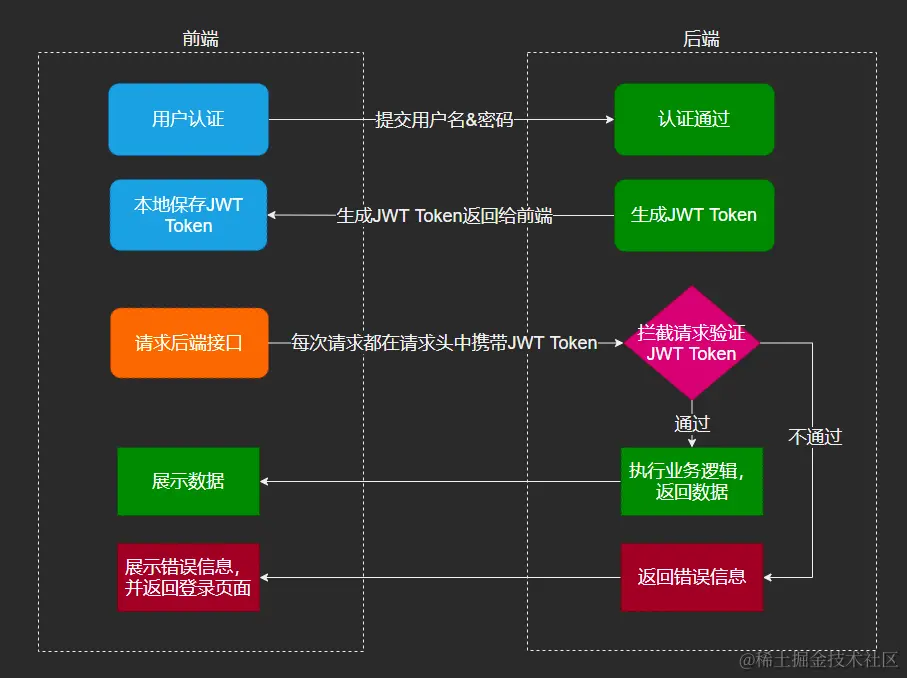
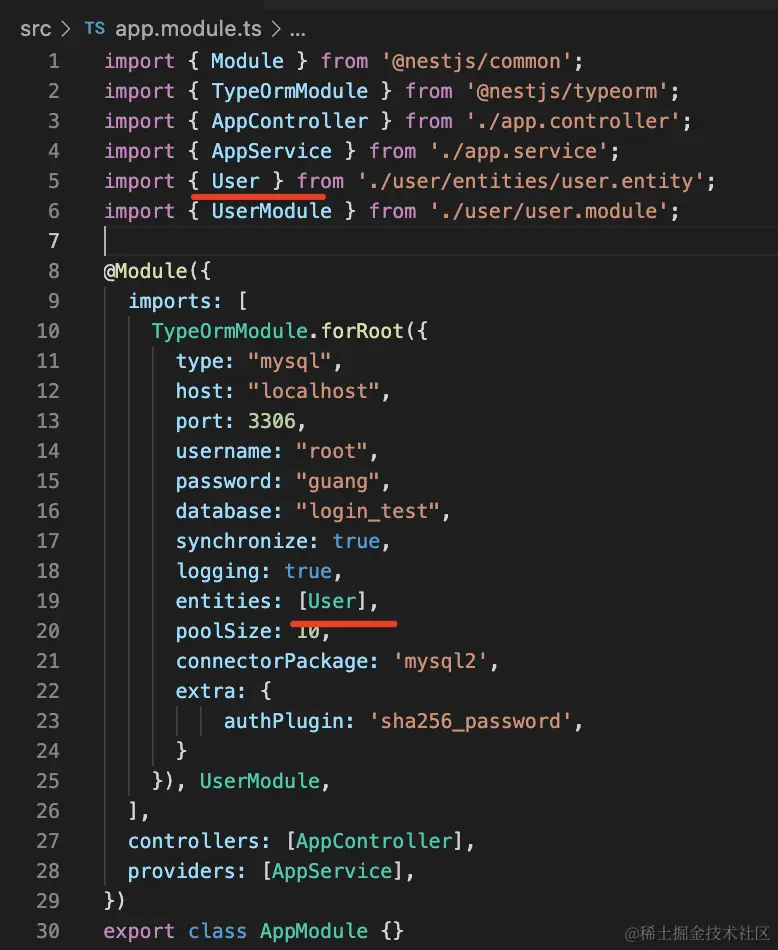
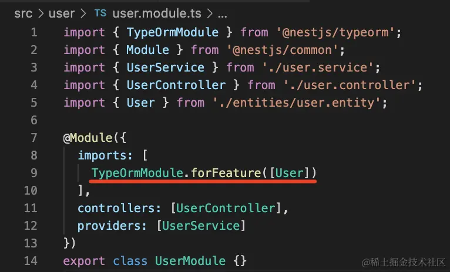
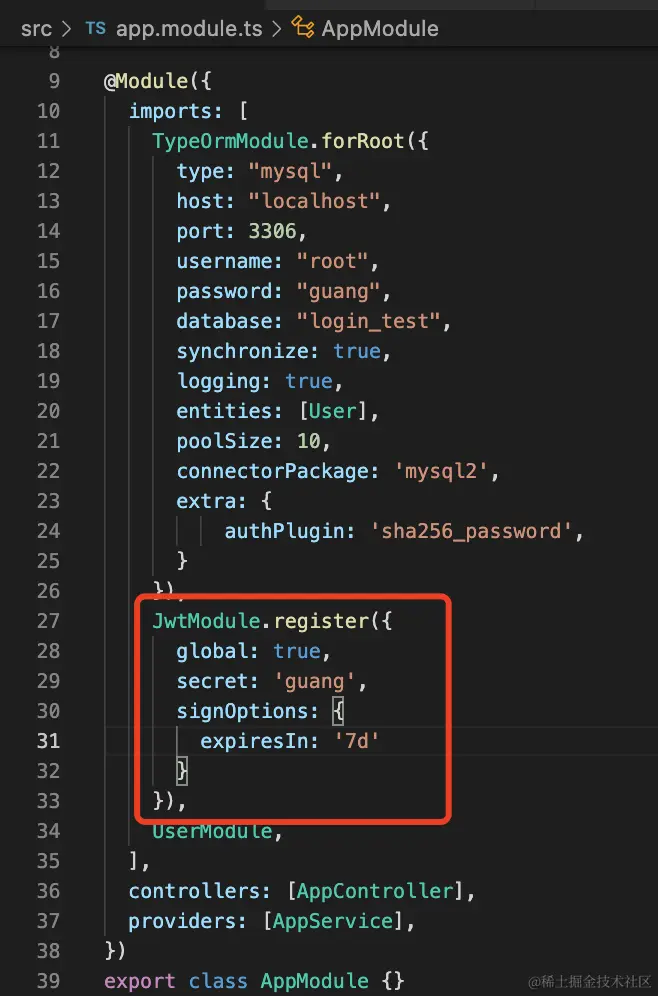
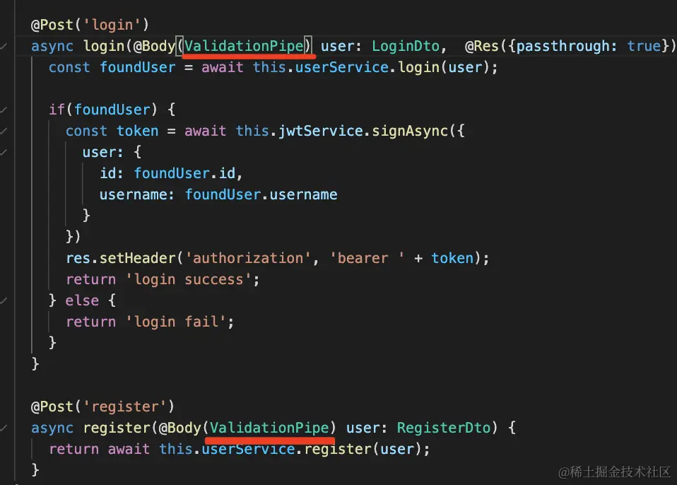
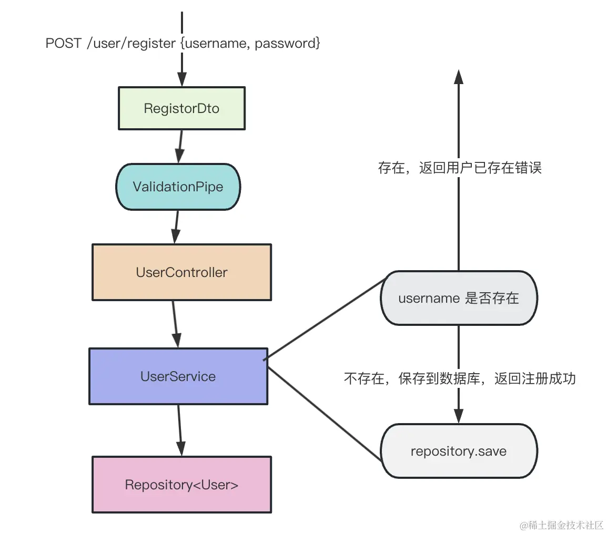
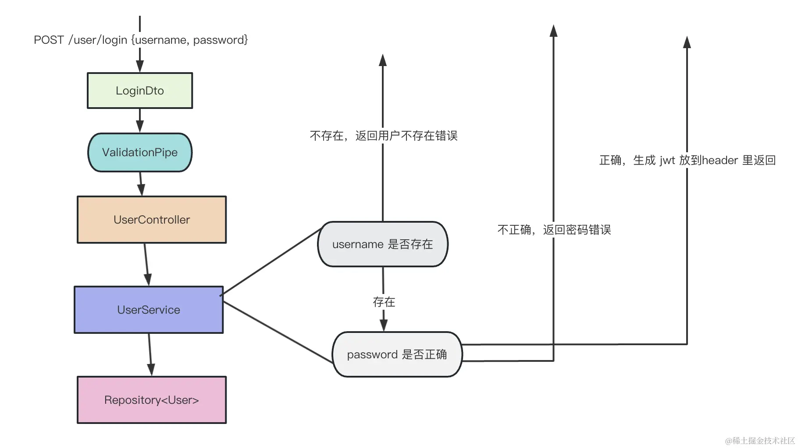
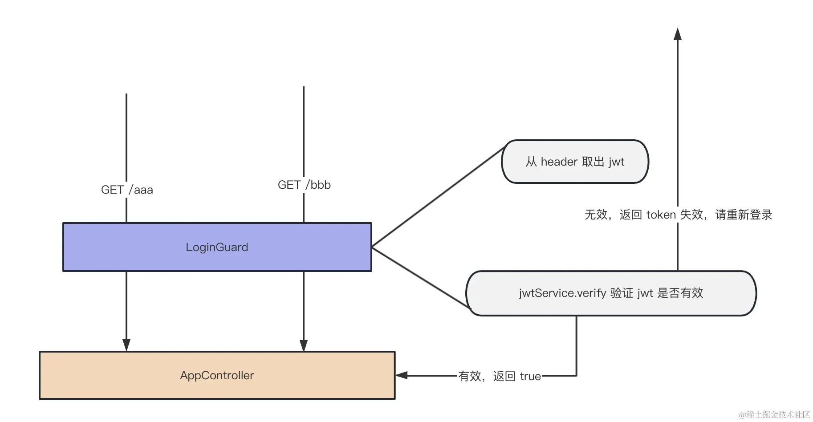

## session+cookie

登录方案有缺陷

- CSRF
  referer 、随机 token
- 分布式
  redis + session
- 跨域
  ajax 主动设置 withCredentials
  服务端设置 allow-origin:xx;allow-credentials:true;

小结：
sesson+cookie 的给 http 添加状态的方案是服务端保存 session 数据，然后把 id 放入 cookie 返回，cookie 是自动携带的，每个请求可以通过 cookie 的 id 找到 seesion，从而实现请求的标识。

## 客户端存储 token

token 的方案常用 json 格式来保存，叫做 json web token，简称 JWT。

JWT 是保存在 request header 里的一段字符串（比如用 header 名可以叫 authorization），它分为三部分：
JWT 由三部分 header、payload、verify signature
header 部分保存当前的加密算法;payload 部分是具体存储的数据;verify signature 部分是把 header 和 payload 还有 salt 做一次加密之后生成的。（salt，盐，就是一段任意的字符串，增加随机性）
这三部分会分别做 Base64，然后连在一起就是 JWT 的 header，放到某个 header 比如 authorization 中：


### 问题：

安全性

jwt 被窃取，所以要搭配 https 使用

性能
cookie 只存 id，jwt 存的内容较多。

没法让 jwt 失效

session 是存在服务端，可以随时让它失效。 配合 redis 解决，记录 token 端生效状态，每次查 redis 是否可用。

小结
jwt 放在 header，请求手动带上。没有 session+cookie 的问题，但也有其他问题。（安全性，性能，没法让 jwt 失效）

## Nest 里实现 Session 和 JWT

```
nest new jwt-and-session -p npm //搭项目
npm install express-session @types/express-session //安装 express-session 和它的 ts 类型定义：
```

入口模块启用

```js
import { NestFactory } from "@nestjs/core";
import { AppModule } from "./app.module";
import * as session from "express-session";

async function bootstrap() {
  const app = await NestFactory.create(AppModule);

  app.use(
    session({
      secret: "guang", //指定加密的密钥 secret。
      resave: false, // 每次访问都会更新 session
      saveUninitialized: false, // true：是不管是否设置 session，都会初始化一个空的 session 对象
    })
  );
  await app.listen(3000);
}
bootstrap();
```

controller 注入 session

```
@Get('sss')
sss(@Session() session) {
    console.log(session)
    session.count = session.count ? session.count + 1 : 1;
    return session.count;
}
```

### Nest 实现 JWT

```
npm install @nestjs/jwt
```

```js
// AppModule
import { Module } from "@nestjs/common";
import { JwtModule } from "@nestjs/jwt";
import { AppController } from "./app.controller";
import { AppService } from "./app.service";
// JwtModule是动态模块
@Module({
  imports: [
    JwtModule.register({
      secret: "guang",
      signOptions: {
        expiresIn: "7d",
      },
    }),
  ],
  controllers: [AppController],
  providers: [AppService],
})
export class AppModule {}
```

controller 注入 JwtModule 搭 JwtService：

```js
@Controller
export class AppController {
    constructor(){}
    @Inject(JwtService)
    private jwtService:JwtService;
}
```

添加一个 handler
这里使用 jwtService.sign 来生成一个 jwt token，放到 response header 里。

因为注入 response 对象之后，默认不会把返回值作为 body 了，需要设置 passthrough 为 true 才可以。

```js
@Get('ttt')
ttt(@Res({ passthrough: true}) response: Response) {
    const newToken = this.jwtService.sign({
      count: 1
    });

    response.setHeader('token', newToken);
    return 'hello';
}
```

后面的请求需要带上这个 token，在服务端取出来 +1 在放回去

```js
@Get('ttt')
ttt(@Headers('authorization') authorization: string, @Res({ passthrough: true}) response: Response) {
    if(authorization) {
      try {
        const token = authorization.split(' ')[1];
        const data = this.jwtService.verify(token);

        const newToken = this.jwtService.sign({
          count: data.count + 1
        });
        response.setHeader('token', newToken);
        return data.count + 1
      } catch(e) {
        console.log(e);
        throw new UnauthorizedException();
      }
    } else {
      const newToken = this.jwtService.sign({
        count: 1
      });

      response.setHeader('token', newToken);
      return 1;
    }
}
```

## MySQL+TypeORM+JWT 实现登录注册

```sql
CREATE SCHEMA login_test DEFAULT CHARACTER SET utf8mb4;
```

```
nest new login-and-register -p npm
```

typeorm

```
npm install --save @nestjs/typeorm typeorm mysql2
```

AppModule 引入 TypeOrmModule

```js
import { Module } from "@nestjs/common";
import { TypeOrmModule } from "@nestjs/typeorm";
import { AppController } from "./app.controller";
import { AppService } from "./app.service";

@Module({
  imports: [
    TypeOrmModule.forRoot({
      type: "mysql",
      host: "localhost",
      port: 3306,
      username: "root",
      password: "guang",
      database: "login_test",
      synchronize: true,
      logging: true,
      entities: [],
      poolSize: 10,
      connectorPackage: "mysql2",
      extra: {
        authPlugin: "sha256_password",
      },
    }),
  ],
  controllers: [AppController],
  providers: [AppService],
})
export class AppModule {}
```

创建 user 的 CRUD 模块

```
nest g resource user
```

引入 User 的 entity：

User 添加属性

```js
import {
  Column,
  CreateDateColumn,
  Entity,
  PrimaryGeneratedColumn,
  UpdateDateColumn,
} from "typeorm";

@Entity()
export class User {
  @PrimaryColumn({ type: "bigint" })
  @BeforeInsert()
  generateRandomId() {
    // 生成一个 10 位的随机数（10^9 到 10^10-1 之间）
    this.id = Math.floor(Math.random() * 9000000000) + 1000000000;
  }
  id: number;

  @Column({
    length: 50,
    comment: "用户名",
  })
  username: string;

  @Column({
    length: 20,
    comment: "手机号",
  })
  phone: string;

  @Column({
    length: 100,
    comment: "邮件",
  })
  email: string;

  @Column({
    length: 255,
    comment: "密码",
  })
  password_hash: string;

  @Column({
    length: 100,
    comment: "密码盐值",
  })
  salt: string;

  @Column({
    type: "int",
    default: 1,
    comment: "状态(0-禁用,1-正常)",
  })
  status: number;

  @CreateDateColumn({
    comment: "创建时间",
  })
  created_at: Date;

  @UpdateDateColumn({
    comment: "更新时间",
  })
  updated_at: Date;
}
```

运行

```
npm run start:dev
```

在 UserModule 引入 TypeOrm.forFeature 动态模块，传入 User 的 entity。


这样模块内就可以注入 User 对于的 Repo 了

```js
@Injectable()
export class UserService {
    @InjectRepository(User)
    private userRepository:Repository<User>
}
```

然后实现 User 的 CRUD
添加 2 个 handler

```js
import { Controller, Get, Post, Body, Patch, Param, Delete } from '@nestjs/common';
import { UserService } from './user.service';

@Controller('user')
export class UserController {
  constructor(private readonly userService: UserService) {}

  @Post('login')
  login() {

  }

  @Post('register')
  register() {

  }
}
```

添加两个 dto
login.dto.ts
register.dto.ts

```js
export class LoginDto {
  username: string;
  password: string;
}
export class RegisterDto {
  username: string;
  password: string;
}
```

handle 使用这个两个 dto 接受参数

```js
@Controller('user')
export class UserController {
  constructor(private readonly userService: UserService) {}

  @Post('login')
  login(@Body() user:LoginDto) {

  }

  @Post('register')
  register(@Body() user:LoginDto) {
    return await this.userService.register(user);
  }
}
```

userService 实现注册

```js
import { RegisterDto } from './dto/register.dto';
import { HttpException, HttpStatus, Injectable, Logger } from '@nestjs/common';
import { InjectRepository } from '@nestjs/typeorm';
import { Repository } from 'typeorm';
import { User } from './entities/user.entity';
import * as crypto from 'crypto';

function md5(str) {
  const hash = crypto.createHash('md5');
  hash.update(str);
  return hash.digest('hex');
}

@Injectable()
export class UserService {

  private logger = new Logger();

  @InjectRepository(User)
  private userRepository: Repository<User>;


  async register(user: RegisterDto) {
    const foundUser = await this.userRepository.findOneBy({
      username: user.username
    });

    if(foundUser) {
      throw new HttpException('用户已存在', 200);
    }

    const newUser = new User();
    newUser.username = user.username;
    newUser.password = md5(user.password);

    try {
      await this.userRepository.save(newUser);
      return '注册成功';
    } catch(e) {
      this.logger.error(e, UserService);
      return '注册失败';
    }
  }
}
```

实现登录

```js
// 添加handle
@Post('login')
async login(@Body() user: LoginDto) {
    const foundUser = await this.userService.login(user);

    if(foundUser) {
      return 'login success';
    } else {
      return 'login fail';
    }
}

//添加对应的service
async login(user: LoginDto) {
    const foundUser = await this.userRepository.findOneBy({
      username: user.username,
    });

    if(!foundUser) {
      throw new HttpException('用户名不存在', 200);
    }
    if(foundUser.password !== md5(user.password)) {
      throw new HttpException('密码错误', 200);
    }
    return foundUser;
}
```

登录成功后，把用户信息放在 jwt 或者 session 中一份

```
npm install @nestjs/jwt
```

AppModule 引入 JwtModule

global:true 声明为全局模块，这样就不用每个模块都引入它了，指定加密密钥，token 过期时间。

在 UserController 里注入 JwtService：

```js
export class UserController {

    @Inject(JwtService)
    private jwtService:JwtService;
}
```

然后在登录成功后，把 user 信息放到 jwt 通过 header 里返回。

```js
@Post('login')
async login(@Body() user: LoginDto,  @Res({passthrough: true}) res: Response) {
    const foundUser = await this.userService.login(user);

    if(foundUser) {
      const token = await this.jwtService.signAsync({
        user: {
          id: foundUser.id,
          username: foundUser.username
        }
      })
      res.setHeader('token', token);
      return 'login success';
    } else {
      return 'login fail';
    }
}
```

有些接口是只有登录了才能访问的
加个 Guard 限制
`nest g guard login --no-spec --flat`

取出 authorization 的 header，验证 token 是否有效，token 有效返回 true，无效的话就返回 UnauthorizedException。

```js
import { JwtService } from '@nestjs/jwt';
import { CanActivate, ExecutionContext, Inject, Injectable, UnauthorizedException } from '@nestjs/common';
import { Request } from 'express';
import { Observable } from 'rxjs';

@Injectable()
export class LoginGuard implements CanActivate {
  @Inject(JwtService)
  private jwtService: JwtService;

  canActivate(
    context: ExecutionContext,
  ): boolean | Promise<boolean> | Observable<boolean> {
    const request: Request = context.switchToHttp().getRequest();

    const authorization = request.header('authorization') || '';

    const bearer = authorization.split(' ');

    if(!bearer || bearer.length < 2) {
      throw new UnauthorizedException('登录 token 错误');
    }

    const token = bearer[1];

    try {
      const info = this.jwtService.verify(token);
      (request as any).user = info.user;
      return true;
    } catch(e) {
      throw new UnauthorizedException('登录 token 失效，请重新登录');
    }
  }
}
```

应用到 handler

```js
@Get('aaa')
@UseGuards(LoginGuard)
aaa() {
    return 'aaa';
}

@Get('bbb')
@UseGuards(LoginGuard)
bbb() {
    return 'bbb';
}
```

没有对参数进行校验

```
npm install class-validator class-transformer
```

给 /user/login 和 /user/register 接口添加 ValidationPipe：


在 dto 里声明参数的约束：

```js
import { IsNotEmpty, IsString, Length, Matches } from "class-validator";

export class RegisterDto {
  @IsString()
  @IsNotEmpty()
  @Length(6, 30)
  @Matches(/^[a-zA-Z0-9#$%_-]+$/, {
    message: "用户名只能是字母、数字或者 #、$、%、_、- 这些字符",
  })
  username: string;

  @IsString()
  @IsNotEmpty()
  @Length(6, 30)
  password: string;
}
```

登录不限制，不为空就行

```js
import { IsNotEmpty } from "class-validator";

export class LoginDto {
  @IsNotEmpty()
  username: string;

  @IsNotEmpty()
  password: string;
}
```

这样，我们就实现了注册、登录和鉴权的完整功能。




### 总结

总结
这节我们通过 mysql + typeorm + jwt + ValidationPipe 实现了登录注册的功能。

typeorm 通过 @PrimaryGeneratedKey、@Column、@CreateDateColumn、@UpdateDateColumn 声明和数据库表的映射。

通过 TypeOrmModule.forRoot、TypeOrmModule.forFeature 的动态模块添加数据源，拿到 User 的 Repository。

然后用 Repository 来做增删改查，实现注册和登录的功能。

登录之后，把用户信息通过 jwt 的方式放在 authorization 的 header 里返回。

然后 LoginGuard 里面取出 header 来做验证，token 正确的话才放行。

此外，参数的校验使用 ValidationPipe + class-validator 来实现。

这样，就实现了注册和基于 JWT 的登录功能。
