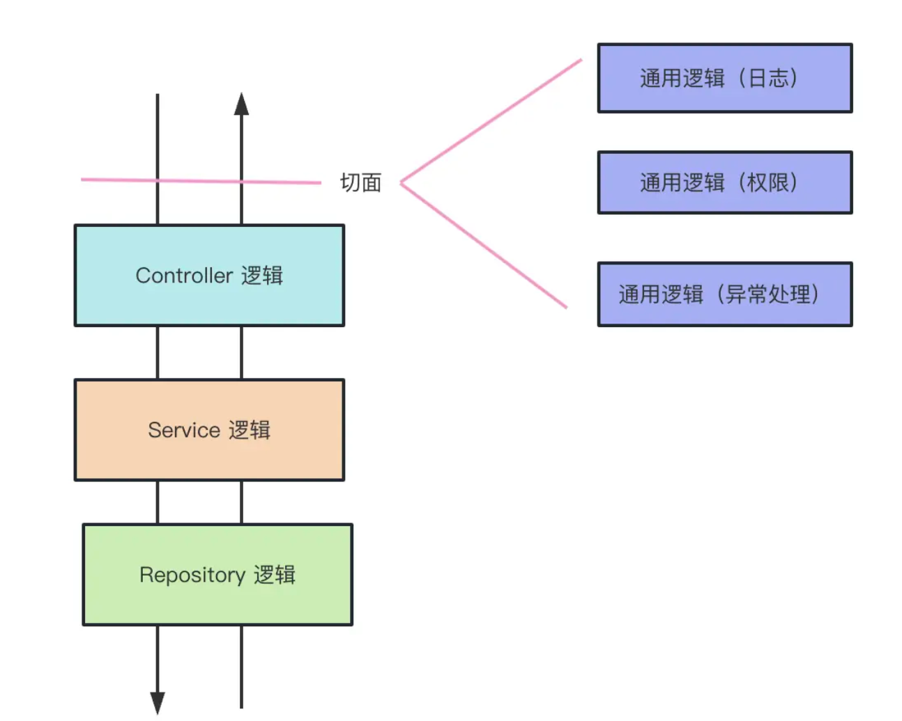
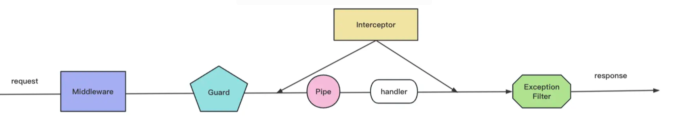

# Nest

## 初认识

NestJS 是一个基于 Node.js 和 TypeScript 的框架，用于构建高效、可靠、可扩展的服务器端应用程序和 CLI 应用程序。它结合了许多流行的 Node.js 插件，提供了一个结构化的框架，帮助开发人员更好地组织和扩展应用程序。

## 功能

- 内置路由功能：处理请求和响应。
- 中间件支持：可以拦截和修改传入的请求。
- 异常处理：内置的异常处理机制。
- 测试功能：支持单元测试和端到端测试，兼容 Jest 和 Supertest。
- 文档生成：通过装饰器生成 API 文档，支持与 Swagger 等工具集成。

## 场景

- 微服务：支持微服务架构。
- webScoket：实现实时通信。
- GraphQL：构建 GraphQL API。
- MVC 应用程序：传统的 MVC 架构。
- CLI 应用程序：构建命令行工具。

## 分层

NestJS 的分层架构是其核心设计理念之一，借鉴了领域驱动设计（DDD）和分层架构思想，通过分离关注点实现代码的可维护性、可扩展性和可测试性。其分层结构从外向内（用户交互到数据存储）依次为：控制器层（Controllers） → 服务层（Services） → 数据访问层（Repositories），同时辅以辅助层（DTOs、Guards、Filters 等） 支撑核心流程。

结构
|属性|类型|作用|
|---|---|---|
|controllers|Type<any>[]|声明当前模块包含的控制器（处理请求的组件），Nest 会自动实例化这些控制器|
|providers|Provider[]|声明当前模块包含的提供者（如服务、仓库等可注入的组件），Nest 的 DI 容器会管理它们的生命周期。|
|imports|Type<any>[]|导入其他模块，使当前模块可以使用被导入模块中 “导出” 的提供者。|
|exports|Type<any>[] | string[]|声明当前模块对外暴露的提供者，供导入该模块的其他模块使用（不导出则仅模块内可用）。|

```
┌─────────────────────────────────────────────────────────────────┐
│                      客户端（浏览器/APP/服务）                    │
└───────────────────────────────┬─────────────────────────────────┘
                                │
┌───────────────────────────────▼─────────────────────────────────┐
│                     控制器层（Controllers）                       │
│  - 接收请求（路由定义）                                         │
│  - 验证参数（依赖 Pipes/DTOs）                                  │
│  - 调用服务层，返回响应                                         │
└───────────────────────────────┬─────────────────────────────────┘
                                │（依赖注入）
┌───────────────────────────────▼─────────────────────────────────┐
│                      服务层（Services）                          │
│  - 封装核心业务逻辑                                             │
│  - 协调数据访问层，处理事务/缓存                                │
│  - 被控制器或其他服务调用                                       │
└───────────────────────────────┬─────────────────────────────────┘
                                │（依赖注入）
┌───────────────────────────────▼─────────────────────────────────┐
│                    数据访问层（Repositories）                    │
│  - 与数据库/外部服务交互（CRUD）                                │
│  - 封装数据操作细节                                             │
└───────────────────────────────┬─────────────────────────────────┘
                                │
┌───────────────────────────────▼─────────────────────────────────┐
│                        数据源（数据库/Redis等）                   │
└─────────────────────────────────────────────────────────────────┘

// 辅助层（横切关注点）
┌───────────────┐  ┌───────────────┐  ┌───────────────┐  ┌───────────────┐
│    Guards     │  │   Filters     │  │    Pipes      │  │    DTOs       │
│ （授权/权限）  │  │ （异常处理）  │  │（参数验证）   │  │（数据结构）   │
└───────────────┘  └───────────────┘  └───────────────┘  └───────────────┘
```

## 核心概念

### Module

定义：代码组织者。用于将相关的组件（控制器、服务、工具类等）封装在一起，形成一个功能独立的代码块。它是 Nest 实现 “模块化架构” 的基础，通过明确的依赖关系管理，使应用结构清晰、可维护性强。

作用：

- 代码组织：将同一功能域的组件（如用户管理、订单处理）聚合在一起，避免代码混乱。
- 边界隔离：模块内部的组件默认仅在模块内可见，通过 “导出” 机制选择性暴露功能，实现模块间的低耦合。
- 依赖管理：通过 “导入” 其他模块，复用其暴露的功能，建立模块间的依赖关系。

示例

```js
// src/user/user.module.ts
import { Module } from "@nestjs/common";
import { UserController } from "./user.controller"; // 控制器
import { UserService } from "./user.service"; // 服务（提供者）
import { DatabaseModule } from "../database/database.module"; // 外部模块
@Module({
  controllers: [UserController], // 本模块的控制器
  providers: [UserService], // 本模块的提供者
  imports: [DatabaseModule], // 导入数据库模块（复用其提供的数据库连接）
  exports: [UserService], // 导出 UserService，允许其他模块注入使用
})
export class UserModule {} // 模块类
```

根模块

```ts
// 每个 Nest 应用必须有且仅有一个根模块（通常命名为 AppModule），它是应用的入口点，Nest 从根模块开始解析整个应用的依赖树。
// src/app.module.ts（根模块）
import { Module } from "@nestjs/common";
import { UserModule } from "./user/user.module";
import { AuthModule } from "./auth/auth.module";

@Module({
  imports: [UserModule, AuthModule], // 导入其他功能模块
})
export class AppModule {} // 根模块
```

动态模块

```ts
@Module({})
export class DatabaseModule {
  static forRoot(options: DatabaseOptions): DynamicModule {
    return {
      module: DatabaseModule,
      providers: [{ provide: "DATABASE_OPTIONS", useValue: options }],
      exports: ["DATABASE_OPTIONS"],
    };
  }
}

// 使用动态模块
@Module({ imports: [DatabaseModule.forRoot({ host: "localhost" })] })
export class AppModule {}
```

### Handle

Controller 里具体路由的方法

### Service

实现业务逻辑的地方，比如操作数据库

### DTO（data transfer object）

封装请求体的对象

### IoC（控制反转） 与 依赖注入

概括：就是不用自己 new 对象了，声明好依赖关系，自动处理。比如`UserController`可能需要`UserService` 只需要在`controller`声明我需要使用`UserService`.Nest 容器就会自动帮你把 UserService 的实例准备好，然后“注入”进来供你使用。 `Provider`列出来的东西，就是 Nest 需要准备的东西。`Service`只是`Provider`常见形式，还可以通过`useValue`直接提供一个值或者`useFactory`等方式定义 provider 里的东西。

注入依赖的两种形式

1. 构造器注入

```js
@Controller()
class CatsController(){
 constructor(private readonly catsService:CatsService) {}
}
```

2. 属性注入

```js
@Controller()
class CatsController(){
 @Inject(CatsService)
}
```

### 实体（Entity）:数据库表的映射

User 表对应一个 User 的`Entity`

```ts
import { Comment } from "src/comment/entities/comment.entity";
import {
  BeforeInsert,
  Column,
  CreateDateColumn,
  Entity,
  OneToMany,
  PrimaryColumn,
  UpdateDateColumn,
} from "typeorm";
import { v4 as uuidv4 } from "uuid";
import { Interaction } from "src/interation/entities/interation.entity";
import { Post } from "src/posts/entities/post.entity";
import { Identity } from "src/auth/entities/identity.entity";
import { Request } from "express";
export interface RequestWithUser extends Request {
  user: User; // 这里我们直接使用User实体，但实际项目中可能使用轻量级的DTO
}
@Entity()
export class User {
  @PrimaryColumn({ type: "bigint" })
  id: number;
  @BeforeInsert()
  generateRandomId() {
    // 生成一个 10 位的随机数（10^9 到 10^10-1 之间）
    this.id = Math.floor(Math.random() * 9000000000) + 1000000000;
  }

  @Column({
    length: 50,
    comment: "用户名",
  })
  username: string;

  @Column({
    type: "int",
    default: 1,
    comment: "状态(0-禁用,1-正常)",
  })
  status: number;

  @CreateDateColumn({
    comment: "创建时间",
  })
  created_at: Date;

  @UpdateDateColumn({
    comment: "更新时间",
  })
  updated_at: Date;

  @Column({
    length: 100,
    nullable: true,
    comment: "微信openid",
    unique: true,
  })
  openid: string;

  @Column({
    type: "boolean",
    default: true,
    comment: "是否是第一次登录",
  })
  isFirstLogin: boolean;
}
```

## 切面 (用来处理通用逻辑的利器)

Nest 提供了 AOP （Aspect Oriented Programming 面向切面编程）的机制

具体来说，有 Middleware、Guard、Interceptor、Pipe、Exception Filter 这五种。


- 中间件：用来处理请求和响应对象，或者调用下一个中间件函数
- 守卫：用于权限控制
- 拦截器：功能强大，绑定额外的逻辑方法执行前后，转换方法返回的结果。或者覆盖出的异常。（比如记录请求响应的时间逻辑，通过 Intercetor 来实现就很优雅）
- 管道：主要用于数据转换（string->number）,数据校验。
- 异常过滤器：处理捕获未处理的异常，并发送适当的响应。
