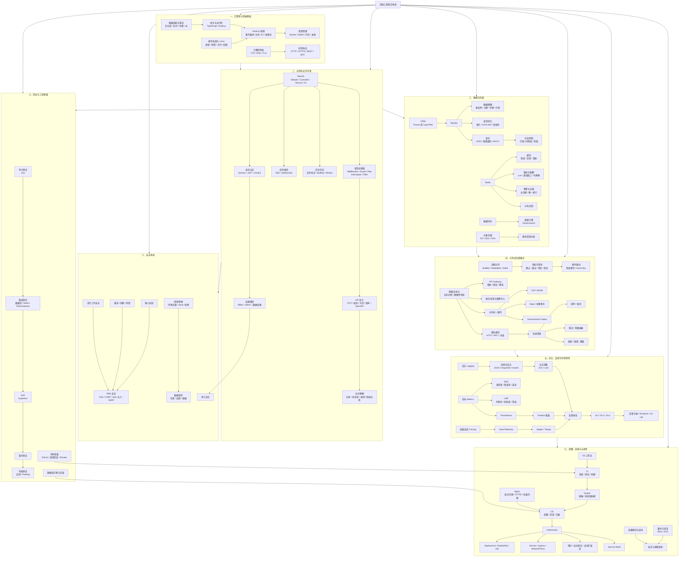

# 体系架构

typescript、Node为主

```mermaid
flowchart TB
    ROOT["后端工程知识体系"]

    ROOT --> BASIC
    ROOT --> APP
    ROOT --> DATA
    ROOT --> DIST
    ROOT --> OBS
    ROOT --> SEC
    ROOT --> DELIVERY
    ROOT --> QUALITY

    subgraph BASIC["一、计算机与后端基础"]
        LANG["语言与运行时<br/>TypeScript / Node.js"]
        NODE["Node.js 原理<br/>事件循环 / 异步 I/O / 线程池"]
        MEM["资源管理<br/>Stream / Buffer / 内存 / 进程"]
        NET["计算机网络<br/>TCP / DNS / TLS"]
        HTTP["应用协议<br/>HTTP / HTTPS / REST / RPC"]
        OS["操作系统与 Linux<br/>进程 / 线程 / 文件 / 权限"]
        DS["数据结构与算法<br/>复杂度 / 队列 / 哈希 / 树"]
        
        LANG --> NODE --> MEM
        NET --> HTTP
        OS --> NODE
        DS --> LANG
    end

    subgraph APP["二、应用与业务开发"]
        NEST["NestJS<br/>Module / Controller / Service / DI"]
        PIPE["请求处理链<br/>Middleware / Guard / Pipe<br/>Interceptor / Filter"]
        API["API 设计<br/>DTO / 校验 / 分页 / 版本 / OpenAPI"]
        DOMAIN["业务建模<br/>实体 / 状态机 / 规则 / 领域边界"]
        AUTH["身份认证<br/>Session / JWT / OAuth2"]
        PERMISSION["权限控制<br/>RBAC / ABAC / 数据权限"]
        REALTIME["实时通信<br/>SSE / WebSocket"]
        TASK["后台任务<br/>定时任务 / BullMQ / Worker"]

        NEST --> PIPE --> API
        API --> DOMAIN
        AUTH --> PERMISSION
        NEST --> AUTH
        NEST --> REALTIME
        NEST --> TASK
    end

    subgraph DATA["三、数据与存储"]
        MYSQL["MySQL"]
        MODEL["数据建模<br/>表结构 / 主键 / 外键 / 约束"]
        INDEX["查询优化<br/>索引 / EXPLAIN / 慢查询"]
        TX["事务<br/>ACID / 隔离级别 / MVCC"]
        LOCK["并发控制<br/>行锁 / 间隙锁 / 死锁"]
        ORM["ORM<br/>Prisma 或 TypeORM"]
        
        REDIS["Redis"]
        CACHE["缓存<br/>穿透 / 击穿 / 雪崩"]
        LIMIT["限流与配额<br/>Lua / 滑动窗口 / 令牌桶"]
        IDEMP["幂等与去重<br/>业务键 / 唯一索引"]
        DLOCK["分布式锁"]
        
        SEARCH["搜索引擎<br/>Elasticsearch"]
        OBJECT["对象存储<br/>S3 / OSS / CDN"]

        MYSQL --> MODEL
        MYSQL --> INDEX
        MYSQL --> TX --> LOCK
        ORM --> MYSQL

        REDIS --> CACHE
        REDIS --> LIMIT
        REDIS --> IDEMP
        REDIS --> DLOCK

        DATA_SYNC["数据同步"] --> SEARCH
        OBJECT --> CDN["静态资源分发"]
    end

    subgraph DIST["四、分布式与微服务"]
        MQ["消息队列<br/>BullMQ / RabbitMQ / Kafka"]
        MESSAGE["消息可靠性<br/>确认 / 重试 / 死信 / 积压"]
        EVENT["事件驱动<br/>领域事件 / Event Bus"]
        
        MICRO["微服务拆分<br/>业务边界 / 数据所有权"]
        GATEWAY["API Gateway<br/>路由 / 鉴权 / 限流"]
        DISCOVERY["服务发现与配置中心"]
        CALL["服务通信<br/>HTTP / RPC / 消息"]
        
        CONSISTENCY["分布式一致性"]
        CAP["CAP / BASE"]
        SAGA["Saga / 补偿事务"]
        OUTBOX["Transactional Outbox"]
        
        RESILIENCE["系统韧性"]
        TIMEOUT["超时 / 取消"]
        RETRY["重试 / 指数退避"]
        BREAKER["熔断 / 隔离 / 降级"]

        MQ --> MESSAGE --> EVENT
        MICRO --> GATEWAY
        MICRO --> DISCOVERY
        MICRO --> CALL
        MICRO --> CONSISTENCY
        CONSISTENCY --> CAP
        CONSISTENCY --> SAGA
        CONSISTENCY --> OUTBOX
        
        CALL --> RESILIENCE
        RESILIENCE --> TIMEOUT
        RESILIENCE --> RETRY
        RESILIENCE --> BREAKER
    end

    subgraph OBS["五、日志、监控与可观测性"]
        LOG["日志 Logging"]
        STRUCT["结构化日志<br/>JSON / requestId / traceId"]
        COLLECT["日志采集<br/>ELK / Loki"]
        
        METRIC["指标 Metrics"]
        RED["RED<br/>请求量 / 错误率 / 延迟"]
        USE["USE<br/>利用率 / 饱和度 / 错误"]
        PROM["Prometheus"]
        GRAFANA["Grafana 看板"]
        
        TRACE["链路追踪 Tracing"]
        OTEL["OpenTelemetry"]
        TRACE_SYS["Jaeger / Tempo"]
        
        ALERT["告警体系"]
        SLI["SLI / SLO / SLA"]
        ONCALL["告警分级 / Runbook / On-call"]

        LOG --> STRUCT --> COLLECT
        METRIC --> RED
        METRIC --> USE
        METRIC --> PROM --> GRAFANA
        TRACE --> OTEL --> TRACE_SYS
        
        COLLECT --> ALERT
        GRAFANA --> ALERT
        TRACE_SYS --> ALERT
        ALERT --> SLI --> ONCALL
    end

    subgraph SEC["六、安全体系"]
        VALIDATE["输入校验"]
        OWASP["Web 安全<br/>XSS / CSRF / SQL 注入 / SSRF"]
        SECRET["密钥管理<br/>环境变量 / Vault / 轮换"]
        ENCRYPT["数据保护<br/>哈希 / 加密 / 脱敏"]
        AUDIT["审计日志"]
        RATE["限流 / 防刷 / 风控"]
        UPLOAD["文件上传安全"]

        VALIDATE --> OWASP
        SECRET --> ENCRYPT
        PERMISSION --> AUDIT
        RATE --> OWASP
        UPLOAD --> OWASP
    end

    subgraph DELIVERY["七、部署、运维与云原生"]
        GIT["Git 工作流"]
        CI["CI<br/>检查 / 测试 / 构建"]
        DOCKER["Docker<br/>镜像 / 多阶段构建"]
        NGINX["Nginx<br/>反向代理 / HTTPS / 负载均衡"]
        CD["CD<br/>部署 / 灰度 / 回滚"]
        
        K8S["Kubernetes"]
        WORKLOAD["Deployment / StatefulSet / Job"]
        NETWORK["Service / Ingress / NetworkPolicy"]
        HEALTH["探针 / 自动恢复 / 自动扩缩容"]
        MESH["Service Mesh"]
        
        BACKUP["备份与恢复<br/>RPO / RTO"]
        CAPACITY["容量规划与成本"]
        DR["容灾与故障演练"]

        GIT --> CI --> DOCKER --> CD
        NGINX --> CD
        CD --> K8S
        K8S --> WORKLOAD
        K8S --> NETWORK
        K8S --> HEALTH
        K8S --> MESH
        
        BACKUP --> DR
        CAPACITY --> DR
    end

    subgraph QUALITY["八、测试与工程质量"]
        UNIT["单元测试<br/>Jest"]
        INTEGRATION["集成测试<br/>数据库 / Redis / Testcontainers"]
        E2E["E2E<br/>Supertest"]
        CONTRACT["契约测试"]
        LOAD["性能测试<br/>压测 / Profiling"]
        LINT["代码质量<br/>ESLint / 类型检查 / Review"]
        MIGRATION["数据库迁移与回滚"]

        UNIT --> INTEGRATION --> E2E
        E2E --> CONTRACT
        CONTRACT --> LOAD
        LINT --> CI
        MIGRATION --> CD
    end

    BASIC --> APP
    APP --> DATA
    DATA --> DIST
    APP --> SEC
    APP --> QUALITY
    DIST --> OBS
    OBS --> DELIVERY
```

# 建议学习顺序
```
Node/TypeScript
→ NestJS
→ MySQL
→ Redis
→ 鉴权与安全
→ 测试
→ Docker/CI/CD
→ 日志、指标、链路追踪
→ 消息队列与可靠性
→ 分布式一致性
→ 微服务
→ Kubernetes
```