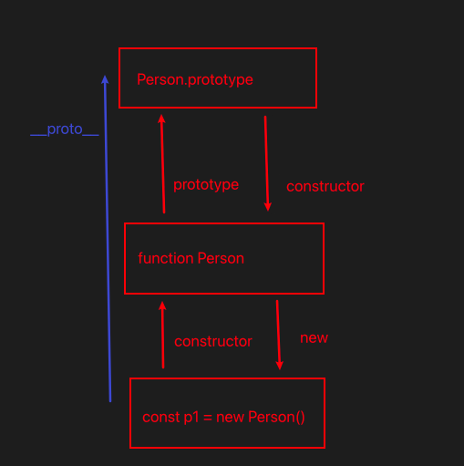

## this 指向

附：箭头函数的特点
设计目的是解决回调函数中 this 指向混乱的问题，让代码更简洁。

- 函数内不绑定 this 指向，this 继承外层作用域的 this
- 无法修改箭头函数的 this，箭头函数的 this 是 “定义时绑定，而非调用时绑定”：
- 无 argument
- 无法 new

### 理解函数调用栈

```html
<script>
  btn.addEventListener("click", function handler() {
    console.log(this); // 请问这里的 this 是什么 this === btn
  });
  btn.addEventListener("click", () => {
    console.log(this); // window
  });

  function baz() {
    console.log("baz 111 当前调用栈在window");
    bar();
  }

  function bar() {
    console.log("bar 222 在调用栈 baz");
    foo();
  }

  function foo() {
    console.log("foo 333 调用栈在bar");
  }
  baz();
</script>
```

### 试题

```js
var name = "a";
var obj = {
  name: "b",
  fee: function () {
    var zz = () => {
      console.log(this.name);
    };
    zz();
  },
};
obj.fee(); //b
c = obj.fee;
c(); //a
```

```js
var a = 3;
function foo() {
  var a = 2;
  console.log(this); //window
  console.log(this.a); // window.a
  obj.doSomething(); // obj undefined
  console.log(this.count);
  undefined;
}
foo.count = 0;
var obj = {
  name: "hxh",
  doSomething() {
    console.log(this); //对象
    console.log(this.a);
  },
};
foo();
```

```js
var ca = {
  render: function () {
    console.log(this);

    this.update();
  },
  update: function () {
    console.log(this);

    console.log("ca");
  },
};
window.setInterval(ca.render(), 1000); // 执行正常，但ca.render() 没有返回会报错。
```

```js
function Super() {
  let count = 1;
  //父级Super  执行上下文的this
  return () => {
    //let 不会出现在window的全局对象中
    console.log(this);
    console.log(count);
  };
}
var obj = {
  way: Super,
  count: "b",
  // 父执行上下文的this
  smile: () => {
    console.log(this);
  },
};
obj.smile(); // 父执行上下文的this ❌ -> window
let b = obj.way(); // 创建时绑定this
b(); //obj 1
```

```js
/* 只有在函数执行产生位置,时this才有意义
      谁调用指向谁
  立即执行指向window（环境）
    独立调用指向window */
let obj = {
  name: "a",
  s1: function () {
    //obj谁调绑定谁
    setTimeout(() => {
      console.log(this);
    }, 0);
  },
};
let obj2 = {
  name: "b",
};
let nums = [1, 2, 3];

let window_s = obj.s1;
window_s(); //window
obj.s1.call(obj2); //obj2
```

```js
var name = "window";
var person = {
  name: "person",
  sayName: function () {
    console.log(this.name);
  },
};

function sayName() {
  console.log(this); //window
  var sss = person.sayName;
  sss(); // window
  person.sayName(); //person
  person.sayName(); //window ❌ 只有函数引用，没保留上下文
  (b = person.sayName)(); //window。引用赋值给b。b() 丢失上下文
}
sayName();
```

```js
var name = "window";
var person1 = {
  name: "person1",
  foo1: function () {
    console.log(this.name);
  },
  foo2: () => {
    console.log(this.name);
  },
  foo3: function () {
    return function () {
      console.log(this.name);
    };
  },
  foo4: function () {
    return () => {
      console.log(this.name);
    };
  },
};
var person2 = { name: "person2" };

person1.foo1(); //person1 ✔
person1.foo1.call(person2); //person2 ✔

person1.foo2(); //window ✔
person1.foo2.call(person2); //window ✔

person1.foo3()(); //window ✔
person1.foo3.call(person2)(); //window ✔
person1.foo3().call(person2); //person2 ✔

person1.foo4()(); //person1 ✔
person1.foo4.call(person2)(); //person2 ✔
person1.foo4().call(person2); //person1✔
```

```js
var name = "window";
function Person(name) {
  this.name = name;
  this.foo1 = function () {
    console.log(this.name);
  };
  this.foo2 = () => console.log(this.name);
  this.foo3 = function () {
    return function () {
      console.log(this.name);
    };
  };
  this.foo4 = function () {
    return () => {
      console.log(this.name);
    };
  };
}
var person1 = new Person("person1");
var person2 = new Person("person2");

person1.foo1(); //p1
person1.foo1.call(person2); //p2

person1.foo2(); //p1
person1.foo2.call(person2); // p1

person1.foo3()(); //window
person1.foo3.call(person2)(); //window
person1.foo3().call(person2); //p2

person1.foo4()(); //p1
person1.foo4.call(person2)(); //p2
person1.foo4().call(person2); //p1
```

## 实现深拷贝

- 类型（基本、对象、数组、map、set、日期对象、正则对象、函数通常只需要复制引用、`getOwnPropertySymbol`）
- 循环引用
- 基本操作 `for(let key of obj)` `obj.hasOwnProperty(key)`

```js
function deepClone(target, map = new WeakMap()) {
  // 1. 处理基本类型（直接返回）
  if (target === null || typeof target !== "object") {
    return target;
  }

  // 2. 处理循环引用（如果已拷贝过，直接返回缓存的结果）
  if (map.has(target)) {
    return map.get(target);
  }

  let cloneResult;

  // 3. 处理日期对象
  if (target instanceof Date) {
    cloneResult = new Date(target);
    map.set(target, cloneResult);
    return cloneResult;
  }

  // 4. 处理正则对象
  if (target instanceof RegExp) {
    cloneResult = new RegExp(target.source, target.flags);
    cloneResult.lastIndex = target.lastIndex; // 保留正则的lastIndex属性
    map.set(target, cloneResult);
    return cloneResult;
  }

  // 5. 处理数组和对象（区分数组和普通对象）
  if (Array.isArray(target)) {
    cloneResult = [];
  } else {
    // 处理普通对象（包括自定义对象，但不包括函数）
    cloneResult = Object.create(Object.getPrototypeOf(target)); // 继承原型链
  }

  // 缓存已拷贝的对象（解决循环引用）
  map.set(target, cloneResult);

  // 6. 递归拷贝属性（包括可枚举属性和Symbol属性）
  const keys = [
    ...Object.keys(target),
    ...Object.getOwnPropertySymbols(target),
  ];
  keys.forEach((key) => {
    cloneResult[key] = deepClone(target[key], map); // 递归拷贝每个属性值
  });

  return cloneResult;
}

// 测试用例
const obj = {
  a: 1,
  b: "hello",
  c: null,
  d: [1, 2, { e: 3 }],
  f: new Date(),
  g: /abc/gi,
  h: Symbol("test"),
};
// 添加循环引用
obj.self = obj;

const clonedObj = deepClone(obj);

// 验证拷贝结果（修改原对象不影响拷贝对象）
obj.d[2].e = 100;
console.log(clonedObj.d[2].e); // 3（未受影响，深拷贝成功）
console.log(clonedObj.self === clonedObj); // true（循环引用处理成功）
console.log(clonedObj.f instanceof Date); // true（日期类型保留）
console.log(clonedObj.g instanceof RegExp); // true（正则类型保留）
```

## 原型

### 原型的基本概念

- 原型对象：：每个对象在创建时，都会关联一个 “原型对象”（简称 “原型”）。这个原型对象本身也是一个对象，**存储着可被当前对象共享的属性和方法**。例如（Array.prototype，里面有 push、pop 等）
- `__proto__`: 每个对象（null）都有一个隐藏**proto**，用于指向原型对象 `const arr=[];arr_proto__ === Array.prototype`
- prototype:只有“构造函数”才有 prototype，它指向“该构造函数创建的所有实例的原型对象” `Array是构造函数`

### 构造函数、实例、原型对象的三角关系

这三者的关系是理解原型的核心，可用一句话概括：构造函数通过 prototype 指向原型对象，原型对象通过 constructor 指向构造函数，实例通过 `__proto__` 指向原型对象。


### 原型链

当访问一个对象的属性和方法时，遵循以下规则：

1. 先在对象自身查找，如果找到则直接使用；
2. 如果没找到，就通过 **proto** 去原型对象中查找；
3. 如果原型对象中也没找到，就继续通过原型对象的 **proto** 向上查找（即原型的原型）；
4. 直到找到顶层原型 Object.prototype，如果仍未找到，则返回 undefined。
   这种 “层层向上查找” 的链式结构，称为原型链。原型链的终点是 Object.prototype.**proto**，其值为 null（表示没有更上层的原型）。

- 数组、函数等特殊对象的原型链。 `[].__proto__===Array.prototype` `Array.prototype.__proto__ === Object.prototype` `Object.prototype.__proto__===null`

### 核心作用

1. 实现属性和方法的共享。将公共方法定义在原型上，所有实例无需重复创建。
2. 实现继承：通过修改原型指向，让一个构造函数的实例**继承另一个构造函数的原型方法**。

```js
function Student() {}
Student.prototype = new Person(); // 让Student的原型指向Person的实例（继承Person的原型方法）
Student.prototype.constructor = Student;
修复constructor指向;
```

3. 扩展内置对象功能

```js
Array.prototype.sum = function () {
  return this.reduce((a, b) => a + b, 0);
};
[1, 2, 3].sum(); // 6
```

### 继承的实现

#### 原型链继承

- 缺点
- - 1. 子实例会共享父类实例的引用类型属性(`c1.arr.push(3)`)会导致其他子实例的 arr 也被修改。
- - 2. 子无法在构造的时候向父构造传递参数

```js
function Parent() {
  this.name = "父类";
  this.arr = [1, 2]; // 引用类型属性
}
Parent.prototype.sayHi = function () {
  console.log("Hi");
};

function Child() {}

// 核心：子类原型指向父类实例
Child.prototype = new Parent();
Child.prototype.constructor = Child; // 修复 constructor 指向

// 测试
const c1 = new Child();
c1.name; // "父类"（访问父类实例属性）
c1.sayHi(); // "Hi"（访问父类原型方法）
```

#### 构造函数继承

原理：在子类构造函数中通过 Parent.call(this, ...args) 调用父类构造函数，手动将父类实例属性绑定到子类 this 上。

缺点：无法共享父原型的方法`Person.prototype.sayHi`

```js
function Parent(name) {
  this.name = name;
  this.arr = [1, 2];
}
Parent.prorotype.sayHi = () => {};
function Child(name, age) {
  Parent.call(this, name); // 关键：调用父类构造函数，继承实例属性
  this.age = age;
}

// 测试
const c1 = new Child("张三", 18);
const c2 = new Child("李四", 20);
c1.arr.push(3);
console.log(c1.arr); // [1,2,3]
console.log(c2.arr); // [1,2]（引用类型不再共享，解决原型链继承的问题）
```

#### 寄生组合继承

原理：结合 “原型链继承”（继承原型方法）和 “构造函数继承”（继承实例属性），并优化原型链避免冗余。

```js
function Parent(name) {
  this.name = name;
  this.arr = [1, 2];
}
Parent.prototype.sayHi = function() => { console.log(this.name) };
function Child(name) {
  Parent.call(this, name); // 构造函数继承，继承父的属性和方法
  this.childProps = "xxx";
}
// 核心：让子类原型继承父类原型（而非父类实例），避免继承父类实例属性
const parentType = Object.create(Parent.prototype);
Child.prototype = parentType;
Child.prototype.constrcutor = Child;

let o1 = new Child('o1');
o1.arr.push('o1') // [1.2,o1]
o1.sayHi(); // o1
let o2 = new Child('o2')
o2.arr.push('o2') // [1,2,o2]
o2.sayHi(); // o2
```

### new 的过程

创建对象 -> 关联构造函数的原型 -> 绑定 this 执行构造函数 -> 返回对象

```js
function myNew(fn,...args) {
  let obj = {};
  obj.__proto__ = Object.create(fn.prototype);
  fn.apply(obj,args)
  return obj;
}
```

## 防抖和截流

### 防抖

频繁触发，当触发后超过 `几百ms(自己设定)`后，则执行一次。

```js
function debounce(cb, delay) {
  let timer;
  return function (...args) {
    clearTimer(timer);
    timer = setTimeout(() => {
      cb.apply(this, ...args);
    }, delay);
  };
}
```

### 防抖进阶版

- 首次执行（`leading`）
- 取消功能 （`debounced.cancel`）
- 支持异步函数与返回值`包装promise返回`
- 配置化选项（参数立即执行、延迟时间等）

```js
function debounce(cb, delay, options = {}) {
  let timer;
  let { leading = false, trailing = true } = options;
  let lastCallTime = 0;
  // 执行被防抖的函数
  const execute = (...args) => {
    lastCallTime = Date.now();
    return cb.apply(this, ...args);
  };
  // 防抖包装函数
  function debounced(...args) {
    const now = Date.now();
    const elapsed = now - lastCallTime;
    // 清除现有定时器（无论哪种模式，重复触发都需重置trailing的计时）
    if (timer) {
      clearTimeout(timer);
    }
    // 1. 处理leading模式：首次触发且距离上次执行超过delay，立即执行
    if (leading && !timer && elapsed >= delay) {
      return execute(...args);
    }
    // 2. 处理trailing模式：设置延迟执行（若leading已执行，需确保trailing不重复执行）
    else if (trailing) {
      return new Promise((resolve, reject) => {
        timer = setTimeout(() => {
          // 若leading已执行且未超过delay，不重复执行trailing
          if (!leading || lastCallTime >= delay) {
            const result = execute(...args);
            resolve(result);
          } else {
            resolve();
          }
          timer = null;
        }, delay);
      });
    }
  }
  debounced.cancel = () => {
    if (timer) {
      clearTimeout(timer);
      timer = null;
      lastCallTime = 0; // 重置状态
    }
  };

  return debounced;
}
```

### 截流

每`几百ms（自己设定）`触发一次

```js
function throttle(cb, delay) {
  let start = 0; // 如果 let start = Date.now() -> 时间相差很短，第一次不执行
  return function (...args) {
    let now = Date.now();
    if (now - start >= delay) {
      cb.apply(this, ...args);
      start = Date.now();
    }
  };
}
```

## 闭包

### 是什么：

一个函数对其周围状态（词法环境）的引用捆绑在一起的组合。简单来说，闭包让你可以在一个内层函数访问到外层的函数的作用域。

### 怎么产生：

“闭包的产生需要两个必要条件”：

1. 函数嵌套：一个函数（外层函数）内部定义了另一函数（内层函数）
2. 内部函数引用外部变量：内部函数引用了外部函数作用域中的变量。
   过程：当一个函数执行，会创建函数执行上下文和与之关联的词法环境，这个词法环境包含了这个函数作用域内的所有局部变量。正常情况：一个函数执行完毕后，其执行上下文和词法环境会被垃圾回收机制回收。如果这个函数内部创建的函数（内层函数）被返回了出去，或者以任何方式（如被赋值给全局变量、作为回调函数等）被外部引用， 那么内部函数所维持的**作用域**链就不会断开。这个 **被引用的变量和保持存在的词法环境的组合，就是闭包。**

### 核心作用：

1. 保护变量：函数可以将闭包隐藏在函数内部，只能通过特定的接口（方法）进行访问和修改，避免全局污染。实现了类似 **私有变量** 的效果。
2. 保存变量：函数内部变量的生命周期得以延续，不会在外层函数调用后被销毁，这些变量仿佛被持久化地保存在内存中。

### 实际应用：

- 模块化开发：esm 出来之前，通过 **IIFE** 创建闭包来模拟模块，封装私有变量和方法。

```js
const myMoudle = (function () {
  let privateCounter = 0; // 私有变量

  function privateFunction() {
    // 私有方法
    // ...
  }

  return {
    // 公共API
    increment: function () {
      privateCounter++;
    },
    getValue: function () {
      return privateCounter;
    },
  };
})();
myMoudle.increment();
console.log(myModule.getValue()); // 1
```

- 柯里化和函数工厂：闭包可用于创建预先配置好的函数。

```js
function makeAdder(x) {
  return function (y) {
    return x + y;
  };
}
const add5 = makeAdder(5); // add5 是一个闭包，它记住了 x=5
const add10 = makeAdder(10); // add10 是一个闭包，它记住了 x=10
console.log(add5(2)); // 7
console.log(add10(2)); // 12
```

- 回调函数和异步编程：在事件处理、setTimeout、Ajax 请求等场景中，回调函数常常会形成闭包，以访问定义它们时的上下文变量。

```js
function handleClick(buttonName) {
  return function () {
    console.log(`Button ${buttonName} was clicked!`);
  };
}
document.getElementById("myBtn").onclick = handleClick("Submit");
```

### 注意事项：

问题：主要问题是“内存泄漏”。闭包长期保留对外部变量的引用，导致这些变量占用的内存无法被垃圾回收机制释放。如果大量使用闭包或者闭包中保存了非常大的对象，就可能导致内存占用升高。
解决：在不需要使用，**及时断开对函数的引用** 将事件处理函数设置为`null` `element.onclick=null`

## 函数执行过程发生了什么

1. **函数执行过程：**： 一个函数被调用时，js 引擎所做的一系列事情（创建执行上下文、执行代码、返回值、销毁上下文）
2. **调用栈（Call Stack）**：一种数据结构，用于追踪当前正在执行的函数，当函数被调用，其执行上下文被压入栈顶；当函数执行完毕，其上下文被弹出。保证了代码的执行顺序。
3. **词法环境（Lexical Environment）**：是管理关联关系的一种规范类型。物理结构包括`1.环境记录; 2.outer(对外部词法环境的引用) `
4. **作用域（Scope）**：一个理论概念：指的是变量和函数的可访问范围，它由代码的**书写位置（词法作用域）**决定，而不是调用位置。作用域规则是通过词法环境来实现。
5. `[[Scopes]]`:一个列表【 内部包含两种类型的环境：1.Closure 2.全局环境 】这是一个内部属性，无法通过代码直接访问。它存在每个**函数对象**，在函数**定义**时就被确定并保存下来。它包含了该函数所能访问的所有**父级词法环境**的引用。

### 关系与过程详解：

- 第一步：函数定义时 --- `[[Scopes]]`诞生。`[[Scopes]]`是当前作用域的作用域链

- 第二步：函数调用时 --- 执行上下文创建。
  全过程：

1. 创建执行上下文，
2. 创建词法环境【它的`环境记录`存储本次调用的参数、局部变量、`this`】【它的`outer`引用，直接指向函数对象的`[[Scopes]]`属性中的第一个词法环境（它的直接父级）】
3. 压入调用栈

- 第三步：代码执行时 --- 作用域链的查找
  例子：当遇到变量`myVar`

1. 现在当前词法环境`环境记录`找
2. 没找到，它不会去`[[Scopes]]`里找，而是顺着当前词法环境的`outer`**引用**跳到下一个（父级）词法环境中继续查找。
3. 如果没找到，会继续顺着那个词法环境的`outer`引用向上找，直到到达全局词法环境
4. `outer`引用穿起来的链，就是**作用域链（Scope Chain）**

### 关键点

- **作用域**是规则，**作用域链**是实现这条规则的查找路径
- `[[Scopes]]`在函数定义预先存储这条链的`地图`
- 函数执行时，当前词法环境`outer`指针根据这张`地图`被正确设置，从而运行时构建出可用的作用域链

- 第四步：执行完毕。

1. 调用栈的执行上下文弹出。
2. 词法环境失去所有引用，等待回收
3. （例外） 如果`foo`定义`bar`,`bar`引用`foo`变量，`bar`的`[[Scopes]]`属性会保存对`foo`词法环境的引用。即使`foo`执行上下文已从调用栈弹出，它的词法环境也不会被销毁，因为 bar 的 [[Scopes]] 还指着它。这就是闭包的本质。

### `[[Scopes]]`和`outer`引用的关系

总结：`[[Scopes]]`是函数在定义时获得`地图`，而`outer`引用时函数在执行时根据这张地图建立的`导航链接`
|特性|`[[Scopes]]`|`outer`|
|---|---|---|
|归属对象|函数对象的内在属性|词法环境的组成部分|
|表现形式|一个包含多个环境应用的列表/链| 一个指向单个外部环境的指针|
|主要作用|记录函数定义可访问的父级环境| 在执行时构建作用域，实现变量查找 |

### 总结与图示

我们可以用一个简单的比喻来理解：

[[Scopes]]：就像你家的房产证，上面写明了你的地址和你的户籍关系（你的父级、祖籍）。这个证在你出生（函数定义）时就办好了。

调用栈：像是一个酒店入住登记表。每次你去一个城市出差（函数调用），就在当地酒店开一个房间（创建执行上下文和词法环境），并在登记表上记下房间号（压栈）。工作结束就退房（弹出）。

词法环境：就是你在酒店开的那个房间，里面有你的本地物品（局部变量）。

作用域链：当你在房间（当前词法环境）里找不到某份文件（变量）时，你根据房产证（`[[Scopes]]]]`）上的地址，先回父亲家找（outer 引用），父亲家没有就再回爷爷家找（下一个 outer 引用），直到找到为止。

## Promise

### promise 和 async/await 的区别？

| 特性     | Promise      | async/await  |
| -------- | ------------ | ------------ |
| 语法上   | 链式调用     | 同步分风格   |
| 错误处理 | .catch       | .try-catch   |
| 可读性   | 较麻烦       | 比较直观     |
| 调试     | 不够直观     | 直观         |
| 适用场景 | 简单异步操作 | 复杂异步逻辑 |

### Promise.all 和 Promise.allSettle

| 对比         | all                                  | allSettle                       |
| ------------ | ------------------------------------ | ------------------------------- |
| 失败处理方式 | 有一个失败就 reject(短路)            | 所有都执行完                    |
| 返回值       | 成功拿到所有数组，失败返回第一个错误 | 包含所有结果的数组              |
| 适用场景     | 所有 Promise 必须成功的场景          | 需要直到所有 Promise 结果的场景 |

### 场景题 Promise 实现控制并发

- 全局记录 index，complete，返回结果
- 实现 run 递归执行就行了

```js
function concurrent(tasks, limit = 3) {
  let index = 0;
  let complete = 0;
  let results = [];
  let total = tasks.length;
  return new Promise((resolve) => {
    const run = () => {
      if (index >= total) {
        return;
      }
      let i = index++;
      task[i]().then((res) => {
        results[i] = res;
        complete++;
        if (complete === total) {
          resolve(results);
        } else {
          run();
        }
      });
    };
    for (let i = 0; i < Math.min(limit, total); i++) {
      run();
    }
  });
}
const createTask = (id) => () =>
  new Promise((resolve) => {
    const delay = Math.random() * 1000 + 500; // 500-1500ms随机延迟
    console.log(`任务${id}开始`);
    setTimeout(() => {
      console.log(`任务${id}完成`);
      resolve(`结果${id}`);
    }, delay);
  });

// 创建8个任务
const taskList = Array.from({ length: 8 }, (_, i) => createTask(i));

concurrent(taskList).then((res) => {
  console.log(res);
});
```

### 柯里化

核心思想：参数满足长度后才执行，不然一致递归返回函数，闭包收集参数

- this 指向，记得在`returnFunc`保存`this`，`结合箭头函数`和`apply`绑定第一层的 this

```js
function curry(func) {
  let totalCount = func.length;
  function returnFun(...args) {
    let other = [...args];
    if (other.length >= totalCount) {
      return func.apply(this, other.slice(0, totalCount));
    } else {
      return (...va) => {
        return returnFun.apply(this, [...other, ...va]);
      };
    }
  }
  return returnFun;
}
const add = (x, y, z) => {
  return x + y + z;
};
const fn = curry(add);
let addx = fn(1, 2); // 这样调用吗
console.log(addx(22)); // 3

const obj = {
  value: 10,
  add(a, b) {
    return this.value + a + b;
  },
};
const curriedAdd = curry(obj.add);
console.log(curriedAdd.call(obj, 5)(5));
```
