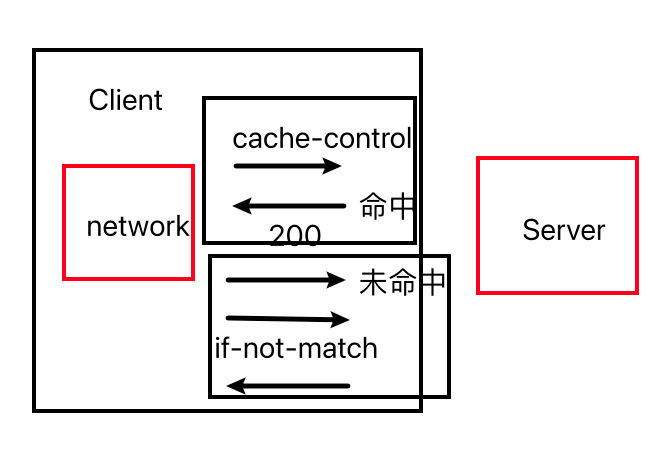
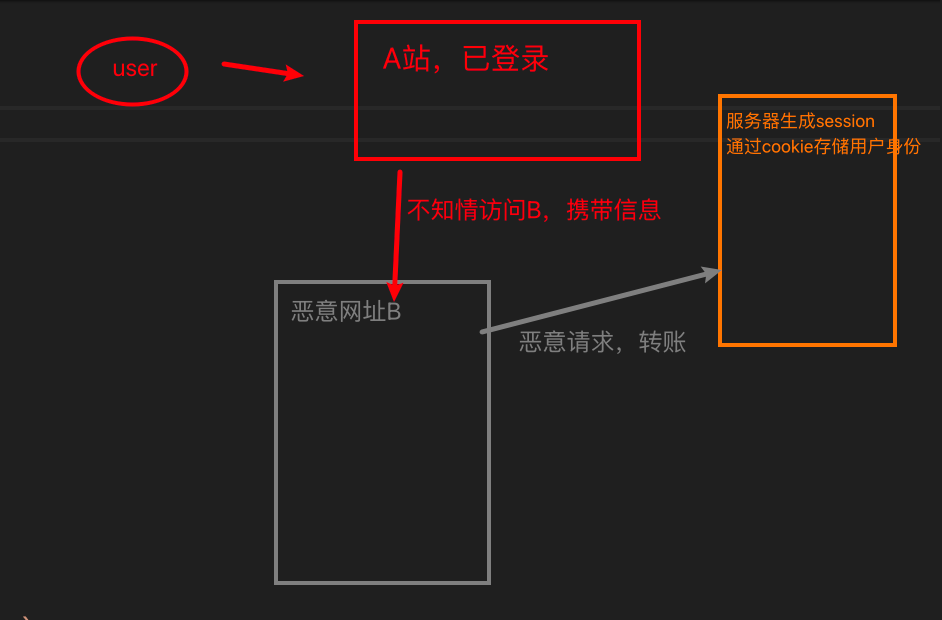

# 浏览器原理

## http强缓存和协商缓存
1. 什么是http缓存？作用是什么？
是浏览器为了减少网络请求，提升页面加载速度而对服务器响应资源进行本地存储的机制。

2. 强缓存和协商缓存的核心区别
- 强缓存，从本地读取缓存，不再向服务端发起请求
- 协商缓存，从本地读取缓存，如果缓存过期需要向服务器发起请求，服务端判断请求是否可用。
  - 若未更新，返回 304 `Not Modified` 客户端使用本地缓存。
  - 若更新，返回 200 并更新缓存。
3. 实现机制
强缓存
- `expires http 1.0`和`Cache Concrol http1.1`
- expires
- - 格式 `Expires:Wed,21 Oct 2025 07:28:00 GMT`（服务器的绝对时间）
- - 问题依赖客户端和服务器时间同步

- cache-control
-  格式 `Cache-Control:max-age=5000`(相对于服务器请求时间)
-  常用指令
- - `max-age=xxx`:资源有效期
- - `public`:允许任何缓存（如cdn、代理服务器）存储该资源
- - `private`:允许客户端（浏览器）缓存
- - `no-cache`:不使用强缓存，必需走协商缓存
- - `no-store`:完全不走缓存

协商缓存
- 第一组 `Last-Modified` + `If-Modified-Since`
  - 响应头 `Last-Modifed`：服务器返回资源最后修改时间
  - 请求头 `If-Modified-Since`:客户端再次发起请求时，携带上次`Last-Modifed`值，服务端对比：
  - - 若资源最后修改时间<=该值，未更新，返回 `304`
  - - 若更新，返回200+新资源 同时更新`Last-Modifed`
- 第二组 `ETag` + `Last-Modified`
- 响应头 `ETag`：生成一个唯一标示符
- 请求头 `If-None-Match`:客户端再次发起请求时，携带上次`ETag`值，服务器对比：
- - 若`ETag`不一致，表示更新 返回 200 + 新内容 + 新`ETag`。
- - 如一致 返回 304 表示资源未更新

### `ETag`比`Last-Modifed`更优，为什么
- `Last-Modifed`只能精确修改，同一秒多次修改，无法识别
- 若资源内容没变只修改名字，`Last-Modifed`标记为更新
- ETag基于资源内容生成

### 流程与优先级
1.客户端请求资源时，先检查强缓存
- 若 Cache-Control/Expires 未过期，直接使用本地缓存（强缓存命中）；
- 若已过期，进入下一步。
2.强缓存未命中时，触发协商缓存：
- 客户端发送请求，携带 If-Modified-Since/If-None-Match 到服务器；
- 服务器验证资源是否更新：
- - 未更新：返回 304，客户端使用本地缓存（协商缓存命中）；
- - 已更新：返回 200 和新资源，客户端更新本地缓存。

### 如何判断命中强还是协商
- 强缓存命中：网络面板中状态码可能显示 200 OK (from cache) 或不显示状态码（直接从内存 / 磁盘缓存读取），且无请求发送到服务器。
- 协商缓存命中：状态码显示 304 Not Modified，有请求发送到服务器，但服务器未返回资源内容。
- 未命中缓存：状态码显示 200 OK，服务器返回完整资源。



## cookie的使用
是小型文本文件，用来做数据持久化。
应用场景
- 用户身份认证
- 喜好设置
- 购物车数据持久化
- SSO单点登录

属性
- name
- value
- expire （绝对时间）
- max-age（相对时间，相同存在优先级高）
- domian （指定cookie对哪些域名有效，不能设置非当前域名的顶级域名）
- path
- httpOnly （不允许js脚本访问）
- secure 只允许https
- samesite
- - strict 不允许跨站携带cookie
- - lax 允许导航到目标网址的GET请求携带Cookie
- - none 允许跨站发送（必须同时设置Secure）

安全实践
- 1. 敏感信息。始终设置`Secure`和`HttpOnly`
- 2. 跨站Cookie，始终设置` sameSite = none;Secure `
- 3. 会话管理：设置合理有效时间
- 4. 数据存储：避免存储用户敏感信息
- 5. 生产环境始终使用HTTPS保护传输

什么情况会导致cookie不携带

- 会话超时 max-ageœ
- 跨站cookie的samesite设置（none、非同域 ）
- 设置secure，但使用http
- domian和path不匹配。

实例
```js
document.cookie = `aa=b;expires=xxx;path=/;Secure;SameSite=Lax`
```

## XSS攻击介绍，以及如何防范  
XSS（Cross-Site Scripting，跨站脚本攻击）是一种常见的 Web 安全漏洞，其核心原理是攻击者将恶意脚本注入到网页中，当用户访问该页面时，脚本在用户的浏览器执行。从而窃取用户信息，篡改网页内容或执行其他恶意操作。
1. 存储型XSS
- 特点：恶意脚本被永久存储在服务器（如数据库、评论区、用户资料）
- 流程：
  - 攻击者在评论区提交包含恶意脚本内容（`<script> alert(document.cookie) </script>`）,服务器未过滤直接存储，
  - 其他用户访问该评论页面时，服务器从数据库返回给浏览器，浏览器执行脚本，导致攻击。
- 场景：论坛、博客评论区、用户个人资料页等。

2. 反射型XSS
- 特点：恶意脚本不存储在服务器，而是通过URL参数、表单提交等方式“临时”传递给服务器，再有服务器“反射”回页面。
- 流程：
- - 攻击者构造恶意脚本的URL（`http://example.com/search?query=<script>steal()</script>`）
- - 诱导用户点击URL，服务器将`query`参数直接嵌入页面返回，浏览器执行脚本。
- 场景：搜索框、URL参数展示页等（需用户主动触发恶意链接）

3. DOM型XSS
- 特点：恶意脚本的注入和执行完全在**客户端（浏览器）**完成，不经过服务器处理
- 流程：
  - 页面通过JavaScript读取URL参数（如`locaton.hash`）并直接插入DOM（`document.innerHTML=location.hash`）
  - 攻击者构建含恶意脚本的URL（如`http://example.com/#<script>xss()<script> `）,用户点击后，客户端脚本直接将恶意代码插入DOM并执行。
- 核心：服务器未参与，漏洞在客户端对用户输入的处理逻辑。
  
 ### 危害
 - 窃取敏感信息：通过`document.cookie`获取用户cookie，SessionID，冒充用户身份登录网址。
 - 劫持用户会话：利用用户权限执行操作（如转账、发布内容）
 - 篡改页面内容：伪造虚假信息（钓鱼链接、虚假登录框）
 - 恶意行为：如记录用户的键盘输入（窃取密码）、发起DDOS攻击。

### 如何防范XSS方法
1. 输入验证与过滤
对用户输入内容（评论、表单、url参数）进行严格校验，过滤危险字符和标签

2. 输出编码
当需要将用户输入的内容展示到页面，对内容进行编码处理，让浏览器将其当作“文本”而非“代码”解析：
- html编码 （如<→&lt;，>→&gt;，&→&amp;）
- 场景适配：根据输出位置选择编码方式（如 JavaScript 环境用 JS 编码，URL 参数用 URL 编码）

3. 使用http安全头
- Content-Security-Policy。定义页面可加载的资源来源（脚本、样式、图片）。禁止执行未授权的脚本。示例配置：`Content-Security-Policy:default-src 'self';script-src 'self' https://trusted-cdn.com`
- X-XSS-Protection: 启用浏览器内置的 XSS 过滤器（现代浏览器多默认启用，可辅助拦截反射型 XSS）。

4. 限制Cookie权限
- 设置Cookie属性，HttpOnly；Secure
- 设置SameSite属性，配合CSRF防御。限制 Cookie 在跨站请求中的发送

5. 避免危险API
- `textContent`代替`innerHTML`
- 禁止`eval` `new Function`等可执行字符串的函数

6. 敏感操作二次验证
对于转账、修改密码等敏感操作，要求用户输入验证码或再次验证密码，即使 XSS 窃取了会话，也无法直接执行操作。

### 总结：
XSS的核心是“恶意脚本注入执行”，防御需结合输入过滤（堵源头）、输出编码（防解析）、CSP（限权限） 和Cookie 保护（降损失），形成多层防护。


## CSRF介绍，如何防止CSRF
介绍：是一种常见的 Web 安全攻击，其核心原理是攻击者诱导已认证用户在不知情的情况下，向受信任的服务器发送非本意的请求，从而利用用户的身份执行恶意操作（如转账、修改密码等）。
### 攻击原理
- 前提条件：
用户已在目标网站（如银行网站）完成登录，持有有效的身份认证信息（如 Cookie、Session）。
攻击者通过诱导（如邮件、恶意链接、嵌入在第三方网站的图片 / 表单）让用户触发一个针对目标网站的请求。

- 攻击流程：
用户登录A网站（受信任网站），服务器生成 Session 并通过 Cookie 存储用户身份。
用户未退出A网站时，访问了攻击者控制的B网站（恶意网站）。
B网站向A网站发送一个伪造的请求（如转账请求），由于浏览器会自动携带A网站的 Cookie，A网站会误认为该请求是用户本人发起的，从而执行操作。


CSRF特点：
- 利用已认证身份，而非窃取身份
- 攻击目标是执行操作，而不是获取数据
- 攻击者不能直接获取用户cookie，仅能“滥用”已有的认证状态。

### 如何防止CSRF？
CRSF原理是**滥用用户身份**，核心**是让服务器区分哪些请求是用户‘主动、知情’发起的**

#### CSRF TOKEN（最高效）
- 原理：服务器为每个用户生成唯一随机 `CSRF Token`,并将其存储在用户session中。
- 流程
- - 客户端请求页面，服务器将TOKEN嵌入表单或者响应数据中`<input value='xx' name='csrfToken' >`
- - 请求必需携带，验证token和session存储是否一致，不一致拒绝。
- - 优势：无法获取token，攻击者无法伪造请求。

#### 验证Referer/Origin
- 原理：服务器验证请求来源的Referer（包含发起请求的url）和Origin（包含请求发起的域），判断是否是可信来源
- 局限性：
- - Referer可能被浏览器屏蔽或窜改，可靠性低。
- - Origin在部分请求中可能不携带（如导航类请求）

#### 设置Samesite 
- 原理：通过设置 Cookie 的SameSite属性，限制 Cookie 在跨站请求中的发送行为
- 优势：无需服务端额外开发，由浏览器自动拦截跨站 Cookie，兼容性较好（现代浏览器均支持）。

#### 其他操作
- 敏感操作二次验证：如转账、修改密码等操作，要求用户输入验证码、密码或进行短信验证，增加攻击门槛。
- 禁用第三方 Cookie：部分浏览器支持禁用第三方 Cookie，从根源上阻止跨站请求携带目标网站的 Cookie


## Http常见错误码
用于快速标识请求处理结果
### 1xx（服务端接收请求中）
- 100 Continue ：服务端已接受请求头部，允许客户端继续发送请求体（通常用户POST/PUT等大请求）
- 101 Switching Protocols：服务端同意客户端等协议切换请求（如HTTP请求切换到WebSocket）

### 2xx 成功状态码（请求已正常处理）
表示客户端请求服务端成功接收、理解并处理
- 200 ok：最常见，请求成功，服务端返回对应资源（如GET请求的页面/数据）
- 201 Created：请求成功且服务端创建新资源（如表单提交后创建用户），响应头通常包含`Location`指向新地址。
- 204 No Content：请求成功，但服务器无数据返回（如DELETE删除资源，无需返回内容）
- 206 Partical Content：部分请求成功（用于断点续传，客户端通过`Range`头指定获取部分资源。

### 3xx 重定向状态码
- 301 Moved Permanently：永久重定向，请求资源被永久迁移到新地址，客户端应该更新书签引用。
- 302 Found：临时重定向，资源在新地址，客户端下次请求仍需请求旧地址。
- 304 Not Modifed：资源未修改，客户端直接使用本地缓存(`If-Modified-Since`配合使用)
- 307 Temporary Redirect:临时重定向，严格保持原请求方法（如 POST 请求重定向后仍用 POST，而 302 可能被浏览器改为 GET）。

### 4xx 客户端错误状态码（请求存在问题）
- 400 Bad Request：请求格式错误（参数无效、JSON语法错误），服务器不理解
- 401 Unauthorized：请求需要身份认证，响应头通常包含`WWW-Authenticate`
- 403 Forbidden: 服务器拒接请求（已认证但无权限，如普通用户访问管理员页面）
- 404 NOT FOUND:最常见，请求资源不存在（URL错误或资源已删除）
- 405 Method Not Allowed：请求方法不被允许（如对静态页面发送PUT请求），响应头Allow会说明支持的方法。
- 409 Confilct：请求与服务端资源状态冲突（如创建用户但用户存在）
- 413 PayLoad Too Large：请求体过大，服务端拒绝处理（如大文件超过限制）


###  5xx
- 500 Internal Server Error：服务器内部错误 
- 502 Bad Gateway-收到了无效响应
含义：网关或代理服务器在向上游服务器（如后端业务服务器）转发请求时，收到了无效的、不符合HTTP协议的响应。简单说：代理服务器成功联系到了后端服务器，但后端返回的内容 “格式错误” 或 “无法被代理理解”，导致代理无法完成请求处理，最终返回 502。
- - 常见场景：
- - 后端服务器崩溃、重启中，返回了非HTTP标准的错误数据
- - 后端逻辑错误，输出无效响应（如乱码、不完整的http报文）
- - 代理服务器和后端服务器之间的网络传输被篡改、导致响应损坏
- - 503 Service Unavailabe：服务器暂时无法处理请求（维护中、负载过高），通常包含`Retry-After`提示重试时间
- - 504 Gateway Timeout（网关超时）-没收到任何响应
含义：网关或代理服务器在向上游服务器转发请求后，在规定超时时间内没有收到后端服务器的任何响应（包括正常和异常的响应）。简单说：代理服务器成功联系到了后端服务器，但后端 “处理太慢” 或 “卡住了”，超过了代理设置的等待时间，代理只能终止等待并返回 504。
- 后端服务器负载过高
- 处理逻辑耗时过长，未在规定时间返回
- 代理服务器和后端服务器之间的网络链路不稳定，导致响应传输被阻塞。