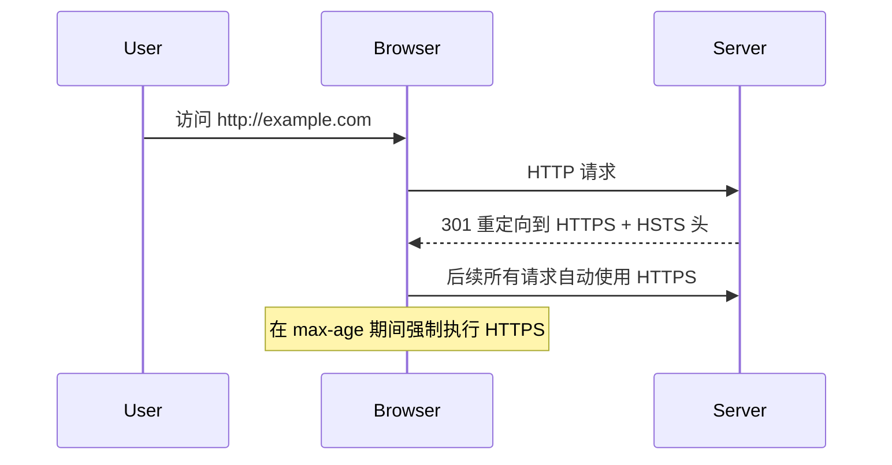
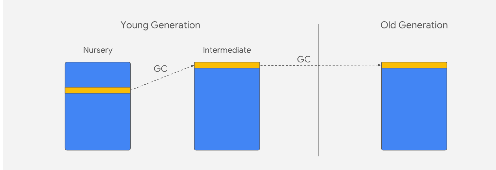

# 浏览器原理

## 跨域有哪些解决方案

- 服务端后台配置`Access-Control-Allow-Origin`
- 通过服务器代理请求
- JSONP
  原理：利用`script`不受同源策略影响，动态创建`script`，请求后端接口，后端返回一段回调函数的 JS 代码，前端通过回调函数获取数据。只支持`GET`，后端需要配合返回`JSONP`

```js
// 前端：定义回调函数
window.handleJsonp = (data) => {
  console.log("JSONP返回数据：", data);
};

// 动态创建script标签，发起请求
const script = document.createElement("script");
script.src = "https://backend.com/api/user?callback=handleJsonp"; // 传递回调函数名
document.body.appendChild(script);

// 后端（Node.js）：返回带回调的JS代码
app.get("/api/user", (req, res) => {
  const callback = req.query.callback; // 获取前端传递的回调函数名
  const data = { name: "张三", age: 20 };
  res.send(`${callback}(${JSON.stringify(data)})`); // 返回：handleJsonp({...})
});
```

- 页面间通信：postMessage

```html
<!-- 父页面（https://parent.com） -->
<iframe id="childFrame" src="https://child.com"></iframe>
<script>
  const frame = document.getElementById("childFrame");
  // 等待iframe加载完成后发送消息
  frame.onload = () => {
    // 发送消息：目标窗口、消息内容、允许的源
    frame.contentWindow.postMessage(
      { type: "greet", data: "Hello from parent" },
      "https://child.com" // 限制接收方域名，提高安全性
    );
  };

  // 监听子页面的回复
  window.addEventListener("message", (e) => {
    // 验证发送方域名（关键！防止恶意网站伪造消息）
    if (e.origin !== "https://child.com") return;
    console.log("收到子页面消息：", e.data);
  });
</script>

<!-- 子页面（https://child.com） -->
<script>
  // 监听父页面消息
  window.addEventListener("message", (e) => {
    // 验证发送方域名
    if (e.origin !== "https://parent.com") return;
    console.log("收到父页面消息：", e.data);

    // 回复父页面
    e.source.postMessage(
      { type: "reply", data: "Hello from child" },
      e.origin // 使用父页面的origin作为目标
    );
  });
</script>
```

-
- websocket 原理：协议本身不限制跨域

## HSTS （HTTP Strict Transport Security）
HSTS（HTTP Strict Transport Security）是一种​​强制浏览器使用 HTTPS 连接的安全策略机制​​，旨在防止中间人攻击和协议降级攻击。

核心作用：
1. 强制 HTTPS 连接​
```
Strict-Transport-Security: max-age=31536000; includeSubDomains; preload
```
- 浏览器收到此响应头后，在指定时间内（max-age）会自动将所有 HTTP 请求转为 HTTPS
- 即使用户手动输入 http://example.com，浏览器也会自动跳转到 https://example.com
2. ​​防止 SSL 剥离攻击​
- 攻击者拦截 HTTP 流量，阻止用户升级到 HTTPS
- HSTS 通过浏览器内置机制完全绕过 HTTP 连接
3. ​​消除首次访问风险​
- 通过 preload列表解决首次访问无 HSTS 策略的问题

原理


## http 和 https 的差别

| 区别     | http               | https                                            |
| -------- | ------------------ | ------------------------------------------------ |
| 安全性   | 无加密，明文       | 基于 SSL/TSL 数据传输安全                        |
| 核心机制 | 数据传输，无安全层 | 3 大核心能力：1.身份验证 2 数据加密 3.完整性校验 |
| 端口     | 默认使用 80        | 默认使用 443                                     |
| 数据传输 | 明文传输           | 加密传输                                         |
| 证书要求 | 无需证书           | 必须安装 CA                                      |
| 性能开销 | 无额外开销         | 需要 SSL/TLS 握手，有轻微性能损耗                |
| SEO 权重 | 搜索引擎权重较低   |                                                  |

## http 强缓存和协商缓存

1. 什么是 http 缓存？作用是什么？
   是浏览器为了减少网络请求，提升页面加载速度而对服务器响应资源进行本地存储的机制。
2. 强缓存和协商缓存的核心区别

- 强缓存，从本地读取缓存，不再向服务端发起请求
- 协商缓存，从本地读取缓存，如果缓存过期需要向服务器发起请求，服务端判断请求是否可用。
  - 若未更新，返回 304 `Not Modified` 客户端使用本地缓存。
  - 若更新，返回 200 并更新缓存。

3. 实现机制
   强缓存

- `expires http 1.0`和`Cache Concrol http1.1`
- expires
- - 格式 `Expires:Wed,21 Oct 2025 07:28:00 GMT`（服务器的绝对时间）
- - 问题依赖客户端和服务器时间同步
- cache-control
- 格式 `Cache-Control:max-age=5000`(相对于服务器请求时间)
- 常用指令
- - `max-age=xxx`:资源有效期
- - `public`:允许任何缓存（如 cdn、代理服务器）存储该资源
- - `private`:允许客户端（浏览器）缓存
- - `no-cache`:不使用强缓存，必需走协商缓存
- - `no-store`:完全不走缓存

协商缓存

- 第一组 `Last-Modified` + `If-Modified-Since`
  - 响应头 `Last-Modifed`：服务器返回资源最后修改时间
  - 请求头 `If-Modified-Since`:客户端再次发起请求时，携带上次`Last-Modifed`值，服务端对比：
  - - 若资源最后修改时间<=该值，未更新，返回 `304`
  - - 若更新，返回 200+新资源 同时更新`Last-Modifed`
- 第二组 `ETag` + `Last-Modified`
- 响应头 `ETag`：生成一个唯一标示符
- 请求头 `If-None-Match`:客户端再次发起请求时，携带上次`ETag`值，服务器对比：
- - 若`ETag`不一致，表示更新 返回 200 + 新内容 + 新`ETag`。
- - 如一致 返回 304 表示资源未更新

### `ETag`比`Last-Modifed`更优，为什么

- `Last-Modifed`只能精确修改，同一秒多次修改，无法识别
- 若资源内容没变只修改名字，`Last-Modifed`标记为更新
- ETag 基于资源内容生成

### 流程与优先级

1.客户端请求资源时，先检查强缓存

- 若 Cache-Control/Expires 未过期，直接使用本地缓存（强缓存命中）；
- 若已过期，进入下一步。 2.强缓存未命中时，触发协商缓存：
- 客户端发送请求，携带 If-Modified-Since/If-None-Match 到服务器；
- 服务器验证资源是否更新：
- - 未更新：返回 304，客户端使用本地缓存（协商缓存命中）；
- - 已更新：返回 200 和新资源，客户端更新本地缓存。

### 如何判断命中强还是协商

- 强缓存命中：网络面板中状态码可能显示 200 OK (from cache) 或不显示状态码（直接从内存 / 磁盘缓存读取），且无请求发送到服务器。
- 协商缓存命中：状态码显示 304 Not Modified，有请求发送到服务器，但服务器未返回资源内容。
- 未命中缓存：状态码显示 200 OK，服务器返回完整资源。


## cookie 的使用

是小型文本文件，用来做数据持久化。
应用场景

- 用户身份认证
- 喜好设置
- 购物车数据持久化
- SSO 单点登录

属性

- name
- value
- expire （绝对时间）
- max-age（相对时间，相同存在优先级高）
- domian （指定 cookie 对哪些域名有效，不能设置非当前域名的顶级域名）
- path
- httpOnly （不允许 js 脚本访问）
- secure 只允许 https
- samesite
- - strict 不允许跨站携带 cookie
- - lax 允许导航到目标网址的 GET 请求携带 Cookie
- - none 允许跨站发送（必须同时设置 Secure）

安全实践

- 1. 敏感信息。始终设置`Secure`和`HttpOnly`
- 2. 跨站 Cookie，始终设置`sameSite = none;Secure`
- 3. 会话管理：设置合理有效时间
- 4. 数据存储：避免存储用户敏感信息
- 5. 生产环境始终使用 HTTPS 保护传输

什么情况会导致 cookie 不携带

- 会话超时 max-ageœ
- 跨站 cookie 的 samesite 设置（none、非同域 ）
- 设置 secure，但使用 http
- domian 和 path 不匹配。

实例

```js
document.cookie = `aa=b;expires=xxx;path=/;Secure;SameSite=Lax`;
```

## XSS 攻击介绍，以及如何防范

XSS（Cross-Site Scripting，跨站脚本攻击）是一种常见的 Web 安全漏洞，其核心原理是攻击者将恶意脚本注入到网页中，当用户访问该页面时，脚本在用户的浏览器执行。从而窃取用户信息，篡改网页内容或执行其他恶意操作。

1. 存储型 XSS

- 特点：恶意脚本被永久存储在服务器（如数据库、评论区、用户资料）
- 流程：
  - 攻击者在评论区提交包含恶意脚本内容（`<script> alert(document.cookie) </script>`）,服务器未过滤直接存储，
  - 其他用户访问该评论页面时，服务器从数据库返回给浏览器，浏览器执行脚本，导致攻击。
- 场景：论坛、博客评论区、用户个人资料页等。

2. 反射型 XSS

- 特点：恶意脚本不存储在服务器，而是通过 URL 参数、表单提交等方式“临时”传递给服务器，再有服务器“反射”回页面。
- 流程：
- - 攻击者构造恶意脚本的 URL（`http://example.com/search?query=<script>steal()</script>`）
- - 诱导用户点击 URL，服务器将`query`参数直接嵌入页面返回，浏览器执行脚本。
- 场景：搜索框、URL 参数展示页等（需用户主动触发恶意链接）

3. DOM 型 XSS

- 特点：恶意脚本的注入和执行完全在**客户端（浏览器）**完成，不经过服务器处理
- 流程：
  - 页面通过 JavaScript 读取 URL 参数（如`locaton.hash`）并直接插入 DOM（`document.innerHTML=location.hash`）
  - 攻击者构建含恶意脚本的 URL（如`http://example.com/#<script>xss()<script> `）,用户点击后，客户端脚本直接将恶意代码插入 DOM 并执行。
- 核心：服务器未参与，漏洞在客户端对用户输入的处理逻辑。
- 例子：`input获取值后复制给innerHtml`

### 危害

- 窃取敏感信息：通过`document.cookie`获取用户 cookie，SessionID，冒充用户身份登录网址。
- 劫持用户会话：利用用户权限执行操作（如转账、发布内容）
- 篡改页面内容：伪造虚假信息（钓鱼链接、虚假登录框）
- 恶意行为：如记录用户的键盘输入（窃取密码）、发起 DDOS 攻击。

### 如何防范 XSS 方法

1. 输入验证与过滤
   对用户输入内容（评论、表单、url 参数）进行严格校验，过滤危险字符和标签
2. 输出编码
   当需要将用户输入的内容展示到页面，对内容进行编码处理，让浏览器将其当作“文本”而非“代码”解析：

- html 编码 （如<→&lt;，>→&gt;，>→&amp;）
- 场景适配：根据输出位置选择编码方式（如 JavaScript 环境用 JS 编码，URL 参数用 URL 编码）

3. 使用 http 安全头

- Content-Security-Policy。定义页面可加载的资源来源（脚本、样式、图片）。禁止执行未授权的脚本。示例配置：`Content-Security-Policy:default-src 'self';script-src 'self' https://trusted-cdn.com`
- X-XSS-Protection: 启用浏览器内置的 XSS 过滤器（现代浏览器多默认启用，可辅助拦截反射型 XSS）。

4. 限制 Cookie 权限

- 设置 Cookie 属性，HttpOnly；Secure
- 设置 SameSite 属性，配合 CSRF 防御。限制 Cookie 在跨站请求中的发送

5. 避免危险 API

- `textContent`代替`innerHTML`
- 禁止`eval` `new Function`等可执行字符串的函数

6. 敏感操作二次验证
   对于转账、修改密码等敏感操作，要求用户输入验证码或再次验证密码，即使 XSS 窃取了会话，也无法直接执行操作。

### 总结：

XSS 的核心是“恶意脚本注入执行”，防御需结合输入过滤（堵源头）、输出编码（防解析）、CSP（限权限） 和 Cookie 保护（降损失），形成多层防护。

## CSRF 介绍，如何防止 CSRF

介绍：是一种常见的 Web 安全攻击，其核心原理是攻击者诱导已认证用户在不知情的情况下，向受信任的服务器发送非本意的请求，从而利用用户的身份执行恶意操作（如转账、修改密码等）。

### 攻击原理

- 前提条件：
  用户已在目标网站（如银行网站）完成登录，持有有效的身份认证信息（如 Cookie、Session）。
  攻击者通过诱导（如邮件、恶意链接、嵌入在第三方网站的图片 / 表单）让用户触发一个针对目标网站的请求。
- 攻击流程：
  用户登录 A 网站（受信任网站），服务器生成 Session 并通过 Cookie 存储用户身份。
  用户未退出 A 网站时，访问了攻击者控制的 B 网站（恶意网站）。
  B 网站向 A 网站发送一个伪造的请求（如转账请求），由于浏览器会自动携带 A 网站的 Cookie，A 网站会误认为该请求是用户本人发起的，从而执行操作。
  

CSRF 特点：

- 利用已认证身份，而非窃取身份
- 攻击目标是执行操作，而不是获取数据
- 攻击者不能直接获取用户 cookie，仅能“滥用”已有的认证状态。

### 如何防止 CSRF？

CRSF 原理是**滥用用户身份**，核心**是让服务器区分哪些请求是用户‘主动、知情’发起的**

#### CSRF TOKEN（最高效）

- 原理：服务器为每个用户生成唯一随机 `CSRF Token`,并将其存储在用户 session 中。
- 流程
- - 客户端请求页面，服务器将 TOKEN 嵌入表单或者响应数据中`<input value='xx' name='csrfToken' >`
- - 请求必需携带，验证 token 和 session 存储是否一致，不一致拒绝。
- - 优势：无法获取 token，攻击者无法伪造请求。

#### 验证 Referer/Origin

- 原理：服务器验证请求来源的 Referer（包含发起请求的 url）和 Origin（包含请求发起的域），判断是否是可信来源
- 局限性：
- - Referer 可能被浏览器屏蔽或窜改，可靠性低。
- - Origin 在部分请求中可能不携带（如导航类请求）

#### 设置 Samesite

- 原理：通过设置 Cookie 的 SameSite 属性，限制 Cookie 在跨站请求中的发送行为
- 优势：无需服务端额外开发，由浏览器自动拦截跨站 Cookie，兼容性较好（现代浏览器均支持）。

#### 其他操作

- 敏感操作二次验证：如转账、修改密码等操作，要求用户输入验证码、密码或进行短信验证，增加攻击门槛。
- 禁用第三方 Cookie：部分浏览器支持禁用第三方 Cookie，从根源上阻止跨站请求携带目标网站的 Cookie

## Http 常见错误码

用于快速标识请求处理结果

### 1xx（服务端接收请求中）

- 100 Continue ：服务端已接受请求头部，允许客户端继续发送请求体（通常用户 POST/PUT 等大请求）
- 101 Switching Protocols：服务端同意客户端等协议切换请求（如 HTTP 请求切换到 WebSocket）

### 2xx 成功状态码（请求已正常处理）

表示客户端请求服务端成功接收、理解并处理

- 200 ok：最常见，请求成功，服务端返回对应资源（如 GET 请求的页面/数据）
- 201 Created：请求成功且服务端创建新资源（如表单提交后创建用户），响应头通常包含`Location`指向新地址。
- 204 No Content：请求成功，但服务器无数据返回（如 DELETE 删除资源，无需返回内容）
- 206 Partical Content：部分请求成功（用于断点续传，客户端通过`Range`头指定获取部分资源。

### 3xx 重定向状态码

- 301 Moved Permanently：永久重定向，请求资源被永久迁移到新地址，客户端应该更新书签引用。
- 302 Found：临时重定向，资源在新地址，客户端下次请求仍需请求旧地址。
- 304 Not Modifed：资源未修改，客户端直接使用本地缓存(`If-Modified-Since`配合使用)
- 307 Temporary Redirect:临时重定向，严格保持原请求方法（如 POST 请求重定向后仍用 POST，而 302 可能被浏览器改为 GET）。

### 4xx 客户端错误状态码（请求存在问题）

- 400 Bad Request：请求格式错误（参数无效、JSON 语法错误），服务器不理解
- 401 Unauthorized：请求需要身份认证，响应头通常包含`WWW-Authenticate`
- 403 Forbidden: 服务器拒接请求（已认证但无权限，如普通用户访问管理员页面）
- 404 NOT FOUND:最常见，请求资源不存在（URL 错误或资源已删除）
- 405 Method Not Allowed：请求方法不被允许（如对静态页面发送 PUT 请求），响应头 Allow 会说明支持的方法。
- 409 Confilct：请求与服务端资源状态冲突（如创建用户但用户存在）
- 413 PayLoad Too Large：请求体过大，服务端拒绝处理（如大文件超过限制）

### 5xx

- 500 Internal Server Error：服务器内部错误
- 502 Bad Gateway-收到了无效响应
  含义：网关或代理服务器在向上游服务器（如后端业务服务器）转发请求时，收到了无效的、不符合 HTTP 协议的响应。简单说：代理服务器成功联系到了后端服务器，但后端返回的内容 “格式错误” 或 “无法被代理理解”，导致代理无法完成请求处理，最终返回 502。
- - 常见场景：
- - 后端服务器崩溃、重启中，返回了非 HTTP 标准的错误数据
- - 后端逻辑错误，输出无效响应（如乱码、不完整的 http 报文）
- - 代理服务器和后端服务器之间的网络传输被篡改、导致响应损坏
- - 503 Service Unavailabe：服务器暂时无法处理请求（维护中、负载过高），通常包含`Retry-After`提示重试时间
- - 504 Gateway Timeout（网关超时）-没收到任何响应
    含义：网关或代理服务器在向上游服务器转发请求后，在规定超时时间内没有收到后端服务器的任何响应（包括正常和异常的响应）。简单说：代理服务器成功联系到了后端服务器，但后端 “处理太慢” 或 “卡住了”，超过了代理设置的等待时间，代理只能终止等待并返回 504。
- 后端服务器负载过高
- 处理逻辑耗时过长，未在规定时间返回
- 代理服务器和后端服务器之间的网络链路不稳定，导致响应传输被阻塞。

## Http 常见的响应头

### `Content-Disposition`

作用：

- 1.控制内容的处理方式:决定是‘在线打开’（如网页、图片、PDF），还是“下载保存”；
- 指定下载文件名：当内容需要下载，可以通过该头指定文件的默认名称（用户可在保存时修改）

关键参数

- inline(默认值)，浏览器在线打开。
- attachment。将内容下载。
- filename：指定下载文件的默认名称

### `Content-Type`

文本类（text/\*）

| Content-Type    | 用途说明     |
| --------------- | ------------ |
| text/html       | HTML 文档    |
| text/plain      | 无格式纯文本 |
| text/css        | css          |
| text/javascript | javascript   |
| text/xml        | XML 格式     |

图片类（image/\*）

| Content-Type  | 用途说明                                |
| ------------- | --------------------------------------- |
| image/jpeg    | JPEG（有损，适合图片）                  |
| image/png     | PNG（无损，支持透明）                   |
| image/gif     | gif 格式图片                            |
| image/svg+xml | svg 矢量图（可缩放、文本格式）          |
| text/webp     | WebP 格式图片（高效压缩，坚固质量体积） |

应用类（application/\*）
用于表示复杂格式的数据（如二进制、结构化数据等），是 API 交互和文件传输中最常用的类别。

| Content-Type                      | 用途说明                                        | 典型场景                           |
| --------------------------------- | ----------------------------------------------- | ---------------------------------- |
| application/json                  | JSON 格式数据（键值对结构，轻量）               | API                                |
| application/x-www-form-urlencoded | 表单数据（键值对用 & 连接，值经 URL 编码）      | 普通表单（默认 enctype）           |
| multipart/form-data               | 多部分表单数据（支持二进制文件、键值对混合）    | 上传文件表单（需显示指定 enctype） |
| application/pdf                   | PDF 文档（便携文档格式）                        | 下载/在线查看 pdf                  |
| application/zip                   | ZIP 压缩文件（多文件打包）                      | 下载压缩包                         |
| application/octet-stream          | 未知二进制流（通用二进制类型）                  | 下载未知格式二进制（.bin .exe）    |
| application/javascript            | JavaScript 代码（新标准，替代 text/javascript） | 现在网页脚本文本                   |
| application/xml                   | XML 格式数据（结构化标记，比 text/xml 更严格）  | 复杂数据交换                       |

多媒体(audio/_ video/_)

| Content-Type | 用途说明                           | 典型场景          |
| ------------ | ---------------------------------- | ----------------- |
| audio/mpeg   | MPEG 音频（如 MP3 格式）           | 播放 MP3 音频文件 |
| audio/wav    | WAV 音频（无损格式，体积较大）     | 原始音频          |
| video/mp4    | MP4 视频（主流视频格式，兼容性好） | 网页播放 MP4 视频 |
| video/mpeg   | MPEG 视频（如 VCD、DVD 格式）      | 传统视频文件      |

注意：

1. 表单提交的区别：
   - 普通表单用`application/x-www-urlencoded`
   - 含文件表单必须用`multipart/form-data` 并在表单中指定`enctype='multipart/form-data' `
2. JSON 和 js 区别
   - JSON(字符串)
   - js 用于传递可执行 js 代码
3. 二进制通用类型 `application/octet-stream`（默认触发下载）

错误指定`Content-Type`,res 时候

- text->binary 转成 blob
- binary->text 乱码
- 请求的时候，表单->json 获取空 json

## http2.0

### 一、协议格式与解析效率

- HTTP/1.1 。采用文本格式传输数据，请求和响应头以纯文本形式呈现，可读性强但解析效率低。
- HTTP/2 引入二进制分帧层，将数据拆分为二进制帧（如 HEADERS 帧、DATA 帧），通过流（Stream）标识符重组。

### 二、连接管理与并发性

- HTTP/1.1
- - 持久连接（Keep-Alive）。允许在同一 TCP 连接上发送多个请求，但需按顺序处理，存在队头阻塞问题
- - 并发限制：浏览器对同一域名通常限制 6~8 个并发连接，需通过多域名分片缓解，但会增加 DNS 查询和连接开销。
- HTTP2
- - 多路复用：单连接上并行处理多个请求 / 响应，彻底消除队头阻塞。例如，一个 TCP 连接可同时传输 HTML、CSS、JS 等资源，无需等待前一个请求完成。
- - 流优先级：客户端可为每个流设置优先级（如优先加载关键 CSS），服务器按优先级调度资源，优化渲染顺序。

### 三、头部压缩与带宽优化

- HTTP/1.1 （如 Cookie、User-Agent）每次请求都需完整传输，冗余严重
- HTTP2。采用 HPACK 算法压缩头部：

### 四、服务器推送与资源预加载

- HTTP/1.1 客户端需显式请求每个资源。例如，加载 HTML 后需单独请求 CSS 和 JS，增加延迟。
- HTTP/2 支持服务器推送（Server Push）：服务器可主动推送客户端可能需要的资源（如 CSS、JS）。例如，发送 HTML 时同时推送关联的 CSS，减少客户端请求次数，加快页面加载速度。

| 区别         | http1                           | http2                                                |
| ------------ | ------------------------------- | ---------------------------------------------------- |
| 页面加载时间 | 依赖多连接和管道化，延迟较高    | 多路复用减少延迟，典型场景提升 20%                   |
| 头部大小     | 冗余文本，平均 1000+字节        | HPACK 压缩后平均 200-500 字节                        |
| TCP 连接数   | 多连接（6-8/域名                | 单连接                                               |
| 高延迟网络   | 处理时间长（200msRTT 验证显著） | 处理时长缩短 60%                                     |
| 场景         | 简单静态                        | 视频流、实时通信等性能敏感场景，挑战是：需配置 HTTPS |

### 总结

http2 采取多路复用、头部压缩、服务端推送和 TLS 加密的特性，显著提升了性能和安全。

## 垃圾回收机制

GC 是 Garbage Collection,程序过程中会产生很多 垃圾,这些垃圾是程序不再使用的内存或者一些不可达的对象,而 GC 就是负责回收垃圾的,找到内存中的垃圾、并释放和回收空间。

在浏览器的发展历史上,用到过两种主要的标记策略:**标记清理** 和 **引用计数**。

### 引用计数

引用计算的核心思想是对**每个值都记录它被引用的次数。声明变量并给他赋一个引用值时,这个值的应用数为 1。**
如果同一个值又被赋给另一个变 量，那么引用数加 1。类似地，如果保存对该值引用的变量被其他值给覆盖了，那么引用数减 1。当一 个值的引用数为 0 时，就说明没办法再访问到这个值了，因此可以安全地收回其内存了。垃圾回收程序 下次运行的时候就会释放引用数为 0 的值的内存。

- 问题：循环引用
- 缺点：时间开销大，需要维护引用数；无法解决循环引用的问题。

### 标记清理

引擎在执行 标记清除算法 时,需要从出发点去遍历内存中所有对象去打标志,而这个出发点就是 根对象,在浏览器中你可以理解为 windows,整个标记清除算法大致过程就像下面这样:

1. 垃圾收集器在运行时会给内存中的所有变量都加上一个标记,假设内存中所有对象都是垃圾,全标记为 0;
2. 然后从 根对象 开始深度遍历,把不是垃圾的节点改成 1;
3. 清除所有标记为 0 的垃圾,销毁并回收它们所占用的内存空
4. 最后把内存中的所有对象标志修改为 0,等待下一轮垃圾回收;

### v8 的 GC

思想：使用**分代式垃圾回收策略**。存活时间短的对象-新生代，存活时间长-老生代。

#### 新生代垃圾回收

原理：采用复制方法实现垃圾回收。将空间分为 `from` 和 `to`。处于使用的是`from`.空闲是`to`.

过程：当分配对象时是在`from`分配；回收时，检查`from`的存活对象，存活的会被复制到`to`，非存活的空间会被释放。然后对`from`和`to`进行空间翻转。但在`from`复制到`to`之前，会对对象进行检查，将存活周期长的移到老生代中，完成对象晋升。

晋升条件：

- 是否经历过`Scavenge`回收。
- to 的空间内存占用超过限制。
  

#### 老生代垃圾回收

老生代采用了 Mark-Sweep(标记清除) 和 Mark-compact(标记整理)。

- Mark-Sweep
- 阶段：分为标记和清除两个阶段。
- 过程：在标记阶段遍历堆中的所有对象,并标记活着的对象,在随后的清除阶段中,只清除没有被标记的阶段。
- 特点：只清除死亡对象。
- 缺点：清除后，造成内存空间不连续的状态。
- Mark-Compact
- 特点：在于对象在标记为死亡后,在整理的过程中,将活着的对象往一端移动,移动完成之后,直接清理边界外的内存。

#### 全停顿（stop the world）

- 概念：都需要用 js 引擎，垃圾回收的 3 种基本算法都需要将应用逻辑停下来,得执行完垃圾回收后再恢复执行应用逻辑,这种行为被称为 全停顿(stop-the-world)。
- 解决方案： V8 先从标记阶段入手,原本一次停顿完成的动作改为增量标记,也就是**拆分为许多小 步进**,每做完一 步进 就让 JavaScript 引用逻辑执行一小会儿,垃圾回收与应用逻辑交替执行直到标记阶段完成,

## SVG 和 Canvas 的区别对比

| 技术   | 核心优势                           | 典型场景                                    |
| ------ | ---------------------------------- | ------------------------------------------- |
| SVG    | 矢量无损缩放、DOM 级交互、结构清晰 | 图表、LOGO、流程图、地图、简单图表          |
| Canvas | 像素级控制、高性能绘制、适合动画   | 游戏、股票 K 线图、实时数据可视化、复杂动画 |
