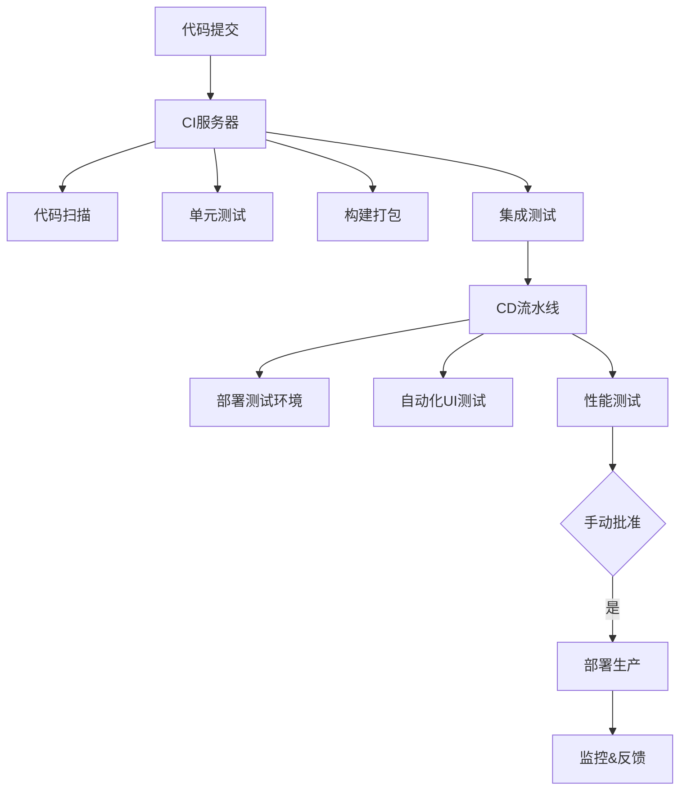

# CI/CD

## 什么是 CI/CD

### CI:持续集成（Continuous Integration）

核心实践：

开发人员每天多次提交代码到共享仓库

每次提交触发自动化构建和测试

快速发现集成错误，通常修复时间<10 分钟

关键价值：

减少集成地狱（Integration Hell）

早期发现缺陷（成本降低 100 倍）

保持主干代码始终可部署

### CD:持续部署（Continuous Deployment）

核心实践：

自动化部署到测试/预生产环境

通过自动化测试验证发布准备度

手动触发生产环境发布

关键价值：

每个变更都可随时发布

降低发布风险

缩短发布周期（从月到天）

### CICD 工作全貌



## 实践

以本站点 vitePress+ git action 进行实践

1.创建工作流文件
笔者使用 git Page 提供的静态托管服务，如图所示

此操作会创建 `./github/workflows/jekyll-gh-pages.yml`,默认内容

```yml
# Sample workflow for building and deploying a Jekyll site to GitHub Pages
name: Deploy Jekyll with GitHub Pages dependencies preinstalled

on:
  # Runs on pushes targeting the default branch
  push:
    branches: ["master"]

  # Allows you to run this workflow manually from the Actions tab
  workflow_dispatch:

# Sets permissions of the GITHUB_TOKEN to allow deployment to GitHub Pages
permissions:
  contents: read
  pages: write
  id-token: write

# Allow only one concurrent deployment, skipping runs queued between the run in-progress and latest queued.
# However, do NOT cancel in-progress runs as we want to allow these production deployments to complete.
concurrency:
  group: "pages"
  cancel-in-progress: false

jobs:
  # Build job
  build:
    runs-on: ubuntu-latest
    steps:
      - name: Checkout
        uses: actions/checkout@v4
      - name: Setup Pages
        uses: actions/configure-pages@v5
      - name: Build with Jekyll
        uses: actions/jekyll-build-pages@v1
        with:
          source: ./
          destination: ./_site
      - name: Upload artifact
        uses: actions/upload-pages-artifact@v3

  # Deployment job
  deploy:
    environment:
      name: github-pages
      url: ${{ steps.deployment.outputs.page_url }}
    runs-on: ubuntu-latest
    needs: build
    steps:
      - name: Deploy to GitHub Pages
        id: deployment
        uses: actions/deploy-pages@v4
```

2.我们需要针对默认生成，创建新的修改

```yml
# Sample workflow for building and deploying a Jekyll site to GitHub Pages
name: Deploy Jekyll with GitHub Pages dependencies preinstalled

on:
  # Runs on pushes targeting the default branch
  push:
    branches: ["main"]

  # Allows you to run this workflow manually from the Actions tab
  workflow_dispatch:

# Sets permissions of the GITHUB_TOKEN to allow deployment to GitHub Pages
permissions:
  contents: read
  pages: write
  id-token: write

# Allow only one concurrent deployment, skipping runs queued between the run in-progress and latest queued.
# However, do NOT cancel in-progress runs as we want to allow these production deployments to complete.
concurrency:
  group: "pages"
  cancel-in-progress: false

jobs:
  # Build job
  build:
    runs-on: ubuntu-latest
    steps:
      - name: Checkout
        uses: actions/checkout@v4
      # 安装node.js
      - name: Setup Node.js
        uses: actions/setup-node@v4
        with:
          node-version: "20" # 推荐使用 LTS 版本
          cache: "npm"
      # 安装依赖
      - name: Install dependencies
        run: npm install
      # 构建VitePress站点，并设置全局变量，注意BASE_PATH配置需同步配置config.mjs里的为base: process.env.BASE_PATH || "",
      # 否则，部分资源会因为最终生成的域名形如 xxx.github.io<repo-name> 而加载不到
      - name: Build VitePress
        run: npm run docs:build
        env:
          BASE_PATH: /${{ github.event.repository.name }}/
      - name: Setup Pages
        uses: actions/configure-pages@v5
      - name: Upload artifact
        uses: actions/upload-pages-artifact@v3
        # 部署部分的修改
        with:
          path: ./.vitepress/dist

  # Deployment job
  deploy:
    environment:
      name: github-pages
      url: ${{ steps.deployment.outputs.page_url }}
    runs-on: ubuntu-latest
    needs: build
    steps:
      - name: Deploy to GitHub Pages
        id: deployment
        uses: actions/deploy-pages@v4
```

3.主要的修改解释

```yml
# 安装node.js
- name: Setup Node.js
  uses: actions/setup-node@v4
  with:
    node-version: "20" # 推荐使用 LTS 版本
    cache: "npm"
# 安装依赖
- name: Install dependencies
  run: npm install
# 构建VitePress站点，并设置全局变量，注意BASE_PATH配置需同步配置config.mjs里的为base: process.env.BASE_PATH || "",
# 否则，部分资源会因为最终生成的域名形如 xxx.github.io<repo-name> 而加载不到
- name: Build VitePress
   run: npm run docs:build
    env:
      BASE_PATH: /${{ github.event.repository.name }}/

- name: Upload artifact
  uses: actions/upload-pages-artifact@v3
  # 部署部分的修改
  with:
    path: ./.vitepress/dist
```

4.保存


构建失败请查看：


最后查看构建的[网站 vitePress](https://hxh-ly.github.io/cicd-vitepress/)

## npm 自动发布工具

## 实践 github action + 阿里云 ECS CICD 部署

架构图

```
开发者本地机器         -->         GitHub仓库         -->         GitHub Actions         -->         阿里云ECS服务器
    (git push)                  (监听push/webhook)            (自动构建、测试、部署)              (通过SSH部署文件)
```

### 一、环境准备

1. 服务器端（阿里云 ECS）准备
   a. 创建部署专用用户（推荐）

```shell
# 以 root 身份登录服务器
adduser deployer
# 为 deployer 用户设置密码
passwd deployer
# 将 deployer 用户添加到 sudo 组（可选，如果部署过程不需要sudo可省略）
usermod -aG sudo deployer

# 切换到 deployer 用户，生成 SSH 密钥对
su - deployer
ssh-keygen -t rsa -b 4096 -C "deployer@your-server-first-docker" # 一路回车，不设密码
cat ~/.ssh/id_rsa.pub >> ~/.ssh/authorized_keys
chmod 600 ~/.ssh/authorized_keys
```

b. 准备项目部署目录，如`/home/deployer/www/your-project-name`,并确保 deployer 用户对该目录有读写权限。

```shell
mkdir -p /home/deployer/www/your-project-name
```

c. DockerFile 编写.在项目根目录下创建 Dockerfile
"style-to-object": "^1.0.9",
"allotment": "^1.20.4",

```shell
# 阶段 1: 构建阶段
FROM node:18-alpine AS builder
WORKDIR /app
# 首先复制依赖定义文件并安装依赖
# 利用 Docker 缓存层，只有当 package.json 或 lock 文件变化时才重新运行 npm ci
COPY package*.json ./
RUN npm ci
# 复制源代码并构建
COPY . .
RUN npm run build

# 阶段 2: 运行阶段
FROM nginx:alpine
# 将构建产物从 builder 阶段复制到 Nginx 的默认静态文件目录
COPY --from=builder /app/dist /usr/share/nginx/html

# 将构建产物从 builder 阶段复制到 Nginx 的默认静态文件目录
COPY --from=builder /app/dist /usr/share/nginx/html

# 暴露 80 端口
EXPOSE 80

# 使用 Nginx 运行（基础镜像的默认命令，通常可省略）
CMD ["nginx", "-g", "daemon off;"]
```

可选，创建`.dockerignore`

```shell
node_modules
Dockerfile
.dockerignore
.git
.github
README.md
```

d. 服务器安装 docker

```shell
# 另一个版本
sudo dnf install -y \
ca-certificates \
curl \
gnupg2 \
redhat-lsb-core
# 1. 创建 RHEL 系系统存放 GPG 密钥的目录（通常已存在，保险起见创建）
sudo mkdir -p /etc/pki/rpm-gpg/

# 备份原有配置（可选）
sudo cp /etc/yum.repos.d/docker-ce.repo /etc/yum.repos.d/docker-ce.repo.bak

# 用阿里云源覆盖配置
sudo tee /etc/yum.repos.d/docker-ce.repo <<-'EOF'
[docker-ce-stable]
name=Docker CE Stable - $basearch
baseurl=https://mirrors.aliyun.com/docker-ce/linux/centos/8/$basearch/stable
enabled=1
gpgcheck=1
gpgkey=https://mirrors.aliyun.com/docker-ce/linux/centos/gpg
EOF

# 清理旧缓存（避免残留的官方源信息干扰）
sudo dnf clean all
sudo dnf makecache

# 彻底卸载可能残留的不完整 Docker 包
sudo dnf remove -y docker-ce docker-ce-cli containerd.io docker-compose-plugin

# 重新安装（使用阿里云源的完整包）
sudo dnf install -y docker-ce docker-ce-cli containerd.io docker-compose-plugin

# 检查 docker.service 服务文件是否生成
ls -l /usr/lib/systemd/system/docker.service

# 若文件存在，启动并验证
sudo systemctl daemon-reload  # 重新加载服务配置
sudo systemctl start docker
sudo systemctl status docker  # 应显示 active (running)
```

e. 配置 Docker Hub 镜像加速器

请将 `https://your-mirror-id.mirror.aliyuncs.com` 替换为你从阿里云容器镜像服务控制台获取的加速器地址。

注册 Docker Hub 账户并创建仓库 记下仓库名字,格式`your-dockerhub-username/your-repo-name`

```shell
sudo mkdir -p /etc/docker
# 创建或修改 daemon.json 文件
sudo tee /etc/docker/daemon.json <<-'EOF'
{
  "registry-mirrors": ["https://your-mirror-id.mirror.aliyuncs.com"]
}
EOF
# 重启 Docker 使配置生效
sudo systemctl daemon-reload
sudo systemctl restart docker
```

### 二、gitHub Action CI/CD 流水线

本地项目创建`.github/workflows/deploy-to-ecs-docker.yml`

```shell
name: Build, Push to Docker Hub and Deploy to ECS

on:
  push:
    branches: [ "main" ]
  # 上面是工作元数据
env:
  # --- 主要修改在这里 ---
  DOCKERHUB_USERNAME: ${{ secrets.DOCKERHUB_USERNAME }} # 你的 Docker Hub 用户名
  IMAGE_NAME: ${{ secrets.DOCKERHUB_USERNAME }}/your-repo-name # 你的 Docker Hub 镜像名，如 'myusername/my-frontend-app'
  # --- 修改结束 ---
  CONTAINER_NAME: "your-container-name" # 你的容器名称，如 my-frontend-app
  ECS_HOST: ${{ secrets.ALIYUN_ECS_HOST }} # 你的 ECS 公网 IP
  ECS_USER: ${{ secrets.ALIYUN_ECS_USER }} # 你的 ECS 登录用户，如 deployer

jobs:
  build-and-push:
    runs-on: ubuntu-latest # 最新版本的 Ubuntu 虚拟机上执行这个 Job
    permissions:
      contents: read
      packages: write

    steps:
      - name: Checkout code
        uses: actions/checkout@v4  #  检出代码

      - name: Set up Docker Buildx
        uses: docker/setup-buildx-action@v3  # Buildx 是 Docker 的一个扩展插件，支持更强大的构建功能，如多平台构建

      - name: Log in to Docker Hub
        # --- 主要修改在这里 ---
        uses: docker/login-action@v3
        with:
          username: ${{ secrets.DOCKERHUB_USERNAME }}
          password: ${{ secrets.DOCKERHUB_TOKEN }} # 使用 Token 而非密码更安全
        # --- 修改结束 ---

      - name: Extract metadata for Docker
        id: meta
        uses: docker/metadata-action@v5
        with:
          images: ${{ env.IMAGE_NAME }} # 直接使用 Docker Hub 镜像名
          tags: |
            type=sha,prefix={{date 'YYYYMMDD'}}-,suffix=-{{sha}}
            type=ref,event=branch
          # 生成镜像标签 这会生成类似 'myusername/myapp:20230915-a1b2c3d' 和 'myusername/myapp:main' 的标签

      - name: Build and push Docker image
        uses: docker/build-push-action@v5
        with:
          context: .
          push: true
          tags: ${{ steps.meta.outputs.tags }}
          labels: ${{ steps.meta.outputs.labels }}
          cache-from: type=gha
          cache-to: type=gha,mode=max
            # 构建并推送镜像
  deploy: # 部署任务
    needs: build-and-push # needs: build-and-push：确保只有在前一个构建任务成功完成后，部署任务才会开始。
    runs-on: ubuntu-latest
    if: github.ref == 'refs/heads/main'

    steps: #通过 SSH 部署
      - name: Deploy to ECS via SSH
        uses: appleboy/ssh-action@v1.0.0
        with:
          host: ${{ env.ECS_HOST }}
          username: ${{ env.ECS_USER }}
          key: ${{ secrets.ALIYUN_ECS_SSH_KEY }}
          script: |
            # --- 主要修改在这里 ---
            # 如果使用私有仓库，需要在服务器上登录 Docker Hub
            # 如果是公共仓库，则无需登录
            echo "${{ secrets.DOCKERHUB_TOKEN }}" | sudo docker login -u "${{ secrets.DOCKERHUB_USERNAME }}" --password-stdin

            # 停止并移除当前正在运行的容器
            sudo docker stop ${{ env.CONTAINER_NAME }} || true
            sudo docker rm ${{ env.CONTAINER_NAME }} || true

            # 拉取最新的镜像（现在从 Docker Hub 拉取）
            sudo docker pull ${{ env.IMAGE_NAME }}:main

            # 运行一个新的容器
            sudo docker run -d \
              --name ${{ env.CONTAINER_NAME }} \
              -p 80:80 \
              --restart=always \
              ${{ env.IMAGE_NAME }}:main
            # --- 修改结束 ---

            # （可选）清理不再使用的旧镜像，避免磁盘空间占用
            sudo docker image prune -af
```

### Docker 镜像拉取超时问题解决指南

配置 Docker 国内镜像源

```shell
# 47.115.61.169
sudo dnf install -y nano # 下载工具
sudo mkdir -p /etc/docker
sudo nano /etc/docker/daemon.json
写入-> { "registry-mirrors": ["https://docker.m.daocloud.io", "https://dockerproxy.com", "https://registry.docker-cn.com", "https://docker.mirrors.ustc.edu.cn",
  "https://hub-mirror.c.163.com", "https://ccr.ccs.tencentyun.com"]
}  # ctrl+o 回车 #ctrl+x退出

sudo systemctl daemon-reload
sudo systemctl restart docker
```

sudo mkdir -p /etc/docker
sudo tee /etc/docker/daemon.json <<-'EOF'
{
"registry-mirrors": ["https://<your-mirror-url>.mirror.aliyuncs.com"]
}
EOF
sudo systemctl daemon-reload
sudo systemctl restart docker

### 总结：整个脚本的工作流程

- 触发：开发者将代码推送到 GitHub 仓库的 main 分支。

- 准备：GitHub Actions 启动一个 Ubuntu 虚拟机，并检出代码。

- 构建：在虚拟机上，使用项目中的 Dockerfile 构建一个 Docker 镜像，并打好标签。

- 推送：将构建好的镜像推送到 Docker Hub 仓库。

- 连接：另一个任务通过 SSH 安全地连接到你的阿里云 ECS 服务器。

- 更新：在服务器上执行一系列命令：拉取新镜像、停止旧容器、启动新容器。

- 清理：移除旧的、不再使用的容器和镜像。

- 完成：部署完成。用户访问你的服务器 IP，看到的就是刚刚部署的新版本应用。

### 三、在 GitHub 仓库配置 Secrets

1. 进入你的 GitHub 项目仓库的 Settings -> Secrets and variables -> Actions。

2. 添加以下 Secrets：

- ALIYUN_ECS_HOST: 你的 ECS 公网 IP。（不变）

- ALIYUN_ECS_USER: 你的 ECS 登录用户（例如 deployer）。（不变）

- ALIYUN_ECS_SSH_KEY: 部署用户的 SSH 私钥。（不变）

- DOCKERHUB_USERNAME: 你的 Docker Hub 用户名。

- DOCKERHUB_TOKEN: 你的 Docker Hub Access Token（推荐使用 Token 而不是密码，更安全）。

3. 获取 Docker Hub Access Token：

- 登录 Docker Hub 网站。

- 点击你的用户名，进入 Account Settings。

- 选择 Security -> New Access Token。

- 为 Token 提供一个描述（例如 github-actions-for-my-app），并设置读/写权限。

- 生成后，立即复制这个 Token 的值，它只会显示一次。

## ecs服务器绑定域名，开放https
- HTTP 仅需服务器开放 80 端口并配置 Web 服务（如 Nginx/Apache）即可；
- HTTPS 需要满足 3 个条件：
- - 服务器安装SSL 证书（与域名匹配）；
- - 开放 443 端口（阿里云安全组 + 服务器防火墙）；
- - Web 服务正确配置 HTTPS（监听 443 端口，关联证书文件）。

## npm 发布

```shell
# 可选 使用nrm 管理 registry
npm install -g nrm --registry=https://registry.npmmirror.com/
nrm ls
nrm use taobao
nrm add myrepo https://registry.myrepo.com/npm/ # 添加自定义源
nrm test taobao  # 测试淘宝源速度
nrm del myrepo # 删除源
```

```shell
# 需切换到npmjs
npm set config registry https://registry.npmjs.org/

npm login


npm version patch #更新一个小版本，如1.1.0 -> 1.1.1，如bug修复;
npm version minor #更新一个中版本，如1.1.0 -> 1.2.0，如新增功能;
npm version major #更新一个大版本，如1.1.0 -> 2.1.0，如重构架构;

npm publish # 发布 (不需要走代理就能发)

```

使用`cimi`工具管理
cimi 是一款全自动 npm 发包工具，一行命令帮助你 git replase、创建 git tag、发布 npm 包。

Cimi 自动生成新版本号，自动生成 commit message，创建 tag，push 到 github，最后发布到 npm 中，整个过程只需要一行命令，解放你的双手！

```shell
cimi patch #更新一个小版本，如1.1.0 -> 1.1.1，如bug修复;
cimi minor #更新一个中版本，如1.1.0 -> 1.2.0，如新增功能;
cimi major #更新一个大版本，如1.1.0 -> 2.1.0，如重构架构;

#而分支默认为master，如果主分支为其他分支，应这样使用:
cimi patch main
cimi patch beta
```

```shell
sudo tee /etc/clash/config.yaml <<-'EOF'
mode: rule
mixed-port: 7897
allow-lan: true
log-level: info
ipv6: false
external-controller: 127.0.0.1:9097
secret: ''
unified-delay: true
cfw-conn-break-strategy: true
hosts:
  mtalk.google.com: 108.177.125.188
  services.googleapis.cn: 74.125.203.94
cfw-latency-timeout: 8000
cfw-latency-url: http://YouTube.com/generate_204
dns:
  enable: true
  listen: 127.0.0.1:1053
  ipv6: true
  default-nameserver:
  - 114.114.114.114
  - 223.5.5.5
  - 119.29.29.29
  enhanced-mode: fake-ip
  fake-ip-range: 28.0.0.1/8
  use-hosts: true
  fake-ip-filter:
  - '*.lan'
  - '*.localdomain'
  - '*.example'
  - '*.invalid'
  - '*.localhost'
  - '*.test'
  - '*.local'
  - '*.home.arpa'
  - time.*.com
  - time.*.gov
  - time.*.edu.cn
  - time.*.apple.com
  - time1.*.com
  - time2.*.com
  - time3.*.com
  - time4.*.com
  - time5.*.com
  - time6.*.com
  - time7.*.com
  - ntp.*.com
  - ntp1.*.com
  - ntp2.*.com
  - ntp3.*.com
  - ntp4.*.com
  - ntp5.*.com
  - ntp6.*.com
  - ntp7.*.com
  - '*.time.edu.cn'
  - '*.ntp.org.cn'
  - +.pool.ntp.org
  - time1.cloud.tencent.com
  - music.163.com
  - '*.music.163.com'
  - '*.126.net'
  - musicapi.taihe.com
  - music.taihe.com
  - songsearch.kugou.com
  - trackercdn.kugou.com
  - '*.kuwo.cn'
  - api-jooxtt.sanook.com
  - api.joox.com
  - joox.com
  - y.qq.com
  - '*.y.qq.com'
  - streamoc.music.tc.qq.com
  - mobileoc.music.tc.qq.com
  - isure.stream.qqmusic.qq.com
  - dl.stream.qqmusic.qq.com
  - aqqmusic.tc.qq.com
  - amobile.music.tc.qq.com
  - '*.xiami.com'
  - '*.music.migu.cn'
  - music.migu.cn
  - +.msftconnecttest.com
  - +.msftncsi.com
  - msftconnecttest.com
  - msftncsi.com
  - localhost.ptlogin2.qq.com
  - localhost.sec.qq.com
  - +.srv.nintendo.net
  - +.stun.playstation.net
  - xbox.*.microsoft.com
  - xnotify.xboxlive.com
  - +.ipv6.microsoft.com
  - +.battlenet.com.cn
  - +.wotgame.cn
  - +.wggames.cn
  - +.wowsgame.cn
  - +.wargaming.net
  - proxy.golang.org
  - stun.*.*
  - stun.*.*.*
  - +.stun.*.*
  - +.stun.*.*.*
  - +.stun.*.*.*.*
  - heartbeat.belkin.com
  - '*.linksys.com'
  - '*.linksyssmartwifi.com'
  - '*.router.asus.com'
  - mesu.apple.com
  - swscan.apple.com
  - swquery.apple.com
  - swdownload.apple.com
  - swcdn.apple.com
  - swdist.apple.com
  - lens.l.google.com
  - stun.l.google.com
  - '*.square-enix.com'
  - '*.finalfantasyxiv.com'
  - '*.ffxiv.com'
  - '*.ff14.sdo.com'
  - ff.dorado.sdo.com
  - '*.mcdn.bilivideo.cn'
  - +.media.dssott.com
  - +.pvp.net
  nameserver:
  - tls://223.5.5.5:853
  - tls://223.6.6.6:853
  - https://doh.pub/dns-query
  - https://dns.alidns.com/dns-query
  use-system-hosts: false
tun:
  stack: gvisor
  device: Mihomo
  auto-route: true
  strict-route: false
  auto-detect-interface: true
  dns-hijack:
  - any:53
  mtu: 1500
  enable: false
profile:
  store-selected: true
udp: true
experimental:
  ignore-resolve-fail: true
bind-address: '*'
proxies:
- name: 剩余流量：87.88 GB
  type: trojan
  server: sg12.trojanyyds.com
  port: 443
  password: ca9f4c30-80ce-4681-a49b-93b286fd628a
  udp: true
  sni: sg12.trojanyyds.com
- name: 距离下次重置剩余：23 天
  type: trojan
  server: sg12.trojanyyds.com
  port: 443
  password: ca9f4c30-80ce-4681-a49b-93b286fd628a
  udp: true
  sni: sg12.trojanyyds.com
- name: 套餐到期：2025-08-29
  type: trojan
  server: sg12.trojanyyds.com
  port: 443
  password: ca9f4c30-80ce-4681-a49b-93b286fd628a
  udp: true
  sni: sg12.trojanyyds.com
- name: 新加坡03-T-T节点将暂时下线
  type: trojan
  server: sg12.trojanyyds.com
  port: 443
  password: ca9f4c30-80ce-4681-a49b-93b286fd628a
  udp: true
  sni: sg12.trojanyyds.com
- name: '[vip1] 香港01'
  type: ss
  server: hk1.kapoknode.site
  port: 21804
  cipher: chacha20-ietf-poly1305
  password: ca9f4c30-80ce-4681-a49b-93b286fd628a
  udp: true
- name: '[vip1] 香港02'
  type: ss
  server: hk2.kapoknode.site
  port: 21804
  cipher: chacha20-ietf-poly1305
  password: ca9f4c30-80ce-4681-a49b-93b286fd628a
  udp: true
- name: '[vip1] 香港03'
  type: ss
  server: hk1.kapoknode.site
  port: 21805
  cipher: chacha20-ietf-poly1305
  password: ca9f4c30-80ce-4681-a49b-93b286fd628a
  udp: true
- name: '[vip1] 香港04'
  type: ss
  server: hk2.kapoknode.site
  port: 21805
  cipher: chacha20-ietf-poly1305
  password: ca9f4c30-80ce-4681-a49b-93b286fd628a
  udp: true
- name: '[vip1] 日本01'
  type: ss
  server: jp1.kapoknode.site
  port: 21807
  cipher: chacha20-ietf-poly1305
  password: ca9f4c30-80ce-4681-a49b-93b286fd628a
  udp: true
- name: '[vip1] 日本02'
  type: ss
  server: jp2.kapoknode.site
  port: 21807
  cipher: chacha20-ietf-poly1305
  password: ca9f4c30-80ce-4681-a49b-93b286fd628a
  udp: true
- name: '[vip1] 日本03'
  type: ss
  server: jp1.kapoknode.site
  port: 21808
  cipher: chacha20-ietf-poly1305
  password: ca9f4c30-80ce-4681-a49b-93b286fd628a
  udp: true
- name: '[vip1] 日本04'
  type: ss
  server: jp2.kapoknode.site
  port: 21808
  cipher: chacha20-ietf-poly1305
  password: ca9f4c30-80ce-4681-a49b-93b286fd628a
  udp: true
- name: '[vip1] 印度01'
  type: ss
  server: cm.kapoknode.site
  port: 21809
  cipher: chacha20-ietf-poly1305
  password: ca9f4c30-80ce-4681-a49b-93b286fd628a
  udp: true
- name: '[vip1] 印度02'
  type: ss
  server: cu.kapoknode.site
  port: 21809
  cipher: chacha20-ietf-poly1305
  password: ca9f4c30-80ce-4681-a49b-93b286fd628a
  udp: true
- name: '[vip1] 新加坡01'
  type: ss
  server: sg1.kapoknode.site
  port: 21810
  cipher: chacha20-ietf-poly1305
  password: ca9f4c30-80ce-4681-a49b-93b286fd628a
  udp: true
- name: '[vip1] 新加坡02'
  type: ss
  server: sg2.kapoknode.site
  port: 21810
  cipher: chacha20-ietf-poly1305
  password: ca9f4c30-80ce-4681-a49b-93b286fd628a
  udp: true
- name: '[vip1] 新加坡03'
  type: ss
  server: sg1.kapoknode.site
  port: 21811
  cipher: chacha20-ietf-poly1305
  password: ca9f4c30-80ce-4681-a49b-93b286fd628a
  udp: true
- name: '[vip1] 新加坡04'
  type: ss
  server: sg2.kapoknode.site
  port: 21811
  cipher: chacha20-ietf-poly1305
  password: ca9f4c30-80ce-4681-a49b-93b286fd628a
  udp: true
- name: '[vip1] 台湾01'
  type: ss
  server: cm.kapoknode.site
  port: 21812
  cipher: chacha20-ietf-poly1305
  password: ca9f4c30-80ce-4681-a49b-93b286fd628a
  udp: true
- name: '[vip1] 台湾02'
  type: ss
  server: cu.kapoknode.site
  port: 21812
  cipher: chacha20-ietf-poly1305
  password: ca9f4c30-80ce-4681-a49b-93b286fd628a
  udp: true
- name: '[vip1] 台湾03'
  type: ss
  server: cm.kapoknode.site
  port: 21813
  cipher: chacha20-ietf-poly1305
  password: ca9f4c30-80ce-4681-a49b-93b286fd628a
  udp: true
- name: '[vip1] 台湾04'
  type: ss
  server: cu.kapoknode.site
  port: 21813
  cipher: chacha20-ietf-poly1305
  password: ca9f4c30-80ce-4681-a49b-93b286fd628a
  udp: true
- name: '[vip1] 美国01'
  type: ss
  server: us1.kapoknode.site
  port: 21819
  cipher: chacha20-ietf-poly1305
  password: ca9f4c30-80ce-4681-a49b-93b286fd628a
  udp: true
- name: '[vip1] 美国02'
  type: ss
  server: us2.kapoknode.site
  port: 21819
  cipher: chacha20-ietf-poly1305
  password: ca9f4c30-80ce-4681-a49b-93b286fd628a
  udp: true
- name: '[vip1] 美国04'
  type: ss
  server: us2.kapoknode.site
  port: 21820
  cipher: chacha20-ietf-poly1305
  password: ca9f4c30-80ce-4681-a49b-93b286fd628a
  udp: true
- name: '[vip1] 美国03'
  type: ss
  server: us1.kapoknode.site
  port: 21820
  cipher: chacha20-ietf-poly1305
  password: ca9f4c30-80ce-4681-a49b-93b286fd628a
  udp: true
proxy-groups:
- name: 节点选择
  type: select
  proxies:
  - 自动选择
  - 故障转移
  - 境内使用
  - 海外使用
  - 剩余流量：87.88 GB
  - 距离下次重置剩余：23 天
  - 套餐到期：2025-08-29
  - 新加坡03-T-T节点将暂时下线
  - '[vip1] 香港01'
  - '[vip1] 香港02'
  - '[vip1] 香港03'
  - '[vip1] 香港04'
  - '[vip1] 日本01'
  - '[vip1] 日本02'
  - '[vip1] 日本03'
  - '[vip1] 日本04'
  - '[vip1] 印度01'
  - '[vip1] 印度02'
  - '[vip1] 新加坡01'
  - '[vip1] 新加坡02'
  - '[vip1] 新加坡03'
  - '[vip1] 新加坡04'
  - '[vip1] 台湾01'
  - '[vip1] 台湾02'
  - '[vip1] 台湾03'
  - '[vip1] 台湾04'
  - '[vip1] 美国01'
  - '[vip1] 美国02'
  - '[vip1] 美国04'
  - '[vip1] 美国03'
- name: 自动选择
  type: url-test
  proxies:
  - 新加坡03-T-T节点将暂时下线
  - '[vip1] 香港01'
  - '[vip1] 香港02'
  - '[vip1] 香港03'
  - '[vip1] 香港04'
  - '[vip1] 日本01'
  - '[vip1] 日本02'
  - '[vip1] 日本03'
  - '[vip1] 日本04'
  - '[vip1] 新加坡01'
  - '[vip1] 新加坡02'
  - '[vip1] 新加坡03'
  - '[vip1] 新加坡04'
  - '[vip1] 台湾01'
  - '[vip1] 台湾02'
  - '[vip1] 台湾03'
  - '[vip1] 台湾04'
  url: http://www.YouTube.com
  interval: 600
  tolerance: 200
- name: 故障转移
  type: fallback
  proxies:
  - 新加坡03-T-T节点将暂时下线
  - '[vip1] 香港01'
  - '[vip1] 香港02'
  - '[vip1] 香港03'
  - '[vip1] 香港04'
  - '[vip1] 日本01'
  - '[vip1] 日本02'
  - '[vip1] 日本03'
  - '[vip1] 日本04'
  - '[vip1] 新加坡01'
  - '[vip1] 新加坡02'
  - '[vip1] 新加坡03'
  - '[vip1] 新加坡04'
  - '[vip1] 台湾01'
  - '[vip1] 台湾02'
  - '[vip1] 台湾03'
  - '[vip1] 台湾04'
  url: http://www.YouTube.com
  interval: 700
  lazy: true
- name: ChatGPT
  type: select
  proxies:
  - 节点选择
  - 剩余流量：87.88 GB
  - 距离下次重置剩余：23 天
  - 套餐到期：2025-08-29
  - 新加坡03-T-T节点将暂时下线
  - '[vip1] 香港01'
  - '[vip1] 香港02'
  - '[vip1] 香港03'
  - '[vip1] 香港04'
  - '[vip1] 日本01'
  - '[vip1] 日本02'
  - '[vip1] 日本03'
  - '[vip1] 日本04'
  - '[vip1] 印度01'
  - '[vip1] 印度02'
  - '[vip1] 新加坡01'
  - '[vip1] 新加坡02'
  - '[vip1] 新加坡03'
  - '[vip1] 新加坡04'
  - '[vip1] 台湾01'
  - '[vip1] 台湾02'
  - '[vip1] 台湾03'
  - '[vip1] 台湾04'
  - '[vip1] 美国01'
  - '[vip1] 美国02'
  - '[vip1] 美国04'
  - '[vip1] 美国03'
- name: 境内使用
  type: select
  proxies:
  - '[vip1] 香港01'
  - '[vip1] 香港02'
  - '[vip1] 香港03'
  - '[vip1] 香港04'
  - '[vip1] 日本01'
  - '[vip1] 日本02'
  - '[vip1] 日本03'
  - '[vip1] 日本04'
  - '[vip1] 印度01'
  - '[vip1] 印度02'
  - '[vip1] 新加坡01'
  - '[vip1] 新加坡02'
  - '[vip1] 新加坡03'
  - '[vip1] 新加坡04'
  - '[vip1] 台湾01'
  - '[vip1] 台湾02'
  - '[vip1] 台湾03'
  - '[vip1] 台湾04'
  - '[vip1] 美国01'
  - '[vip1] 美国02'
  - '[vip1] 美国04'
  - '[vip1] 美国03'
- name: 海外使用
  type: select
  proxies:
  - 新加坡03-T-T节点将暂时下线
- name: Netflix
  type: select
  proxies:
  - 节点选择
  - 新加坡03-T-T节点将暂时下线
  - '[vip1] 香港01'
  - '[vip1] 香港02'
  - '[vip1] 香港03'
  - '[vip1] 香港04'
  - '[vip1] 日本01'
  - '[vip1] 日本02'
  - '[vip1] 日本03'
  - '[vip1] 日本04'
  - '[vip1] 印度01'
  - '[vip1] 印度02'
  - '[vip1] 新加坡01'
  - '[vip1] 新加坡02'
  - '[vip1] 新加坡03'
  - '[vip1] 新加坡04'
  - '[vip1] 台湾01'
  - '[vip1] 台湾02'
  - '[vip1] 台湾03'
  - '[vip1] 台湾04'
  - '[vip1] 美国01'
  - '[vip1] 美国02'
  - '[vip1] 美国04'
  - '[vip1] 美国03'
- name: 哔哩哔哩
  type: select
  proxies:
  - DIRECT
  - 节点选择
  - 新加坡03-T-T节点将暂时下线
  - '[vip1] 香港01'
  - '[vip1] 香港02'
  - '[vip1] 香港03'
  - '[vip1] 香港04'
  - '[vip1] 日本01'
  - '[vip1] 日本02'
  - '[vip1] 日本03'
  - '[vip1] 日本04'
  - '[vip1] 印度01'
  - '[vip1] 印度02'
  - '[vip1] 新加坡01'
  - '[vip1] 新加坡02'
  - '[vip1] 新加坡03'
  - '[vip1] 新加坡04'
  - '[vip1] 台湾01'
  - '[vip1] 台湾02'
  - '[vip1] 台湾03'
  - '[vip1] 台湾04'
  - '[vip1] 美国01'
  - '[vip1] 美国02'
  - '[vip1] 美国04'
  - '[vip1] 美国03'
- name: 抖音
  type: select
  proxies:
  - DIRECT
  - 节点选择
  - 新加坡03-T-T节点将暂时下线
  - '[vip1] 香港01'
  - '[vip1] 香港02'
  - '[vip1] 香港03'
  - '[vip1] 香港04'
  - '[vip1] 日本01'
  - '[vip1] 日本02'
  - '[vip1] 日本03'
  - '[vip1] 日本04'
  - '[vip1] 印度01'
  - '[vip1] 印度02'
  - '[vip1] 新加坡01'
  - '[vip1] 新加坡02'
  - '[vip1] 新加坡03'
  - '[vip1] 新加坡04'
  - '[vip1] 台湾01'
  - '[vip1] 台湾02'
  - '[vip1] 台湾03'
  - '[vip1] 台湾04'
  - '[vip1] 美国01'
  - '[vip1] 美国02'
  - '[vip1] 美国04'
  - '[vip1] 美国03'
- name: Telegram
  type: select
  proxies:
  - 节点选择
  - 新加坡03-T-T节点将暂时下线
  - '[vip1] 香港01'
  - '[vip1] 香港02'
  - '[vip1] 香港03'
  - '[vip1] 香港04'
  - '[vip1] 日本01'
  - '[vip1] 日本02'
  - '[vip1] 日本03'
  - '[vip1] 日本04'
  - '[vip1] 新加坡01'
  - '[vip1] 新加坡02'
  - '[vip1] 新加坡03'
  - '[vip1] 新加坡04'
  - '[vip1] 台湾01'
  - '[vip1] 台湾02'
  - '[vip1] 台湾03'
  - '[vip1] 台湾04'
- name: TikTok
  type: select
  proxies:
  - 新加坡03-T-T节点将暂时下线
  - '[vip1] 日本01'
  - '[vip1] 日本02'
  - '[vip1] 日本03'
  - '[vip1] 日本04'
  - '[vip1] 印度01'
  - '[vip1] 印度02'
  - '[vip1] 新加坡01'
  - '[vip1] 新加坡02'
  - '[vip1] 新加坡03'
  - '[vip1] 新加坡04'
  - '[vip1] 台湾01'
  - '[vip1] 台湾02'
  - '[vip1] 台湾03'
  - '[vip1] 台湾04'
  - '[vip1] 美国01'
  - '[vip1] 美国02'
  - '[vip1] 美国04'
  - '[vip1] 美国03'
- name: Twitter
  type: select
  proxies:
  - 节点选择
  - 新加坡03-T-T节点将暂时下线
  - '[vip1] 香港01'
  - '[vip1] 香港02'
  - '[vip1] 香港03'
  - '[vip1] 香港04'
  - '[vip1] 日本01'
  - '[vip1] 日本02'
  - '[vip1] 日本03'
  - '[vip1] 日本04'
  - '[vip1] 新加坡01'
  - '[vip1] 新加坡02'
  - '[vip1] 新加坡03'
  - '[vip1] 新加坡04'
  - '[vip1] 台湾01'
  - '[vip1] 台湾02'
  - '[vip1] 台湾03'
  - '[vip1] 台湾04'
- name: Copilot
  type: select
  proxies:
  - 节点选择
  - 新加坡03-T-T节点将暂时下线
  - '[vip1] 香港01'
  - '[vip1] 香港02'
  - '[vip1] 香港03'
  - '[vip1] 香港04'
  - '[vip1] 日本01'
  - '[vip1] 日本02'
  - '[vip1] 日本03'
  - '[vip1] 日本04'
  - '[vip1] 印度01'
  - '[vip1] 印度02'
  - '[vip1] 新加坡01'
  - '[vip1] 新加坡02'
  - '[vip1] 新加坡03'
  - '[vip1] 新加坡04'
  - '[vip1] 台湾01'
  - '[vip1] 台湾02'
  - '[vip1] 台湾03'
  - '[vip1] 台湾04'
  - '[vip1] 美国01'
  - '[vip1] 美国02'
  - '[vip1] 美国04'
  - '[vip1] 美国03'
- name: 微软服务
  type: select
  proxies:
  - DIRECT
  - 节点选择
  - 新加坡03-T-T节点将暂时下线
  - '[vip1] 香港01'
  - '[vip1] 香港02'
  - '[vip1] 香港03'
  - '[vip1] 香港04'
  - '[vip1] 日本01'
  - '[vip1] 日本02'
  - '[vip1] 日本03'
  - '[vip1] 日本04'
  - '[vip1] 印度01'
  - '[vip1] 印度02'
  - '[vip1] 新加坡01'
  - '[vip1] 新加坡02'
  - '[vip1] 新加坡03'
  - '[vip1] 新加坡04'
  - '[vip1] 台湾01'
  - '[vip1] 台湾02'
  - '[vip1] 台湾03'
  - '[vip1] 台湾04'
  - '[vip1] 美国01'
  - '[vip1] 美国02'
  - '[vip1] 美国04'
  - '[vip1] 美国03'
- name: 苹果服务
  type: select
  proxies:
  - DIRECT
  - 节点选择
  - 新加坡03-T-T节点将暂时下线
  - '[vip1] 香港01'
  - '[vip1] 香港02'
  - '[vip1] 香港03'
  - '[vip1] 香港04'
  - '[vip1] 日本01'
  - '[vip1] 日本02'
  - '[vip1] 日本03'
  - '[vip1] 日本04'
  - '[vip1] 印度01'
  - '[vip1] 印度02'
  - '[vip1] 新加坡01'
  - '[vip1] 新加坡02'
  - '[vip1] 新加坡03'
  - '[vip1] 新加坡04'
  - '[vip1] 台湾01'
  - '[vip1] 台湾02'
  - '[vip1] 台湾03'
  - '[vip1] 台湾04'
  - '[vip1] 美国01'
  - '[vip1] 美国02'
  - '[vip1] 美国04'
  - '[vip1] 美国03'
- name: 谷歌服务
  type: select
  proxies:
  - 节点选择
  - 新加坡03-T-T节点将暂时下线
  - '[vip1] 香港01'
  - '[vip1] 香港02'
  - '[vip1] 香港03'
  - '[vip1] 香港04'
  - '[vip1] 日本01'
  - '[vip1] 日本02'
  - '[vip1] 日本03'
  - '[vip1] 日本04'
  - '[vip1] 印度01'
  - '[vip1] 印度02'
  - '[vip1] 新加坡01'
  - '[vip1] 新加坡02'
  - '[vip1] 新加坡03'
  - '[vip1] 新加坡04'
  - '[vip1] 台湾01'
  - '[vip1] 台湾02'
  - '[vip1] 台湾03'
  - '[vip1] 台湾04'
  - '[vip1] 美国01'
  - '[vip1] 美国02'
  - '[vip1] 美国04'
  - '[vip1] 美国03'
- name: Steam
  type: select
  proxies:
  - 节点选择
  - DIRECT
  - 新加坡03-T-T节点将暂时下线
  - '[vip1] 香港01'
  - '[vip1] 香港02'
  - '[vip1] 香港03'
  - '[vip1] 香港04'
  - '[vip1] 日本01'
  - '[vip1] 日本02'
  - '[vip1] 日本03'
  - '[vip1] 日本04'
  - '[vip1] 印度01'
  - '[vip1] 印度02'
  - '[vip1] 新加坡01'
  - '[vip1] 新加坡02'
  - '[vip1] 新加坡03'
  - '[vip1] 新加坡04'
  - '[vip1] 台湾01'
  - '[vip1] 台湾02'
  - '[vip1] 台湾03'
  - '[vip1] 台湾04'
  - '[vip1] 美国01'
  - '[vip1] 美国02'
  - '[vip1] 美国04'
  - '[vip1] 美国03'
rules:
- DOMAIN,65.108.238.170,DIRECT
- DOMAIN-KEYWORD,mianhuayun,自动选择
- DOMAIN,chat.openai.com.cdn.cloudflare.net,ChatGPT
- DOMAIN,openaiapi-site.azureedge.net,ChatGPT
- DOMAIN,openaicom-api-bdcpf8c6d2e9atf6.z01.azurefd.net,ChatGPT
- DOMAIN,openaicomproductionae4b.blob.core.windows.net,ChatGPT
- DOMAIN,production-openaicom-storage.azureedge.net,ChatGPT
- DOMAIN,o33249.ingest.sentry.io,ChatGPT
- DOMAIN,openaicom.imgix.net,ChatGPT
- DOMAIN-SUFFIX,chatgpt.com,ChatGPT
- DOMAIN-SUFFIX,oaistatic.com,ChatGPT
- DOMAIN-SUFFIX,oaiusercontent.com,ChatGPT
- DOMAIN-SUFFIX,openai.com,ChatGPT
- DOMAIN-KEYWORD,openai,ChatGPT
- DOMAIN-SUFFIX,coze.com,ChatGPT
- DOMAIN-SUFFIX,ttwstatic.com,ChatGPT
- DOMAIN-SUFFIX,byteoversea.com,ChatGPT
- DOMAIN-SUFFIX,byteintlapi.com,ChatGPT
- DOMAIN-SUFFIX,douyinvod.com,抖音
- DOMAIN-SUFFIX,snssdk.com,抖音
- DOMAIN-SUFFIX,amemv.com,抖音
- DOMAIN-SUFFIX,douyinpic.com,抖音
- DOMAIN-SUFFIX,pstatp.com,抖音
- DOMAIN-SUFFIX,douyinstatic.com,抖音
- DOMAIN-SUFFIX,zjcdn.com,抖音
- DOMAIN-SUFFIX,douyincdn.com,抖音
- DOMAIN-SUFFIX,zijieapi.com,抖音
- DOMAIN-KEYWORD,douyi,抖音
- DOMAIN-SUFFIX,muscdn.com,TikTok
- DOMAIN-SUFFIX,musical.ly,TikTok
- DOMAIN-SUFFIX,tik-tokapi.com,TikTok
- DOMAIN-SUFFIX,tiktok.com,TikTok
- DOMAIN-SUFFIX,tiktokcdn-us.com,TikTok
- DOMAIN-SUFFIX,tiktokcdn.com,TikTok
- DOMAIN-SUFFIX,tiktokd.net,TikTok
- DOMAIN-SUFFIX,tiktokd.org,TikTok
- DOMAIN-SUFFIX,tiktokv.com,TikTok
- DOMAIN-SUFFIX,ttwstatic.com,TikTok
- DOMAIN,p16-tiktokcdn-com.akamaized.net,TikTok
- DOMAIN-SUFFIX,cdnst.net,节点选择
- DOMAIN-SUFFIX,cellmaps.com,节点选择
- DOMAIN-SUFFIX,ekahau.cloud,节点选择
- DOMAIN-SUFFIX,ekahau.com,节点选择
- DOMAIN-SUFFIX,ookla.com,节点选择
- DOMAIN-SUFFIX,ooklaserver.net,节点选择
- DOMAIN-SUFFIX,pingtest.net,节点选择
- DOMAIN-SUFFIX,speedtest.co,节点选择
- DOMAIN-SUFFIX,speedtest.net,节点选择
- DOMAIN-SUFFIX,speedtestcustom.com,节点选择
- DOMAIN-SUFFIX,webtest.net,节点选择
- IP-CIDR,127.0.0.1/32,REJECT,no-resolve
- DOMAIN,injections.adguard.org,DIRECT,no-resolve
- DOMAIN,local.adguard.org,DIRECT,no-resolve
- DOMAIN-SUFFIX,local,DIRECT,no-resolve
- IP-CIDR,127.0.0.0/8,DIRECT,no-resolve
- IP-CIDR,172.16.0.0/12,DIRECT,no-resolve
- IP-CIDR,192.168.0.0/16,DIRECT,no-resolve
- IP-CIDR,10.0.0.0/8,DIRECT,no-resolve
- IP-CIDR,17.0.0.0/8,DIRECT,no-resolve
- IP-CIDR,100.64.0.0/10,DIRECT,no-resolve
- IP-CIDR,224.0.0.0/4,DIRECT,no-resolve
- IP-CIDR6,fe80::/10,DIRECT,no-resolve
- DOMAIN,netflix.com.edgesuite.net,Netflix
- DOMAIN-SUFFIX,fast.com,Netflix
- DOMAIN-SUFFIX,netflix.ca,Netflix
- DOMAIN-SUFFIX,netflix.com,Netflix
- DOMAIN-SUFFIX,netflix.net,Netflix
- DOMAIN-SUFFIX,netflixinvestor.com,Netflix
- DOMAIN-SUFFIX,netflixtechblog.com,Netflix
- DOMAIN-SUFFIX,nflxext.com,Netflix
- DOMAIN-SUFFIX,nflximg.com,Netflix
- DOMAIN-SUFFIX,nflximg.net,Netflix
- DOMAIN-SUFFIX,nflxsearch.net,Netflix
- DOMAIN-SUFFIX,nflxso.net,Netflix
- DOMAIN-SUFFIX,nflxvideo.net,Netflix
- DOMAIN-SUFFIX,netflixdnstest1.com,Netflix
- DOMAIN-SUFFIX,netflixdnstest2.com,Netflix
- DOMAIN-SUFFIX,netflixdnstest3.com,Netflix
- DOMAIN-SUFFIX,netflixdnstest4.com,Netflix
- DOMAIN-SUFFIX,netflixdnstest5.com,Netflix
- DOMAIN-SUFFIX,netflixdnstest6.com,Netflix
- DOMAIN-SUFFIX,netflixdnstest7.com,Netflix
- DOMAIN-SUFFIX,netflixdnstest8.com,Netflix
- DOMAIN-SUFFIX,netflixdnstest9.com,Netflix
- DOMAIN-SUFFIX,netflixdnstest10.com,Netflix
- DOMAIN,api.msn.com,Copilot
- DOMAIN,api.statsig.com,Copilot
- DOMAIN,assets.msn.com,Copilot
- DOMAIN,browser-intake-datadoghq.com,Copilot
- DOMAIN,copilot.microsoft.com,Copilot
- DOMAIN,gateway.bingviz.microsoft.net,Copilot
- DOMAIN,gateway.bingviz.microsoftapp.net,Copilot
- DOMAIN,in.appcenter.ms,Copilot
- DOMAIN,location.microsoft.com,Copilot
- DOMAIN,odc.officeapps.live.com,Copilot
- DOMAIN,openai-api.arkoselabs.com,Copilot
- DOMAIN,openaicomproductionae4b.blob.core.windows.net,Copilot
- DOMAIN,production-openaicom-storage.azureedge.net,Copilot
- DOMAIN,r.bing.com,Copilot
- DOMAIN,self.events.data.microsoft.com,Copilot
- DOMAIN,services.bingapis.com,Copilot
- DOMAIN,static.cloudflareinsights.com,Copilot
- DOMAIN,www.bing.com,Copilot
- DOMAIN-SUFFIX,algolia.net,Copilot
- DOMAIN-SUFFIX,api.microsoftapp.net,Copilot
- DOMAIN-SUFFIX,auth0.com,Copilot
- DOMAIN-SUFFIX,bing-shopping.microsoft-falcon.io,Copilot
- DOMAIN-SUFFIX,cdn.cloudflare.net,Copilot
- DOMAIN-SUFFIX,challenges.cloudflare.com,Copilot
- DOMAIN-SUFFIX,chatgpt.livekit.cloud,Copilot
- DOMAIN-SUFFIX,client-api.arkoselabs.com,Copilot
- DOMAIN-SUFFIX,edgeservices.bing.com,Copilot
- DOMAIN-SUFFIX,events.statsigapi.net,Copilot
- DOMAIN-SUFFIX,featuregates.org,Copilot
- DOMAIN-SUFFIX,sydney.bing.com,Copilot
- DOMAIN-SUFFIX,host.livekit.cloud,Copilot
- DOMAIN-SUFFIX,identrust.com,Copilot
- DOMAIN-SUFFIX,intercom.io,Copilot
- DOMAIN-SUFFIX,intercomcdn.com,Copilot
- DOMAIN-SUFFIX,launchdarkly.com,Copilot
- DOMAIN-SUFFIX,oaistatic.com,Copilot
- DOMAIN-SUFFIX,oaiusercontent.com,Copilot
- DOMAIN-SUFFIX,observeit.net,Copilot
- DOMAIN-SUFFIX,openai.com,Copilot
- DOMAIN-SUFFIX,openaiapi-site.azureedge.net,Copilot
- DOMAIN-SUFFIX,openaicom.imgix.net,Copilot
- DOMAIN-SUFFIX,poe.com,Copilot
- DOMAIN-SUFFIX,segment.io,Copilot
- DOMAIN-SUFFIX,sentry.io,Copilot
- DOMAIN-SUFFIX,stripe.com,Copilot
- DOMAIN-SUFFIX,turn.livekit.cloud,Copilot
- DOMAIN-KEYWORD,openaicom-api,Copilot
- IP-CIDR,24.199.123.28/32,Copilot,no-resolve
- IP-CIDR,64.23.132.171/32,Copilot,no-resolve
- DOMAIN,e122475.dscg.akamaiedge.net,节点选择
- DOMAIN,licdn.cn.cdn20.com,节点选择
- DOMAIN,linkedin.sc.omtrdc.net,节点选择
- DOMAIN-SUFFIX,bizographics.com,节点选择
- DOMAIN-SUFFIX,licdn.com,节点选择
- DOMAIN-SUFFIX,linkedin.at,节点选择
- DOMAIN-SUFFIX,linkedin.com,节点选择
- DOMAIN-SUFFIX,lnkd.in,节点选择
- DOMAIN-SUFFIX,l-0005.dc-msedge.net,节点选择
- DOMAIN-SUFFIX,l-0005.l-msedge.net,节点选择
- DOMAIN-SUFFIX,licdn.cn,节点选择
- DOMAIN-SUFFIX,linkedin.cn,节点选择
- DOMAIN,manga.bilibili.com,哔哩哔哩
- DOMAIN,upos-hz-mirrorakam.akamaized.net,哔哩哔哩
- DOMAIN-SUFFIX,bilicomic.com,哔哩哔哩
- DOMAIN-SUFFIX,bilicomics.com,哔哩哔哩
- DOMAIN-SUFFIX,acg.tv,哔哩哔哩
- DOMAIN-SUFFIX,acgvideo.com,哔哩哔哩
- DOMAIN-SUFFIX,animetamashi.cn,哔哩哔哩
- DOMAIN-SUFFIX,animetamashi.com,哔哩哔哩
- DOMAIN-SUFFIX,anitama.cn,哔哩哔哩
- DOMAIN-SUFFIX,anitama.net,哔哩哔哩
- DOMAIN-SUFFIX,b23.tv,哔哩哔哩
- DOMAIN-SUFFIX,bigfun.cn,哔哩哔哩
- DOMAIN-SUFFIX,bigfunapp.cn,哔哩哔哩
- DOMAIN-SUFFIX,bili22.cn,哔哩哔哩
- DOMAIN-SUFFIX,bili2233.cn,哔哩哔哩
- DOMAIN-SUFFIX,bili23.cn,哔哩哔哩
- DOMAIN-SUFFIX,bili33.cn,哔哩哔哩
- DOMAIN-SUFFIX,biliapi.com,哔哩哔哩
- DOMAIN-SUFFIX,biliapi.net,哔哩哔哩
- DOMAIN-SUFFIX,bilibili.cc,哔哩哔哩
- DOMAIN-SUFFIX,bilibili.cn,哔哩哔哩
- DOMAIN-SUFFIX,bilibili.com,哔哩哔哩
- DOMAIN-SUFFIX,bilibili.net,哔哩哔哩
- DOMAIN-SUFFIX,bilibilipay.cn,哔哩哔哩
- DOMAIN-SUFFIX,bilibilipay.com,哔哩哔哩
- DOMAIN-SUFFIX,bilicdn1.com,哔哩哔哩
- DOMAIN-SUFFIX,bilicdn2.com,哔哩哔哩
- DOMAIN-SUFFIX,bilicdn3.com,哔哩哔哩
- DOMAIN-SUFFIX,bilicdn4.com,哔哩哔哩
- DOMAIN-SUFFIX,bilicdn5.com,哔哩哔哩
- DOMAIN-SUFFIX,biligo.com,哔哩哔哩
- DOMAIN-SUFFIX,biliimg.com,哔哩哔哩
- DOMAIN-SUFFIX,bilivideo.cn,哔哩哔哩
- DOMAIN-SUFFIX,bilivideo.com,哔哩哔哩
- DOMAIN-SUFFIX,bilivideo.net,哔哩哔哩
- DOMAIN-SUFFIX,dreamcast.hk,哔哩哔哩
- DOMAIN-SUFFIX,hdslb.com,哔哩哔哩
- DOMAIN-SUFFIX,hdslb.org,哔哩哔哩
- DOMAIN-SUFFIX,im9.com,哔哩哔哩
- DOMAIN-SUFFIX,maoercdn.com,哔哩哔哩
- DOMAIN-SUFFIX,mincdn.com,哔哩哔哩
- DOMAIN-SUFFIX,yo9.com,哔哩哔哩
- DOMAIN-SUFFIX,bilibili.tv,哔哩哔哩
- DOMAIN-SUFFIX,biliintl.com,哔哩哔哩
- DOMAIN-SUFFIX,bilibiligame.cn,哔哩哔哩
- DOMAIN-SUFFIX,bilibiligame.co,哔哩哔哩
- DOMAIN-SUFFIX,bilibiligame.net,哔哩哔哩
- DOMAIN-SUFFIX,biligame.co,哔哩哔哩
- DOMAIN-SUFFIX,biligame.com,哔哩哔哩
- DOMAIN-SUFFIX,biligame.net,哔哩哔哩
- DOMAIN,e.crashlytics.com,REJECT
- DOMAIN-SUFFIX,a1.mzstatic.com,苹果服务
- DOMAIN-SUFFIX,a2.mzstatic.com,苹果服务
- DOMAIN-SUFFIX,a3.mzstatic.com,苹果服务
- DOMAIN-SUFFIX,a4.mzstatic.com,苹果服务
- DOMAIN-SUFFIX,a5.mzstatic.com,苹果服务
- DOMAIN-SUFFIX,adcdownload.apple.com.akadns.net,苹果服务
- DOMAIN-SUFFIX,adcdownload.apple.com,苹果服务
- DOMAIN-SUFFIX,appldnld.apple.com,苹果服务
- DOMAIN-SUFFIX,appldnld.g.aaplimg.com,苹果服务
- DOMAIN-SUFFIX,appleid.cdn-apple.com,苹果服务
- DOMAIN-SUFFIX,apps.apple.com,苹果服务
- DOMAIN-SUFFIX,apps.mzstatic.com,苹果服务
- DOMAIN-SUFFIX,cdn-cn1.apple-mapkit.com,苹果服务
- DOMAIN-SUFFIX,cdn-cn2.apple-mapkit.com,苹果服务
- DOMAIN-SUFFIX,cdn-cn3.apple-mapkit.com,苹果服务
- DOMAIN-SUFFIX,cdn-cn4.apple-mapkit.com,苹果服务
- DOMAIN-SUFFIX,cdn.apple-mapkit.com,苹果服务
- DOMAIN-SUFFIX,cdn1.apple-mapkit.com,苹果服务
- DOMAIN-SUFFIX,cdn2.apple-mapkit.com,苹果服务
- DOMAIN-SUFFIX,cdn3.apple-mapkit.com,苹果服务
- DOMAIN-SUFFIX,cdn4.apple-mapkit.com,苹果服务
- DOMAIN-SUFFIX,cds-cdn.v.aaplimg.com,苹果服务
- DOMAIN-SUFFIX,cds.apple.com.akadns.net,苹果服务
- DOMAIN-SUFFIX,cds.apple.com,苹果服务
- DOMAIN-SUFFIX,cl1-cdn.origin-apple.com.akadns.net,苹果服务
- DOMAIN-SUFFIX,cl1.apple.com,苹果服务
- DOMAIN-SUFFIX,cl2-cn.apple.com,苹果服务
- DOMAIN-SUFFIX,cl2.apple.com.edgekey.net.globalredir.akadns.net,苹果服务
- DOMAIN-SUFFIX,cl2.apple.com,苹果服务
- DOMAIN-SUFFIX,cl3-cdn.origin-apple.com.akadns.net,苹果服务
- DOMAIN-SUFFIX,cl3.apple.com,苹果服务
- DOMAIN-SUFFIX,cl4-cdn.origin-apple.com.akadns.net,苹果服务
- DOMAIN-SUFFIX,cl4-cn.apple.com,苹果服务
- DOMAIN-SUFFIX,cl4.apple.com,苹果服务
- DOMAIN-SUFFIX,cl5-cdn.origin-apple.com.akadns.net,苹果服务
- DOMAIN-SUFFIX,cl5.apple.com,苹果服务
- DOMAIN-SUFFIX,clientflow.apple.com.akadns.net,苹果服务
- DOMAIN-SUFFIX,clientflow.apple.com,苹果服务
- DOMAIN-SUFFIX,configuration.apple.com.akadns.net,苹果服务
- DOMAIN-SUFFIX,configuration.apple.com,苹果服务
- DOMAIN-SUFFIX,cstat.apple.com,苹果服务
- DOMAIN-SUFFIX,dd-cdn.origin-apple.com.akadns.net,苹果服务
- DOMAIN-SUFFIX,download.developer.apple.com,苹果服务
- DOMAIN-SUFFIX,gs-loc-cn.apple.com,苹果服务
- DOMAIN-SUFFIX,gs-loc.apple.com,苹果服务
- DOMAIN-SUFFIX,gsp10-ssl-cn.ls.apple.com,苹果服务
- DOMAIN-SUFFIX,gsp11-cn.ls.apple.com,苹果服务
- DOMAIN-SUFFIX,gsp12-cn.ls.apple.com,苹果服务
- DOMAIN-SUFFIX,gsp13-cn.ls.apple.com,苹果服务
- DOMAIN-SUFFIX,gsp4-cn.ls.apple.com.edgekey.net.globalredir.akadns.net,苹果服务
- DOMAIN-SUFFIX,gsp4-cn.ls.apple.com.edgekey.net,苹果服务
- DOMAIN-SUFFIX,gsp4-cn.ls.apple.com,苹果服务
- DOMAIN-SUFFIX,gsp5-cn.ls.apple.com,苹果服务
- DOMAIN-SUFFIX,gsp85-cn-ssl.ls.apple.com,苹果服务
- DOMAIN-SUFFIX,gspe19-cn-ssl.ls.apple.com,苹果服务
- DOMAIN-SUFFIX,gspe19-cn.ls-apple.com.akadns.net,苹果服务
- DOMAIN-SUFFIX,gspe19-cn.ls.apple.com,苹果服务
- DOMAIN-SUFFIX,gspe21-ssl.ls.apple.com,苹果服务
- DOMAIN-SUFFIX,gspe21.ls.apple.com,苹果服务
- DOMAIN-SUFFIX,gspe35-ssl.ls.apple.com,苹果服务
- DOMAIN-SUFFIX,iadsdk.apple.com,苹果服务
- DOMAIN-SUFFIX,icloud-cdn.icloud.com.akadns.net,苹果服务
- DOMAIN-SUFFIX,icloud.cdn-apple.com,苹果服务
- DOMAIN-SUFFIX,images.apple.com.akadns.net,苹果服务
- DOMAIN-SUFFIX,images.apple.com.edgekey.net.globalredir.akadns.net,苹果服务
- DOMAIN-SUFFIX,images.apple.com,苹果服务
- DOMAIN-SUFFIX,init-p01md-lb.push-apple.com.akadns.net,苹果服务
- DOMAIN-SUFFIX,init-p01md.apple.com,苹果服务
- DOMAIN-SUFFIX,init-p01st-lb.push-apple.com.akadns.net,苹果服务
- DOMAIN-SUFFIX,init-p01st.push.apple.com,苹果服务
- DOMAIN-SUFFIX,init-s01st-lb.push-apple.com.akadns.net,苹果服务
- DOMAIN-SUFFIX,init-s01st.push.apple.com,苹果服务
- DOMAIN-SUFFIX,iosapps.itunes.g.aaplimg.com,苹果服务
- DOMAIN-SUFFIX,iphone-ld.apple.com,苹果服务
- DOMAIN-SUFFIX,is1-ssl.mzstatic.com,苹果服务
- DOMAIN-SUFFIX,is1.mzstatic.com,苹果服务
- DOMAIN-SUFFIX,is2-ssl.mzstatic.com,苹果服务
- DOMAIN-SUFFIX,is2.mzstatic.com,苹果服务
- DOMAIN-SUFFIX,is3-ssl.mzstatic.com,苹果服务
- DOMAIN-SUFFIX,is3.mzstatic.com,苹果服务
- DOMAIN-SUFFIX,is4-ssl.mzstatic.com,苹果服务
- DOMAIN-SUFFIX,is4.mzstatic.com,苹果服务
- DOMAIN-SUFFIX,is5-ssl.mzstatic.com,苹果服务
- DOMAIN-SUFFIX,is5.mzstatic.com,苹果服务
- DOMAIN-SUFFIX,itunes-apple.com.akadns.net,苹果服务
- DOMAIN-SUFFIX,itunes.apple.com,苹果服务
- DOMAIN-SUFFIX,itunesconnect.apple.com,苹果服务
- DOMAIN-SUFFIX,mesu-cdn.apple.com.akadns.net,苹果服务
- DOMAIN-SUFFIX,mesu-china.apple.com.akadns.net,苹果服务
- DOMAIN-SUFFIX,mesu.apple.com,苹果服务
- DOMAIN-SUFFIX,music.apple.com,苹果服务
- DOMAIN-SUFFIX,ocsp-lb.apple.com.akadns.net,苹果服务
- DOMAIN-SUFFIX,ocsp.apple.com,苹果服务
- DOMAIN-SUFFIX,oscdn.apple.com,苹果服务
- DOMAIN-SUFFIX,oscdn.origin-apple.com.akadns.net,苹果服务
- DOMAIN-SUFFIX,pancake.apple.com,苹果服务
- DOMAIN-SUFFIX,pancake.cdn-apple.com.akadns.net,苹果服务
- DOMAIN-SUFFIX,phobos.apple.com,苹果服务
- DOMAIN-SUFFIX,prod-support.apple-support.akadns.net,苹果服务
- DOMAIN-SUFFIX,reserve-prime.apple.com,苹果服务
- DOMAIN-SUFFIX,s.mzstatic.com,苹果服务
- DOMAIN-SUFFIX,stocks-sparkline-lb.apple.com.akadns.net,苹果服务
- DOMAIN-SUFFIX,store.apple.com.edgekey.net.globalredir.akadns.net,苹果服务
- DOMAIN-SUFFIX,store.apple.com.edgekey.net,苹果服务
- DOMAIN-SUFFIX,store.apple.com,苹果服务
- DOMAIN-SUFFIX,store.storeimages.apple.com.akadns.net,苹果服务
- DOMAIN-SUFFIX,store.storeimages.cdn-apple.com,苹果服务
- DOMAIN-SUFFIX,support-china.apple-support.akadns.net,苹果服务
- DOMAIN-SUFFIX,support.apple.com,苹果服务
- DOMAIN-SUFFIX,swcatalog-cdn.apple.com.akadns.net,苹果服务
- DOMAIN-SUFFIX,swcatalog.apple.com,苹果服务
- DOMAIN-SUFFIX,swcdn.apple.com,苹果服务
- DOMAIN-SUFFIX,swcdn.g.aaplimg.com,苹果服务
- DOMAIN-SUFFIX,swdist.apple.com.akadns.net,苹果服务
- DOMAIN-SUFFIX,swdist.apple.com,苹果服务
- DOMAIN-SUFFIX,swscan-cdn.apple.com.akadns.net,苹果服务
- DOMAIN-SUFFIX,swscan.apple.com,苹果服务
- DOMAIN-SUFFIX,updates-http.cdn-apple.com.akadns.net,苹果服务
- DOMAIN-SUFFIX,updates-http.cdn-apple.com,苹果服务
- DOMAIN-SUFFIX,updates.cdn-apple.com,苹果服务
- DOMAIN-SUFFIX,valid.apple.com,苹果服务
- DOMAIN-SUFFIX,valid.origin-apple.com.akadns.net,苹果服务
- DOMAIN-SUFFIX,www.apple.com.edgekey.net.globalredir.akadns.net,苹果服务
- DOMAIN-SUFFIX,www.apple.com.edgekey.net,苹果服务
- DOMAIN-SUFFIX,www.apple.com,苹果服务
- DOMAIN-SUFFIX,www-cdn.icloud.com.akadns.net,苹果服务
- DOMAIN-SUFFIX,applemx-icloud.com,苹果服务
- DOMAIN,api.smoot.apple.cn,苹果服务
- DOMAIN,apple-events.akamaized.net,苹果服务
- DOMAIN,apple.comscoreresearch.com,苹果服务
- DOMAIN-SUFFIX,aaplimg.com,苹果服务
- DOMAIN-SUFFIX,akadns.net,苹果服务
- DOMAIN-SUFFIX,apple-cloudkit.com,苹果服务
- DOMAIN-SUFFIX,apple-dns.net,苹果服务
- DOMAIN-SUFFIX,apple-icloud.cn,苹果服务
- DOMAIN-SUFFIX,apple-livephotoskit.com,苹果服务
- DOMAIN-SUFFIX,apple-mapkit.com,苹果服务
- DOMAIN-SUFFIX,apple.co,苹果服务
- DOMAIN-SUFFIX,apple.com,苹果服务
- DOMAIN-SUFFIX,apple.com.cdn20.com,苹果服务
- DOMAIN-SUFFIX,apple.com.cn,苹果服务
- DOMAIN-SUFFIX,apple.com.mwcloudcdn.com,苹果服务
- DOMAIN-SUFFIX,apple.com.mwcname.com,苹果服务
- DOMAIN-SUFFIX,apple.news,苹果服务
- DOMAIN-SUFFIX,appleicloud.cn,苹果服务
- DOMAIN-SUFFIX,applemusic.com,苹果服务
- DOMAIN-SUFFIX,applemx-icloud.com,苹果服务
- DOMAIN-SUFFIX,appsto.re,苹果服务
- DOMAIN-SUFFIX,appstore.com,苹果服务
- DOMAIN-SUFFIX,apzones.com,苹果服务
- DOMAIN-SUFFIX,cdn-apple.com,苹果服务
- DOMAIN-SUFFIX,crashlytics.com,苹果服务
- DOMAIN-SUFFIX,digicert.com,苹果服务
- DOMAIN-SUFFIX,gsp4-cn.ls.apple.com.edgekey.net,苹果服务
- DOMAIN-SUFFIX,icloud,苹果服务
- DOMAIN-SUFFIX,itunes.com,苹果服务
- DOMAIN-SUFFIX,itunes.com.edgekey.net,苹果服务
- DOMAIN-SUFFIX,me.com,苹果服务
- DOMAIN-SUFFIX,mzstatic.com,苹果服务
- DOMAIN-SUFFIX,safebrowsing.apple,苹果服务
- DOMAIN-SUFFIX,store.apple.com.edgekey.net,苹果服务
- DOMAIN-SUFFIX,www.apple.com.edgekey.net,苹果服务
- DOMAIN-SUFFIX,wwwicloud.com,苹果服务
- DOMAIN-KEYWORD,apple-support.akadns.net,苹果服务
- DOMAIN-KEYWORD,apple.com.akadns.net,苹果服务
- DOMAIN-KEYWORD,apple.com.edgekey.net,苹果服务
- DOMAIN-KEYWORD,icloud.com.akadns.net,苹果服务
- DOMAIN-KEYWORD,icoudo,苹果服务
- DOMAIN-KEYWORD,icoudos,苹果服务
- DOMAIN-KEYWORD,testflight,苹果服务
- IP-CIDR,139.178.128.0/18,苹果服务,no-resolve
- IP-CIDR,144.178.0.0/19,苹果服务,no-resolve
- IP-CIDR,144.178.36.0/22,苹果服务,no-resolve
- IP-CIDR,144.178.48.0/20,苹果服务,no-resolve
- IP-CIDR,17.0.0.0/8,苹果服务,no-resolve
- IP-CIDR,192.35.50.0/24,苹果服务,no-resolve
- IP-CIDR,198.183.17.0/24,苹果服务,no-resolve
- IP-CIDR,205.180.175.0/24,苹果服务,no-resolve
- IP-CIDR,63.92.224.0/19,苹果服务,no-resolve
- IP-CIDR,65.199.22.0/23,苹果服务,no-resolve
- DOMAIN,f3b7q2p3.ssl.hwcdn.net,Steam
- DOMAIN,steambroadcast.akamaized.net,Steam
- DOMAIN,steamcdn-a.akamaihd.net,Steam
- DOMAIN,steamcommunity-a.akamaihd.net,Steam
- DOMAIN,steammobile.akamaized.net,Steam
- DOMAIN,steampipe-kr.akamaized.net,Steam
- DOMAIN,xz.pphimalayanrt.com,Steam
- DOMAIN,steampipe-partner.akamaized.net,Steam
- DOMAIN,steampipe.akamaized.net,Steam
- DOMAIN,steamstore-a.akamaihd.net,Steam
- DOMAIN,steamusercontent-a.akamaihd.net,Steam
- DOMAIN,steamuserimages-a.akamaihd.net,Steam
- DOMAIN,steamvideo-a.akamaihd.net,Steam
- DOMAIN-SUFFIX,valvesoftware.com,Steam
- DOMAIN-SUFFIX,s.team,Steam
- DOMAIN-SUFFIX,steam-api.com,Steam
- DOMAIN-SUFFIX,steam-chat.com,Steam
- DOMAIN-SUFFIX,steamcommunity.com,Steam
- DOMAIN-SUFFIX,steamdeck.com,Steam
- DOMAIN-SUFFIX,steamgames.com,Steam
- DOMAIN-SUFFIX,playartifact.com,Steam
- DOMAIN-SUFFIX,steamstatic.com,Steam
- DOMAIN-SUFFIX,underlords.com,Steam
- DOMAIN-SUFFIX,steampowered.com,Steam
- DOMAIN-SUFFIX,steam.eca.qtlglb.com,Steam
- DOMAIN-SUFFIX,steam.apac.qtlglb.com,Steam
- DOMAIN-SUFFIX,steam.naeu.qtlglb.com,Steam
- DOMAIN-SUFFIX,steam.ru.qtlglb.com,Steam
- DOMAIN-SUFFIX,steam.cdn.on.net,Steam
- DOMAIN-SUFFIX,steam.cdn.webra.ru,Steam
- DOMAIN-SUFFIX,edge.steam-dns.top.comcast.net,Steam
- DOMAIN-SUFFIX,steam.cdn.orcon.net.nz,Steam
- DOMAIN-SUFFIX,steam.cdn.slingshot.co.nz,Steam
- DOMAIN-SUFFIX,steamcontent.com,Steam
- DOMAIN-SUFFIX,steamserver.net,Steam
- DOMAIN-SUFFIX,steamusercontent.com,Steam
- DOMAIN-SUFFIX,csgo.wmsj.cn,Steam
- DOMAIN-SUFFIX,dota2.wmsj.cn,Steam
- DOMAIN-SUFFIX,wmsjsteam.com,Steam
- DOMAIN-SUFFIX,dl.steam.clngaa.com,Steam
- DOMAIN-SUFFIX,dl.steam.ksyna.com,Steam
- DOMAIN-SUFFIX,st.dl.bscstorage.net,Steam
- DOMAIN-SUFFIX,st.dl.eccdnx.com,Steam
- DOMAIN-SUFFIX,st.dl.pinyuncloud.com,Steam
- DOMAIN-SUFFIX,steampipe.steamcontent.tnkjmec.com,Steam
- DOMAIN-SUFFIX,steampowered.com.8686c.com,Steam
- DOMAIN-SUFFIX,steamstatic.com.8686c.com,Steam
- DOMAIN-SUFFIX,steamchina.com,Steam
- DOMAIN-SUFFIX,ads-twitter.com,Twitter
- DOMAIN-SUFFIX,cms-twdigitalassets.com,Twitter
- DOMAIN-SUFFIX,periscope.tv,Twitter
- DOMAIN-SUFFIX,pscp.tv,Twitter
- DOMAIN-SUFFIX,t.co,Twitter
- DOMAIN-SUFFIX,tellapart.com,Twitter
- DOMAIN-SUFFIX,tweetdeck.com,Twitter
- DOMAIN-SUFFIX,twimg.com,Twitter
- DOMAIN-SUFFIX,twitpic.com,Twitter
- DOMAIN-SUFFIX,twitter.biz,Twitter
- DOMAIN-SUFFIX,twitter.com,Twitter
- DOMAIN-SUFFIX,twitter.jp,Twitter
- DOMAIN-SUFFIX,twittercommunity.com,Twitter
- DOMAIN-SUFFIX,twitterflightschool.com,Twitter
- DOMAIN-SUFFIX,twitterinc.com,Twitter
- DOMAIN-SUFFIX,twitteroauth.com,Twitter
- DOMAIN-SUFFIX,twitterstat.us,Twitter
- DOMAIN-SUFFIX,twtrdns.net,Twitter
- DOMAIN-SUFFIX,twttr.com,Twitter
- DOMAIN-SUFFIX,twttr.net,Twitter
- DOMAIN-SUFFIX,twvid.com,Twitter
- DOMAIN-SUFFIX,vine.co,Twitter
- DOMAIN-SUFFIX,x.com,Twitter
- DOMAIN-SUFFIX,0emm.com,谷歌服务
- DOMAIN-SUFFIX,1e100.net,谷歌服务
- DOMAIN-SUFFIX,1ucrs.com,谷歌服务
- DOMAIN-SUFFIX,265.com,谷歌服务
- DOMAIN-SUFFIX,2mdn.net,谷歌服务
- DOMAIN-SUFFIX,466453.com,谷歌服务
- DOMAIN-SUFFIX,abc.xyz,谷歌服务
- DOMAIN-SUFFIX,adgoogle.net,谷歌服务
- DOMAIN-SUFFIX,admeld.com,谷歌服务
- DOMAIN-SUFFIX,admob.com,谷歌服务
- DOMAIN-SUFFIX,adsense.com,谷歌服务
- DOMAIN-SUFFIX,adsensecustomsearchads.com,谷歌服务
- DOMAIN-SUFFIX,adsenseformobileapps.com,谷歌服务
- DOMAIN-SUFFIX,advertisercommunity.com,谷歌服务
- DOMAIN-SUFFIX,advertiserscommunity.com,谷歌服务
- DOMAIN-SUFFIX,adwords-community.com,谷歌服务
- DOMAIN-SUFFIX,adwords.com,谷歌服务
- DOMAIN-SUFFIX,adwordsexpress.com,谷歌服务
- DOMAIN-SUFFIX,amp.dev,谷歌服务
- DOMAIN-SUFFIX,ampproject.com,谷歌服务
- DOMAIN-SUFFIX,ampproject.net,谷歌服务
- DOMAIN-SUFFIX,ampproject.org,谷歌服务
- DOMAIN-SUFFIX,android.com,谷歌服务
- DOMAIN-SUFFIX,androidify.com,谷歌服务
- DOMAIN-SUFFIX,androidtv.com,谷歌服务
- DOMAIN-SUFFIX,angulardart.org,谷歌服务
- DOMAIN-SUFFIX,api.ai,谷歌服务
- DOMAIN-SUFFIX,apigee.com,谷歌服务
- DOMAIN-SUFFIX,app-measurement.com,谷歌服务
- DOMAIN-SUFFIX,app-measurement.net,谷歌服务
- DOMAIN-SUFFIX,appbridge.ca,谷歌服务
- DOMAIN-SUFFIX,appbridge.io,谷歌服务
- DOMAIN-SUFFIX,appbridge.it,谷歌服务
- DOMAIN-SUFFIX,appspot.com,谷歌服务
- DOMAIN-SUFFIX,apture.com,谷歌服务
- DOMAIN-SUFFIX,area120.com,谷歌服务
- DOMAIN-SUFFIX,asp-cc.com,谷歌服务
- DOMAIN-SUFFIX,autodraw.com,谷歌服务
- DOMAIN-SUFFIX,bandpage.com,谷歌服务
- DOMAIN-SUFFIX,baselinestudy.com,谷歌服务
- DOMAIN-SUFFIX,baselinestudy.org,谷歌服务
- DOMAIN-SUFFIX,bazel.build,谷歌服务
- DOMAIN-SUFFIX,bdn.dev,谷歌服务
- DOMAIN-SUFFIX,beatthatquote.com,谷歌服务
- DOMAIN-SUFFIX,blink.org,谷歌服务
- DOMAIN-SUFFIX,blogblog.com,谷歌服务
- DOMAIN-SUFFIX,blogger.com,谷歌服务
- DOMAIN-SUFFIX,blogspot.ae,谷歌服务
- DOMAIN-KEYWORD,blogspot,谷歌服务
- DOMAIN-SUFFIX,brocaproject.com,谷歌服务
- DOMAIN-SUFFIX,brotli.org,谷歌服务
- DOMAIN-SUFFIX,bumpshare.com,谷歌服务
- DOMAIN-SUFFIX,bumptop.ca,谷歌服务
- DOMAIN-SUFFIX,bumptop.com,谷歌服务
- DOMAIN-SUFFIX,bumptop.net,谷歌服务
- DOMAIN-SUFFIX,bumptop.org,谷歌服务
- DOMAIN-SUFFIX,bumptunes.com,谷歌服务
- DOMAIN-SUFFIX,campuslondon.com,谷歌服务
- DOMAIN-SUFFIX,capitalg.com,谷歌服务
- DOMAIN-SUFFIX,certificate-transparency.dev,谷歌服务
- DOMAIN-SUFFIX,certificate-transparency.org,谷歌服务
- DOMAIN-SUFFIX,charlestonroadregistry.com,谷歌服务
- DOMAIN-SUFFIX,chat.gle,谷歌服务
- DOMAIN-SUFFIX,chrome.com,谷歌服务
- DOMAIN-SUFFIX,chromebook.com,谷歌服务
- DOMAIN-SUFFIX,chromecast.com,谷歌服务
- DOMAIN-SUFFIX,chromeexperiments.com,谷歌服务
- DOMAIN-SUFFIX,chromeos.dev,谷歌服务
- DOMAIN-SUFFIX,chromercise.com,谷歌服务
- DOMAIN-SUFFIX,chromestatus.com,谷歌服务
- DOMAIN-SUFFIX,chromium.org,谷歌服务
- DOMAIN-SUFFIX,chronicle.security,谷歌服务
- DOMAIN-SUFFIX,chroniclesec.com,谷歌服务
- DOMAIN-SUFFIX,clickserver.googleads.com,谷歌服务
- DOMAIN-SUFFIX,cloudburstresearch.com,谷歌服务
- DOMAIN-SUFFIX,cloudfunctions.net,谷歌服务
- DOMAIN-SUFFIX,cloudrobotics.com,谷歌服务
- DOMAIN-SUFFIX,cobrasearch.com,谷歌服务
- DOMAIN-SUFFIX,codespot.com,谷歌服务
- DOMAIN-SUFFIX,conscrypt.com,谷歌服务
- DOMAIN-SUFFIX,conscrypt.org,谷歌服务
- DOMAIN-SUFFIX,cookiechoices.org,谷歌服务
- DOMAIN-SUFFIX,coova.com,谷歌服务
- DOMAIN-SUFFIX,coova.net,谷歌服务
- DOMAIN-SUFFIX,coova.org,谷歌服务
- DOMAIN-SUFFIX,crashlytics.com,谷歌服务
- DOMAIN-SUFFIX,crbug.com,谷歌服务
- DOMAIN-SUFFIX,creativelab5.com,谷歌服务
- DOMAIN-SUFFIX,crossmediapanel.com,谷歌服务
- DOMAIN-SUFFIX,crr.com,谷歌服务
- DOMAIN-SUFFIX,crrev.com,谷歌服务
- DOMAIN-SUFFIX,cs4hs.com,谷歌服务
- DOMAIN-SUFFIX,dart.dev,谷歌服务
- DOMAIN-SUFFIX,dartlang.org,谷歌服务
- DOMAIN-SUFFIX,dartpad.dev,谷歌服务
- DOMAIN-SUFFIX,dartsearch.net,谷歌服务
- DOMAIN-SUFFIX,data-vocabulary.org,谷歌服务
- DOMAIN-SUFFIX,dataliberation.org,谷歌服务
- DOMAIN-SUFFIX,debug.com,谷歌服务
- DOMAIN-SUFFIX,debugproject.com,谷歌服务
- DOMAIN-SUFFIX,deepmind.com,谷歌服务
- DOMAIN-SUFFIX,deja.com,谷歌服务
- DOMAIN-SUFFIX,devsitetest.how,谷歌服务
- DOMAIN-SUFFIX,dialogflow.com,谷歌服务
- DOMAIN-SUFFIX,digisfera.com,谷歌服务
- DOMAIN-SUFFIX,digitalassetlinks.org,谷歌服务
- DOMAIN-SUFFIX,digitalattackmap.com,谷歌服务
- DOMAIN-SUFFIX,doubleclick.com,谷歌服务
- DOMAIN-SUFFIX,doubleclick.net,谷歌服务
- DOMAIN-SUFFIX,episodic.com,谷歌服务
- DOMAIN-SUFFIX,fastlane.ci,谷歌服务
- DOMAIN-SUFFIX,fastlane.tools,谷歌服务
- DOMAIN-SUFFIX,feedburner.com,谷歌服务
- DOMAIN-SUFFIX,fflick.com,谷歌服务
- DOMAIN-SUFFIX,financeleadsonline.com,谷歌服务
- DOMAIN-SUFFIX,firebaseapp.com,谷歌服务
- DOMAIN-SUFFIX,firebaseio.com,谷歌服务
- DOMAIN-SUFFIX,flutter.dev,谷歌服务
- DOMAIN-SUFFIX,flutterapp.com,谷歌服务
- DOMAIN-SUFFIX,foofle.com,谷歌服务
- DOMAIN-SUFFIX,froogle.com,谷歌服务
- DOMAIN-SUFFIX,fuchsia.dev,谷歌服务
- DOMAIN-SUFFIX,g-tun.com,谷歌服务
- DOMAIN-SUFFIX,g.cn,谷歌服务
- DOMAIN-SUFFIX,g.co,谷歌服务
- DOMAIN-SUFFIX,g.dev,谷歌服务
- DOMAIN-SUFFIX,g.page,谷歌服务
- DOMAIN-SUFFIX,gateway.dev,谷歌服务
- DOMAIN-SUFFIX,gcr.io,谷歌服务
- DOMAIN-SUFFIX,gerritcodereview.com,谷歌服务
- DOMAIN-SUFFIX,get.app,谷歌服务
- DOMAIN-SUFFIX,get.dev,谷歌服务
- DOMAIN-SUFFIX,get.how,谷歌服务
- DOMAIN-SUFFIX,get.page,谷歌服务
- DOMAIN-SUFFIX,getbumptop.com,谷歌服务
- DOMAIN-SUFFIX,getmdl.io,谷歌服务
- DOMAIN-SUFFIX,getoutline.org,谷歌服务
- DOMAIN-SUFFIX,ggoogle.com,谷歌服务
- DOMAIN-SUFFIX,ggpht.cn,谷歌服务
- DOMAIN-SUFFIX,ggpht.com,谷歌服务
- DOMAIN-SUFFIX,gipscorp.com,谷歌服务
- DOMAIN-SUFFIX,gkecnapps.cn,谷歌服务
- DOMAIN-SUFFIX,globaledu.org,谷歌服务
- DOMAIN-SUFFIX,gmail.com,谷歌服务
- DOMAIN-SUFFIX,gmodules.com,谷歌服务
- DOMAIN-SUFFIX,go-lang.com,谷歌服务
- DOMAIN-SUFFIX,go-lang.net,谷歌服务
- DOMAIN-SUFFIX,go-lang.org,谷歌服务
- DOMAIN-SUFFIX,go.dev,谷歌服务
- DOMAIN-SUFFIX,godoc.org,谷歌服务
- DOMAIN-SUFFIX,gogle.com,谷歌服务
- DOMAIN-SUFFIX,gogole.com,谷歌服务
- DOMAIN-SUFFIX,golang.com,谷歌服务
- DOMAIN-SUFFIX,golang.net,谷歌服务
- DOMAIN-SUFFIX,golang.org,谷歌服务
- DOMAIN-SUFFIX,gonglchuangl.net,谷歌服务
- DOMAIN-SUFFIX,goo.gl,谷歌服务
- DOMAIN-KEYWORD,googel,谷歌服务
- DOMAIN-SUFFIX,googil.com,谷歌服务
- DOMAIN-SUFFIX,googl.com,谷歌服务
- DOMAIN-SUFFIX,google,谷歌服务
- DOMAIN-SUFFIX,googlr.com,谷歌服务
- DOMAIN-SUFFIX,goolge.com,谷歌服务
- DOMAIN-SUFFIX,gooogle.com,谷歌服务
- DOMAIN-SUFFIX,gridaware.app,谷歌服务
- DOMAIN-SUFFIX,gsrc.io,谷歌服务
- DOMAIN-SUFFIX,gstatic.cn,谷歌服务
- DOMAIN-SUFFIX,gstatic.com,谷歌服务
- DOMAIN-SUFFIX,gstaticcnapps.cn,谷歌服务
- DOMAIN-SUFFIX,gsuite.com,谷歌服务
- DOMAIN-SUFFIX,gv.com,谷歌服务
- DOMAIN-SUFFIX,gvt0.com,谷歌服务
- DOMAIN-SUFFIX,gvt1.com,谷歌服务
- DOMAIN-SUFFIX,gvt2.com,谷歌服务
- DOMAIN-SUFFIX,gvt3.com,谷歌服务
- DOMAIN-SUFFIX,gvt5.com,谷歌服务
- DOMAIN-SUFFIX,gvt6.com,谷歌服务
- DOMAIN-SUFFIX,gvt7.com,谷歌服务
- DOMAIN-SUFFIX,gvt9.com,谷歌服务
- DOMAIN-SUFFIX,gwtproject.org,谷歌服务
- DOMAIN-SUFFIX,hdrplusdata.org,谷歌服务
- DOMAIN-SUFFIX,hey.gle,谷歌服务
- DOMAIN-SUFFIX,hindiweb.com,谷歌服务
- DOMAIN-SUFFIX,howtogetmo.co.uk,谷歌服务
- DOMAIN-SUFFIX,html5rocks.com,谷歌服务
- DOMAIN-SUFFIX,hwgo.com,谷歌服务
- DOMAIN-SUFFIX,iam.soy,谷歌服务
- DOMAIN-SUFFIX,iamremarkable.org,谷歌服务
- DOMAIN-SUFFIX,igoogle.com,谷歌服务
- DOMAIN-SUFFIX,impermium.com,谷歌服务
- DOMAIN-SUFFIX,itasoftware.com,谷歌服务
- DOMAIN-SUFFIX,j2objc.org,谷歌服务
- DOMAIN-SUFFIX,jibemobile.com,谷歌服务
- DOMAIN-SUFFIX,kaggle.com,谷歌服务
- DOMAIN-SUFFIX,kaggle.io,谷歌服务
- DOMAIN-SUFFIX,keyhole.com,谷歌服务
- DOMAIN-SUFFIX,keytransparency.com,谷歌服务
- DOMAIN-SUFFIX,keytransparency.foo,谷歌服务
- DOMAIN-SUFFIX,keytransparency.org,谷歌服务
- DOMAIN-SUFFIX,lanternal.com,谷歌服务
- DOMAIN-SUFFIX,like.com,谷歌服务
- DOMAIN-SUFFIX,madewithcode.com,谷歌服务
- DOMAIN-SUFFIX,material.io,谷歌服务
- DOMAIN-SUFFIX,mdialog.com,谷歌服务
- DOMAIN-SUFFIX,meet.new,谷歌服务
- DOMAIN-SUFFIX,mfg-inspector.com,谷歌服务
- DOMAIN-SUFFIX,mobileview.page,谷歌服务
- DOMAIN-SUFFIX,moodstocks.com,谷歌服务
- DOMAIN-SUFFIX,near.by,谷歌服务
- DOMAIN-SUFFIX,nest.com,谷歌服务
- DOMAIN-SUFFIX,neverware.com,谷歌服务
- DOMAIN-SUFFIX,nomulus.foo,谷歌服务
- DOMAIN-SUFFIX,oasisfeng.com,谷歌服务
- DOMAIN-SUFFIX,oauthz.com,谷歌服务
- DOMAIN-SUFFIX,ok.gle,谷歌服务
- DOMAIN-SUFFIX,on.here,谷歌服务
- DOMAIN-SUFFIX,on2.com,谷歌服务
- DOMAIN-SUFFIX,onefifteen.net,谷歌服务
- DOMAIN-SUFFIX,onefifteen.org,谷歌服务
- DOMAIN-SUFFIX,oneworldmanystories.com,谷歌服务
- DOMAIN-SUFFIX,openthread.io,谷歌服务
- DOMAIN-SUFFIX,openweave.io,谷歌服务
- DOMAIN-SUFFIX,orbitera.com,谷歌服务
- DOMAIN-SUFFIX,page.link,谷歌服务
- DOMAIN-SUFFIX,pagespeedmobilizer.com,谷歌服务
- DOMAIN-SUFFIX,pageview.mobi,谷歌服务
- DOMAIN-SUFFIX,panoramio.com,谷歌服务
- DOMAIN-SUFFIX,partylikeits1986.org,谷歌服务
- DOMAIN-SUFFIX,paxlicense.org,谷歌服务
- DOMAIN-SUFFIX,picasa.com,谷歌服务
- DOMAIN-SUFFIX,picasaweb.com,谷歌服务
- DOMAIN-SUFFIX,picasaweb.net,谷歌服务
- DOMAIN-SUFFIX,picasaweb.org,谷歌服务
- DOMAIN-SUFFIX,picnik.com,谷歌服务
- DOMAIN-SUFFIX,pittpatt.com,谷歌服务
- DOMAIN-SUFFIX,pixate.com,谷歌服务
- DOMAIN-SUFFIX,pki.goog,谷歌服务
- DOMAIN-SUFFIX,plus.codes,谷歌服务
- DOMAIN-SUFFIX,polymer-project.org,谷歌服务
- DOMAIN-SUFFIX,polymerproject.org,谷歌服务
- DOMAIN-SUFFIX,postini.com,谷歌服务
- DOMAIN-SUFFIX,privacysandbox.com,谷歌服务
- DOMAIN-SUFFIX,projectara.com,谷歌服务
- DOMAIN-SUFFIX,projectbaseline.com,谷歌服务
- DOMAIN-SUFFIX,publishproxy.com,谷歌服务
- DOMAIN-SUFFIX,questvisual.com,谷歌服务
- DOMAIN-SUFFIX,quickoffice.com,谷歌服务
- DOMAIN-SUFFIX,quiksee.com,谷歌服务
- DOMAIN-SUFFIX,recaptcha.net,谷歌服务
- DOMAIN-SUFFIX,redhotlabs.com,谷歌服务
- DOMAIN-SUFFIX,registry.google,谷歌服务
- DOMAIN-SUFFIX,revolv.com,谷歌服务
- DOMAIN-SUFFIX,ridepenguin.com,谷歌服务
- DOMAIN-SUFFIX,run.app,谷歌服务
- DOMAIN-SUFFIX,savethedate.foo,谷歌服务
- DOMAIN-SUFFIX,saynow.com,谷歌服务
- DOMAIN-SUFFIX,schema.org,谷歌服务
- DOMAIN-SUFFIX,schemer.com,谷歌服务
- DOMAIN-SUFFIX,screenwisetrends.com,谷歌服务
- DOMAIN-SUFFIX,screenwisetrendspanel.com,谷歌服务
- DOMAIN-SUFFIX,shattered.io,谷歌服务
- DOMAIN-SUFFIX,snapseed.com,谷歌服务
- DOMAIN-SUFFIX,solveforx.com,谷歌服务
- DOMAIN-SUFFIX,stadia.dev,谷歌服务
- DOMAIN-SUFFIX,stcroixmosquito.com,谷歌服务
- DOMAIN-SUFFIX,stcroixmosquitoproject.com,谷歌服务
- DOMAIN-SUFFIX,studywatchbyverily.com,谷歌服务
- DOMAIN-SUFFIX,studywatchbyverily.org,谷歌服务
- DOMAIN-SUFFIX,stxmosquito.com,谷歌服务
- DOMAIN-SUFFIX,stxmosquitoproject.com,谷歌服务
- DOMAIN-SUFFIX,stxmosquitoproject.net,谷歌服务
- DOMAIN-SUFFIX,stxmosquitoproject.org,谷歌服务
- DOMAIN-SUFFIX,synergyse.com,谷歌服务
- DOMAIN-SUFFIX,teachparentstech.org,谷歌服务
- DOMAIN-SUFFIX,telephony.goog,谷歌服务
- DOMAIN-SUFFIX,tensorflow.org,谷歌服务
- DOMAIN-SUFFIX,tfhub.dev,谷歌服务
- DOMAIN-SUFFIX,thecleversense.com,谷歌服务
- DOMAIN-SUFFIX,thegooglestore.com,谷歌服务
- DOMAIN-SUFFIX,thinkquarterly.co.uk,谷歌服务
- DOMAIN-SUFFIX,thinkquarterly.com,谷歌服务
- DOMAIN-SUFFIX,thinkwithgoogle.com,谷歌服务
- DOMAIN-SUFFIX,tiltbrush.com,谷歌服务
- DOMAIN-SUFFIX,txcloud.net,谷歌服务
- DOMAIN-SUFFIX,txvia.com,谷歌服务
- DOMAIN-SUFFIX,unfiltered.news,谷歌服务
- DOMAIN-SUFFIX,urchin.com,谷歌服务
- DOMAIN-SUFFIX,useplannr.com,谷歌服务
- DOMAIN-SUFFIX,usvimosquito.com,谷歌服务
- DOMAIN-SUFFIX,usvimosquitoproject.com,谷歌服务
- DOMAIN-SUFFIX,v8.dev,谷歌服务
- DOMAIN-SUFFIX,v8project.org,谷歌服务
- DOMAIN-SUFFIX,velostrata.com,谷歌服务
- DOMAIN-SUFFIX,verily.com,谷歌服务
- DOMAIN-SUFFIX,verilylifesciences.com,谷歌服务
- DOMAIN-SUFFIX,verilystudyhub.com,谷歌服务
- DOMAIN-SUFFIX,verilystudywatch.com,谷歌服务
- DOMAIN-SUFFIX,verilystudywatch.org,谷歌服务
- DOMAIN-SUFFIX,wallet.com,谷歌服务
- DOMAIN-SUFFIX,waveprotocol.org,谷歌服务
- DOMAIN-SUFFIX,waymo.com,谷歌服务
- DOMAIN-SUFFIX,waze.com,谷歌服务
- DOMAIN-SUFFIX,web.app,谷歌服务
- DOMAIN-SUFFIX,web.dev,谷歌服务
- DOMAIN-SUFFIX,webappfieldguide.com,谷歌服务
- DOMAIN-SUFFIX,webmproject.org,谷歌服务
- DOMAIN-SUFFIX,webpkgcache.com,谷歌服务
- DOMAIN-SUFFIX,webrtc.org,谷歌服务
- DOMAIN-SUFFIX,weltweitwachsen.de,谷歌服务
- DOMAIN-SUFFIX,whatbrowser.org,谷歌服务
- DOMAIN-SUFFIX,widevine.com,谷歌服务
- DOMAIN-SUFFIX,withgoogle.com,谷歌服务
- DOMAIN-SUFFIX,womenwill.com,谷歌服务
- DOMAIN-SUFFIX,womenwill.com.br,谷歌服务
- DOMAIN-SUFFIX,womenwill.id,谷歌服务
- DOMAIN-SUFFIX,womenwill.in,谷歌服务
- DOMAIN-SUFFIX,womenwill.mx,谷歌服务
- DOMAIN-SUFFIX,x.company,谷歌服务
- DOMAIN-SUFFIX,x.team,谷歌服务
- DOMAIN-SUFFIX,xn--9kr7l.com,谷歌服务
- DOMAIN-SUFFIX,xn--9trs65b.com,谷歌服务
- DOMAIN-SUFFIX,xn--flw351e.com,谷歌服务
- DOMAIN-SUFFIX,xn--ggle-55da.com,谷歌服务
- DOMAIN-SUFFIX,xn--gogl-0nd52e.com,谷歌服务
- DOMAIN-SUFFIX,xn--gogl-1nd42e.com,谷歌服务
- DOMAIN-SUFFIX,xn--ngstr-lra8j.com,谷歌服务
- DOMAIN-SUFFIX,xn--p8j9a0d9c9a.xn--q9jyb4c,谷歌服务
- DOMAIN-SUFFIX,xplr.co,谷歌服务
- DOMAIN-SUFFIX,youtu.be,谷歌服务
- DOMAIN-SUFFIX,yt.be,谷歌服务
- DOMAIN-SUFFIX,ytimg.com,谷歌服务
- DOMAIN-SUFFIX,zukunftswerkstatt.de,谷歌服务
- DOMAIN-SUFFIX,zynamics.com,谷歌服务
- DOMAIN-KEYWORD,appspot,谷歌服务
- DOMAIN-KEYWORD,blogspot,谷歌服务
- DOMAIN-KEYWORD,gmail,谷歌服务
- DOMAIN-KEYWORD,google,谷歌服务
- DOMAIN-KEYWORD,googlesource,谷歌服务
- DOMAIN-KEYWORD,gstatic,谷歌服务
- DOMAIN-KEYWORD,recaptcha,谷歌服务
- DOMAIN-KEYWORD,www.google.,谷歌服务
- IP-CIDR,172.110.32.0/21,谷歌服务,no-resolve
- IP-CIDR,173.194.0.0/16,谷歌服务,no-resolve
- IP-CIDR,216.73.80.0/20,谷歌服务,no-resolve
- IP-CIDR,74.125.0.0/16,谷歌服务,no-resolve
- DOMAIN-SUFFIX,1drv.com,微软服务
- DOMAIN-SUFFIX,a-msedge.net,微软服务
- DOMAIN-SUFFIX,a1158.g.akamai.net,微软服务
- DOMAIN-SUFFIX,a122.dscg3.akamai.net,微软服务
- DOMAIN-SUFFIX,a767.dscg3.akamai.net,微软服务
- DOMAIN-SUFFIX,aadrm.com,微软服务
- DOMAIN-SUFFIX,acompli.com,微软服务
- DOMAIN-SUFFIX,acompli.net,微软服务
- DOMAIN-SUFFIX,adaptivecards.io,微软服务
- DOMAIN-SUFFIX,aicscience.com,微软服务
- DOMAIN-SUFFIX,aka.ms,微软服务
- DOMAIN-SUFFIX,akadns.net,微软服务
- DOMAIN-SUFFIX,ankarazirvesi2018.com,微软服务
- DOMAIN-SUFFIX,api-extractor.com,微软服务
- DOMAIN-SUFFIX,apisof.net,微软服务
- DOMAIN-SUFFIX,appcenter.ms,微软服务
- DOMAIN-SUFFIX,aria.ms,微软服务
- DOMAIN-SUFFIX,asp.net,微软服务
- DOMAIN-SUFFIX,aspnetcdn.com,微软服务
- DOMAIN-SUFFIX,assets-yammer.com,微软服务
- DOMAIN-SUFFIX,azure-apim.net,微软服务
- DOMAIN-SUFFIX,azure-mobile.net,微软服务
- DOMAIN-SUFFIX,azure-sphere.com,微软服务
- DOMAIN-SUFFIX,azure-test.net,微软服务
- DOMAIN-SUFFIX,azure.cn,微软服务
- DOMAIN-SUFFIX,azure.com,微软服务
- DOMAIN-SUFFIX,azure.net,微软服务
- DOMAIN-SUFFIX,azurecomcdn.net,微软服务
- DOMAIN-SUFFIX,azurecontainer.io,微软服务
- DOMAIN-SUFFIX,azurecosmos.net,微软服务
- DOMAIN-SUFFIX,azuredatabricks.net,微软服务
- DOMAIN-SUFFIX,azuredevopslaunch.com,微软服务
- DOMAIN-SUFFIX,azuredigitaltwin.com,微软服务
- DOMAIN-SUFFIX,azureedge-test.net,微软服务
- DOMAIN-SUFFIX,azureedge.net,微软服务
- DOMAIN-SUFFIX,azureiotcentral.com,微软服务
- DOMAIN-SUFFIX,azureiotsolutions.com,微软服务
- DOMAIN-SUFFIX,azureiotsuite.com,微软服务
- DOMAIN-SUFFIX,azurerms.com,微软服务
- DOMAIN-SUFFIX,azureserviceprofiler.com,微软服务
- DOMAIN-SUFFIX,azuresmartspaces.net,微软服务
- DOMAIN-SUFFIX,azurestackvalidation.com,微软服务
- DOMAIN-SUFFIX,azurewebsites.net,微软服务
- DOMAIN-SUFFIX,b.akamaiedge.net,微软服务
- DOMAIN-SUFFIX,bbing.com,微软服务
- DOMAIN-SUFFIX,beth.games,微软服务
- DOMAIN-SUFFIX,bethesda.net,微软服务
- DOMAIN-SUFFIX,bethesdagamestudios.com,微软服务
- DOMAIN-SUFFIX,bethsoft.com,微软服务
- DOMAIN-SUFFIX,bibg.com,微软服务
- DOMAIN-SUFFIX,biing.com,微软服务
- DOMAIN-SUFFIX,binads.com,微软服务
- DOMAIN-SUFFIX,binb.com,微软服务
- DOMAIN-SUFFIX,binf.com,微软服务
- DOMAIN-SUFFIX,bing.com,微软服务
- DOMAIN-SUFFIX,bing123.com,微软服务
- DOMAIN-SUFFIX,bing135.com,微软服务
- DOMAIN-SUFFIX,bing4.com,微软服务
- DOMAIN-SUFFIX,bingads.com,微软服务
- DOMAIN-SUFFIX,bingagencyawards.com,微软服务
- DOMAIN-SUFFIX,bingapis.com,微软服务
- DOMAIN-SUFFIX,bingapistatistics.com,微软服务
- DOMAIN-SUFFIX,binginternal.com,微软服务
- DOMAIN-SUFFIX,bingit.net,微软服务
- DOMAIN-SUFFIX,bingiton.com,微软服务
- DOMAIN-SUFFIX,bingj.com,微软服务
- DOMAIN-SUFFIX,bingpix.com,微软服务
- DOMAIN-SUFFIX,bingpk.com,微软服务
- DOMAIN-SUFFIX,bings.com,微软服务
- DOMAIN-SUFFIX,bingsandbox.com,微软服务
- DOMAIN-SUFFIX,bingtoolbar.com,微软服务
- DOMAIN-SUFFIX,bingtranslator.com,微软服务
- DOMAIN-SUFFIX,bingvisualsearch.com,微软服务
- DOMAIN-SUFFIX,bingworld.com,微软服务
- DOMAIN-SUFFIX,blazor.net,微软服务
- DOMAIN-SUFFIX,bluehatil.com,微软服务
- DOMAIN-SUFFIX,bluehatnights.com,微软服务
- DOMAIN-SUFFIX,boswp.com,微软服务
- DOMAIN-SUFFIX,botframework.com,微软服务
- DOMAIN-SUFFIX,brazilpartneruniversity.com,微软服务
- DOMAIN-SUFFIX,breakdown.me,微软服务
- DOMAIN-SUFFIX,c-msedge.net,微软服务
- DOMAIN-SUFFIX,callersbane.com,微软服务
- DOMAIN-SUFFIX,centralvalidation.com,微软服务
- DOMAIN-SUFFIX,ch9.ms,微软服务
- DOMAIN-SUFFIX,charticulator.com,微软服务
- DOMAIN-SUFFIX,chinacloudapi.cn,微软服务
- DOMAIN-SUFFIX,chinacloudapp.cn,微软服务
- DOMAIN-SUFFIX,chinacloudsites.cn,微软服务
- DOMAIN-SUFFIX,cloudapp.net,微软服务
- DOMAIN-SUFFIX,cloudappsecurity.com,微软服务
- DOMAIN-SUFFIX,codethemicrobit.com,微软服务
- DOMAIN-SUFFIX,cortana.ai,微软服务
- DOMAIN-SUFFIX,cortanaanalytics.com,微软服务
- DOMAIN-SUFFIX,cortanaskills.com,微软服务
- DOMAIN-SUFFIX,crmdynint-gcc.com,微软服务
- DOMAIN-SUFFIX,crmdynint.com,微软服务
- DOMAIN-SUFFIX,crossborderexpansion.com,微软服务
- DOMAIN-SUFFIX,cs11.wpc.v0cdn.net,微软服务
- DOMAIN-SUFFIX,cs9.wac.phicdn.net,微软服务
- DOMAIN-SUFFIX,devopsassessment.net,微软服务
- DOMAIN-SUFFIX,devopsms.com,微软服务
- DOMAIN-SUFFIX,dictate.ms,微软服务
- DOMAIN-SUFFIX,discoverbing.com,微软服务
- DOMAIN-SUFFIX,docs.com,微软服务
- DOMAIN-SUFFIX,dot.net,微软服务
- DOMAIN-SUFFIX,dwh5.com,微软服务
- DOMAIN-SUFFIX,dynamics.com,微软服务
- DOMAIN-SUFFIX,e-msedge.net,微软服务
- DOMAIN-SUFFIX,edgesuite.net,微软服务
- DOMAIN-SUFFIX,efproject.net,微软服务
- DOMAIN-SUFFIX,engkoo.com,微软服务
- DOMAIN-SUFFIX,evoke-windowsservices-tas.msedge,微软服务
- DOMAIN-SUFFIX,explorebing.com,微软服务
- DOMAIN-SUFFIX,fabric.io,微软服务
- DOMAIN-SUFFIX,fasttrackreadysupport.com,微软服务
- DOMAIN-SUFFIX,femalefounderscomp.com,微软服务
- DOMAIN-SUFFIX,flipwithsurface.com,微软服务
- DOMAIN-SUFFIX,fluidpreview.com,微软服务
- DOMAIN-SUFFIX,footprintdns.com,微软服务
- DOMAIN-SUFFIX,forzamotorsport.net,微软服务
- DOMAIN-SUFFIX,forzaracingchampionship.com,微软服务
- DOMAIN-SUFFIX,forzarc.com,微软服务
- DOMAIN-SUFFIX,g.akamaiedge.net,微软服务
- DOMAIN-SUFFIX,gamepass.com,微软服务
- DOMAIN-SUFFIX,gamesstack.com,微软服务
- DOMAIN-SUFFIX,gameuxmasterguide.com,微软服务
- DOMAIN-SUFFIX,gears5.com,微软服务
- DOMAIN-SUFFIX,gearspop.com,微软服务
- DOMAIN-SUFFIX,gearstactics.com,微软服务
- DOMAIN-SUFFIX,getmicrosoftkey.com,微软服务
- DOMAIN-SUFFIX,gfx.ms,微软服务
- DOMAIN-SUFFIX,gigjam.com,微软服务
- DOMAIN-SUFFIX,gotcosmos.com,微软服务
- DOMAIN-SUFFIX,graphengine.io,微软服务
- DOMAIN-SUFFIX,helpshift.com,微软服务
- DOMAIN-SUFFIX,heremaps.cn,微软服务
- DOMAIN-SUFFIX,hockeyapp.net,微软服务
- DOMAIN-SUFFIX,hololens.com,微软服务
- DOMAIN-SUFFIX,hotmail.com,微软服务
- DOMAIN-SUFFIX,hummingbird.ms,微软服务
- DOMAIN-SUFFIX,ie10.com,微软服务
- DOMAIN-SUFFIX,ie11.com,微软服务
- DOMAIN-SUFFIX,ie8.co,微软服务
- DOMAIN-SUFFIX,ie9.com,微软服务
- DOMAIN-SUFFIX,imaginecup.pl,微软服务
- DOMAIN-SUFFIX,img-prod-cms-rt-microsoft-com.akamaized.net,微软服务
- DOMAIN-SUFFIX,img-s-msn-com.akamaized.net,微软服务
- DOMAIN-SUFFIX,ingads.com,微软服务
- DOMAIN-SUFFIX,insiderdevtour.com,微软服务
- DOMAIN-SUFFIX,intunewiki.com,微软服务
- DOMAIN-SUFFIX,iotinactionevents.com,微软服务
- DOMAIN-SUFFIX,joinmva.com,微软服务
- DOMAIN-SUFFIX,jwt.ms,微软服务
- DOMAIN-SUFFIX,kidgrid.tv,微软服务
- DOMAIN-SUFFIX,kumo.com,微软服务
- DOMAIN-SUFFIX,latampartneruniversity.com,微软服务
- DOMAIN-SUFFIX,live.com,微软服务
- DOMAIN-SUFFIX,live.net,微软服务
- DOMAIN-SUFFIX,livefilestore.com,微软服务
- DOMAIN-SUFFIX,livetileedge.dsx.mp.microsoft.com.edgekey.net,微软服务
- DOMAIN-SUFFIX,livingyourambition.com,微软服务
- DOMAIN-SUFFIX,localytics.com,微软服务
- DOMAIN-SUFFIX,lync.com,微软服务
- DOMAIN-SUFFIX,m12.vc,微软服务
- DOMAIN-SUFFIX,makecode.org,微软服务
- DOMAIN-SUFFIX,managedmeetingrooms.com,微软服务
- DOMAIN-SUFFIX,mapblast.com,微软服务
- DOMAIN-SUFFIX,mappoint.com,微软服务
- DOMAIN-SUFFIX,masalladeloslimites.com,微软服务
- DOMAIN-SUFFIX,meetfasttrack.com,微软服务
- DOMAIN-SUFFIX,meetyourdevices.com,微软服务
- DOMAIN-SUFFIX,mepn.com,微软服务
- DOMAIN-SUFFIX,mesh.com,微软服务
- DOMAIN-SUFFIX,microbit.org,微软服务
- DOMAIN-SUFFIX,microsoft-give.com,微软服务
- DOMAIN-SUFFIX,microsoft-int.com,微软服务
- DOMAIN-SUFFIX,microsoft-ppe.com,微软服务
- DOMAIN-SUFFIX,microsoft-sap-events.com,微软服务
- DOMAIN-SUFFIX,microsoft-sbs-domains.com,微软服务
- DOMAIN-SUFFIX,microsoft-smb.cn,微软服务
- DOMAIN-SUFFIX,microsoft-tst.com,微软服务
- DOMAIN-SUFFIX,microsoft.com,微软服务
- DOMAIN-SUFFIX,microsoft.com.nsatc.net,微软服务
- DOMAIN-SUFFIX,microsoft365.com,微软服务
- DOMAIN-SUFFIX,microsoftaccountguard.com,微软服务
- DOMAIN-SUFFIX,microsoftadc.com,微软服务
- DOMAIN-SUFFIX,microsoftads.com,微软服务
- DOMAIN-SUFFIX,microsoftadvertising.com,微软服务
- DOMAIN-SUFFIX,microsoftadvertisingregionalawards.com,微软服务
- DOMAIN-SUFFIX,microsoftaffiliates.com,微软服务
- DOMAIN-SUFFIX,microsoftazuread-sso.com,微软服务
- DOMAIN-SUFFIX,microsoftcloud.com,微软服务
- DOMAIN-SUFFIX,microsoftcloudsummit.com,微软服务
- DOMAIN-SUFFIX,microsoftcloudworkshop.com,微软服务
- DOMAIN-SUFFIX,microsoftcommunitytraining.com,微软服务
- DOMAIN-SUFFIX,microsoftdiplomados.com,微软服务
- DOMAIN-SUFFIX,microsofteca.com,微软服务
- DOMAIN-SUFFIX,microsoftedge.com,微软服务
- DOMAIN-SUFFIX,microsoftedgeinsider.com,微软服务
- DOMAIN-SUFFIX,microsoftemail.com,微软服务
- DOMAIN-SUFFIX,microsoftestore.com.hk,微软服务
- DOMAIN-SUFFIX,microsoftgamestack.com,微软服务
- DOMAIN-SUFFIX,microsoftinternetsafety.net,微软服务
- DOMAIN-SUFFIX,microsoftiotcentral.com,微软服务
- DOMAIN-SUFFIX,microsoftiotinsiderlabs.com,微软服务
- DOMAIN-SUFFIX,microsoftlatamaitour.com,微软服务
- DOMAIN-SUFFIX,microsoftlatamholiday.com,微软服务
- DOMAIN-SUFFIX,microsoftlinc.com,微软服务
- DOMAIN-SUFFIX,microsoftmxfilantropia.com,微软服务
- DOMAIN-SUFFIX,microsoftonline-p.com,微软服务
- DOMAIN-SUFFIX,microsoftonline-p.net,微软服务
- DOMAIN-SUFFIX,microsoftonline.com,微软服务
- DOMAIN-SUFFIX,microsoftpartnercommunity.com,微软服务
- DOMAIN-SUFFIX,microsoftpartnersolutions.com,微软服务
- DOMAIN-SUFFIX,microsoftready.com,微软服务
- DOMAIN-SUFFIX,microsoftsiteselection.com,微软服务
- DOMAIN-SUFFIX,microsoftsqlserver.com,微软服务
- DOMAIN-SUFFIX,microsoftstream.com,微软服务
- DOMAIN-SUFFIX,microsoftteams.com,微软服务
- DOMAIN-SUFFIX,microsofttradein.com,微软服务
- DOMAIN-SUFFIX,microsofttranslator.com,微软服务
- DOMAIN-SUFFIX,microsoftusercontent.com,微软服务
- DOMAIN-SUFFIX,microsoftuwp.com,微软服务
- DOMAIN-SUFFIX,minecraft.net,微软服务
- DOMAIN-SUFFIX,minecraftshop.com,微软服务
- DOMAIN-SUFFIX,mmais.com.cn,微软服务
- DOMAIN-SUFFIX,mmdnn.com,微软服务
- DOMAIN-SUFFIX,mojang.com,微软服务
- DOMAIN-SUFFIX,momentumms.com,微软服务
- DOMAIN-SUFFIX,mono-project.com,微软服务
- DOMAIN-SUFFIX,morphcharts.com,微软服务
- DOMAIN-SUFFIX,mpnevolution.com,微软服务
- DOMAIN-SUFFIX,ms-studiosmedia.com,微软服务
- DOMAIN-SUFFIX,ms365surfaceoffer.com,微软服务
- DOMAIN-SUFFIX,msa.akadns6.net,微软服务
- DOMAIN-SUFFIX,msads.net,微软服务
- DOMAIN-SUFFIX,msappproxy.net,微软服务
- DOMAIN-SUFFIX,msauth.net,微软服务
- DOMAIN-SUFFIX,msauthimages.net,微软服务
- DOMAIN-SUFFIX,mschallenge2018.com,微软服务
- DOMAIN-SUFFIX,msdn.com,微软服务
- DOMAIN-SUFFIX,msecnd.net,微软服务
- DOMAIN-SUFFIX,msedge.net,微软服务
- DOMAIN-SUFFIX,msft.net,微软服务
- DOMAIN-SUFFIX,msftauth.net,微软服务
- DOMAIN-SUFFIX,msftauthimages.net,微软服务
- DOMAIN-SUFFIX,msftcenterone.cn,微软服务
- DOMAIN-SUFFIX,msftconnecttest.com,微软服务
- DOMAIN-SUFFIX,msfteducation.ca,微软服务
- DOMAIN-SUFFIX,msftidentity.com,微软服务
- DOMAIN-SUFFIX,msftnet.org,微软服务
- DOMAIN-SUFFIX,msgamesresearch.com,微软服务
- DOMAIN-SUFFIX,msgamestudios.com,微软服务
- DOMAIN-SUFFIX,msidentity.com,微软服务
- DOMAIN-SUFFIX,msignitechina.com,微软服务
- DOMAIN-SUFFIX,msinnovationchallenge.com,微软服务
- DOMAIN-SUFFIX,msn.cn,微软服务
- DOMAIN-SUFFIX,msn.com,微软服务
- DOMAIN-SUFFIX,msnkids.com,微软服务
- DOMAIN-SUFFIX,msnmaps.com,微软服务
- DOMAIN-SUFFIX,msocdn.com,微软服务
- DOMAIN-SUFFIX,msocsp.com,微软服务
- DOMAIN-SUFFIX,msopentech.cn,微软服务
- DOMAIN-SUFFIX,mspairlift.com,微软服务
- DOMAIN-SUFFIX,mspil.cn,微软服务
- DOMAIN-SUFFIX,msra.cn,微软服务
- DOMAIN-SUFFIX,msropendata.com,微软服务
- DOMAIN-SUFFIX,mstea.ms,微软服务
- DOMAIN-SUFFIX,msturing.org,微软服务
- DOMAIN-SUFFIX,msudalosti.com,微软服务
- DOMAIN-SUFFIX,msunlimitedcloudsummit.com,微软服务
- DOMAIN-SUFFIX,msvevent.com,微软服务
- DOMAIN-SUFFIX,msxiaobing.com,微软服务
- DOMAIN-SUFFIX,msxiaoice.com,微软服务
- DOMAIN-SUFFIX,msxiaona.cn,微软服务
- DOMAIN-SUFFIX,mwf-service.akamaized.net,微软服务
- DOMAIN-SUFFIX,myhomemsn.com,微软服务
- DOMAIN-SUFFIX,mymicrosoft.com,微软服务
- DOMAIN-SUFFIX,nextechafrica.net,微软服务
- DOMAIN-SUFFIX,nuget.org,微软服务
- DOMAIN-SUFFIX,nugettest.org,微软服务
- DOMAIN-SUFFIX,nxta.org,微软服务
- DOMAIN-SUFFIX,o365cn.com,微软服务
- DOMAIN-SUFFIX,o365files.cn,微软服务
- DOMAIN-SUFFIX,o365weve-dev.com,微软服务
- DOMAIN-SUFFIX,o365weve-ppe.com,微软服务
- DOMAIN-SUFFIX,o365weve.com,微软服务
- DOMAIN-SUFFIX,oaspapps.com,微软服务
- DOMAIN-SUFFIX,office.com,微软服务
- DOMAIN-SUFFIX,office.net,微软服务
- DOMAIN-SUFFIX,office365.com,微软服务
- DOMAIN-SUFFIX,office365love.com,微软服务
- DOMAIN-SUFFIX,office365tw.com,微软服务
- DOMAIN-SUFFIX,officecdn-microsoft-com.akamaized.net,微软服务
- DOMAIN-SUFFIX,officedev.cn,微软服务
- DOMAIN-SUFFIX,officeplus.cn,微软服务
- DOMAIN-SUFFIX,officeppe.net,微软服务
- DOMAIN-SUFFIX,omniroot.com,微软服务
- DOMAIN-SUFFIX,onecollector.cloudapp.aria,微软服务
- DOMAIN-SUFFIX,onedrive.com,微软服务
- DOMAIN-SUFFIX,onenote.com,微软服务
- DOMAIN-SUFFIX,onenote.net,微软服务
- DOMAIN-SUFFIX,onestore.ms,微软服务
- DOMAIN-SUFFIX,onmicrosoft.com,微软服务
- DOMAIN-SUFFIX,opentranslatorstothings.org,微软服务
- DOMAIN-SUFFIX,opticsforthecloud.net,微软服务
- DOMAIN-SUFFIX,optimizely.com,微软服务
- DOMAIN-SUFFIX,orithegame.com,微软服务
- DOMAIN-SUFFIX,osdinfra.net,微软服务
- DOMAIN-SUFFIX,outingsapp.com,微软服务
- DOMAIN-SUFFIX,outlook.com,微软服务
- DOMAIN-SUFFIX,outlookgroups.ms,微软服务
- DOMAIN-SUFFIX,outlookmobile.com,微软服务
- DOMAIN-SUFFIX,ovi.com.cn,微软服务
- DOMAIN-SUFFIX,passport.net,微软服务
- DOMAIN-SUFFIX,phonefactor.net,微软服务
- DOMAIN-SUFFIX,pixapp.net,微软服务
- DOMAIN-SUFFIX,playfabapi.cn,微软服务
- DOMAIN-SUFFIX,playfabcn.com,微软服务
- DOMAIN-SUFFIX,poshtestgallery.com,微软服务
- DOMAIN-SUFFIX,powerappscdn.net,微软服务
- DOMAIN-SUFFIX,powerautomate.com,微软服务
- DOMAIN-SUFFIX,powerbi.com,微软服务
- DOMAIN-SUFFIX,powershellgallery.com,微软服务
- DOMAIN-SUFFIX,prod-video-cms-rt-microsoft-com.akamaized.net,微软服务
- DOMAIN-SUFFIX,projectmurphy.net,微软服务
- DOMAIN-SUFFIX,projectsangam.com,微软服务
- DOMAIN-SUFFIX,public-trust.com,微软服务
- DOMAIN-SUFFIX,pwabuilder.com,微软服务
- DOMAIN-SUFFIX,pxt.io,微软服务
- DOMAIN-SUFFIX,reactorms.com.cn,微软服务
- DOMAIN-SUFFIX,renlifang.com,微软服务
- DOMAIN-SUFFIX,renovacionoffice.com,微软服务
- DOMAIN-SUFFIX,renovacionxboxlive.com,微软服务
- DOMAIN-SUFFIX,s-microsoft.com,微软服务
- DOMAIN-SUFFIX,s-msedge.net,微软服务
- DOMAIN-SUFFIX,s-msft.com,微软服务
- DOMAIN-SUFFIX,s-msn.com,微软服务
- DOMAIN-SUFFIX,sankie.net,微软服务
- DOMAIN-SUFFIX,sclive.net,微软服务
- DOMAIN-SUFFIX,serverlesslibrary.net,微软服务
- DOMAIN-SUFFIX,sfbassets.com,微软服务
- DOMAIN-SUFFIX,sfbassets.net,微软服务
- DOMAIN-SUFFIX,sfx.ms,微软服务
- DOMAIN-SUFFIX,sharepoint.com,微软服务
- DOMAIN-SUFFIX,sharepointonline.com,微软服务
- DOMAIN-SUFFIX,skype.com,微软服务
- DOMAIN-SUFFIX,skypeassets.com,微软服务
- DOMAIN-SUFFIX,skypeforbusiness.com,微软服务
- DOMAIN-SUFFIX,spoprod-a.akamaihd.net,微软服务
- DOMAIN-SUFFIX,sprinklesapp.com,微软服务
- DOMAIN-SUFFIX,sqlserveronlinux.com,微软服务
- DOMAIN-SUFFIX,staffhub.ms,微软服务
- DOMAIN-SUFFIX,statics-marketingsites-eas-ms-com.akamaized.net,微软服务
- DOMAIN-SUFFIX,statics-marketingsites-eus-ms-com.akamaized.net,微软服务
- DOMAIN-SUFFIX,statics-marketingsites-neu-ms-com.akamaized.net,微软服务
- DOMAIN-SUFFIX,statics-marketingsites-wcus-ms-com.akamaized.net,微软服务
- DOMAIN-SUFFIX,successwithteams.com,微软服务
- DOMAIN-SUFFIX,surface.com,微软服务
- DOMAIN-SUFFIX,svc.ms,微软服务
- DOMAIN-SUFFIX,sway-cdn.com,微软服务
- DOMAIN-SUFFIX,sway-extensions.com,微软服务
- DOMAIN-SUFFIX,sway.com,微软服务
- DOMAIN-SUFFIX,syncshop.cn,微软服务
- DOMAIN-SUFFIX,sysinternals.com,微软服务
- DOMAIN-SUFFIX,tailwindtraders.com,微软服务
- DOMAIN-SUFFIX,techhub.ms,微软服务
- DOMAIN-SUFFIX,tellmewhygame.com,微软服务
- DOMAIN-SUFFIX,tenor.com,微软服务
- DOMAIN-SUFFIX,tfsallin.net,微软服务
- DOMAIN-SUFFIX,timelinestoryteller.com,微软服务
- DOMAIN-SUFFIX,trafficmanager.net,微软服务
- DOMAIN-SUFFIX,translatetheweb.com,微软服务
- DOMAIN-SUFFIX,tryfunctions.com,微软服务
- DOMAIN-SUFFIX,unlocklimitlesslearning.com,微软服务
- DOMAIN-SUFFIX,userpxt.io,微软服务
- DOMAIN-SUFFIX,uservoice.com,微软服务
- DOMAIN-SUFFIX,uwpcommunitytoolkit.com,微软服务
- DOMAIN-SUFFIX,videobreakdown.com,微软服务
- DOMAIN-SUFFIX,videoindexer.ai,微软服务
- DOMAIN-SUFFIX,vip5.afdorigin-prod-am02.afdogw.com,微软服务
- DOMAIN-SUFFIX,virtualearth.net,微软服务
- DOMAIN-SUFFIX,visualstudio-staging.com,微软服务
- DOMAIN-SUFFIX,visualstudio.com,微软服务
- DOMAIN-SUFFIX,vsallin.net,微软服务
- DOMAIN-SUFFIX,vsassets.io,微软服务
- DOMAIN-SUFFIX,wbd.ms,微软服务
- DOMAIN-SUFFIX,what-fan.net,微软服务
- DOMAIN-SUFFIX,windows-int.net,微软服务
- DOMAIN-SUFFIX,windows-ppe.net,微软服务
- DOMAIN-SUFFIX,windows.com,微软服务
- DOMAIN-SUFFIX,windows.net,微软服务
- DOMAIN-SUFFIX,windows8.hk,微软服务
- DOMAIN-SUFFIX,windowsazure.com,微软服务
- DOMAIN-SUFFIX,windowscommunity.net,微软服务
- DOMAIN-SUFFIX,windowslive.cn,微软服务
- DOMAIN-SUFFIX,windowsmarketplace.com,微软服务
- DOMAIN-SUFFIX,windowsphone-int.com,微软服务
- DOMAIN-SUFFIX,windowsphone.com,微软服务
- DOMAIN-SUFFIX,windowssearch.com,微软服务
- DOMAIN-SUFFIX,windowsupdate.com,微软服务
- DOMAIN-SUFFIX,winmp.cn,微软服务
- DOMAIN-SUFFIX,wlxrs.com,微软服务
- DOMAIN-SUFFIX,working-bing-int.com,微软服务
- DOMAIN-SUFFIX,wunderlist.com,微软服务
- DOMAIN-SUFFIX,xamarin.com,微软服务
- DOMAIN-SUFFIX,xbox.com,微软服务
- DOMAIN-SUFFIX,xboxab.com,微软服务
- DOMAIN-SUFFIX,xboxgamepass.com,微软服务
- DOMAIN-SUFFIX,xboxgamestudios.com,微软服务
- DOMAIN-SUFFIX,xboxlive.com,微软服务
- DOMAIN-SUFFIX,xboxplayanywhere.com,微软服务
- DOMAIN-SUFFIX,xboxstudios.com,微软服务
- DOMAIN-SUFFIX,xbx.lv,微软服务
- DOMAIN-SUFFIX,yammer.com,微软服务
- DOMAIN-SUFFIX,yammerusercontent.com,微软服务
- DOMAIN-KEYWORD,1drv,微软服务
- DOMAIN-KEYWORD,microsoft,微软服务
- DOMAIN-KEYWORD,onedrive,微软服务
- DOMAIN-KEYWORD,skydrive,微软服务
- PROCESS-NAME,onedrive,微软服务
- PROCESS-NAME,onedriveupdater,微软服务
- DOMAIN-SUFFIX,126.com,DIRECT
- DOMAIN-SUFFIX,126.net,DIRECT
- DOMAIN-SUFFIX,127.net,DIRECT
- DOMAIN-SUFFIX,163.com,DIRECT
- DOMAIN-SUFFIX,360buyimg.com,DIRECT
- DOMAIN-SUFFIX,36kr.com,DIRECT
- DOMAIN-SUFFIX,acfun.tv,DIRECT
- DOMAIN-SUFFIX,air-matters.com,DIRECT
- DOMAIN-SUFFIX,aixifan.com,DIRECT
- DOMAIN-KEYWORD,alicdn,DIRECT
- DOMAIN-KEYWORD,alipay,DIRECT
- DOMAIN-KEYWORD,taobao,DIRECT
- DOMAIN-SUFFIX,amap.com,DIRECT
- DOMAIN-SUFFIX,autonavi.com,DIRECT
- DOMAIN-KEYWORD,baidu,DIRECT
- DOMAIN-SUFFIX,bdimg.com,DIRECT
- DOMAIN-SUFFIX,bdstatic.com,DIRECT
- DOMAIN-SUFFIX,bilibili.com,DIRECT
- DOMAIN-SUFFIX,bilivideo.com,DIRECT
- DOMAIN-SUFFIX,caiyunapp.com,DIRECT
- DOMAIN-SUFFIX,clouddn.com,DIRECT
- DOMAIN-SUFFIX,cnbeta.com,DIRECT
- DOMAIN-SUFFIX,cnbetacdn.com,DIRECT
- DOMAIN-SUFFIX,cootekservice.com,DIRECT
- DOMAIN-SUFFIX,csdn.net,DIRECT
- DOMAIN-SUFFIX,ctrip.com,DIRECT
- DOMAIN-SUFFIX,dgtle.com,DIRECT
- DOMAIN-SUFFIX,dianping.com,DIRECT
- DOMAIN-SUFFIX,douban.com,DIRECT
- DOMAIN-SUFFIX,doubanio.com,DIRECT
- DOMAIN-SUFFIX,duokan.com,DIRECT
- DOMAIN-SUFFIX,easou.com,DIRECT
- DOMAIN-SUFFIX,ele.me,DIRECT
- DOMAIN-SUFFIX,feng.com,DIRECT
- DOMAIN-SUFFIX,fir.im,DIRECT
- DOMAIN-SUFFIX,frdic.com,DIRECT
- DOMAIN-SUFFIX,g-cores.com,DIRECT
- DOMAIN-SUFFIX,godic.net,DIRECT
- DOMAIN-SUFFIX,gtimg.com,DIRECT
- DOMAIN,cdn.hockeyapp.net,DIRECT
- DOMAIN-SUFFIX,hongxiu.com,DIRECT
- DOMAIN-SUFFIX,hxcdn.net,DIRECT
- DOMAIN-SUFFIX,iciba.com,DIRECT
- DOMAIN-SUFFIX,ifeng.com,DIRECT
- DOMAIN-SUFFIX,ifengimg.com,DIRECT
- DOMAIN-SUFFIX,ipip.net,DIRECT
- DOMAIN-SUFFIX,iqiyi.com,DIRECT
- DOMAIN-SUFFIX,jd.com,DIRECT
- DOMAIN-SUFFIX,jianshu.com,DIRECT
- DOMAIN-SUFFIX,knewone.com,DIRECT
- DOMAIN-SUFFIX,le.com,DIRECT
- DOMAIN-SUFFIX,lecloud.com,DIRECT
- DOMAIN-SUFFIX,lemicp.com,DIRECT
- DOMAIN-SUFFIX,licdn.com,DIRECT
- DOMAIN-SUFFIX,luoo.net,DIRECT
- DOMAIN-SUFFIX,meituan.com,DIRECT
- DOMAIN-SUFFIX,meituan.net,DIRECT
- DOMAIN-SUFFIX,mi.com,DIRECT
- DOMAIN-SUFFIX,miaopai.com,DIRECT
- DOMAIN-SUFFIX,microsoft.com,DIRECT
- DOMAIN-SUFFIX,microsoftonline.com,DIRECT
- DOMAIN-SUFFIX,miui.com,DIRECT
- DOMAIN-SUFFIX,miwifi.com,DIRECT
- DOMAIN-SUFFIX,mob.com,DIRECT
- DOMAIN-SUFFIX,netease.com,DIRECT
- DOMAIN-SUFFIX,office.com,DIRECT
- DOMAIN-SUFFIX,office365.com,DIRECT
- DOMAIN-KEYWORD,officecdn,DIRECT
- DOMAIN-SUFFIX,oschina.net,DIRECT
- DOMAIN-SUFFIX,ppsimg.com,DIRECT
- DOMAIN-SUFFIX,pstatp.com,DIRECT
- DOMAIN-SUFFIX,qcloud.com,DIRECT
- DOMAIN-SUFFIX,qdaily.com,DIRECT
- DOMAIN-SUFFIX,qdmm.com,DIRECT
- DOMAIN-SUFFIX,qhimg.com,DIRECT
- DOMAIN-SUFFIX,qhres.com,DIRECT
- DOMAIN-SUFFIX,qidian.com,DIRECT
- DOMAIN-SUFFIX,qihucdn.com,DIRECT
- DOMAIN-SUFFIX,qiniu.com,DIRECT
- DOMAIN-SUFFIX,qiniucdn.com,DIRECT
- DOMAIN-SUFFIX,qiyipic.com,DIRECT
- DOMAIN-SUFFIX,qq.com,DIRECT
- DOMAIN-SUFFIX,qqurl.com,DIRECT
- DOMAIN-SUFFIX,rarbg.to,DIRECT
- DOMAIN-SUFFIX,ruguoapp.com,DIRECT
- DOMAIN-SUFFIX,segmentfault.com,DIRECT
- DOMAIN-SUFFIX,sinaapp.com,DIRECT
- DOMAIN-SUFFIX,smzdm.com,DIRECT
- DOMAIN-SUFFIX,snapdrop.net,DIRECT
- DOMAIN-SUFFIX,sogou.com,DIRECT
- DOMAIN-SUFFIX,sogoucdn.com,DIRECT
- DOMAIN-SUFFIX,sohu.com,DIRECT
- DOMAIN-SUFFIX,soku.com,DIRECT
- DOMAIN-SUFFIX,speedtest.net,DIRECT
- DOMAIN-SUFFIX,sspai.com,DIRECT
- DOMAIN-SUFFIX,suning.com,DIRECT
- DOMAIN-SUFFIX,taobao.com,DIRECT
- DOMAIN-SUFFIX,tencent.com,DIRECT
- DOMAIN-SUFFIX,tenpay.com,DIRECT
- DOMAIN-SUFFIX,tianyancha.com,DIRECT
- DOMAIN-SUFFIX,tmall.com,DIRECT
- DOMAIN-SUFFIX,tudou.com,DIRECT
- DOMAIN-SUFFIX,umetrip.com,DIRECT
- DOMAIN-SUFFIX,upaiyun.com,DIRECT
- DOMAIN-SUFFIX,upyun.com,DIRECT
- DOMAIN-SUFFIX,veryzhun.com,DIRECT
- DOMAIN-SUFFIX,weather.com,DIRECT
- DOMAIN-SUFFIX,weibo.com,DIRECT
- DOMAIN-SUFFIX,xiami.com,DIRECT
- DOMAIN-SUFFIX,xiami.net,DIRECT
- DOMAIN-SUFFIX,xiaomicp.com,DIRECT
- DOMAIN-SUFFIX,ximalaya.com,DIRECT
- DOMAIN-SUFFIX,xmcdn.com,DIRECT
- DOMAIN-SUFFIX,xunlei.com,DIRECT
- DOMAIN-SUFFIX,yhd.com,DIRECT
- DOMAIN-SUFFIX,yihaodianimg.com,DIRECT
- DOMAIN-SUFFIX,yinxiang.com,DIRECT
- DOMAIN-SUFFIX,ykimg.com,DIRECT
- DOMAIN-SUFFIX,youdao.com,DIRECT
- DOMAIN-SUFFIX,youku.com,DIRECT
- DOMAIN-SUFFIX,zealer.com,DIRECT
- DOMAIN-SUFFIX,zhihu.com,DIRECT
- DOMAIN-SUFFIX,zhimg.com,DIRECT
- DOMAIN-SUFFIX,zimuzu.tv,DIRECT
- DOMAIN-SUFFIX,zoho.com,DIRECT
- GEOIP,telegram,Telegram,no-resolve
- DOMAIN-SUFFIX,CN,DIRECT
- GEOIP,CN,DIRECT
- MATCH,节点选择
EOF
```

### 本地配置ssh
```shell
# 本地已有密钥对，没有就生成
ssh-keygen -t rsa -b 4096 -C "your_email@example.com"
# 查看公钥
ls -la ~/.ssh && echo "\n=== 公钥内容（如果有）===" && cat ~/.ssh/*.pub 2>/dev/null

# 阿里云服务器配置公钥

# 连接
ssh -i ~/.ssh/id_rsa root@47.115.61.169
```

### docker常规操作
```shell
sudo systemctl start docker 
systemctl status docker.service
vim nano /etc/docker/daemon.json
docker info
```

### centos 下载使用 clash
`https://github.com/doreamon-design/clash/releases/`
```shell
mkdir /tmp
wget https://github.com/doreamon-design/clash/releases/download/v2.0.24/clash_2.0.24_linux_amd64.tar.gz
tar -xvf clash_2.0.24_linux_amd64.tar

mv clash /usr/local/bin/clash

clash -v

sudo mkdir -p /etc/clash
cd /etc/clash

sudo wget https://cdn.jsdelivr.net/gh/Dreamacro/maxmind-geoip@release/Country.mmdb
sudo chmod 644 /etc/clash/Country.mmdb

export http_proxy=http://127.0.0.1:7897
export https_proxy=http://127.0.0.1:7897

systemctl status clash
sudo systemctl daemon-reload
sudo systemctl restart clash
sudo systemctl start clash

nano /etc/systemd/system/clash.service


sudo systemctl daemon-reload  # 重新加载systemd配置
sudo systemctl enable clash  # 设置开机自启
sudo systemctl start clash   # 立即启动Clash

curl -I https://www.google.com
```

```yaml
# /etc/systemd/system/clash.service
[Unit]
Description=Clash Proxy Service
After=network.target
[Service]
Type=simple
User=root
ExecStart=/usr/local/bin/clash -d /etc/clash
Restart=on-failure
[Install]
WantedBy=multi-user.target
```
