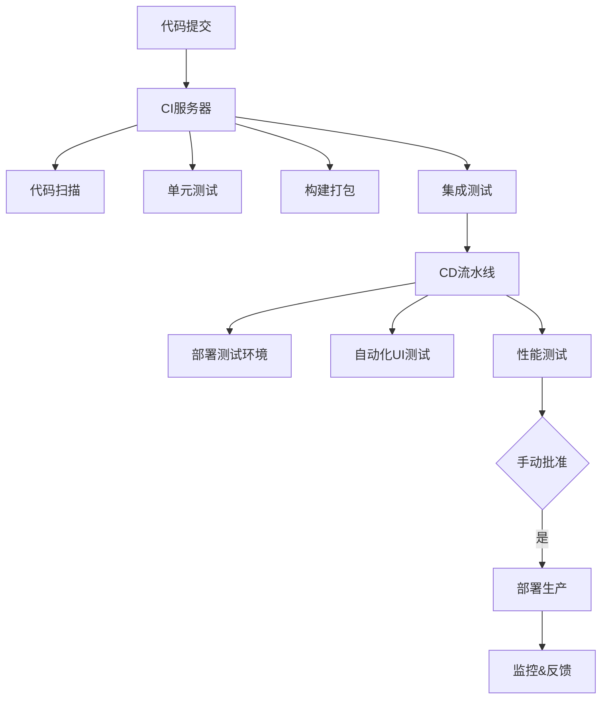

# CI/CD

## 什么是 CI/CD

### CI:持续集成（Continuous Integration）

核心实践：

开发人员每天多次提交代码到共享仓库

每次提交触发自动化构建和测试

快速发现集成错误，通常修复时间<10 分钟

关键价值：

减少集成地狱（Integration Hell）

早期发现缺陷（成本降低 100 倍）

保持主干代码始终可部署

### CD:持续部署（Continuous Deployment）

核心实践：

自动化部署到测试/预生产环境

通过自动化测试验证发布准备度

手动触发生产环境发布

关键价值：

每个变更都可随时发布

降低发布风险

缩短发布周期（从月到天）

### CICD 工作全貌

## 实践

以本站点 vitePress+ git action 进行实践

