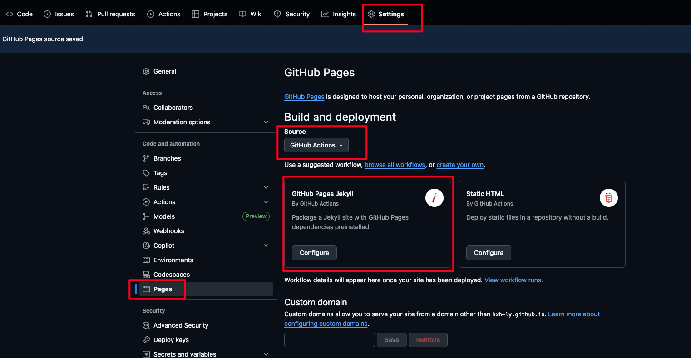
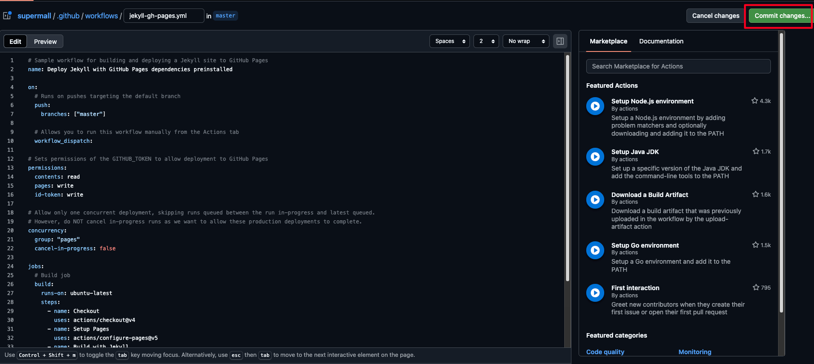
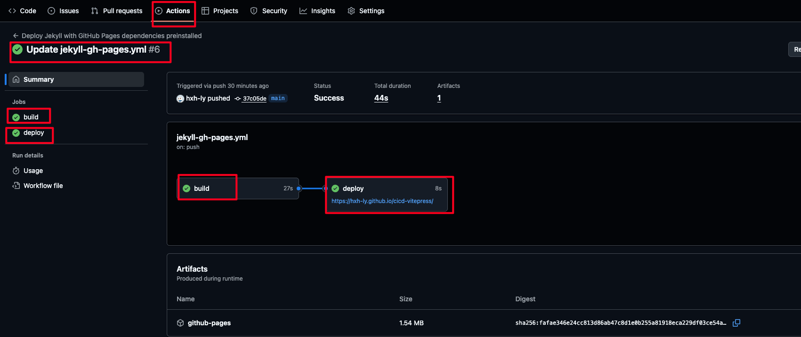

# CI/CD

## 什么是 CI/CD

### CI:持续集成（Continuous Integration）

核心实践：

开发人员每天多次提交代码到共享仓库

每次提交触发自动化构建和测试

快速发现集成错误，通常修复时间<10 分钟

关键价值：

减少集成地狱（Integration Hell）

早期发现缺陷（成本降低 100 倍）

保持主干代码始终可部署

### CD:持续部署（Continuous Deployment）

核心实践：

自动化部署到测试/预生产环境

通过自动化测试验证发布准备度

手动触发生产环境发布

关键价值：

每个变更都可随时发布

降低发布风险

缩短发布周期（从月到天）

### CICD 工作全貌


## 实践

以本站点 vitePress+ git action 进行实践

1.创建工作流文件
笔者使用 git Page 提供的静态托管服务，如图所示

此操作会创建 `./github/workflows/jekyll-gh-pages.yml`,默认内容

```yml
# Sample workflow for building and deploying a Jekyll site to GitHub Pages
name: Deploy Jekyll with GitHub Pages dependencies preinstalled

on:
  # Runs on pushes targeting the default branch
  push:
    branches: ["master"]

  # Allows you to run this workflow manually from the Actions tab
  workflow_dispatch:

# Sets permissions of the GITHUB_TOKEN to allow deployment to GitHub Pages
permissions:
  contents: read
  pages: write
  id-token: write

# Allow only one concurrent deployment, skipping runs queued between the run in-progress and latest queued.
# However, do NOT cancel in-progress runs as we want to allow these production deployments to complete.
concurrency:
  group: "pages"
  cancel-in-progress: false

jobs:
  # Build job
  build:
    runs-on: ubuntu-latest
    steps:
      - name: Checkout
        uses: actions/checkout@v4
      - name: Setup Pages
        uses: actions/configure-pages@v5
      - name: Build with Jekyll
        uses: actions/jekyll-build-pages@v1
        with:
          source: ./
          destination: ./_site
      - name: Upload artifact
        uses: actions/upload-pages-artifact@v3

  # Deployment job
  deploy:
    environment:
      name: github-pages
      url: ${{ steps.deployment.outputs.page_url }}
    runs-on: ubuntu-latest
    needs: build
    steps:
      - name: Deploy to GitHub Pages
        id: deployment
        uses: actions/deploy-pages@v4
```

2.我们需要针对默认生成，创建新的修改

```yml
# Sample workflow for building and deploying a Jekyll site to GitHub Pages
name: Deploy Jekyll with GitHub Pages dependencies preinstalled

on:
  # Runs on pushes targeting the default branch
  push:
    branches: ["main"]

  # Allows you to run this workflow manually from the Actions tab
  workflow_dispatch:

# Sets permissions of the GITHUB_TOKEN to allow deployment to GitHub Pages
permissions:
  contents: read
  pages: write
  id-token: write

# Allow only one concurrent deployment, skipping runs queued between the run in-progress and latest queued.
# However, do NOT cancel in-progress runs as we want to allow these production deployments to complete.
concurrency:
  group: "pages"
  cancel-in-progress: false

jobs:
  # Build job
  build:
    runs-on: ubuntu-latest
    steps:
      - name: Checkout
        uses: actions/checkout@v4
      # 安装node.js
      - name: Setup Node.js
        uses: actions/setup-node@v4
        with:
          node-version: "20" # 推荐使用 LTS 版本
          cache: "npm"
      # 安装依赖
      - name: Install dependencies
        run: npm install
      # 构建VitePress站点，并设置全局变量，注意BASE_PATH配置需同步配置config.mjs里的为base: process.env.BASE_PATH || "",
      # 否则，部分资源会因为最终生成的域名形如 xxx.github.io<repo-name> 而加载不到
      - name: Build VitePress
        run: npm run docs:build
        env:
          BASE_PATH: /${{ github.event.repository.name }}/
      - name: Setup Pages
        uses: actions/configure-pages@v5
      - name: Upload artifact
        uses: actions/upload-pages-artifact@v3
        # 部署部分的修改
        with:
          path: ./.vitepress/dist

  # Deployment job
  deploy:
    environment:
      name: github-pages
      url: ${{ steps.deployment.outputs.page_url }}
    runs-on: ubuntu-latest
    needs: build
    steps:
      - name: Deploy to GitHub Pages
        id: deployment
        uses: actions/deploy-pages@v4
```

3.主要的修改解释

```yml
# 安装node.js
- name: Setup Node.js
  uses: actions/setup-node@v4
  with:
    node-version: "20" # 推荐使用 LTS 版本
    cache: "npm"
# 安装依赖
- name: Install dependencies
  run: npm install
# 构建VitePress站点，并设置全局变量，注意BASE_PATH配置需同步配置config.mjs里的为base: process.env.BASE_PATH || "",
# 否则，部分资源会因为最终生成的域名形如 xxx.github.io<repo-name> 而加载不到
- name: Build VitePress
   run: npm run docs:build
    env:
      BASE_PATH: /${{ github.event.repository.name }}/

- name: Upload artifact
  uses: actions/upload-pages-artifact@v3
  # 部署部分的修改
  with:
    path: ./.vitepress/dist
```
4.保存


构建失败请查看：


最后查看构建的[网站vitePress](https://hxh-ly.github.io/cicd-vitepress/)

## npm自动发布工具