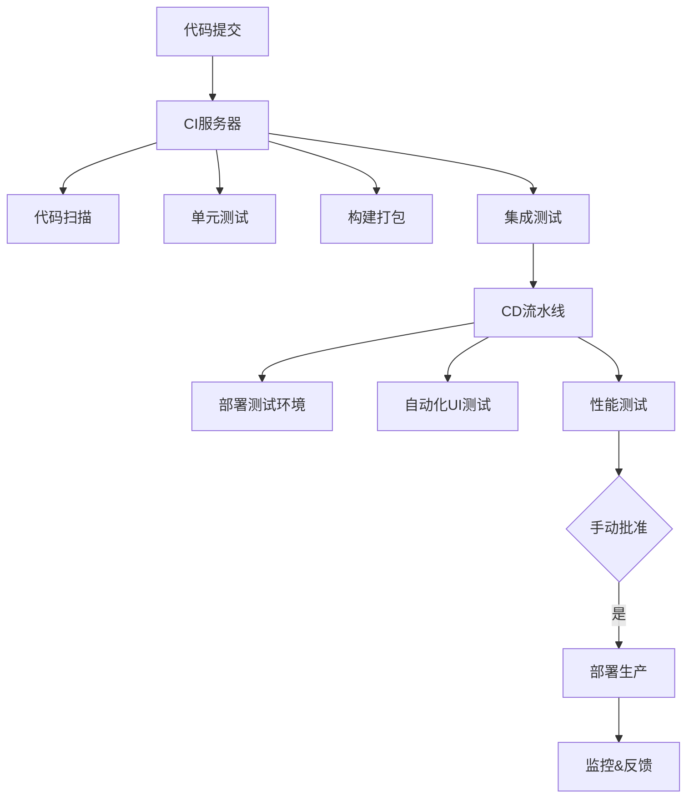

# CI/CD

## 什么是 CI/CD

### CI:持续集成（Continuous Integration）

核心实践：

开发人员每天多次提交代码到共享仓库

每次提交触发自动化构建和测试

快速发现集成错误，通常修复时间<10 分钟

关键价值：

减少集成地狱（Integration Hell）

早期发现缺陷（成本降低 100 倍）

保持主干代码始终可部署

### CD:持续部署（Continuous Deployment）

核心实践：

自动化部署到测试/预生产环境

通过自动化测试验证发布准备度

手动触发生产环境发布

关键价值：

每个变更都可随时发布

降低发布风险

缩短发布周期（从月到天）

### CICD 工作全貌



## 实践

以本站点 vitePress+ git action 进行实践

1.创建工作流文件
笔者使用 git Page 提供的静态托管服务，如图所示

此操作会创建 `./github/workflows/jekyll-gh-pages.yml`,默认内容

```yml
# Sample workflow for building and deploying a Jekyll site to GitHub Pages
name: Deploy Jekyll with GitHub Pages dependencies preinstalled

on:
  # Runs on pushes targeting the default branch
  push:
    branches: ["master"]

  # Allows you to run this workflow manually from the Actions tab
  workflow_dispatch:

# Sets permissions of the GITHUB_TOKEN to allow deployment to GitHub Pages
permissions:
  contents: read
  pages: write
  id-token: write

# Allow only one concurrent deployment, skipping runs queued between the run in-progress and latest queued.
# However, do NOT cancel in-progress runs as we want to allow these production deployments to complete.
concurrency:
  group: "pages"
  cancel-in-progress: false

jobs:
  # Build job
  build:
    runs-on: ubuntu-latest
    steps:
      - name: Checkout
        uses: actions/checkout@v4
      - name: Setup Pages
        uses: actions/configure-pages@v5
      - name: Build with Jekyll
        uses: actions/jekyll-build-pages@v1
        with:
          source: ./
          destination: ./_site
      - name: Upload artifact
        uses: actions/upload-pages-artifact@v3

  # Deployment job
  deploy:
    environment:
      name: github-pages
      url: ${{ steps.deployment.outputs.page_url }}
    runs-on: ubuntu-latest
    needs: build
    steps:
      - name: Deploy to GitHub Pages
        id: deployment
        uses: actions/deploy-pages@v4
```

2.我们需要针对默认生成，创建新的修改

```yml
# Sample workflow for building and deploying a Jekyll site to GitHub Pages
name: Deploy Jekyll with GitHub Pages dependencies preinstalled

on:
  # Runs on pushes targeting the default branch
  push:
    branches: ["main"]

  # Allows you to run this workflow manually from the Actions tab
  workflow_dispatch:

# Sets permissions of the GITHUB_TOKEN to allow deployment to GitHub Pages
permissions:
  contents: read
  pages: write
  id-token: write

# Allow only one concurrent deployment, skipping runs queued between the run in-progress and latest queued.
# However, do NOT cancel in-progress runs as we want to allow these production deployments to complete.
concurrency:
  group: "pages"
  cancel-in-progress: false

jobs:
  # Build job
  build:
    runs-on: ubuntu-latest
    steps:
      - name: Checkout
        uses: actions/checkout@v4
      # 安装node.js
      - name: Setup Node.js
        uses: actions/setup-node@v4
        with:
          node-version: "20" # 推荐使用 LTS 版本
          cache: "npm"
      # 安装依赖
      - name: Install dependencies
        run: npm install
      # 构建VitePress站点，并设置全局变量，注意BASE_PATH配置需同步配置config.mjs里的为base: process.env.BASE_PATH || "",
      # 否则，部分资源会因为最终生成的域名形如 xxx.github.io<repo-name> 而加载不到
      - name: Build VitePress
        run: npm run docs:build
        env:
          BASE_PATH: /${{ github.event.repository.name }}/
      - name: Setup Pages
        uses: actions/configure-pages@v5
      - name: Upload artifact
        uses: actions/upload-pages-artifact@v3
        # 部署部分的修改
        with:
          path: ./.vitepress/dist

  # Deployment job
  deploy:
    environment:
      name: github-pages
      url: ${{ steps.deployment.outputs.page_url }}
    runs-on: ubuntu-latest
    needs: build
    steps:
      - name: Deploy to GitHub Pages
        id: deployment
        uses: actions/deploy-pages@v4
```

3.主要的修改解释

```yml
# 安装node.js
- name: Setup Node.js
  uses: actions/setup-node@v4
  with:
    node-version: "20" # 推荐使用 LTS 版本
    cache: "npm"
# 安装依赖
- name: Install dependencies
  run: npm install
# 构建VitePress站点，并设置全局变量，注意BASE_PATH配置需同步配置config.mjs里的为base: process.env.BASE_PATH || "",
# 否则，部分资源会因为最终生成的域名形如 xxx.github.io<repo-name> 而加载不到
- name: Build VitePress
   run: npm run docs:build
    env:
      BASE_PATH: /${{ github.event.repository.name }}/

- name: Upload artifact
  uses: actions/upload-pages-artifact@v3
  # 部署部分的修改
  with:
    path: ./.vitepress/dist
```

4.保存


构建失败请查看：


最后查看构建的[网站 vitePress](https://hxh-ly.github.io/cicd-vitepress/)

## npm 自动发布工具

## 实践 github action + 阿里云ECS CICD部署

架构图

```
开发者本地机器         -->         GitHub仓库         -->         GitHub Actions         -->         阿里云ECS服务器
    (git push)                  (监听push/webhook)            (自动构建、测试、部署)              (通过SSH部署文件)
```
### 一、环境准备
1. 服务器端（阿里云ECS）准备
a. 创建部署专用用户（推荐）
```shell
# 以 root 身份登录服务器
adduser deployer
# 为 deployer 用户设置密码
passwd deployer
# 将 deployer 用户添加到 sudo 组（可选，如果部署过程不需要sudo可省略）
usermod -aG sudo deployer

# 切换到 deployer 用户，生成 SSH 密钥对
su - deployer
ssh-keygen -t rsa -b 4096 -C "deployer@your-server" # 一路回车，不设密码
cat ~/.ssh/id_rsa.pub >> ~/.ssh/authorized_keys
chmod 600 ~/.ssh/authorized_keys
```
b. 准备项目部署目录，如`/home/deployer/www/your-project-name`,并确保 deployer 用户对该目录有读写权限。
```shell
mkdir -p /home/deployer/www/your-project-name
```

c. DockerFile编写.在项目根目录下创建 Dockerfile
```shell
# 阶段 1: 构建阶段
FROM node:18-alpine AS builder
WORKDIR /app
# 首先复制依赖定义文件并安装依赖
# 利用 Docker 缓存层，只有当 package.json 或 lock 文件变化时才重新运行 npm ci
COPY package*.json ./
RUN npm ci
# 复制源代码并构建
COPY . .
RUN npm run build

# 阶段 2: 运行阶段
FROM nginx:alpine
# 将构建产物从 builder 阶段复制到 Nginx 的默认静态文件目录
COPY --from=builder /app/dist /usr/share/nginx/html

# 将构建产物从 builder 阶段复制到 Nginx 的默认静态文件目录
COPY --from=builder /app/dist /usr/share/nginx/html

# 暴露 80 端口
EXPOSE 80

# 使用 Nginx 运行（基础镜像的默认命令，通常可省略）
CMD ["nginx", "-g", "daemon off;"]
```
可选，创建`.dockerignore`
```shell
node_modules
Dockerfile
.dockerignore
.git
.github
README.md
```

d. 服务器安装docker
```shell
# 以 root 用户执行
# 1. 卸载旧版本（如有）
sudo apt-get remove docker docker-engine docker.io containerd runc

# 2. 设置仓库
sudo apt-get update
sudo apt-get install \
    ca-certificates \
    curl \
    gnupg \
    lsb-release

# 3. 添加 Docker 的官方 GPG 密钥
sudo mkdir -p /etc/apt/keyrings
curl -fsSL https://download.docker.com/linux/ubuntu/gpg | sudo gpg --dearmor -o /etc/apt/keyrings/docker.gpg

# 4. 设置稳定版仓库
echo \
  "deb [arch=$(dpkg --print-architecture) signed-by=/etc/apt/keyrings/docker.gpg] https://download.docker.com/linux/ubuntu \
  $(lsb_release -cs) stable" | sudo tee /etc/apt/sources.list.d/docker.list > /dev/null

# 5. 安装 Docker Engine
sudo apt-get update
sudo apt-get install docker-ce docker-ce-cli containerd.io docker-compose-plugin

# 6. 验证安装
sudo docker run hello-world

# 7. （可选但推荐）将部署用户加入 docker 组，避免每次都要 sudo
sudo usermod -aG docker deployer
# 退出当前 SSH 会话并重新登录以使组更改生效
```

e. 配置Docker Hub镜像加速器

请将 `https://your-mirror-id.mirror.aliyuncs.com` 替换为你从阿里云容器镜像服务控制台获取的加速器地址。

注册 Docker Hub 账户并创建仓库 记下仓库名字,格式`your-dockerhub-username/your-repo-name`
```shell
sudo mkdir -p /etc/docker
# 创建或修改 daemon.json 文件
sudo tee /etc/docker/daemon.json <<-'EOF'
{
  "registry-mirrors": ["https://your-mirror-id.mirror.aliyuncs.com"]
}
EOF
# 重启 Docker 使配置生效
sudo systemctl daemon-reload
sudo systemctl restart docker
```

### 二、gitHub Action CI/CD流水线
本地项目创建`.github/workflows/deploy-to-ecs-docker.yml`
```shell
name: Build, Push to Docker Hub and Deploy to ECS

on:
  push:
    branches: [ "main" ]
  # 上面是工作元数据
env:
  # --- 主要修改在这里 --- 
  DOCKERHUB_USERNAME: ${{ secrets.DOCKERHUB_USERNAME }} # 你的 Docker Hub 用户名
  IMAGE_NAME: ${{ secrets.DOCKERHUB_USERNAME }}/your-repo-name # 你的 Docker Hub 镜像名，如 'myusername/my-frontend-app'
  # --- 修改结束 --- 
  CONTAINER_NAME: "your-container-name" # 你的容器名称，如 my-frontend-app
  ECS_HOST: ${{ secrets.ALIYUN_ECS_HOST }} # 你的 ECS 公网 IP
  ECS_USER: ${{ secrets.ALIYUN_ECS_USER }} # 你的 ECS 登录用户，如 deployer

jobs:
  build-and-push:
    runs-on: ubuntu-latest # 最新版本的 Ubuntu 虚拟机上执行这个 Job
    permissions:
      contents: read
      packages: write

    steps:
      - name: Checkout code
        uses: actions/checkout@v4  #  检出代码
 
      - name: Set up Docker Buildx
        uses: docker/setup-buildx-action@v3  # Buildx 是 Docker 的一个扩展插件，支持更强大的构建功能，如多平台构建

      - name: Log in to Docker Hub
        # --- 主要修改在这里 --- 
        uses: docker/login-action@v3
        with:
          username: ${{ secrets.DOCKERHUB_USERNAME }}
          password: ${{ secrets.DOCKERHUB_TOKEN }} # 使用 Token 而非密码更安全
        # --- 修改结束 --- 

      - name: Extract metadata for Docker
        id: meta
        uses: docker/metadata-action@v5
        with:
          images: ${{ env.IMAGE_NAME }} # 直接使用 Docker Hub 镜像名
          tags: |
            type=sha,prefix={{date 'YYYYMMDD'}}-,suffix=-{{sha}}
            type=ref,event=branch
          # 生成镜像标签 这会生成类似 'myusername/myapp:20230915-a1b2c3d' 和 'myusername/myapp:main' 的标签

      - name: Build and push Docker image
        uses: docker/build-push-action@v5
        with:
          context: .
          push: true
          tags: ${{ steps.meta.outputs.tags }}
          labels: ${{ steps.meta.outputs.labels }}
          cache-from: type=gha
          cache-to: type=gha,mode=max
            # 构建并推送镜像
  deploy: # 部署任务
    needs: build-and-push # needs: build-and-push：确保只有在前一个构建任务成功完成后，部署任务才会开始。
    runs-on: ubuntu-latest
    if: github.ref == 'refs/heads/main'

    steps: #通过 SSH 部署
      - name: Deploy to ECS via SSH
        uses: appleboy/ssh-action@v1.0.0
        with:
          host: ${{ env.ECS_HOST }}
          username: ${{ env.ECS_USER }}
          key: ${{ secrets.ALIYUN_ECS_SSH_KEY }}
          script: |
            # --- 主要修改在这里 --- 
            # 如果使用私有仓库，需要在服务器上登录 Docker Hub
            # 如果是公共仓库，则无需登录
            echo "${{ secrets.DOCKERHUB_TOKEN }}" | sudo docker login -u "${{ secrets.DOCKERHUB_USERNAME }}" --password-stdin

            # 停止并移除当前正在运行的容器
            sudo docker stop ${{ env.CONTAINER_NAME }} || true
            sudo docker rm ${{ env.CONTAINER_NAME }} || true

            # 拉取最新的镜像（现在从 Docker Hub 拉取）
            sudo docker pull ${{ env.IMAGE_NAME }}:main

            # 运行一个新的容器
            sudo docker run -d \
              --name ${{ env.CONTAINER_NAME }} \
              -p 80:80 \
              --restart=always \
              ${{ env.IMAGE_NAME }}:main
            # --- 修改结束 --- 

            # （可选）清理不再使用的旧镜像，避免磁盘空间占用
            sudo docker image prune -af
```
### 总结：整个脚本的工作流程
- 触发：开发者将代码推送到 GitHub 仓库的 main 分支。

- 准备：GitHub Actions 启动一个 Ubuntu 虚拟机，并检出代码。

- 构建：在虚拟机上，使用项目中的 Dockerfile 构建一个 Docker 镜像，并打好标签。

- 推送：将构建好的镜像推送到 Docker Hub 仓库。

- 连接：另一个任务通过 SSH 安全地连接到你的阿里云 ECS 服务器。

- 更新：在服务器上执行一系列命令：拉取新镜像、停止旧容器、启动新容器。

- 清理：移除旧的、不再使用的容器和镜像。

- 完成：部署完成。用户访问你的服务器 IP，看到的就是刚刚部署的新版本应用。

### 三、在 GitHub 仓库配置 Secrets
1. 进入你的 GitHub 项目仓库的 Settings -> Secrets and variables -> Actions。

2. 添加以下 Secrets：

- ALIYUN_ECS_HOST: 你的 ECS 公网 IP。（不变）

- ALIYUN_ECS_USER: 你的 ECS 登录用户（例如 deployer）。（不变）

- ALIYUN_ECS_SSH_KEY: 部署用户的 SSH 私钥。（不变）

- DOCKERHUB_USERNAME: 你的 Docker Hub 用户名。

- DOCKERHUB_TOKEN: 你的 Docker Hub Access Token（推荐使用 Token 而不是密码，更安全）。

3. 获取 Docker Hub Access Token：

- 登录 Docker Hub 网站。

- 点击你的用户名，进入 Account Settings。

- 选择 Security -> New Access Token。

- 为 Token 提供一个描述（例如 github-actions-for-my-app），并设置读/写权限。

- 生成后，立即复制这个 Token 的值，它只会显示一次。