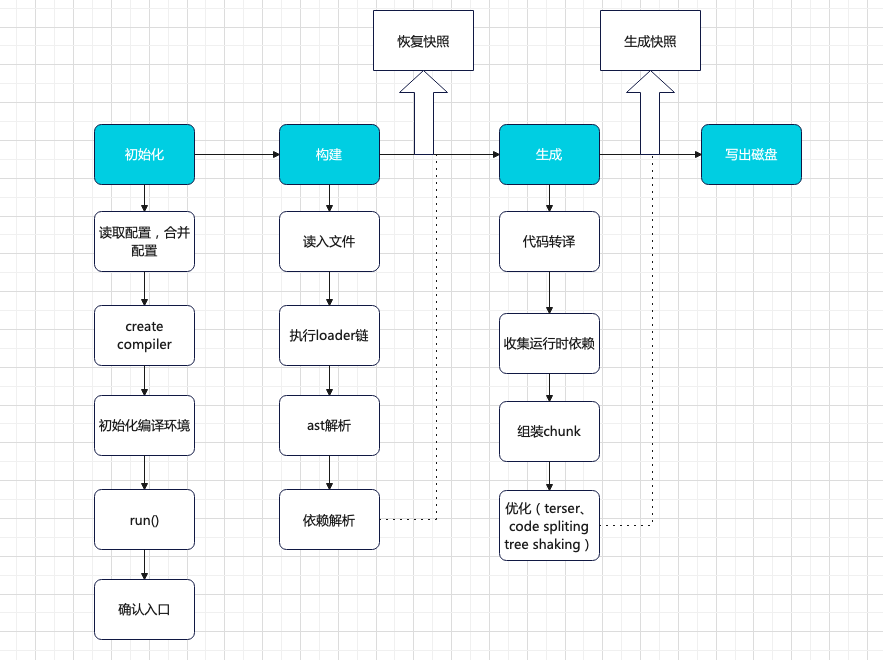

## webpack 核心流程

Webpack 最最核心的功能，一是使用适当 Loader 将任意类型文件转移为 JavaScript 代码，例如将 CSS 代码转移为 JS 字符串，将多媒体文件转移为 Base64 代码等；二是将这些经过 Loader 处理的文件资源合并、打包向下兼容的产物文件。
为了实现这些功能，Webpack 底层的工作流程大致可以总结为这么几个阶段： 1.初始化阶段

- 初始化参数：从配置文件、配置对象、Shell 参数中读取，与默认配置结合得出最终的参数
- 创建编译器对象：用上一步得到的参数创建 Compiler 对象。
- 初始化编译环境：包括注入内置插件、注入各种模块 ⚠️、初始化 RuleSet 集合、加载配置的插件等。
- 开始编译：执行 compiler 对象的 run 方法，创建 compilation 对象。
- 确认入口：根据配置中的`entry`找到所有的入口文件，调用 compilation.addEntry 将入口文件转换为`dependence`对象。

  2.构建阶段：

- 编译模块（make）：从 entry 文件开始，调用 loader 将模块转译为标准的 JS 内容，调用 JS 解析器将内容转换为 AST 对象，从中找出该模块依赖的模块，再递归处理这些依赖模块，知道所有入口依赖的文件都经过本步骤的处理；
- 完成模块编译：上一步递归处理所有能触达到的模块后，得到了每个模块被翻译后的内容以及它们之间的依赖关系图。

  3.封装阶段：

- 合并（seal）：根据入口和模块之间的依赖关系，组装成一个个包含多个模块的 Chunk
- 优化（optimizaion）：对上述 Chunk 施加一系列优化操作：包括：tree-shaking、terser、scope-hoisting、压缩、code split 等。
- 写入文件系统（emitAssets）：在确认好输出内容后，根据配置确认输出等路径和文件名，把文件内容写到文件系统。

在这个过程有不少可能造成性能问题的地方：

- 构建阶段
- - 首先将文件的相对引用路径转化为绝对路径，这个过程可能涉及多次 IO 操作，执行效率取决于文件层次深度；
- - 拿到文件，需要读取文件内容并调用 loader-runner 遍历 loader 数组完成内容转移，这个过程需要执行较密集的 CPU 操作，执行效率取决于 loader 的数量与复杂度；
- - 需要将模块内容解析成 AST 结构，并遍历 AST 找出模块的依赖资源
- - 递归处理依赖资源
- 封装阶段：
- - 根据 splitChunks 配置、entry 配置、动态模块引用语句，确认模块与 Chunk 的映射关系，其中 splitChunks 相关的分包算法非常复杂、涉及大量 CPU 计算；
- - 根据 optimization 配置执行一系列产物优化操作；特别是 Terser 插件需要执行大量 AST 相关的运算，执行效率取决于产物代码量。
    可以看出，webpack 需要执行非常密集的 IO 和 CPU 操作，计算成本高，再加上 Webpack 以及大多数组件都使用 JavaScript 编写，无法充分利用多核 CPU 能力，所以在中大型性能通常表现较差。


### 缓存原理

- 初始化，主要根据配置信息设置内置的各类插件
- Make-构建阶段，从 entry 模块开始，执行：
  - 读入文件内容
  - 调用 Loader 转译文件内容：
  - 调用 acorn 生成 AST 结构：
  - 分析 AST，确定模块依赖列表：
  - 遍历模块依赖列表，递归流程，生成模块依赖图
- 生成阶段
  - 遍历依赖图，进行代码转译（如 import 转 require）; 分析运行时依赖
  - 合并模块代码和运行时代码，生成 chunk；
  - 执行产物优化
  - 写出产物文件


## 缓存策略

webpack5 持久化缓存，它能将首次构建的过程与结果数据持久化保存到本地文件系统，在下一次执行构建时跳过解析、链接、编译等一系列非常消耗性能等操作，直接复用上一次的 Module/ModuleGraph/Chunk 对象数据，迅速构建最终产物。

开启配置

```js
{
  cache: {
    type: "filesystem";
  }
}
```

此外，cache 还提供了若干用于配置缓存效果、缓存周期的配置项、包括：

- cache.type：缓存类型，‘memory’|'filesystem',需要设置为'filesystem‘才能开启持久化缓存。
- cache.cacheDirectory:缓存文件路径 默认为 `/node_module/.cache/webpack/`
- cache.buildDependencies:额外的依赖文件，当这些文件内容方式变化时，缓存会完全失效而执行完整的编译构建，同错可设置各种配置文件，如

```js
module.exports = {
  cache: {
    type: "filesystem",
    buildDenpendencies: {
      config: [path.join(__dirname, "webpack.dll_config.js"), path.join(__dirname, ".babelrc")]
    }
  }
};
```

- cache.managedPaths:受控目录，Webpack 构建时会跳过新旧代码哈希值与时间错的对比，直接使用缓存副本，默认值为['./node_modules']
- cache.profile:是否输出缓存处理过程的详细日志，默认值 false
- cache.maxAge:缓存失效时间，默认值为 5184000000

### 缓存原理


- 初始化，主要根据配置信息设置内置的各类插件
- Make-构建阶段，从 entry 模块开始，执行：
  - 读入文件内容
  - 调用 Loader 转译文件内容：
  - 调用 acorn 生成 AST 结构：
  - 分析 AST，确定模块依赖列表：
  - 遍历模块依赖列表，递归流程，生成模块依赖图
- 生成阶段
  - 遍历依赖图，进行代码转译（如 import 转 require）; 分析运行时依赖
  - 合并模块代码和运行时代码，生成 chunk；
  - 执行产物优化
  - 写出产物文件

### 使用组件自带的缓存功能

webpack 组件自带的缓存能力提升特定领域的编译性能，这一类组件有：
babel-loader
eslint-loader
eslint-webpack-plugin
stylelint-webpack-plugin
例如使用 babel-loader

```js
module.exports = {
  module:{
    rule:[{
      test:'',
      exclude://,
      loader:'babel-loader',
      options:{
        presets:[],
        cacheDirectory:true // 'dir' 默认在 node_modules/.cache/babel-loader
      }
    }]
  }
}
```

eslint-webpack-plugin
stylelint-webpack-plugin

```js
module.exports = {
  plugins: [new ESLintPlugin({ cache: true }), new StyleLintPlugin({ cache: true, files: "**/*.css" })]
};
```

```js
module.exports = {
    //...
    cache: {
        type: 'filesystem'
    },
    //...
};
```