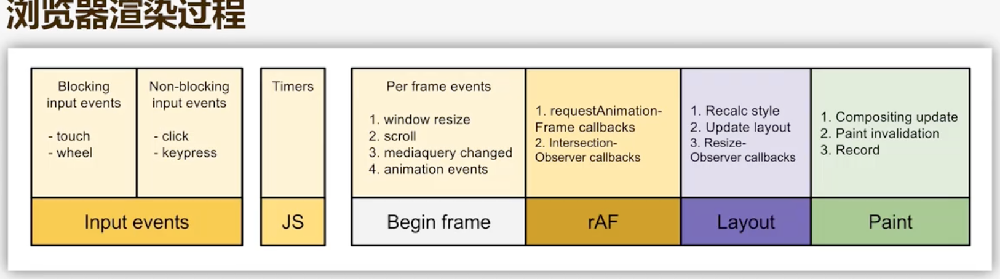

# html

## html5 的新特性

| 标签    | 含义与使用场景                                                             |
| ------- | -------------------------------------------------------------------------- |
| header  | 页面或者区域头部，通常包括标题，logo，导航栏                               |
| footer  | 页面或者区域的底部，通常包括版权、联系方式、相关链接                       |
| nav     | 导航栏区域，用于包裹住要的导航链接（主导航、侧边栏导航—）                  |
| article | 独立完整的“文章类”内容（博客、新闻、评论）可单独存在并被理解               |
| section | 页面中的“区块”（用于对内容分组），通常包含一个标题（h1-h6）强调“主题性”    |
| aside   | 侧边栏或“辅助内容”(如文章的相关推荐、作者信息、广告)，与主内容相关但非必需 |

媒体标签

| 标签   | 含义与使用场景                                                                                                                                                                                                   |
| ------ | ---------------------------------------------------------------------------------------------------------------------------------------------------------------------------------------------------------------- |
| video  | src/loop/autoplay/poster                                                                                                                                                                                         |
| audio  | 嵌入音频，核心属性与`<video>`类似（无 poster），用于播放音乐、语音等                                                                                                                                             |
| source | 为`<video/>/<audio/>`提供 “多格式源”（浏览器会自动选择支持的格式），例：`html<br><video controls><br> <source src="video.mp4" type="video/mp4"><br> <source src="video.webm" type="video/webm"><br></video><br>` |

其他常用标签

| 标签    | 含义与使用场景                                                                                         |
| ------- | ------------------------------------------------------------------------------------------------------ |
| canvas  | 绘图画布（2D/3D），需通过 JS 操作（如绘制图形、动画、游戏），本身无内容，依赖脚本                      |
| svg     | 矢量图形标签（可直接嵌入 HTML），用于绘制图标、图表等（放大不失真）                                    |
| details | 可折叠 / 展开的 “详情区域”，默认折叠，配合`<summary>`作为标题：                                        |
| mark    | 高亮显示文本（如搜索结果中的关键词），视觉上默认黄色背景                                               |
| time    | 表示时间 / 日期，datetime 属性存储机器可读格式（利于 SEO）：`<time datetime="2025-07-24">今天</time> ` |

## 为什么用语义化标签

1. 代码可读性、SEO 友好（搜索引擎更易理解内容结构），便于屏幕阅读器（无障碍访问），减少冗余 class 命名

## SEO,需要知道的细节

### 优化思路

1. 页面结构优化

```html
<!DOCTYPE html>
<html lang="en">
  <head>
    <meta charset="UTF-8" />
    <meta name="viewport" content="width=device-width, initial-scale=1.0" />
    <meta name="description" content="app,理财" />
    <title>Document</title>
  </head>
  <body>
    <header>Main page</header>
    <nav>
      <ul>
        <li></li>
        <li></li>
        <li></li>
        <li></li>
        <li></li>
      </ul>
    </nav>
    <main>
      <article>
        <h1>标题</h1>
        <p>内容</p>
      </article>
    </main>
    <footer>底部版权说明，信息说明</footer>
  </body>
</html>
```

2. 内容优化
保证页面中关键词的覆盖率

3. 技术向SEO优化
- 地图
- 结构化数据
- 移动端兼容
```css
@media (max-width : 600px) {
  body{

  }
}
```

## history，vue 路由的 hash 模式和 history 有什么区别？动态路由？按需加载？鉴权？

history 是 h5 提供的历史记录管理 api，允许 javascript 操作浏览器的会话历史，实现不刷新页面的情况下修改 URL，添加/替换历史记录功能。
hash 是页面的锚点

| 区别               | hash             | history                                     |
| ------------------ | ---------------- | ------------------------------------------- |
| URL 格式           | #                | /                                           |
| 是否需要服务端支持 | 不需要           | 需要（访问不存在页面，会报 404）            |
| 底层原理           | 监听 hash change | 基于 h5 的 pushState                        |
| 兼容性             | 全部兼容         | 依赖 h5 ie>10+                              |
| SEO 友好性         | 较差             | 较好（URL 更规范）                          |
| api                | xx               | -pushState -replaceState -go -back -forward |

## webworker 和 wesocket

### webwworker

是 H5 提供的一种多线程解决方案，主线程创建后台线程，在不阻塞主线程的情况下执行耗时任务（复杂计算、大数据处理）。
特点：1.线程隔离；与主线程运行在不同的上下文（self），不能直接操作 dom 和主线程的全局变量。2.通讯机制，`worker.poseMessage() worker.onmessage` 注意：数据是通过负责传递，而非共享。3.限制不能访问 dom、执行 alert、遵循同源策略（协议、域名、端口）

### ServiceWorker

运行在浏览器后台的独立线程，与网页无关。本质是个代理服务器。主要用于实现 PWA。离线缓存、消息推送、后台同步等功能。是 PWA 的核心技术之一。
特点：1.生命周期独立。与网页无关，关了也能运行。2.离线缓存：拦截网络请求，优先读取缓存策略。3.通讯机制`postMessage`。4.安全机制：必须运行在 https 环境，遵循同源策略。

### wesocket 是一种全双工通信协议，允许客户端与服务器之前建立持久连接，实现双方实时双工通信。打破 Http 的一问一答，适用需要实时数据交互的场景（IM，实时通知、在线协作工具）

特点：1.持久连接。无需重复建立连接。2.全双工通信，双方实时传输。3.低开销，握手协议基于 http 协议，后续通信不携带冗余头部消息。4.跨域支持.`acess-control-allow-origin`;5.二进制传输。不仅传输文本 UTF-8，还能传输二进制图片、视频。

### 工作流程

握手阶段：client 请求头带上`Upgrade:wesocket` `Connection:Upgrade` 表示升级为 wb 协议。service 收到后回复 `101 switch protocol`响应，握手成功。
通讯阶段：双方通过 帧格式传输数据。【操作码（文本/二进制）】【数据长度】
关闭阶段：发送关闭帧，对方确认后关闭。

### 与 Http 的区别

| 对比维度 | http                 | websocket                |
| -------- | -------------------- | ------------------------ |
| 连接方式 | 短连接               | 长连接                   |
| 方向     | 单                   | 双                       |
| 头部开销 | 每次请求携带完整头部 | 握手后无冗余头部，开销低 |
| 场景     | 网页请求             | 聊天、实时传输           |
| 协议表示 | `https://`           | `wss://`                 |

### websocket 和 SSE 的区别

| 维度         | WebSocket                        | SSE                                               |
| ------------ | -------------------------------- | ------------------------------------------------- |
| 方向         | 全双工                           | 单项                                              |
| 协议基础     | 独立协议(`ws://`)                | 基于`http/https`                                  |
| 数据格式     | 文本、二进制（格式有应用层定义） | 仅支持文本（固定格式`data:xxx\n\n`                |
| 连接限制     | 无浏览器同域名并发链接数         | 受浏览器同域名 HTTP 并发连接数限制（通常为 6 个） |
| 自动重连     | 应用层实现                       | 浏览器原生自动重连                                |
| 数据传输效率 | 连接后无 http 头，效率高         | 基于 http 持久连接，每个消息有少量头部传递        |
| 应用场景     | 高频交互（在线游戏、聊天、协同） | 单项（股票、推送、通知、新闻）                    |

### 应用

解决socket断联问题
- 心跳检测。客户端或者服务端主动发送一个空包，对端同样返回相同空包，保障连接的稳定性和持久性。
- - 流程：每30s发送心跳包`heartbeat`,后端立即响应，前端`15s`内未收到，则标记为异常。后端每30s检测客户端最后存活时间，若60s内未收到心跳，则主动断开连接。
- 自动重连。客户端监测到断开，可采用指数退避的方式实现自动重连。


重连设计：

- 自动重连触发：报错重连`attemptReconnect`
- 重连策略：重连次数限制，重连时间递增`1s 每次乘1.5s 最大不超过10s`
- 连接状态管理：标记`isConnected`,重连前清空旧资源
- 提供事件回调

```js
class ReconnectingWebSocket {
  constructor(url, options = {}) {
    this.url = url; // WebSocket 服务地址（如 ws://localhost:8080）
    this.ws = null; // WebSocket 实例
    this.isConnected = false; // 连接状态

    // 重连配置（默认值）
    this.options = {
      maxReconnectAttempts: 10, // 最大重连次数（-1 表示无限重试）
      initialReconnectDelay: 1000, // 初始重连延迟（毫秒）
      maxReconnectDelay: 10000, // 最大重连延迟（毫秒）
      reconnectDelayGrowth: 1.5, // 延迟递增系数（每次重试延迟 = 上一次 * 系数）
      ...options,
    };

    this.reconnectAttempts = 0; // 当前重连次数
    this.reconnectTimer = null; // 重连定时器

    // 绑定事件回调（用户可通过 onXXX 方法注册）
    this.onOpen = () => {}; // 连接成功回调
    this.onMessage = (event) => {}; // 接收消息回调
    this.onError = (error) => {}; // 错误回调
    this.onClose = (code, reason) => {}; // 关闭回调
    this.onMaxReconnect = () => {}; // 达到最大重连次数回调

    // 初始化连接
    this.connect();
  }

  // 建立连接
  connect() {
    // 关闭可能存在的旧连接
    if (this.ws) {
      this.ws.close(1000, "手动重连关闭旧连接");
      this.ws = null;
    }

    // 创建新连接
    try {
      this.ws = new WebSocket(this.url);
      this.isConnected = false;

      // 监听连接成功
      this.ws.onopen = (event) => {
        this.isConnected = true;
        this.reconnectAttempts = 0; // 重置重连次数
        this.clearReconnectTimer(); // 清除重连定时器
        this.onOpen(event); // 触发用户注册的 onOpen
      };

      // 监听消息
      this.ws.onmessage = (event) => {
        this.onMessage(event); // 触发用户注册的 onMessage
      };

      // 监听错误
      this.ws.onerror = (error) => {
        this.onError(error); // 触发用户注册的 onError
      };

      // 监听关闭（连接断开时触发重连）
      this.ws.onclose = (event) => {
        this.isConnected = false;
        this.onClose(event.code, event.reason); // 触发用户注册的 onClose

        // 不需要重连的情况（如手动关闭或服务器主动拒绝）
        if (event.code === 1000 || event.code === 1001) {
          console.log("WebSocket 正常关闭，不进行重连");
          return;
        }

        // 触发重连
        this.attemptReconnect();
      };
    } catch (error) {
      this.onError(error);
      this.attemptReconnect(); // 初始化失败时直接重连
    }
  }

  // 尝试重连
  attemptReconnect() {
    // 检查是否达到最大重连次数
    if (
      this.options.maxReconnectAttempts !== -1 &&
      this.reconnectAttempts >= this.options.maxReconnectAttempts
    ) {
      this.onMaxReconnect();
      console.error(
        `已达到最大重连次数（${this.options.maxReconnectAttempts}次），停止重试`
      );
      return;
    }

    // 计算重连延迟（指数退避：延迟逐渐增加，避免频繁重试）
    const delay = Math.min(
      this.options.initialReconnectDelay *
        Math.pow(this.options.reconnectDelayGrowth, this.reconnectAttempts),
      this.options.maxReconnectDelay
    );

    this.reconnectAttempts++;
    console.log(`第 ${this.reconnectAttempts} 次重连将在 ${delay}ms 后进行...`);

    // 设置重连定时器
    this.reconnectTimer = setTimeout(() => {
      this.connect(); // 执行重连
    }, delay);
  }

  // 发送消息（确保连接状态正常）
  send(data) {
    if (!this.isConnected || !this.ws) {
      console.error("WebSocket 未连接，无法发送消息");
      return false;
    }
    this.ws.send(data);
    return true;
  }

  // 手动关闭连接（不会触发重连）
  close(code = 1000, reason = "手动关闭") {
    this.clearReconnectTimer();
    if (this.ws) {
      this.ws.close(code, reason);
    }
    this.isConnected = false;
  }

  // 清除重连定时器
  clearReconnectTimer() {
    if (this.reconnectTimer) {
      clearTimeout(this.reconnectTimer);
      this.reconnectTimer = null;
    }
  }
}

// 使用示例
const ws = new ReconnectingWebSocket("ws://localhost:8080/ws");

// 注册事件回调
ws.onOpen = () => {
  console.log("WebSocket 连接成功");
  ws.send("客户端已连接"); // 连接成功后发送消息
};

ws.onMessage = (event) => {
  console.log("收到消息：", event.data);
};

ws.onError = (error) => {
  console.error("WebSocket 错误：", error);
};

ws.onClose = (code, reason) => {
  console.log(`WebSocket 关闭（code: ${code}）：${reason}`);
};

ws.onMaxReconnect = () => {
  console.error("达到最大重连次数，请检查服务是否可用");
};

// 如需手动触发重连（可选）
// ws.connect();

// 如需手动关闭（可选）
// ws.close();
```

```js
// client
const ws = new WebSocket("ws://localhost:8080");
ws.onopen = () => {};
ws.onmessage = (event) => {};
ws.onClose = () => {};
ws.onerror = (error) => {};
// 关闭连接
function closeWebSocket() {
  if (socket.readyState === WebSocket.OPEN) {
    // 可选参数：code（状态码）和 reason（原因描述）
    socket.close(1000, "正常关闭"); // 1000 表示正常关闭的状态码
  }
}

// node server
const WebSocket = require("ws");
const wss = new WebSocket.Server({ port: 8080 });
wss.on("connection", () => {
  wss.on("message", () => {});
  // 服务器主动关闭连接
  function closeClientConnection() {
    if (ws.readyState === WebSocket.OPEN) {
      ws.close(1000, "服务器主动关闭");
    }
  }
  wss.on("close", () => {});
});
```

## 拖拽 API。

（被拖拽方）

| name      | 时机       | 场景             |
| --------- | ---------- | ---------------- |
| dragstart | 刚被拖拽时 | 记录拖拽元素     |
| drag      | 持续       | 实时更新拖拽状态 |
| dragend   | 结束时     | 清理样式         |

(接受拖拽)
| name|时机 |场景 |
|---|--- |---|
| dragenter|进入目标元素 | 目标高亮 |
| dragover|在目标内持续移动 |必须阻止默认行为（允许放置）|
| dragleave|离开目标时 |取消目标可放置状态|
|drop|拖拽在目标元素被释放时触发|执行放置逻辑|

默认非拖拽 ，需设置`draggable = 'true'`

## 本地存储的区别。

| 区别     | localStorage       | sessionStorage    | indexedDB                          | cookie                    |
| -------- | ------------------ | ----------------- | ---------------------------------- | ------------------------- |
| 持久性   | 一直存在           | 页签关闭消失      | 永久                               | 设置过期时间              |
| 存储大小 | 5m                 | 5m                | 看磁盘空间                         | 4kb                       |
| 作用域   | 同源下所有页面共享 | 当前页签/窗口共享 | 同源下所有页面共享                 |                           |
| 数据类型 | string             | string            | 复杂对象二进制                     |                           |
| 操作方式 | 同步               | 同步              | 异步                               |                           |
| 适用场景 | 用户偏好           | 临时存储会话数据  | 存储大量结构化数据（离线应用缓存） | 用于身份认证（sessionID） |

## 主题切换

1.全局状态管理搭配系统设置，2.改变状态【dark/light】,3.改变`document.documentElement.classList.add('dark')`,4.从而影响 css 变量。

## rem 适配移动端

1.根据设计稿与屏幕比列，得出根的 fontsize 也就是 rem。然后窗口改变重新计算。 2.通过`postcss-pxtorem`进行 px 转换。

## 浏览器渲染过程

### 每一帧的浏览器渲染过程的顺序为：



1.  用户事件
2.  一个宏任务
3.  队列中全部微任务
4.  requestAnimationFrame
5.  浏览器的重排/重绘
6.  requestIdleCallback

### LongTask

主线程执行时间超过 50ßms 的任务即为 Long Task

- 解决：基于 PerformanceObserver

```js
// 1. 检查浏览器兼容性（现代浏览器均支持，IE不支持）
if (
  window.PerformanceObserver &&
  PerformanceObserver.supportedEntryTypes.includes("longtask")
) {
  // 2. 创建Long Task监听器
  const longTaskObserver = new PerformanceObserver((entryList) => {
    // 3. 遍历所有捕获到的Long Task entry
    entryList.getEntries().forEach((longTaskEntry) => {
      // 4. 提取Long Task核心信息
      const longTaskInfo = {
        // 任务时长（必>50ms）
        duration: longTaskEntry.duration.toFixed(2) + "ms",
        // 任务开始时间（相对于页面导航）
        startTime: longTaskEntry.startTime.toFixed(2) + "ms",
        // 任务来源归因（关键：定位Long Task的产生原因）
        sources: longTaskEntry.attribution.map((attr) => ({
          type: attr.type, // 来源类型：如"script"（JS执行）、"layout"（布局计算）等
          name: attr.name, // 来源名称：如脚本URL、DOM元素ID等
          startTime: attr.startTime.toFixed(2) + "ms", // 来源任务的开始时间
        })),
        // 任务归属页面（区分主页面和iframe）
        owner: longTaskEntry.name,
      };

      // 5. 处理Long Task信息（打印/上报）
      console.warn("捕获Long Task：", longTaskInfo);
      // 实际项目中：上报到服务端（如通过axios/postMessage）
      // reportToServer('longtask', longTaskInfo);
    });
  });

  // 6. 启动监听：指定监听"longtask"类型
  longTaskObserver.observe({ entryTypes: ["longtask"] });

  // （可选）页面卸载前停止监听，避免内存泄漏
  window.addEventListener("beforeunload", () => {
    longTaskObserver.disconnect();
  });
} else {
  console.warn("当前浏览器不支持Long Task监听");
}
```

- 消除 longtask
- 场景 1 长时间 JS 执行

1. 用 web workers 拆分计算密集型任务
2. requestIdleCallback 处理非紧急任务

```js
// 待处理的日志队列
const logQueue = [
  /* 大量日志数据 */
];

// 空闲时处理日志（每次处理 10 条，避免单次耗时过长）
function processLogs(deadline) {
  // deadline.timeRemaining()：当前空闲时间（毫秒）
  while (deadline.timeRemaining() > 0 && logQueue.length > 0) {
    const log = logQueue.shift();
    // 处理单条日志（如上报）
    reportLog(log);
  }

  // 若队列未空，下一次空闲时继续处理
  if (logQueue.length > 0) {
    requestIdleCallback(processLogs);
  }
}

// 启动空闲任务处理
requestIdleCallback(processLogs);
```

3. 拆分长循环

```js
// 原始长循环（可能耗时 >50ms，产生 Long Task）
function badLoop() {
  let result = [];
  for (let i = 0; i < 10000; i++) {
    result.push(heavyCalculation(i)); // 每次循环有耗时计算
  }
}

// 优化：拆分循环，用 requestAnimationFrame 间隔执行
function optimizedLoop(total, batchSize = 100) {
  let current = 0;
  let result = [];

  // 每次处理一个批次
  function processBatch() {
    const end = Math.min(current + batchSize, total);
    for (; current < end; current++) {
      result.push(heavyCalculation(current));
    }

    // 若未处理完，下帧继续
    if (current < total) {
      requestAnimationFrame(processBatch);
    } else {
      console.log("循环完成：", result);
    }
  }

  // 启动批次处理
  processBatch();
}

// 调用：处理 10000 次循环，每次批量 100 次
optimizedLoop(10000, 100);
```

- 场景 2:强制同步布局/重绘
  “强制同步布局” 指：先读取 DOM 布局属性（如 offsetWidth、getBoundingClientRect），再立即修改 DOM 样式，导致浏览器被迫重新计算布局（耗时），若频繁执行（如循环中），会产生 Long Task。

核心思路：先 “批量读取” 布局属性，再 “批量修改” 样式，避免读写交替。

## Html-dom 的渲染过程

- 场景 3:大量 DOM 操作
  核心思路：减少 DOM 操作次数，用 “离线 DOM” 或 “虚拟列表” 优化。

- 场景 4:第三方急哦啊笨
  核心思路：让第三方脚本 “异步加载”，避免阻塞主线程。

输入 ip，dns 解析，http 三次握手建立链接，收到资源，浏览器解析 html 文档，经历布局，绘制，光栅化（将 dom 元素转化为位图）

1.解析 HTML 构建 DOM 树

- 过程：读取 HTML 字节 -> 转为字符 -> 令牌化 -> 构建节点 -> 形成 DOM 树
- 特点：遇到 script 会暂停解析执行 js，遇到 link、style 会并行下载 css
- 输出 树结构的 dom 2.解析 css 成 cssom 树
- 过程：解析外部 css、内连、行内；处理层叠规则和继承关系(如!important、选择器权重)
- 特点：css 解析树阻塞渲染的，从右到左解析 css 选择器(`.nav li a` 先解析 a)
- 输出：cssom 树

  3.合并 dom 和 cssom

- 过程遍历 DOM 树的每个可见节点
- 为每个节点找到匹配的 cssom 规则
- 组成形成包含所有可见节点以及样式的渲染树

  4.布局/重排

- 过程：计算每个渲染树节点在屏幕的精确位置和尺寸；基于视口大小、盒模型】浮动和定位计算
- 触发条件：首次加载、窗口变化、元素位置/尺寸改变
- 关键指标：浏览器会尽量通过增量布局减少计算量

  5.绘制/光栅化

- 过程：将布局结果转化为屏幕的实际像素；填充颜色、文本、图像、边框等视觉属性
- 层级处理：按层叠上下文顺序绘制，处理透明、混合模式等效果
- 优化技术：浏览器将元素提升至独立图层

  6.合成：

- 过程：将不同图层合并成最终屏幕图像；应用 GPU 加速的变换
- 优势：避免重新布局和绘制，60fps 流畅动画的关键

### 关键性能优化点

1.减少重排

```js
el.style.width = "100px";
el.style.height = el.offsetWidth + "px";

// 批量读写
requestAnimationFrame(() => {
  el.style.width = "100px";
  el.style.height = el.offsetWidth + "px";
});
```

2.选择器优化性能

- 避免嵌套过深
- 优先使用类选择器而非属性选择器
  ps：为什么？ 类选择器可以快速缩小范围，维护了类名的索引映射；属性选择器需要遍历检查每一个元素的属性

  3.图层管理

```css
.animate-element {
  will-change: transform;
  transform: translateZ(0);
}
```

### 渲染阻塞行为

| 资源类型  | 解析阻塞 | 渲染阻塞 | 解决方案                    |
| --------- | -------- | -------- | --------------------------- |
| script    | 1        | 1        | async/defer                 |
| link css  | 0        | 1        | 媒体查询 media=print/仅内嵌 |
| 图片/字体 | 0        | 1        | 预加载`<link rel = preload> |

### link 标签的作用

- 加载 css
- - `<link rel="stylesheet" href="style.css">`
- - 媒体查询: `media="print"`指定特定媒体类型
- - 完整性校验 `integrity`属性 + corssorigin=`anonymous`
- 替代样式表:`rel="alternate stylesheet"`

- 网站图标与资源标识
- - `<link rel='icon' href='/icon.svg'>`
- - `rel="apple-touch-icon"`
- - `rel="manifest"`
- - `rel='mask-icon'`
- 预加载、dns 解析、预链接
- - `rel='preload'`
- - `rel='dns-prefetch'`
- - `rel='preconnect'`
- - `rel-'prefetch'`
- 替代内容与备份资源
- - 替换样式表 `rel="alternate stylesheet"`
- - RSS/Atom 订阅 `rel="alternate" type="application/rss+xml"`
- - 多语言版本 `rel='alternate' hreflang="en"`

#### 资源加载优先级

浏览器根据 rel 属性确定资源加载优先级
|rel 值|资源类型|优先级|说明|
|---|---|---|---|
|preload|关键资源|最高|立即加载，阻塞渲染|
|sheet|css|最高|阻塞渲染，影响首次渲染|
|preconnect|连接|中高|提前建立连接，抢先执行部分或全部握手|
|dns-prefetch|DNS|低|后台 dns 预解析|
|prefetch|非关键资源|最低|空闲时加载，用与未来页面|

#### 最佳实践

| 实践                         | 具体                                    |
| ---------------------------- | --------------------------------------- |
| 关键 Css 内联                | 首屏关键放在 html 里                    |
| 非关键 css 异步加载          | `media='print' onload='this.media=all'` |
| 预加载关键资源               | 字体、首屏图片、关键脚本                |
| 使用 dns-preftech/preconnect | 特别是第三方资源                        |
| SRI 完整性校验               | 确保 cdn 资源未被篡改                   |
| 提供现代图标格式             | 优先使用 svg 格式图标                   |

## Shadow DOM

- 概念：浏览器元素的 DOM 封装技术
- 作用：通过样式、脚本隔离实现组件封装，是 web components 标准的重要组成部分。
- 优点：支持良好，广泛用于原生组件和 UI 库
- 劣势：受限于学习成本和框架竞争，流行程度不及 React/Vue 等框架的组件方案。
- 场景：追求 无框架依赖 或 原生组件化的场景中发挥优势。
- 举例

```html
<body>
  <my-component>
    <p slot="main-content" class="slotted-text">
      这段文本从主DOM插入到Shadow插槽
    </p>
  </my-component>
</body>
<script>
  class MyComponent extends HTMLElement {
    constructor() {
      super();
      this.attachShadow({ mode: "open" });
      this.shadowRoot.innerHTML = `<style>.red{color:red} .green {color:green}</style>
      <div class='red'>
      <p class=‘text’ part="shadow-text"> 这是shadow dom里的p</p>
      red text
       <!-- 定义插槽，接收主 DOM 插入的内容 -->
          <slot name="main-content"></slot>
      </div>
      `;
    }
    connectedCallback() {
      this.shadowRoot.querySelector("div").classList.add("green");
    }
  }
  customElements.define("my-component", MyComponent);
</script>
<style>
  .my-component::part(shadow-text) {
    color: yellow;
  }
  /* 给主DOM插入到Slot的元素内容添加样式 */
  .my-component ::slotted(.slotted-text) {
    color: blue;
  }
</style>
```
