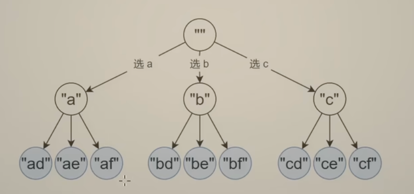

回溯有一个增量构造答案的过程，这个过程通常用递归实现

只要边界条件和非边界条件写对了，其他事情你交给数学归纳法就好了

回溯三问：
当前操作：枚举 path[i]要填入的字母
子问题？构造字符串>=i 的部分
下一个子问题？构造字符串>=i+1 的部分

回溯问题分类：

- 子集型回溯（选/不选）
  模版 1.回溯三问：当前操作是枚举第 i 个数选/不选；子问题？从下标>=i 的数字中构造子集；下一个子问题？从下标>=i+1 的数字中构造子集

模版 2.从答案的角度：枚举第一个数选谁；枚举第二个数选谁
回溯三问：当前的操作？枚举 j>=i 的数字，加入 path；子问题？从下标>=i 的数字中构造子集;下一个子问题？从下标>=i+1 的数字中构造子集

## lc.78.子集

https://leetcode.cn/problems/subsets/

```js
// 模版1
var subsets = function (nums) {
  let n = nums.length;
  let path = [];
  let ans = [];
  function dfs(i) {
    if (i === n) {
      ans.push([...path]);
      return;
    }
    dfs(i + 1);
    path.push(nums[i]);
    dfs(i + 1);
    path.pop();
  }
  dfs(0);
  return ans;
};
```

```js
// 模版2
var subsets = function (nums) {
  let n = nums.length;
  let path = [];
  let ans = [];
  function dfs(i) {
    ans.push([...path]);
    if (i === n) {
      return;
    }
    for (let index = i; index < n; index++) {
      pash.push(nums[index]);
      dfs(index + 1); // ！子问题从 j>=i中， 遍历字符串选一个
      pash.pop();
    }
  }
  dfs(0);
  return ans;
};
```

## 131.分割回文串

```js
// 'aab' -> 'a, a, b'
/* 
 [a,aa,aab]
 [a,ab][b][]
 [b][][]
*/
var partition = function (s) {
  let ans = [];
  let path = [];
  let t = "";
  let n = s.length;
  function dfs(i) {
    if (i === n) {
      ans.push([...path]);
      return;
    }
    for (let index = i; index < n; index++) {
      t = s.slice(i, index + 1); // 当前操作：遍历逗号位置，选逗号。 如（a,a,b) 有2个逗号，选1，选2，选12，都不选
      if (isOk(t)) {
        path.push(t);
        dfs(index + 1); // 子问题 在下标>=i的位置开始 新一轮-遍历逗号位置，选逗号
        path.pop();
      }
    }
  }
  dfs(0);
  console.log(ans);
  return ans;
};
function isOk(path) {
  let left = 0,
    right = path.length - 1;
  while (left < right) {
    if (path[left++] !== path[right--]) {
      return false;
    }
  }
  return true;
}
```
