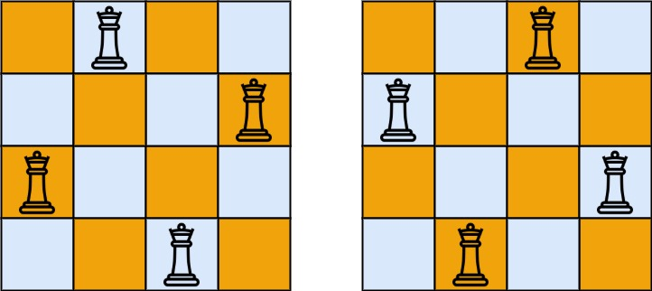

# 回溯

回溯有一个增量构造答案的过程，这个过程通常用递归实现

只要边界条件和非边界条件写对了，其他事情你交给数学归纳法就好了

## 回溯三问：

以 78 子集这题为例

当前操作：枚举 path[i]要填入的字母
子问题？构造字符串>=i 的部分
下一个子问题？构造字符串>=i+1 的部分

# 回溯问题分类：

## 子集型回溯

子集型回溯（选/不选）
- 模版 1.回溯三问：当前操作是枚举第 i 个数选/不选；子问题？从下标>=i 的数字中构造子集；下一个子问题？从下标>=i+1 的数字中构造子集

- 模版 2.从答案的角度：枚举第一个数选谁；枚举第二个数选谁
回溯三问：当前的操作？枚举 j>=i 的数字，加入 path；子问题？从下标>=i 的数字中构造子集;下一个子问题？从下标>=i+1 的数字中构造子集

## lc.78.子集

https://leetcode.cn/problems/subsets/

```js
// 模版1
var subsets = function (nums) {
  let n = nums.length;
  let path = [];
  let ans = [];
  function dfs(i) {
    if (i === n) {
      ans.push([...path]);
      return;
    }
    dfs(i + 1);
    path.push(nums[i]);
    dfs(i + 1);
    path.pop();
  }
  dfs(0);
  return ans;
};
```

```js
// 模版2
var subsets = function (nums) {
  let n = nums.length;
  let path = [];
  let ans = [];
  function dfs(i) {
    ans.push([...path]);
    if (i === n) {
      return;
    }
    for (let index = i; index < n; index++) {
      pash.push(nums[index]);
      dfs(index + 1); // ！子问题从 j>=i中， 遍历字符串选一个
      pash.pop();
    }
  }
  dfs(0);
  return ans;
};
```

## 131.分割回文串

```js
// 'aab' -> 'a, a, b'
/* 
 [a,aa,aab]
 [a,ab][b][]
 [b][][]
*/
var partition = function (s) {
  let ans = [];
  let path = [];
  let t = "";
  let n = s.length;
  function dfs(i) {
    if (i === n) {
      ans.push([...path]);
      return;
    }
    for (let index = i; index < n; index++) {
      t = s.slice(i, index + 1); // 当前操作：遍历逗号位置，选逗号。 如（a,a,b) 有2个逗号，选1，选2，选12，都不选
      if (isOk(t)) {
        path.push(t);
        dfs(index + 1); // 子问题 在下标>=i的位置开始 新一轮-遍历逗号位置，选逗号
        path.pop();
      }
    }
  }
  dfs(0);
  console.log(ans);
  return ans;
};
function isOk(path) {
  let left = 0,
    right = path.length - 1;
  while (left < right) {
    if (path[left++] !== path[right--]) {
      return false;
    }
  }
  return true;
}
```

## 组合型回溯

就是枚举每一个
剪枝优化：
如果 m = path.length, 剩余要选个数为 d = k - m.假设现在从[1,i]里选，i < d，这样的话就选不满。这个分支可以剪枝优化掉。


## lc.77.组合

way1:枚举每一个

```js
/**
 * @param {number} n
 * @param {number} k
 * @return {number[][]}
 */
var combine = function (n, k) {
  let path = [];
  let ans = [];
  function f(i) {
    let d = k - path.length;
    // 剩余可选少于d，无法选满，剪枝
    if (i < d) {
      return;
    }
    if (path.length === k) {
      ans.push([...path]);
      return;
    }
    // 逆序的写法，  判断‘剩余可选少于d，无法选满，剪枝’ 方便写一点。
    for (let index = i; index > 0; index--) {
      path.push(index);
      f(index - 1);
      path.pop();
    }
  }
  f(n);
  return ans;
};
```

way2：选与不选

```js
/* 
当前操作：选或不选
下一个子问题：遍历下标<=i,继续选
同样的，逆序好 剪枝
 */
var combine = function (n, k) {
  let path = [];
  let ans = [];
  function f(i) {
    let d = k - path.length;
    if (i < d) {
      return;
    }
    if (path.length === k) {
      ans.push([...path]);
      return;
    }
    f(i - 1);
    path.push(i);
    f(i - 1);
    path.pop();
  }
  f(n);
  return ans;
};
```

解释： 见注释

时间复杂度： k* C（n，k）

## 216. 组合总和 III

找 k 个数 和为 n； 数从 1 ～ 9，不重复。

way1:每层都遍历

```js
function combinationSum3(k, n) {
  let path = [];
  let ans = [];
  function f(i, t) {
    let d = k - path.length;
    if (i < d) {
      return;
    }
    if (t < 0 || t > Math.floor(((2 * i - d + 1) * 2) / d)) {
      return;
    }
    if (path.length === k) {
      ans.push([...path]);
    }
    for (let index = i; index > 0; index--) {
      path.push(index);
      f(index - 1, t - index);
      path.pop();
    }
  }
  return f(9, n);
}
```

way2: 选与不选

```js
var combinationSum3 = function (k, n) {
  let path = [];
  let ans = [];
  function f(i, t) {
    let d = k - path.length;
    if (i < d) {
      return;
    }
    if (t < 0 || t > Math.floor(((2 * i - d + 1) * d) / 2)) {
      return;
    }
    if (path.length === k) {
      ans.push([...path]);
      return;
    }
    f(i - 1, t - 0);
    path.push(i);
    f(i - 1, t - i);
    path.pop();
  }
  f(9, n);
  return ans;
};
```

解释：
剪枝情况：1.个数不够; 2.剩余值太大，也就是 t<0; 3.剩余值太小，也就是 t>0

## 22.括号生成

n 对括号，生成所有可能。

way1:选与不选

```js
// 选和不选， 选就等价添加左括号
var generateParenthesis = function (n) {
  let m = 2 * n;
  let ans = [];
  let path = [];
  function f(i, open) {
    if (path.length === m) {
      ans.push(path.join(""));
      return;
    }
    // 左可选
    if (open < n) {
      path.push("(");
      f(i + 1, open + 1);
      path.pop();
    }
    if (path.length - open < open) {
      path.push(")");
      f(i + 1, open);
      path.pop();
    }
    // 右可选
  }
  f(0, 0);
  return ans;
};
```

way2：枚举下一个左括号的位置
用 「枚举选哪个」的思路。
在从左往右填的过程中，要时刻保证右括号的个数不能超过左括号的个数。
如果 ✍️ 填了 5 个左括号，2 个右括号，那么至多填 5-2 = 3 个右括号。
所以枚举（在天亮下一个左括号之前）填入了 0，1，2，3 个右括号，这样就能得到下一个左括号的位置。
为了方便，代码直接用 balance 表示左右括号之差。这样我们枚举的范围就是[0,balance]

```js
var generateParenthesis = function (n) {
  const ans = [];
  const path = [];
  // 目前填了i个括号
  // 这i个括号的左括号个数 - 右括号个数 = balance
  function dfs(i, balance) {
    if (path.length === n) {
      const s = Array(n * 2).fill(")");
      for (const j of path) {
        s[j] = "(";
      }
      ans.push(s.join(""));
      return;
    }
    for (let right = 0; right <= balance; right++) {
      //先填right个右括号，然后填1个左括号，记录左括号的下标i+right
      path.push(i + right);
      dfs(i + right + 1, balance - right + 1);
      path.pop();
    }
  }
  dfs(0, 0);
  return ans;
};
```

## 排列型回溯

## lc.46.全排列

排列和组合的区别在于，有序列「1，2，3」 「2，1，3」是不同的

```js
var permute = function (nums) {
  let path = Array(nums.length).fill(0);
  let isSelect = Array(nums.length).fill(false);
  let n = nums.length;
  let ans = [];
  function f(i) {
    if (i === n) {
      ans.push([...path]);
      return;
    }
    for (let index = 0; index < n; index++) {
      if (!isSelect[index]) {
        path[i] = nums[index];
        isSelect[index] = true;
        f(i + 1);
        isSelect[index] = false;
      }
    }
  }
  f(0);
  return ans;
};
```

解释：设计一个数组用来存储元素是否访问过，没访问过的才添加到 path 里


时间复杂度：排列数量 × 每个排列的构建时间 = n! × O(n) = O(n × n!)

排列数量：O(n!)

每个排列的构建时间：O(n)


## lc.51.N皇后问题

皇后不能放在同行同列同斜线中，可以使用全排列枚举。

`col[i]`表示第 i 行，皇后放置在哪一列

`on_path[i]`表示 i 列已经填入。

`diag1`用于表示斜边 左上角已占用。如 diag1[r+c] （左上到右下）

`diag2`用于表示斜边 右下角已占用。如 diag2[r-c + n ] 因为 r-c 可能是负数，所以要+n。 （右上到左下）

思想：`dfs`遍历行，尝试列，刷新左上角和右上角 

```js
/**
 * @param {number} n
 * @return {string[][]}
 */
var solveNQueens = function (n) {
    let col = Array(n).fill(0)
    let on_path = Array(n).fill(0)
    let m = 2 * n - 1;
    let diag1 = Array(m).fill(0);
    let diag2 = Array(m).fill(0);
    let ans = [];
    function dfs(r) {
        if (r === n) {
            //构造答案
            let t = Array(n).fill(0).map(() => Array(n).fill('.'))
            col.forEach((c, r) => {
                t[r][c] = 'Q'
            })
            ans.push(t.map(v => v.join('')));
            return;
        }

        for (let c = 0; c < n; c++) {
            if (!on_path[c] && !diag1[r + c] && !diag2[r - c + n]) {
                col[r] = c;
                on_path[c] = 1;
                diag1[r + c] = 1;
                diag2[r - c + n] = 1;
                dfs(r + 1);
                on_path[c] = 0;
                diag1[r + c] = 0;
                diag2[r - c + n] = 0;
            }
        }
    }
    dfs(0)
    return ans;
};
```

时间复杂度：O(n*n!)