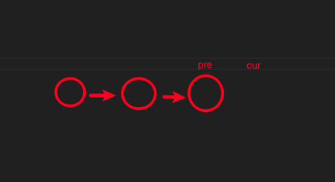
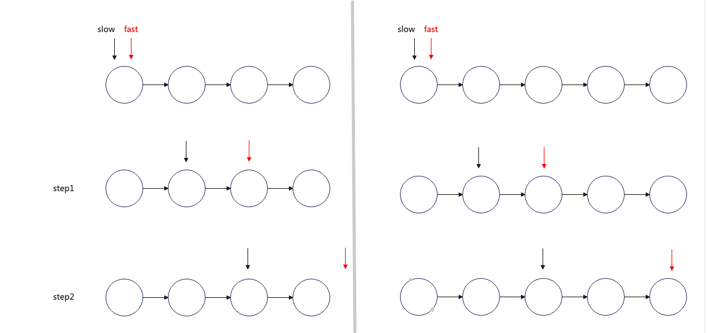
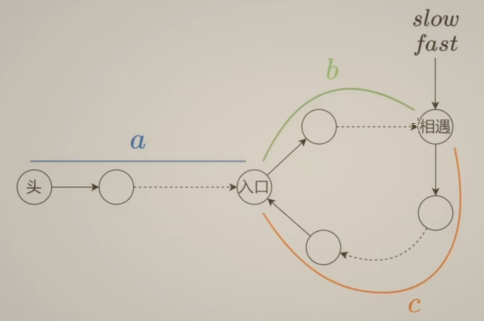
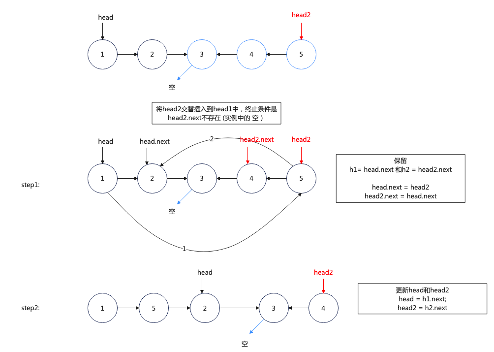
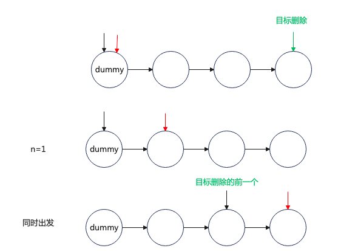
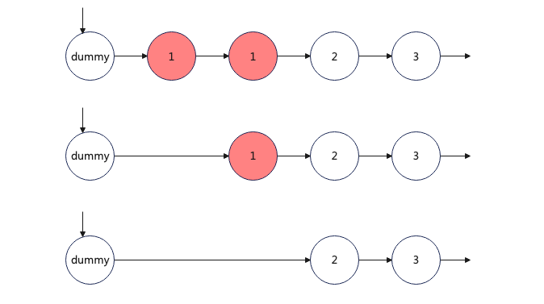

# 链表

## lc.206.反转链表

原题：https://leetcode.cn/problems/reverse-linked-list/description/

```js
/**
 * Definition for singly-linked list.
 * function ListNode(val, next) {
 *     this.val = (val===undefined ? 0 : val)
 *     this.next = (next===undefined ? null : next)
 * }
 */
/**
 * @param {ListNode} head
 * @return {ListNode}
 */
var reverseList = function (head) {
  let pre = null;
  let cur = head;
  while (cur) {
    let nxt = cur.next;
    cur.next = pre;
    pre = cur;
    cur = nxt;
  }
  return pre;
};
```

解释：
需要一个 pre 指针保存 cur 指针上一个节点，同时需要个 next 指针保存 cur.next 的节点，
在这之后 cur 的下一个直线前置节点，实现反转
最后先更新 pre，再更新 cur。
最终 cur 为空，返回 pre


## lc.92.反转链表 II

原题：https://leetcode.cn/problems/reverse-linked-list-ii/description/

```js
/**
 * Definition for singly-linked list.
 * function ListNode(val, next) {
 *     this.val = (val===undefined ? 0 : val)
 *     this.next = (next===undefined ? null : next)
 * }
 */
/**
 * @param {ListNode} head
 * @param {number} left
 * @param {number} right
 * @return {ListNode}
 */
var reverseBetween = function (head, left, right) {
  let dummy = new ListNode(); //先保存最初位置
  dummy.next = head;
  let p0 = dummy;
  // 考虑left可能就是head，引入p0

  // p0的位置在于初始left的上一个节点
  Array(left - 1)
    .fill(0)
    .forEach(() => {
      p0 = p0.next;
    });
  // 这部分和反转列表一致
  let pre = null;
  let cur = left;
  Array(right - left + 1)
    .fill(0)
    .forEach(() => {
      let nxt = cur.next;
      cur.next = pre;
      pre = cur;
      cur = nxt;
    });
  // 重新链接
  p0.next.next = cur; // 已有的要先绑
  p0.next = pre; // 如果先绑定这个，那po.next.next就变了

  return dummy.next; // 一开始保留的开始head，
};
```

解释：
这里要考虑
第一种情况，反转部分，所以要保留 dummy 一开始的指向。
第二种情况，就是 left 就是 head 的时候
细节参考代码注释

## lc.25. K 个一组翻转链表

原题：https://leetcode.cn/problems/reverse-nodes-in-k-group/description/
细节：每 k 个一组翻转，小于 k 就不反转

```js
/**
 * Definition for singly-linked list.
 * function ListNode(val, next) {
 *     this.val = (val===undefined ? 0 : val)
 *     this.next = (next===undefined ? null : next)
 * }
 */
/**
 * @param {ListNode} head
 * @param {number} k
 * @return {ListNode}
 */
var reverseKGroup = function (head, k) {
  let dummy = new ListNode();
  dummy.next = head;
  let p0 = dummy;

  //  先记录总个数
  let n = 0;
  let coutCur = head;
  while (coutCur) {
    n++;
    coutCur = coutCur.next;
  }
  let pre = null;
  let cur = head;

  // 多少组
  while (n >= k) {
    pre = null;
    n -= k;
    let count = k;
    // 每k个为一组翻转
    while (count > 0) {
      count--;
      let nxt = cur.next;
      cur.next = pre;
      pre = cur;
      cur = nxt;
    }
    // !!临时变量，这一组结束后，p0要移动到这一组翻转后，结尾的位置，循环开始
    let tempP0 = p0.next;
    p0.next.next = cur;
    p0.next = pre;
    p0 = tempP0;
  }
  return dummy.next;
};
```

解释：与 lc.92 的区别在于，每 k 个为一组进行翻转。
也就是每做完一组，需要重新更新 p0 到这一组翻转后结尾的位置 pre=null

## lc.876. 链表的中间结点

原题：https://leetcode.cn/problems/middle-of-the-linked-list/description/

```js
/**
 * Definition for singly-linked list.
 * function ListNode(val, next) {
 *     this.val = (val===undefined ? 0 : val)
 *     this.next = (next===undefined ? null : next)
 * }
 */
/**
 * @param {ListNode} head
 * @return {ListNode}
 */
var middleNode = function (head) {
  let slow = head;
  let fast = head;
  while (fast && fast.next) {
    slow = slow.next;
    fast = fast.next.next;
  }
  return slow;
};
```

解释：
原理：slow 走一步，fast 走两步
如图观察，偶数个数 fast 为空；奇数个数 fast.next 为空，当满足其中一个到时候，slow 的位置就是题目所求中间的位置


## lc. 141.环形链表

原题：https://leetcode.cn/problems/linked-list-cycle/description/

```js
let slow = head;
let fast = head;
while (fast && fast.next) {
  slow = slow.next;
  fast = fast.next.next;
  if (fast === slow) {
    return true;
  }
}
return false;
```

解释：如果有环，快指针一定会套圈慢指针相遇；如果无环，跳出循环结束

## lc.142. 环形链表 II

原题：


```js
let slow = head;
let fast = head;
while (fast && fast.next) {
  slow = slow.next;
  fast = fast.next.next;
  if (fast === slow) {
    while (slow !== head) {
      slow = slow.next;
      head = head.next;
    }
    return slow;
  }
}
return null;
```

解释：
环长 = b + c
慢指针移动的距离 = a + b
快指针移动的距离 = a + b + k(b+c)
快指针移动距离是慢指针的两倍
推导出
2(a+b) = a + b + k(b+c)
a-c = (k-1) (b+c)

这意味着 slow 从相遇点开始和 head 节点继续走，最终会相遇。
解释如下：head 走 c 步，slow 也 c 步到了入口，head 再走（k-1)(b+c) 也就是环长到达 a,这时候 slow 也套了 k-1 圈。它们在入口相遇

## 143. 重排链表

原题： https://leetcode.cn/problems/reorder-list/

步骤：
找到中心点，
翻转后半部分链表，
循环交替插入 后半部分链表，
最终得到 L0 -> Ln -> L1 -> Ln-1 -> L2 -> Ln-2

```js
/**
 * Definition for singly-linked list.
 * function ListNode(val, next) {
 *     this.val = (val===undefined ? 0 : val)
 *     this.next = (next===undefined ? null : next)
 * }
 */
/**
 * @param {ListNode} head
 * @return {void} Do not return anything, modify head in-place instead.
 */
var reorderList = function (head) {
  let mid = middleNode(head);
  let head2 = reverseList(mid);
  while (head2.next) {
    let h1 = head.next;
    let h2 = head2.next;
    head.next = head2;
    head2.next = h1;
    head = h1;
    head2 = h2;
  }
};
var middleNode = function (head) {
  let slow = head;
  let fast = head;
  while (fast && fast.next) {
    slow = slow.next;
    fast = fast.next.next;
  }
  return slow;
};
var reverseList = function (head) {
  let pre = null;
  let cur = head;
  while (cur) {
    let nxt = cur.next;
    cur.next = pre;
    pre = cur;
    cur = nxt;
  }
  return pre;
};
```



# 删除链表

## lc.237. 删除链表中的节点

https://leetcode.cn/problems/delete-node-in-a-linked-list/description/

```js
/**
 * @param {ListNode} node
 * @return {void} Do not return anything, modify node in-place instead.
 */
var deleteNode = function (node) {
  let nodeNext = node.next;
  node.val = nodeNext.val;
  node.next = nodeNext.next;
};
```

解释：题目含义为只要值不一致，就认为这个节点删除了。而真正意义的删除是这个节点的内存不在这条链上。
所以这里取巧的是直接改掉原来的值。

## 19. 删除链表的倒数第 N 个结点

https://leetcode.cn/problems/remove-nth-node-from-end-of-list/description/

```js
var removeNthFromEnd = function (head, n) {
  let dummyNode = new ListNode(); // 如果可能操作到头节点就需要一个dummy指向head，便于返回
  dummyNode.next = head;
  let cur = dummyNode;
  let right = cur;
  Array(n)
    .fill(0)
    .forEach(() => {
      right = right.next;
    });
  let left = cur; // 找到带删除的上一个节点
  while (right.next) {
    right = right.next;
    left = left.next;
  }
  left.next = left.next.next;
  return dummyNode.next;
};
```

解释：这里使用快慢指针，right 先走 n 步，在和 left 同时出发，left 从 dummy 出发，right 走到最后一个节点，这时候，left 到位置就是`被删除节点的上一节点`



## 83. 删除排序链表中的重复元素

https://leetcode.cn/problems/remove-duplicates-from-sorted-list/

```js
var deleteDuplicates = function (head) {
  if (!head) {
    return head;
  }
  let cur = head;
  while (cur.next) {
    if (cur.next.val === cur.val) {
      cur.next = cur.next.next;
    } else {
      cur = cur.next;
    }
  }
  return head;
};
```

## 82. 删除排序链表中的重复元素 II

与 83 的区别是有重复的，都不要

```js
var deleteDuplicates = function (head) {
  let dummy = new ListNode();
  dummy.next = head;
  let cur = dummy;
  while (cur.next && cur.next.next) {
    let val = cur.next.val;
    if (val === cur.next.next.val) {
      while (cur.next && cur.next.val === val) {
        // 第一次是自己和自己对比;下一次是和第一次对比
        cur.next = cur.next.next;
      }
    } else {
      cur = cur.next;
    }
  }
  return dummy.next;
};
```

解释；
初始化 cur 指向 dummy Node,每次循环的时候 看下一个节点和 下下一个节点
如果一样，就再套一个循环，不断删除节点。知道没有节点或者遇到的节点值不一样。
如果不一样，cur 移到下一个节点，直至满足不足 2 个节点。

