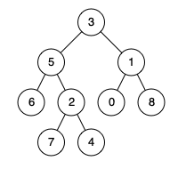

# 二叉树

## 递归本质


## 104.二叉树的最大深度

https://leetcode.cn/problems/maximum-depth-of-binary-tree/

```js
var maxDepth = function (root) {
  // 思考整棵树和左右的关系
  // 深度= max(left,right)+1
  // 归是 节点不存在的时候
  let ans = 0;
  var dfs = function (root, cnt) {
    if (!root) {
      return;
    }
    cnt++;
    ans = Math.max(ans, cnt);
    dfs(root.left, cnt);
    dfs(root.right, cnt);
  };
  dfs(root, 0);
  return ans;
};
```

## 100.相同的树

https://leetcode.cn/problems/same-tree/

```js
/**
 * Definition for a binary tree node.
 * function TreeNode(val, left, right) {
 *     this.val = (val===undefined ? 0 : val)
 *     this.left = (left===undefined ? null : left)
 *     this.right = (right===undefined ? null : right)
 * }
 */
/**
 * @param {TreeNode} p
 * @param {TreeNode} q
 * @return {boolean}
 */
var isSameTree = function (p, q) {
  // 原文题：树是否相同
  // 子问题：树大的节点是否相同
  // 归 -> 不相同或者相同的时候返回
  if (!p && !q) {
    return true;
  }
  if (!p || !q) {
    return false;
  }
  if (p.val !== q.val) {
    return false;
  }
  return isSameTree(p.left, q.left) && isSameTree(p.right, q.right);
};
```

## 101.对称二叉树

https://leetcode.cn/problems/symmetric-tree/description/

```js
/**
 * Definition for a binary tree node.
 * function TreeNode(val, left, right) {
 *     this.val = (val===undefined ? 0 : val)
 *     this.left = (left===undefined ? null : left)
 *     this.right = (right===undefined ? null : right)
 * }
 */
/**
 * @param {TreeNode} root
 * @return {boolean}
 */
var isSymmetric = function (root) {
  /* 
    原问题：树是否对称
    子问题：左右子树是否对称
    递：关系为 左子左 右子右。左子右 右子左
    归：具体节点值是否相等
     */
  var isSame = function (left, right) {
    if (!left && !right) {
      return true;
    }
    if (!left || !right) {
      return false;
    }
    if (left.val !== right.val) {
      return false;
    }
    return isSame(left.left, right.right) && isSame(left.right, right.left);
  };

  return isSame(root.left, root.right);
};
```

## 110.平衡二叉树

https://leetcode.cn/problems/balanced-binary-tree/description/

```js
/**
 * Definition for a binary tree node.
 * function TreeNode(val, left, right) {
 *     this.val = (val===undefined ? 0 : val)
 *     this.left = (left===undefined ? null : left)
 *     this.right = (right===undefined ? null : right)
 * }
 */
/**
 * @param {TreeNode} root
 * @return {boolean}
 */
var isBalanced = function (root) {
  /* 
    原问题：是不是整树是不是平衡二叉树
    子问题：左右子树是平衡二叉树
     递： 
     归：高度差大于1或者都不存在
     */
  if (!root) {
    return true;
  }
  let left_deepth = maxDepth(root.left);
  let right_deepth = maxDepth(root.right);
  if (Math.abs(left_deepth - right_deepth) > 1) {
    return false;
  }
  return isBalanced(root.left) && isBalanced(root.right);
};
var maxDepth = function (root) {
  if (!root) {
    return 0;
  }
  let left_deepth = maxDepth(root.left);
  let right_deepth = maxDepth(root.right);
  return Math.max(left_deepth, right_deepth) + 1;
};
```

way2:把负数利用起来，返回负一就是不平衡的

```js
var isBalanced = function (root) {
  /* 
    原问题：是不是整树是不是平衡二叉树
    子问题：左右子树是平衡二叉树
     递： 往下探深度
     归：-1 代表不平衡
     */
  function getHeight(root) {
    if (!root) {
      return 0;
    }
    let l = getHeight(root.left);
    if (l === -1) {
      return -1;
    }
    let r = getHeight(root.right);
    if (r === -1 || Math.abs(l - r) > 1) {
      return -1;
    }
    return Math.max(l, r) + 1;
  }
  return getHeight(root) !== -1;
};
```

解释：算出左右子树高度，做差就知道是不是平衡二叉树了

## 199.二叉树的右视图

```js
/* 
原问题：右侧能看的节点值
子问题：右子树能看到的节点值，做子树能看到的节点值
递：
归：节点为未空，或者当前深度和答案长度一致
*/
var rightSideView = function (root) {
  let ans = [];
  var dfs = function (root, deepth) {
    if (!root) {
      return;
    }
    if (deepth === ans.length) {
      ans.push(root.val);
    }
    dfs(root.right, deepth + 1);
    dfs(root.left, deepth + 1);
  };
  dfs(root, 0);
  return ans;
};
```

解释：每一层只能保留一个，初始化根节点为 0 层， 这一层还没放，可以放到答案里，
然后从右子树开始，因为要先看到右视图。

way2 层序遍历

```js
var rightSideView = function (root) {
  let stack = [];
  if (root) {
    stack.push(root);
  }
  let ans = [];
  while (stack.length) {
    ans.push(stack[stack.length - 1]?.val);
    let n = stack.length;
    for (let i = 0; i < n; i++) {
      let item = stack.shift();
      if (item?.left) {
        stack.push(item.left);
      }
      if (item?.right) {
        stack.push(item.right);
      }
    }
  }
  return ans;
};
```

## 98.验证二叉搜索树

`二叉搜索树的定义：左边的严格小于中间，中间的严格小于右边`

### 前序的做法：

`先遍历中，再遍历左右`
将区间传递下去，判断节点值是否在区间里。初始化传递区间为(-oo,+oo)


```js
/**
 * Definition for a binary tree node.
 * function TreeNode(val, left, right) {
 *     this.val = (val===undefined ? 0 : val)
 *     this.left = (left===undefined ? null : left)
 *     this.right = (right===undefined ? null : right)
 * }
 */
/**
 * @param {TreeNode} root
 * @return {boolean}
 */
var isValidBST = function (root) {
  function f(root, left, right) {
    if (!root) {
      return true;
    }
    let val = root.val;
    return (
      left < val &&
      val < right &&
      f(root.left, left, val) &&
      f(root.right, val, right)
    );
  }
  return f(root, -Infinity, +Infinity);
};
```

### 中序的做法：

`先遍历前，在遍历中，最后遍历后`
中序遍历的规律是最终遍历的数，会按照严格递增的，所以可以每次只保存上一次遍历的值，和当前的值比较大小，看是否满足。

```js
var isValidBST = function (root) {
  let pre = -Infinity;
  function f(root) {
    if (!root) {
      return true;
    }
    let l = f(root.left);
    if (!l) {
      return false;
    }
    if (root.val <= pre) {
      return false;
    }
    pre = root.val;
    return f(root.right);
  }
  return f(root);
};
```

### 后续遍历

`先遍历左，在遍历右，最后遍历中`
与前序类似，只是在归的时候返回区间进行判断
需要注意：空节点返回的是 [+oo,-oo];遇到不满足区间的节点值返回[-oo,+oo];当这个节点满足后，要返回`[Math.min(l_min, x), Math.max(r_max, x)]` 即左边找最小，右边找最大


```js
/**
 * @param {TreeNode} root
 * @return {boolean}
 */
var isValidBST = function (root) {
  function f(root) {
    if (!root) {
      return [Infinity, -Infinity];
    }
    let [l_min, l_max] = f(root.left);
    let [r_min, r_max] = f(root.right);
    let x = root.val;
    if (x <= l_max || x >= r_min) {
      return [-Infinity, +Infinity];
    }
    return [Math.min(l_min, x), Math.max(r_max, x)];
  }
  let res = f(root);
  return Number.isFinite(res[1]);
};
```

## 236.最近公共祖先

https://leetcode.cn/problems/lowest-common-ancestor-of-a-binary-tree/description/

最近公共祖先的定义为：“对于有根树 T 的两个节点 p、q，最近公共祖先表示为一个节点 x，满足 x 是 p、q 的祖先且 x 的深度尽可能大（一个节点也可以是它自己的祖先）。”

```js
/**
 * @param {TreeNode} root
 * @param {TreeNode} p
 * @param {TreeNode} q
 * @return {TreeNode}
 */
var lowestCommonAncestor = function (root, p, q) {
  return f(root, p, q);
};
var f = function (root, p, q) {
  if (!root || root === q || root === p) {
    return root;
  }
  let l = f(root.left, p, q);
  let r = f(root.right, p, q);
  if (l && r) {
    return root;
  }
  if (l) {
    return l;
  }
  if (r) {
    return r;
  }
};
```

解释：分类讨论
对于某一个节点，
如果当前节点为【空｜ p ｜ q】,则直接返回
其他情况 【左右子树都找到 - 返回当前节点】【只有左子树找到 - 递归左子树结果】【只有右子树找到 - 递归右子树结果】【左右都没找到-返回空节点】

## 235.二叉搜索树的最佳公共祖先

```js
/**
 * Definition for a binary tree node.
 * function TreeNode(val) {
 *     this.val = val;
 *     this.left = this.right = null;
 * }
 */

/**
 * @param {TreeNode} root
 * @param {TreeNode} p
 * @param {TreeNode} q
 * @return {TreeNode}
 */
var lowestCommonAncestor = function (root, p, q) {
  return f(root, p, q);
};
var f = function (root, p, q) {
  if (p.val < root.val && q.val < root.val) {
    //console.log('l', root.val)
    return f(root.left, p, q);
  }
  if (p.val > root.val && q.val > root.val) {
    //console.log('r', root.val)
    return f(root.right, p, q);
  }
  return root;
};
```

解释：利用二叉树的性质
如果 q、p 的值都小当前节点值，则知道他在左子树中
如果 q、p 的值都大当前节点值，则知道他在右子树中
如果 q、p 的值在左右子树中，那最佳公共祖先就是当前节点

分类讨论：
p 和 q 在左子树，返回递归左子树的结果
p 和 q 在右子树，返回递归右子树的结果
其他： 【p 和 q 在左右】【当前是 p】【当前是 q】

# 层序遍历
## 103.二叉树的锯齿形层序遍历

https://leetcode.cn/problems/binary-tree-zigzag-level-order-traversal/

```js
var zigzagLevelOrder = function (root) {
  if (!root) {
    return [];
  }
  let ans = [];
  let cur = [root];
  let even = false;
  while (cur.length) {
    let val = [];
    let next = [];
    cur.forEach((v) => {
      val.push(v);
      let node = v;
      if (node.left) {
        next.push(node.left);
      }
      if (node.right) {
        next.push(node.right);
      }
    });
    cur = next;
    ans = ans.concat(
      even ? [val.reverse().map((v) => v.val)] : [val.map((v) => v.val)]
    );
    even = !even;
  }
  return ans;
};
```

## 513.找树左下角的值

https://leetcode.cn/problems/find-bottom-left-tree-value/description/

```js
/**
 * Definition for a binary tree node.
 * function TreeNode(val, left, right) {
 *     this.val = (val===undefined ? 0 : val)
 *     this.left = (left===undefined ? null : left)
 *     this.right = (right===undefined ? null : right)
 * }
 */
/**
 * @param {TreeNode} root
 * @return {number}
 */
var findBottomLeftValue = function (root) {
  let stack = [root];
  let node;
  while (stack.length) {
    node = stack.shift();
    if (node.right) {
      stack.push(node.right);
    }
    if (node.left) {
      stack.push(node.left);
    }
  }
  return node.val;
};
```
