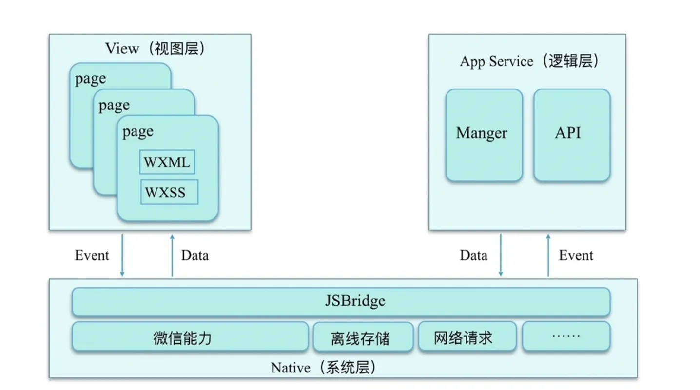
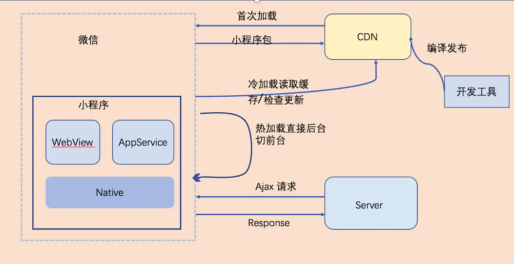
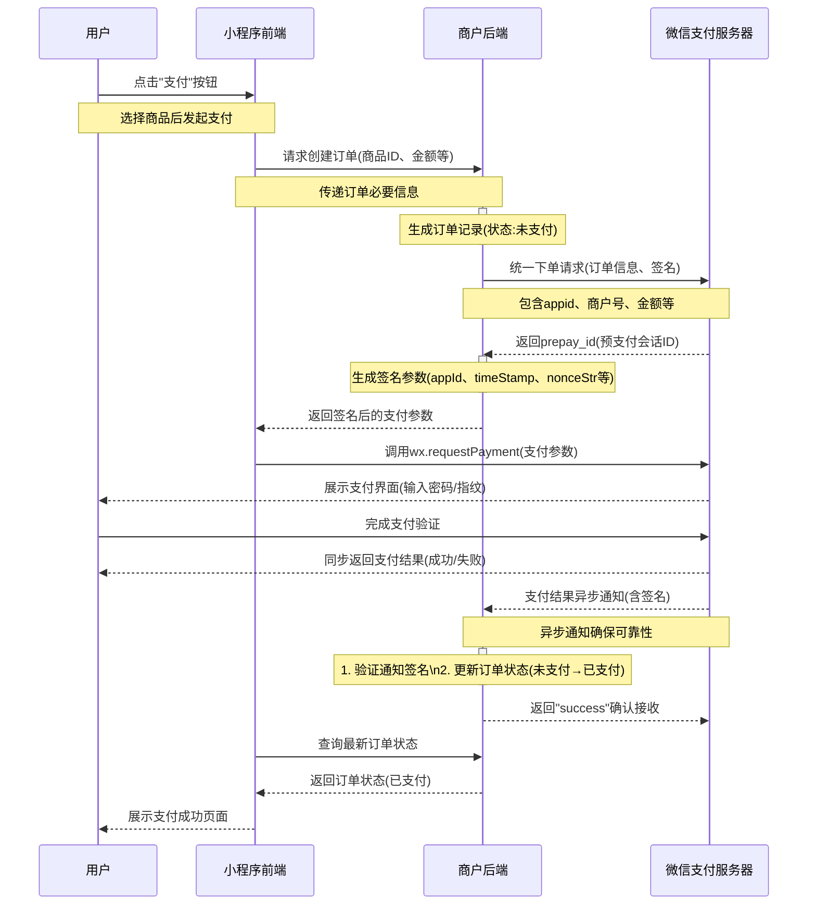
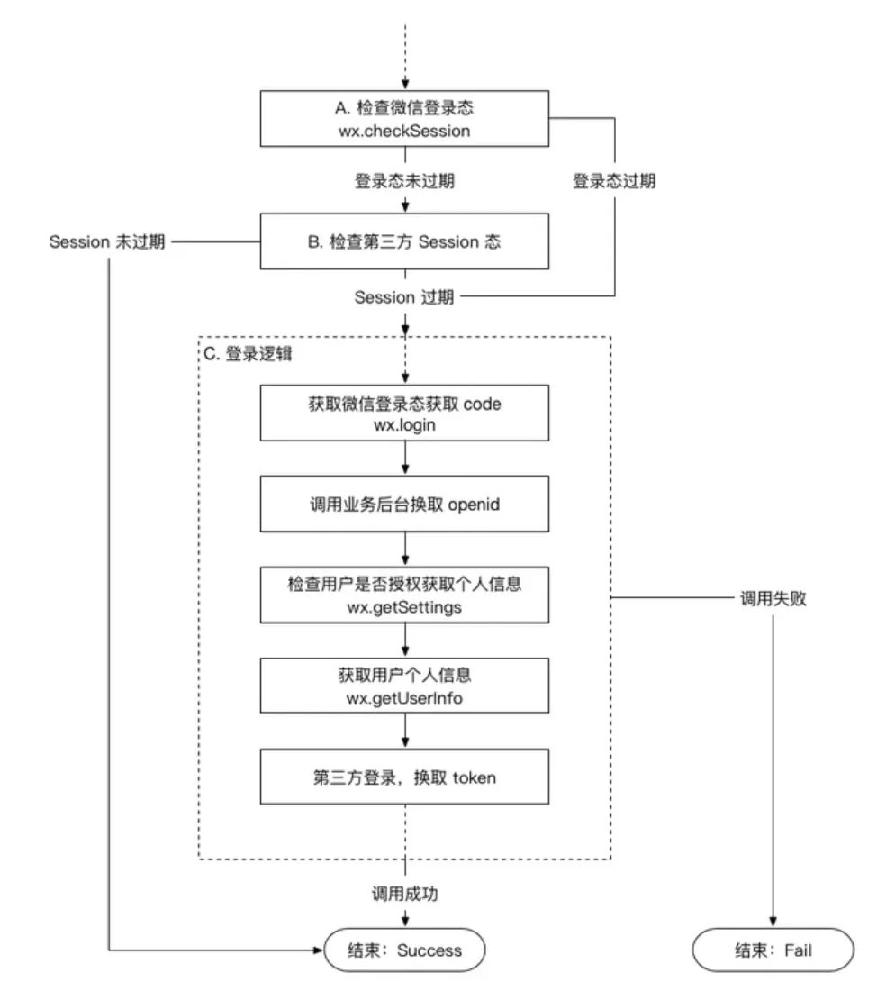

## 小程序的实现原理
### 背景：
传统的网页开发，渲染线程和脚本是互斥的。这也是为什么长时间的脚本运行会导致界面无响应的原因。因为我们常说`JS`是单线程的，微信小程序则选用了`hybird`的渲染方式，将视图层与逻辑层分开，实现双线程同时运行。在此模式下，视图层的界面使用`webview`进行渲染，而逻辑层则在`JScore`中运行。

在小程序中，渲染层主要负责界面渲染相关的任务，并在WebView线程中执行。一个小程序可能存在多个页面，所以渲染层存在多个WebView线程，而逻辑层则采用JSCore线程运行脚本，执行的都是与小程序业务逻辑有关的代码。

### 通信：

### 运行机制：
启动运行主要有2种情况：
- 冷启动（重新开始）：用户首次打开或者小程序被微信销毁后再次打开，这时候需要重新加载启动，即为冷启动。
- 热启动：用户已经打开过小程序，然后一定时间内再次打开小程序，此时无需重启，只需将后台态的小程序切换到前台，这个过程为热启动
需要注意的是：
1. 小程序没有重启的概念
2. 当小程序进入后台，客户端会维持一段时间的运行状态，超过一定时间后会被微信主动销毁
3. 短时间收到系统两次以上内存警告，也会对小程序进行销毁。这就是为什么一旦页面内存溢出，页面会奔溃的本质原因。

当开发者在后台发布新版本，无法立即影响所有现网用户，但最差情况下，也在发布后24小时之内下发新版本到用户。每次冷启动，都会检查是否有更新版本，如果发现，则会异步下载新版本代码包，并同时用客户端本地的包进行启动，即新版本的小程序需要下一次冷启动才会应用上。


## 小程序的支付流程

流程大致如下：
1. 用户通过分享或者扫码进入商户小程序，用户选择购买，完成选购流程。
2. 调用微信支付控件，用户输入支付密码。
3. 密码验证，支付成功，商户后台得到支付成功通知。
4. 返回商户小程序，显示购买成功。
5. 微信支付公众号下发支付凭证。
详细流程图：


具体操作流程如下：
1. 打开小程序，下单，此时小程序会调`wx.login`获取用户临时凭证`code`,发送给wx后台换取`openId`
2. 用户下单，小程序需要将购买的商品Id,数量，以及用户的openId传送到服务器
3. 服务器收到商品id，数量，openId后，生成订单数据，通过通过签名算法，向微信支付发送支付请求，获取预付单`perpay_id`.然后，服务器会将获取到数据再次进行签名，向小程序响应必要的信息。
4. 小程序获取对于参数，调用`wx.requestPayment`发起支付请求，唤起支付工作台，进行支付
5. 用户进行密码/指纹验证，确认支付后，微信后台进行鉴权、直接返回给前端支付的结果，前端收到返回数据后对支付结果进行展示。
6. 最后，微信后台给前端返回结果后，也会给后台返回一个支付结果，后台通过这个支付结果来更新订单信息。
以下是后端响应数据和`wx.requestPayment`方法所需要的参数示例
```js
wx.requestPayment({
    timeStamp:'', // 时间戳
    nonceStr:'', // 随机字符串
    package:'', // 统一下单接口返回的perpay_id 
    signType:'',// 签名类型
    paySign:'',// 签名
    success(){}, //成功回调
    fail(){} // 失败回调
    compelete(){} // 结束回调
})
```

### 支付安全
首先，接口基于HTTPS加密；
其次，支付服务提供商户证书下发、报文签名以及商户数据包（MD5）校验等多种安全机制；
此外，用户信息（银行卡、密码、验证码）等信息均不会保存商户系统或者微信系统）；
最后，微信支付还为用户提供交易过程中的安全保障，通过多种风险控制系统为用户拦截可疑交易；
### 结束
小程序支付和以往的网页、APP微信支付大同小异，可以说小程序的支付变得更加简洁，不需要设置支付目录、域名授权等操作。其优化了支付流程，同时在安全方面也做出了保障，从而为用户提供了更好的支付体验。

## 提高微信小程序的应用速度的手段
一、减少体积
- 控制代码包大小
- 子包按需加载
- 打包优化 -> 压缩代码 
- 打包优化 -> 清理无用代码

二、优化加载
- 预加载子包

三、渲染优化
- onLoad阶段发起请求
- 合并setData
- 首屏骨架屏
- 长列表，虚拟列表
- 懒加载图片

四、利用缓存
- 缓存本地数据
- 利用cdn请求资源

## 微信小程序跳转方式的区别
根据需要使用合适跳转方式，控制栈数量，合理管理小程序内存
|方法|navigateTo|redirectTo|switchTab|navigateBack|reLaunch|
|---|---|---|---|---|---|
|作用|push栈的形式|replace的形式|清空，只留下新的tabBar|返回上一层|清空，只留新页面|


## 小程序微信登录流程
(小程序登录)[https://developers.weixin.qq.com/miniprogram/dev/framework/open-ability/login.html]
### 步骤
1. 获取code
   - 调用`wx.login()`获取code
2. 获取openid
   - code发送到开发者服务器
   - 使用code向wx服务器换取`openId` `session_key`
3. 自定义登录状态
   - 拿openId，数据库查询，不存在则创建；存在则校验，生成自定义登录态；
4. 返回登录态
   - 开发者服务器返回登录态给小程序
   - 小程序本地存储
5. 校验登录态
   - 小程序重启可校验登录态
   - `wx.checkSession`验证登录态是否过期
   - 过期则重新执行登录流程，未过期继续使用

综上,微信小程序的登录流程主要分为获取openid、生成和校验登录态几个步骤。具体实现还需要开发者服务器配合,参考微信官方文档。


### `session_key`的作用：
1. 解密用户敏感数据
微信小程序中，用户的部分敏感信息（如手机号、头像昵称的完整信息、unionId 等）会以加密形式返回给开发者（通过 wx.getUserProfile、wx.getPhoneNumber 等接口），这些加密数据必须使用 session_key 才能解密为明文。

2. 验证登录状态的有效性
流程
- 调用`auth.code2Session`获取`session_key`和`openid`，开发者生成一个token关联这两个值，返回给小程序前端。
- 后续用户操作`如提交订单`，前端携带token发起请求，验证身份合法性。

3. 保证数据传输安全性
- 敏感数据的解密过程只能在开发者服务器完成，避免前端存储密钥导致的泄露风险。
- 即使 session_key 泄露，其时效性也能限制风险范围（过期后自动失效）。
4. 总结
- session_key 是小程序中处理用户敏感数据、验证登录状态的 “安全钥匙”，其核心价值在于在保障用户数据安全的前提下，实现开发者对用户信息的合法获取与身份验证。


## 小程序生命周期
分为三部分：
- 应用生命周期
- 页面生命周期
- 组件生命周期

### 应用生命周期
|方法|含义|
|---|---|
|onLaunch|全局执行一次，小程序初始化完成触发|
|onShow|启动或者，后台切前台|
|onHide|切后台|
|onError|脚本错误或者API调用错误报错|
|onPageNotFound|跳转页面未找到|
|onUnhandledRejection|未处理的Promise拒接|
|onThemeChange|主题切换|

### 页面生命周期

|方法|含义|
|---|---|
|onLoad|全局执行一次,页面初始化加载触发|
|onShow|页面显示|
|onReady|渲染完成|
|onHide|切后台|
|onUnload|卸载|

### 组件声明周期

|方法|含义|
|---|---|
|created|组件实例刚创建时触发|
|attached|组件进入页面节点树时触发|
|ready|组件首次渲染完成时触发|
|moved|组件位置改变时触发|
|detached|组件离开页面节点树时触发|
|error|组件方法错误时触发|

### 执行顺序
1. 小程序打开： onLaunch -> onShow -> onLoad -> onShow -> onReady
2. 进入新页面： onHide ->   onLoad -> onShow -> onReady
3. 返回上一页： onUnload -> onShow
4. 小程序切后台:onHide
5. 小程序重启： onLaunch -> onShow

## 说说对小程序的理解？优缺点
小程序是依托于超级 APP（如微信、支付宝、抖音等）生态的**轻量级应用**，核心特点是 “**无需下载安装、即点即用、用完即走**”。它介于 H5 网页和原生 APP 之间，通过平台提供的底层能力（如支付、定位、社交关系链）实现轻量化服务，同时复用宿主 APP 的流量和用户基础。

优点：
- 无需下载，分发简单，性能优于h5
- 借助平台
- 相对安全
- 开发门槛低
- 降低兼容性
- 可使用native

缺点：
- 用户留存率不高
- 性能和复杂度有上限，体积限制
- 受限微信，自由度较低

## 小程序的事件
冒泡事件列表

|类型|触发条件|
|---|---|
|touchStart|触摸动作开始|
|touchMove|手指触摸后移动|
|touchcancel|触摸被打断，来电提醒、弹窗|
|touchend|触摸结束|
|tap|触摸后马上离开|
|longpress|触摸超350ms，如果触发了这个，则tap不触发|


- `bind`绑定事件：`bindtap`
- `catch`阻止冒泡：`catchtap`
- `capture`捕获事件阶段，`capture-bind:tap` `capture-catch:tap`(中断捕获，取消冒泡)
  - 下列，点击inner View ，事件顺序为：handleTap2 handleTap4 handleTap3 handleTap1
```wxml
  <view id="outer" bind:touchstart="handleTap1" capture-bind:touchstart="handleTap2">
  outer view
  <view id="inner" bind:touchstart="handleTap3" capture-bind:touchstart="handleTap4">
    inner view
  </view>
</view>
```

- `mul-bind`:换而言之，所有 mut-bind 是“互斥”的，只会有其中一个绑定函数被触发。同时，它完全不影响 bind 和 catch 的绑定效果。
  - 下列，点击inner View，触发顺序为 handleTap3 handleTap2 
```wxml
  <view id="outer" mut-bind:tap="handleTap1">
  outer view
  <view id="middle" bindtap="handleTap2">
    middle view
    <view id="inner" mut-bind:tap="handleTap3">
      inner view
    </view>
  </view>
</view>
```