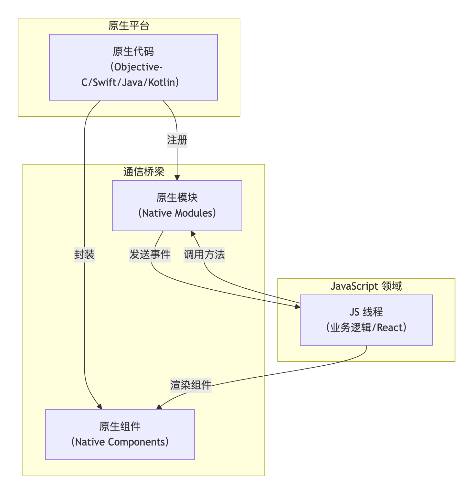

## 兼容性
|兼容性问题领域|主要挑战|核心解决思路|
|---|---|---|
|平台特性与组件行为|iOS 和 Android 的导航模式、组件默认行为（如滚动、阴影）存在差异|使用 PlatformAPI 进行条件渲染或样式设置
，选择跨平台兼容的组件|
|样式与布局​|相同样式在不同平台渲染效果不一致（如阴影、表单元素），以及安全区适配问题|使用 Platform.select指定平台样式
，利用 SafeAreaView处理刘海屏等|
|性能表现​|​JavaScript 线程与原生模块通信可能成为瓶颈，列表渲染、动画性能不佳|优化 JavaScript 代码，使用性能组件（如 FlatList），考虑使用优化库（如 react-native-reanimated)|
|第三方库与依赖​​|某些第三方库可能仅支持单一平台，或在不同平台有不同行为，RN 版本升级可能导致库不兼容|选择维护良好、文档明确支持双平台的库
，关注并妥善管理依赖库的版本|
|原生模块与设备功能​|需要特定平台原生功能（如特定硬件传感器）时，需开发原生模块，并处理平台差异|开发原生模块时需熟悉平台特性，并进行充分测试|
|构建与部署​|特定于某一平台的配置可能复杂（如 Android 64位库支持、iOS 证书配置），热更新策略需考虑平台政策|仔细遵循官方指南，利用云测试平台进行多设备测试|

​​条件渲染组件​​：
```js
import { Platform, View } from 'react-native';
const MyComponent = () => (
  <View>
    {Platform.select({
      ios: <Text>这是iOS特有的文本</Text>,
      android: <Text>这是Android特有的文本</Text>,
    })}
  </View>
);
```

平台特定样式：
```js
import { Platform, StyleSheet } from 'react-native';
const styles = StyleSheet.create({
  container: {
    flex: 1,
    ...Platform.select({
      ios: {
        shadowColor: '#000',
        shadowOffset: { width: 0, height: 2 },
        shadowOpacity: 0.2,
      },
      android: {
        elevation: 4,
      },
    }),
  },
});
```
平台特定文件扩展名：对于平台差异较大的组件或模块，可以创建单独的文件，如 MyComponent.ios.js和 MyComponent.android.js。React Native 在打包时会自动根据平台加载对应的文件。

## 目录
一个典型的 React Native 项目目录结构清晰地区分了不同平台和功能的代码，其核心构成如下
|目录/文件|	用途说明|
|---|---|
|android/|Android 平台的原生代码、资源配置和构建文件（如 build.gradle）。|
|ios/|​​iOS 平台的 Xcode 项目文件、原生代码和资源配置（如 Info.plist）。|
|node_modules/|项目依赖的第三方库（安装后自动生成，通常无需手动修改）。|
|src/​​ 或 ​​app/|项目的核心，存放 JavaScript/TypeScript 源代码​​|
|src/components/|可复用的 UI 组件。|
|src/screens/|各个页面（屏幕）组件。|
|src/navigation/|导航配置相关文件。|
|src/services/|网络请求、API 调用等业务逻辑。|
|src/utils/|工具函数和常量定义。|
|src/assets/|静态资源，如图片、字体等。|
|index.js|应用的入口文件​​，负责注册根组件。|
|App.js|应用的根组件，通常定义应用的主界面结构。|
|package.json|定义项目元信息、依赖项和可执行的脚本命令（如启动、打包）|
|metro.config.js|Metro 打包器（负责打包 JavaScript 代码）的配置文件。|

## 混合应用的架构
