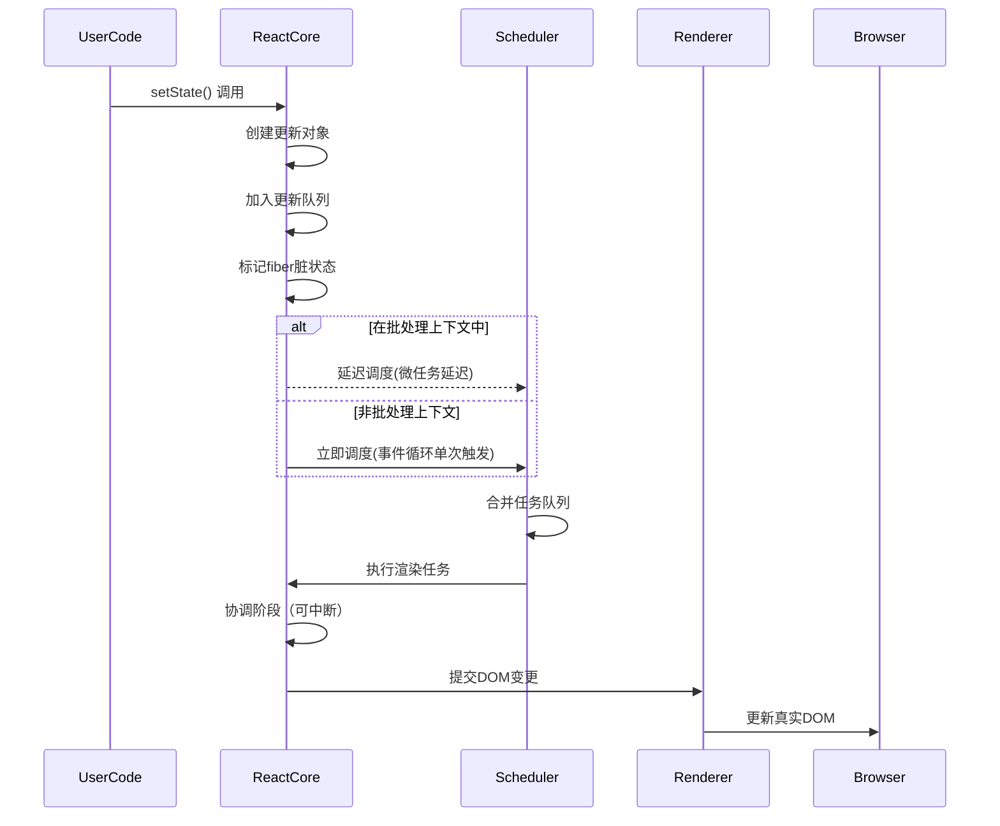
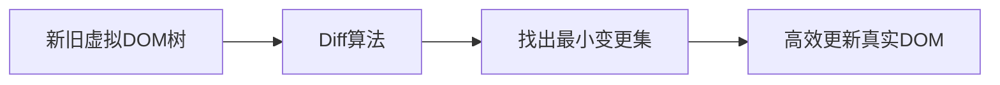
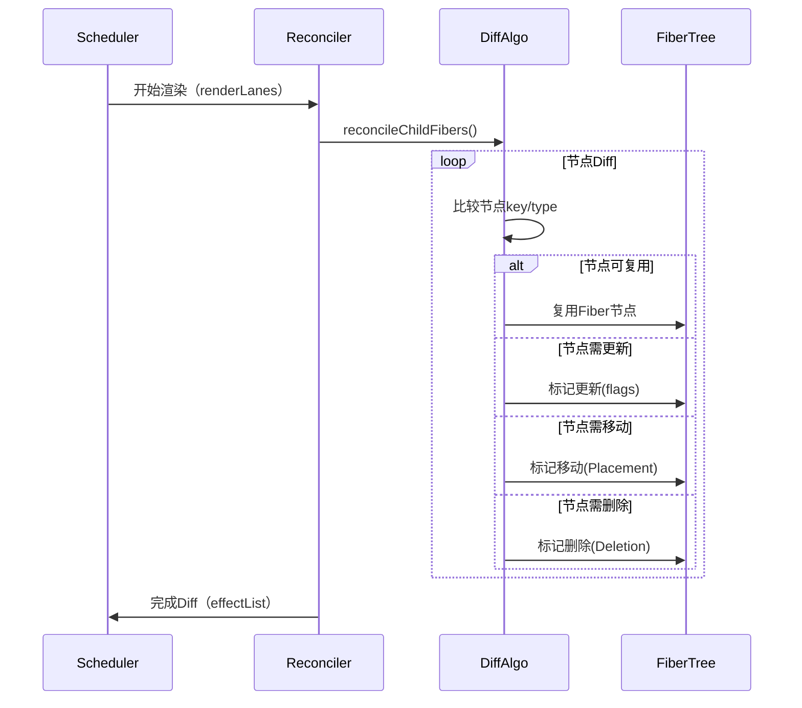

## 1.React 的核心设计理念是什么？列举其三大核心特性？

核心设计理念是声明式、组件化、和单向数据流展开，这使得 React 在构建复杂的用户界面时更加高效、可维护。其三大核心特性 - 虚拟 DOM、 生命周期管理、 hooks

- 虚拟 DOM 提供性能优化，减少不必要的 DOM 操作。
- 组件生命周期管理 让开发者可以在特定的时间点执行操作。
- hooks 使得函数式组件能够管理状态和副作用，简化开发流程。

## 2.解释虚拟 DOM 的工作原理以及其性能优化的机制？
答 1.
原理：将 jsx 编译为一个 render 函数，执行 render 函数会生成一个 React Element 的 js 对象（也称为虚拟 dom）
性能优化的机制：在状态发生更新的时候，会根据前后 vdom 进行对比，标记增删改的组件状态，解析完整棵树后在对应真实 DOM 的增删改更新。
答 2.
虚拟 DOM 的概念：虚拟 DOM 是一种在内存表示真实 DOM 的轻量级副本的技术。它是一个 javascript 对象，模拟了浏览器的 DOM 结构。
工作原理：初次渲染：当 React 应用首次加载，它会构建一个虚拟 DOM，是 React 元素的 javascript 对象表示。这个虚拟 DOM 树包含了所有的 UI 组件以及它们的状态；更新组件状态：当组件的 state 或者 props 发生变化，React 会重新渲染该组件。此时 React 会构建新的虚拟 DOM 树，并与上一次渲染的虚拟 DOM 树进行对比。批量更新：一旦确认某部分需要更新，React 会将这些更新批量提交给真实 DOM。
性能优化机制：
Diff 算法是 React 性能优化的核心。

- 基于组件层级的比较：它假定同一层级的元素大概率不变，因此 React 可以跳过对元素类型的深度比较，优先对节点的关键属性进行比较。
- 最小化比较范围：React 不会对整体虚拟 Dom 树进行完全对比，而是只比较最近发生改变的部分。
- 假设同类元素相同：React 假设同一类型的 DOM 元素在更新时不发生重大结构变化，因此它会重用之前的 Dom 节点。这种优化策略叫做“元素类型的重用”，它避免了不必要的 Dom 元素重建。
  最小化真实 DOM 的操作
- 批量更新：React 会将多次需要更新 DOM 的操作合并成一个批量更新的过程，减少了每次更新的开销。
- 选择性更新：只更新发生变化的部分 DOM 元素。
- 局部更新：利用虚拟 DOM 的 diff，只更新实际发生变化的部分，而不重新渲染整个页面或组件。
  reconcilation 的过程
  reconcilation 是指 React 如何比较两个虚拟 DOM 树并决定如何将它们更新到真实 DOM 中。Reconciliation 也包含性能优化机制：
- 组件 key 属性：用于帮助识别那些元素被更改、添加或者删除。
- 元素类型比较：React 假设如果两个相同层级的 DOM 元素类型发生变化，那么它们的结构很可能会不同，因此它会选择重新创建整个 DOM 元素。

通过一些策略优化性能：

- shouldComponentUpdate 返回 true 才重新渲染该组件
- React.memo。对于函数组件，如果 props 不变化，则跳过渲染过程，直接复用之前的结果。
- 懒加载和代码分割。react 通过 React.lazy 和 Suspense 实现组件懒加载。

## 附加：Suspense 是如何工作的？

```tsx
// 使用
function Comp() {
  return <>delay</>;
}
const Lazy = React.lazy(() => delay(5000).then((x) => ({ default: Comp })));
function App() {
  return (
    <>
      <Suspense fallback={'loading'}>
        <Lazy></Lazy>
      </Suspense>
    </>
  );
}
```
Suspense只是提供了用于加载数据的标准，`加载`->`过渡`->`完成切换`
步骤：
1.遍历到primiay组件，抛出异常
2.捕获，添加回调
3.展示fallback
4.加载完成，执行回调
5.展示加载完成后的组件

## 附加：React 性能优化的最佳实践
React.memo

```tsx
// React.memo的使用

// 1.纯展示组件
function Test1({data}:props){}
return default React.memo(Test1)
// 2.渲染开销很大的组件
function Chat = React.memo(({data})=>{
    const chartData = processData(data) // 昂贵的渲染计算
    return  <svg width="600" height="400">
      {/* 复杂SVG渲染 */}
    </svg>
})
// 3.频繁重新渲染的列表项
const ListItem = React.memo(({ item, onSelect }) => (
  <li onClick={() => onSelect(item.id)}>
    {item.name} - {item.price}
  </li>
));
// 4.使用自定义比较函数
const ComplexComponent = React.memo(({config})=>{},(prevProps,nextProps)=>{
    return _.isEqual(prevProps.config, nextProps.config);
})
// 5.组合 useMemo和useCallback
const Test5 = ({data,callback})=>{
    return <></>
}
function App(){
  const items = [{},{}]
// 使用useCallback稳定函数引用
  const handleClick = useCallback(() => {
    console.log('点击');
  }, []);
  // 使用useMemo稳定对象引用
  const userData = useMemo(() => ({
    name: 'John',
    age: 30
  }), []);

    return <>

    <Test1 data='静态数据'></Test1>
    <Chat></Chat>
    {
        items.map(v=>(<ListItem/>))
    }
    <ComplexComponent></ComplexComponent>
    <Test5 data={userData} callback={handleClick}></Test5>
    </>
}
```

## 3.jsx 的本质上什么？为什么浏览器无法直接解析 jsx？
本质是：
1.js 的语法扩展 2.是 React.createElement()的调用简写 3.一个声明式的 UI 描述语法
为什么无法直接解析 jsx？因为是 js 扩展语法，浏览器只理解纯 javascript

## 4.React 与 Angular/Vue 的核心区别（如数据绑定，DOM 操作、架构设计）
| 区别 | React | Angular | Vue |
| ---- | ---- | ---- | ---- |
| 数据绑定 | 单向数据流 | 默认双向数据绑定 | 双向绑定+单向支持 |
| DOM 操作 | 基于 vdom | 真实 Dom | 基于 vdom |
| 架构设计 | 仅关注 view，其他依赖社区生态 | 全家桶 | 提供渐进式框架 |
| 模版语法 | JSX | 模版语法+装饰器 | 模版语法+可选 JSX |

## 5.解释 React 的“单向数据流”特性以其实践意义
特性：数据流是单向，从父组件传递到子组件，子组件无法直接修改父组件的状态，而是通过回调函数向上传递意图。
意义：可预测性更强：状态的来源明确，组件行为跟容易追踪和测试。调试更方便：可用 React DevTools 等工具查看数据流向。更容易构建大型应用：状态提升、状态管理（Redux、Zustand ）

## 6.什么是合成事件？与原生事件有何区别？
合成是事件是React封装的一种事件，它模拟了浏览器的原生事件对象，但又提供了一些额外的优势。React使用合成事件系统来处理所有事件（点击、鼠标事件、键盘事件），目的是在不同浏览器中统一处理事件，优化性能并避免内存泄漏。
特点：
- 跨浏览器一致性：不同浏览器对事件的实现和处理方式各不相同，React封装了这些差异，使得在所有浏览器中事件的行为是一致的。通过合成事件，React避免了浏览器差异引起的问题。
举例各个浏览器事件的差异
| 功能点 | IE/edge | Chrome | Safari |
| ---- | ---- | ---- | ---- |
| 事件对象获取 | window.event | 回调参数e | 回调参数e |
| 阻止默认事件 | e.returnValue = false | e.preventDefault() | e.preventDefault() |
| 阻止冒泡 | e.cancelBubble = true | e.stopProppagation() | e.stopProppagation() |
| 鼠标滚轮事件 | onmousewheel | onwheel | onmousewheel |
| 键盘事件编码 | e.keyCode | e.key | e.keyCode |
- 事件池化：React在合成事件对象的实现中采用了事件池化的策略。这意味当事件处理完成后，React会将事件对象重新放入池中，而不是保留每个事件的实例，从而减少内存的开销。事件池化的实现意味着事件对象的属性值只能在事件回调函数中访问，而在回调执行后，属性会被清空。
1.内存优化
| 事件类型 | 无池化（对象数） | 有池化（对象数） | 内存节省 |
| ---- | ---- | ---- | ---- |
| 点击事件 | 1000 | 10 | 99% |
| 鼠标移动 | 10000| 20 | 99.8% |
| 滚动事件 | 5000 | 15 | 98.7% |
2.垃圾回收优化
创建大量短期对象会增加垃圾回收频率；垃圾回收会阻塞主线程，造成页面卡顿（称GC卡顿）
3.高频事件性能优化

- 统一的接口：合成事件封装了标准的原生事件接口，并提供一致的API来访问事件的属性，如`event.target` `event.preventDefault` `event.stopPropagation`
- 事件代理：原生事件会在每个dom添加事件监听器。合成事件，React会在`document`添加一个全局事件监听器，当任何子元素触发的时候，这个全局监听器会捕获到事件并将其分发给目标元素，这种方法减少了事件监听器的数量，避免了每个DOM元素都绑定事件监听器，从而优化性能。

## 7.React组件化的思想如何提升代码复用率？
- 模块化，页面拆分为各个独立的部分，组件作为独立的单元可以在不同地方复用，避免重复代码。
- 可配置化。传入不同props在不同场景下使用
- 组合化。通过组件嵌套和组合，构建复杂UI
- 逻辑复用。自定义hooks和hoc和render props，可以复用逻辑而不影响组件功能。
- 提升状态。通过将共享状态提升到共同的组件，避免了状态重复管理和同步问题。
这些设计理念和模式让React的组件化不仅仅是代码的复用，更是通过结构化的方式使得UI和和逻辑的管理变得更加高效和可维护。

## 8.解释React的“组件即函数”理念（函数组件和类组件的本质区别）
理念：
1.React组件本质上是一个接受输入（props）并返回输出（UI描述）的函数。
2.组件的核心职责是：props -> UI
3.组件应该是纯净的：相同输入总是产生相同输出
4.组件应该是可组合的：像函数一样可以嵌套组合
本质区别：
1.语法和结构
- 函数组件：一个普通的javascript函数，接受props作为参数并返回jsx。没有生命周期方法、this
- 类组件：基于ES6类定义，继承自React.Component,需要手动实现render方法，并使用this.state和this.setState管理状态。
2.生命周期管理：
- 类组件：类组件有内建的生命周期方法，可以在这些方法中执行异步操作、更新状态等。例如 `componentDidMount` `componentWillUnmount`
- 函数组件：函数组件没有生命周期方法，但通过React Hooks（如useEffect）引入函数组件的副作用处理，使函数组件具备类似类组件的生命周期管理功能。useEffect允许我们在组件挂载、更新和卸载时执行副作用。
3.状态管理
- 类组件：使用this.state来管理状态，使用this.setState来更新状态。setState是异步的，并且会触发组件的重新渲染。
- 函数组件：函数组件原本是无状态的，但随着React Hooks的引入，useState使得函数组件也可以使用状态管理。
总结：React的“组件即函数”理念，意味着React组件可以简单地用函数实现，而无需依赖复杂的类继承结构。函数组件通过其简洁的结构、易于理解的API和性能优势吗，成为现代React开发的首选方式。

## 9.React的严格模式（Strict Mode）解决了哪些潜在问题？
1. 过时的生命周期方法：16.3后`ComponentWillMount` `ComponentWillReceiveProps` `ComponentWillUpdate`不在推荐使用
2. 意外的副作用：严格模式会开启双重渲染，这意味着组件的渲染和副作用函数会被执行2次，React会主动触发两次渲染来确保副作用函数是纯粹的，不会影响后续的渲染过程。
3. 不安全的findDOMNode。这个方法已经过时，推荐使用Ref来访问元素。
4. 不推荐字符串refs
5. 不稳定的副作用（setState） 在componenWillUnmount不能使用setState
6. 异步渲染的相关问题：react16之后引入异步渲染（concurent rendering）严格模式可以帮助开发者提前发现一些与异步渲染相关的bug
7. 不稳定的上下文
总结：
React的严格模式是一个工具，它帮助开发者检测并解决潜在的错误和性能问题。严格模式通过对组件的双重渲染、生命周期方法的检查、不推荐的API使用警告等方式，确保开发者编写的代码符合React的最佳实践。

## 10.React的最新版本特性（React18）
并发模式
- 渲染过程可中断，React可在合适时机调度任务，不阻塞主线程
- 比如：输入框不会因大型渲染任务而卡顿
自动批处理
```tsx
setCount(a+1)
setName('aa')
```
useTransition
标记非紧急更新
新Root Api和SSR改进
支持createRoot替代旧版ReactDOM.render
SSR支持延迟加载片段、流式传输（Streaming）

## 11.调用setState后发生了什么？解释其异步批处理机制 
基本流程：
1. 入队-> 将更新加入队列
2. 批处理-> 合并多个更新请求
3. 合并-> 计算最终状态值
4. 协调-> Fiber树Diff计算
5. 提交-> 原子化DOM更新
`React的批处理不是一种优化，而是保证UI一致性的必要机制。它确保无论你调用多少次setState，最终用户只会看到一次完整的UI更新`

源码导读：

1.更新入队阶段
```js
// setState 入口
enqueueSetState(inst, payload, callback) {
  const fiber = getInstance(inst);
  const eventTime = requestEventTime();
  const lane = requestUpdateLane(fiber); // 获取更新优先级
  
  // 创建更新对象
  const update = createUpdate(eventTime, lane);
  update.payload = payload;
  
  // 加入更新队列
  enqueueUpdate(fiber, update);
  
  // 调度更新
  scheduleUpdateOnFiber(fiber, lane, eventTime);
}
```
核心操作:

- 创建 update 对象（包含 payload 和回调）

- 将 update 加入 fiber 节点的更新队列

- 标记 fiber 为需要更新 (fiber.lanes |= lane)

2.批处理决策阶段
```js
function scheduleUpdateOnFiber(fiber, lane, eventTime) {
  // 检查是否在批处理上下文中
  if (isInsideEventHandler) {
    // 🅰️ 批处理模式：标记为待处理
    markRootUpdated(root, lane, eventTime);
  } else {
    // 🅱️ 非批处理：立即调度
    ensureRootIsScheduled(root, eventTime);
  }
}
```

3.状态合并阶段
```js
function processUpdateQueue(workInProgress, props, instance, renderLanes) {
  const queue = workInProgress.updateQueue;
  let baseState = queue.baseState;
  
  // 遍历更新队列
  let update = queue.first;
  while (update !== null) {
    // 合并状态更新
    if (typeof update.payload === 'function') {
      // 函数式更新
      baseState = update.payload(baseState);
    } else {
      // 对象合并
      baseState = Object.assign({}, baseState, update.payload);
    }
    update = update.next;
  }
  
  // 保存最终状态
  workInProgress.memoizedState = baseState;
}
```

4.协调渲染阶段
```js
function performConcurrentWorkOnRoot(root) {
  // 构建 workInProgress 树
  renderRootSync(root, lanes);
  
  // 执行协调算法
  workLoopSync();
  
  // 提交准备
  prepareFreshStack(root, lanes);
}
```

Fiber 协调流程:

调用 beginWork 处理组件更新

执行 completeWork 创建 DOM 节点

生成 effectList（变更链表）

5.提交更新阶段
```js
// 阶段1: Before mutation
  commitBeforeMutationEffects();
  
  // 阶段2: Mutation
  commitMutationEffects(root, renderPriorityLevel);
  
  // 阶段3: Layout
  commitLayoutEffects(root, lanes);
```

提交三阶段:

Before mutation:

调用 getSnapshotBeforeUpdate

暂停 useLayoutEffect 清理函数

Mutation:

执行 DOM 操作（增删改）

调用 useEffect 清理函数

Layout:

调用 componentDidMount/Update

执行 useLayoutEffect 回调

更新 refs




异步批处理机制：
- 目的：减少不必要的DOM更新
- 多个setState合并，只渲染一次组件
- 特别在事件回调、生命周期表现明显
- 注意：`setState((prev)=>prev+1)`会正确叠加

## 12.虚拟DOM的diff与原理（如层级比较、key值作用）

diff的基本原理
1. 同一层级比较
   - React认为Dom树中每层的节点都是独立的，层级比较即在统一层级上进行节点的逐个比较。如果节点类型相同，则更新改节点；如果类型不同，则删除旧节点，插入新节点。
2. 递归比较子树
   - 如果两树类型相同，React会继续递归比较它们的子节点，更新或者删除子节点。否则，会跳过该树比较，直接销毁并替换掉旧的子树。
3. 逐个比较节点的属性
   - 在更新节点时，会通过比较新旧节点的属性（classname、style、children等），更新节点的属性。如果属性发生变化，React会更新变化的部分，而不是重新渲染整个节点。
4. 对比元素类型
   - 如果节点类型（比如`<div> <span>`不同，React会销毁旧节点，并创建一个新节点。通过这种方式，React保证不会错误地复用不相干的组件。

层级比较和key的作用
- 同级比较可以大大减少不必要的渲染
- key跟踪每个元素的身份，避免错误地复用元素。提高比较效率。避免不必要的组件的渲染。提高性能。

react对diff算法的优化
1. 元素的排序：避免对所有节点的对比，只对相同类型的节点进行深度比较，跳过不相关的部分。
2. 同层比较。假设不同层级节点通常不发生变化。因此它只会在同一层级内比较节点。不同层级节点直接销毁重建。
3. 组件的复用，通过Key保证列表元素的复用，减少列表渲染时的性能开销。
4. 最小化更新：通过精确的差异计算，React能够在最小化更新的同时保证页面的一致性和性能。只会发生变化的部分进行更新，从而避免大量的重复操作。



源码导读
路径:`packages/react-reconciler/src/ReactFiberBeginWork.old.js`

|参数|关键作用|影响diff行为|
| ---|---|---|
| current | 提供旧Fiber树结构| 决定复用可能性|
| workInProgress | 承载新Fiber构建| Diff结果容器|
| nextChildren | 提供新虚拟Dom结构| Diff的目标|
| renderLanes | 确定渲染优先级| 控制diff深度和范围|
```js
function reconcileChildren(
  current: Fiber | null, 
  workInProgress: Fiber, 
  nextChildren: any, 
  renderLanes: Lanes
) {
  if (current === null) {
    // 挂载阶段
    workInProgress.child = mountChildFibers(
      workInProgress, 
      null, 
      nextChildren, 
      renderLanes
    );
  } else {
    // 更新阶段（Diff核心）
    workInProgress.child = reconcileChildFibers(
      workInProgress,
      current.child,
      nextChildren,
      renderLanes
    );
  }
}
```

### 🔥三大策略

1️⃣ 同级比较策略

```js
function reconcileChildFibers(
  returnFiber: Fiber,
  currentFirstChild: Fiber | null,
  newChild: any,
  lanes: Lanes
): Fiber | null {
  // 策略1：单节点Diff
  if (typeof newChild === 'object' && newChild !== null) {
    switch (newChild.$$typeof) {
      case REACT_ELEMENT_TYPE:
        return placeSingleChild(
          reconcileSingleElement(
            returnFiber,
            currentFirstChild,
            newChild,
            lanes
          )
        );
    }
  }
  
  // 策略2：多节点Diff
  if (isArray(newChild)) {
    return reconcileChildrenArray(
      returnFiber,
      currentFirstChild,
      newChild,
      lanes
    );
  }
  
  // ...其他类型处理
}
```

2️⃣ 组件类型判断
```js
function reconcileSingleElement(
  returnFiber: Fiber,
  currentFirstChild: Fiber | null,
  element: ReactElement,
  lanes: Lanes
): Fiber {
  const key = element.key;
  let child = currentFirstChild;
  
  // 遍历旧子节点
  while (child !== null) {
    if (child.key === key) {
      // KEY相同
      if (child.elementType === element.type) {
        // 类型相同 → 复用节点
        deleteRemainingChildren(returnFiber, child.sibling);
        const existing = useFiber(child, element.props);
        existing.ref = coerceRef(returnFiber, child, element);
        existing.return = returnFiber;
        return existing;
      } else {
        // 类型不同 → 删除旧节点
        deleteRemainingChildren(returnFiber, child);
        break;
      }
    } else {
      // KEY不同 → 删除旧节点
      deleteChild(returnFiber, child);
    }
    child = child.sibling;
  }
  
  // 创建新节点
  const created = createFiberFromElement(element, returnFiber.mode, lanes);
  created.ref = coerceRef(returnFiber, currentFirstChild, element);
  created.return = returnFiber;
  return created;
}
```

3️⃣ Key 优化策略
```js 
function reconcileChildrenArray(
  returnFiber: Fiber,
  currentFirstChild: Fiber | null,
  newChildren: Array<*>,
  lanes: Lanes
): Fiber | null {
  // 生成旧节点Map {key: Fiber}
  const existingChildren = mapRemainingChildren(returnFiber, currentFirstChild);
  
  for (; newIdx < newChildren.length; newIdx++) {
    const newFiber = updateFromMap(
      existingChildren,
      returnFiber,
      newIdx,
      newChildren[newIdx],
      lanes
    );
    
    if (newFiber !== null) {
      if (shouldTrackSideEffects) {
        if (newFiber.alternate !== null) {
          // 节点复用 → 从Map中删除
          existingChildren.delete(
            newFiber.key === null ? newIdx : newFiber.key
          );
        }
      }
      
      // 检查节点移动
      lastPlacedIndex = placeChild(newFiber, lastPlacedIndex, newIdx);
    }
  }
  
  // 删除未使用的旧节点
  existingChildren.forEach(child => deleteChild(returnFiber, child));
}
```

Diff核心算法：`placeChild`
```js
function placeChild(
  newFiber: Fiber,
  lastPlacedIndex: number,
  newIndex: number
): number {
  newFiber.index = newIndex;
  
  const current = newFiber.alternate;
  if (current !== null) {
    const oldIndex = current.index;
    if (oldIndex < lastPlacedIndex) {
      // 移动节点 → 添加 Placement flag
      newFiber.flags |= Placement;
      return lastPlacedIndex;
    } else {
      // 位置不变
      return oldIndex;
    }
  } else {
    // 新增节点 → 添加 Placement flag
    newFiber.flags |= Placement;
    return lastPlacedIndex;
  }
}
```

🔄 Diff 全流程


💡 Diff 结果提交
```js
function commitMutationEffects(
  root: FiberRoot,
  firstChild: Fiber,
  committedLanes: Lanes
) {
  let fiber = firstChild;
  while (fiber !== null) {
    // 处理插入/移动
    if (fiber.flags & Placement) {
      commitPlacement(fiber);
    }
    // 处理删除
    if (fiber.flags & Deletion) {
      commitDeletion(root, fiber);
    }
    // 处理更新
    if (fiber.flags & Update) {
      commitWork(fiber);
    }
    fiber = fiber.sibling;
  }
}
```

### 总结React18的diff原理
1.双指针遍历
- 新旧同时遍历
- 通过oldIndex和newIndex判断移动

```js
// 场景1:举例 列表头部插入
// 旧 B、C
// 新 A、B、C
1. B（旧） VS A（新） 中断
2.map 保存旧， 遍历新节点，复用 B、C
3.创建A -> 标记Placement(插入头部)
```

```js
//场景2
// 旧: [A, B, C, D]
// 新: [A, C, D]

1. A 复用
2.B(旧) vs C(新) key不同，中断
3.收集旧，遍历新，复用C、D
4.删除B
```

关键设计思想

1.移动优化删除重建;位置索引追踪；批处理移动操作`commitPlacement`

2.三层优化策略
- 同级比较
- 类型比较
- key优化
3.Fiber链表结构
- 通过children、sibling、return关联
- 增量diff（可中断回复） ？？
4.Lane优先级 （也会影响diff的范围和深度） ？？
- 高优更新优先Diff ？？
- 低优更新可被大断 ？？
5.Effect标记
- 最小化Dom操作
- 批量执行变更


## 13.声明周期的划分

附加：React 的 class 类有什么生命周期？

构建（constructor)： 派(getDerivedStateFromProps) -> 绘(render) -> 挂(componentDidMount)
| 方法 | 调用时机 | 用途 | 是否可调用 setState |
| ---- | ---- | ---- | ---- |
| constructor | 组件初始化 | 初始化 state，绑定方法 | ❌ |
| getDerivedStateFromProps | 每次渲染前 | 根据 props 更新 state | ❌ |
| render | 必须实现的方法 | 返回 jsx | ❌ |
| componententDidMount | 组件挂载后 | DOM 操作、网络请求、订阅 | ✅ |

变更 ： 派(getDerivedStateFromProps) -> 判(shouldComponentUpdate) -> 绘(render) -> 捕(getSnapShotBeforeUpdate) -> 更(componentDidUpdate)
| 方法 | 调用时机 | 用途 | 是否可调用 setState |
| ---- | ---- | ---- | ---- |
| getDerivedStateFromProps | 每次渲染前 | 根据 props 更新 state | ❌ |
| shouldComponentUpdate | 更新前 | 性能优化，控制是否渲染 | ❌ |
| render | 必须实现的方法 | 返回 jsx | ❌ |
| getSnapShotBeforeUpdate | Dom 更新前 | 获取 DOM 的快照信息 | ❌ |
| componentDidUpdate | 更新完成后 | DOM 操作，网络请求 | ✅ |

卸载： 清(componentWillUnmount)
| 方法 | 调用时机 | 用途 | 是否可调用 setState |
| ---- | ---- | ---- | ---- |
| componentWillUnmount | 组件卸载前 | 清理操作（计时器，订阅） | ❌ |

错误处理： 派(getDerivedStateFromError) -> 记(componentDidCatch)

| 方法                     | 调用时机           | 用途         | 是否可调用 setState |
| ------------------------ | ------------------ | ------------ | ------------------- |
| getDerivedStateFromError | 后代组件抛出错误后 | 渲染备用 UI  |                     |
| componententDidCatch     | 后代组件抛出错误后 | 记录错误形象 |                     |

附加：class 的生命周期怎么使用 hook 的对比

| 方法                     | hook                     | xx  | xx  |
| ------------------------ | ------------------------ | --- | --- |
| constructor              | useState 初始化          | xx  | xx  |
| getDerivedStateFromProps | useState+useEffect       | xx  | xx  |
| render                   | 函数组件本身             | xx  | xx  |
| componententDidMount     | useEffect                | xx  | xx  |
| shouldComponentUpdate    | useMemo                  | xx  | xx  |
| componententDidUpdate    | useEffect                | xx  | xx  |
| componententDidUnmount   | useEffect 返回的清理函数 | xx  | xx  |


## 14.为什么AJAX请求放在`componentDidMount`?
- dom已经加载完成：该方法在组件第一次渲染完成之后调用，避免访问未渲染DOM的问题
- 避免重复请求：相比放在render，componentDidMount只执行一次，避免请求重复发器。
- 符合副作用处理规范：React推荐将副作用（如网络请求）写在钩子中，与函数组件中的`useEffect`用法一致。

## 15.shouldComponentUpdate的作用以及如何通过它优化性能？
`shouldComponentUpdate(nextProps,nextState)`方法是用来拦截更新用的。返回boolean。
优化方式：
- 避免不必要渲染
- 结合不可变数据(immutable)和(PureComponent)进行优化。

## 16.React的key值在列表渲染中的作用以及最佳实践
在动态渲染列表，key帮助React高效识别哪些列表项改变、添加或者删除，从而避免不必要的渲染，并优化性能。

key的作用：
- 唯一标识列表项
- 提升性能和避免不必要的渲染
- 确保组件正确复用

key的工作原理：

react在列表渲染时的处理流程如下：
- 对比两颗虚拟dom树：当组件状态或者props发生变化时，React会创建新的虚拟DOM树，并将其与之前的虚拟DOM树进行对比，查找差异。
- 匹配元素。只有key相同才能被认为相同的。
- 更新变化的元素。根据key的比较结果，只更新那些需要变化的DOM元素，而不是重新渲染列表。

最佳实践：

- 确保元素唯一key。
- 数组避免使用索引做key。
- 使用稳定的key。
- 确保key在同一层级内唯一。当多层嵌套列表时，可以为每一层使用不同的key规则