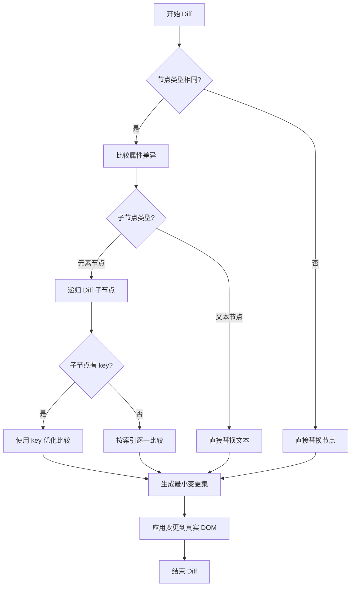

# React DOM Diff 算法详解 🚀

React 的 DOM Diff 算法是 React 框架的核心之一，它决定了 React 如何高效地更新 UI。让我们一起来深入了解这个神奇的算法吧！✨

## 什么是 DOM Diff？🤔

DOM Diff 是 React 用来比较两棵虚拟 DOM 树差异的算法。当组件的状态或属性发生变化时，React 会创建一棵新的虚拟 DOM 树，并与旧的虚拟 DOM 树进行比较，找出最小的变更集合，然后只更新这些变化的部分到真实 DOM 中。

## Diff 算法流程图 📊



## 核心 Diff 策略 💡

React 的 Diff 算法基于三个重要的策略：

### 1. Tree Diff 🌳

React 对树的比较采用了同层比较的策略，时间复杂度为 O(n)：

- Web UI 中 DOM 节点跨层级的移动操作特别少
- 所以 React 对树的 Diff 只会对同一父节点下的所有子节点进行比较
- 如果发现节点已经不存在，则该节点及其所有子节点会被完全删除

### 2. Component Diff 🧩

React 是面向组件的，所以对组件的比较也做了优化：

- 同一类型的组件，直接比较 Virtual DOM tree
- 不同类型的组件，直接替换组件下的所有子节点
- 可以通过 `shouldComponentUpdate()` 来判断是否需要更新

### 3. Element Diff 🔍

这是 Diff 算法中最核心的部分，当节点处于同一层级时，React 采用以下方式更新：

1. **按索引比较**：如果没有 key，React 会按索引顺序比较子元素
2. **使用 key 优化**：如果有 key，React 会根据 key 来判断元素是否真的存在

## 源码解析 🔍

让我们来看一下 React 中 Diff 算法的关键源码实现：

### reconcileChildFibers 函数

```javascript
function reconcileChildFibers(
  returnFiber: Fiber,
  currentFirstChild: Fiber | null,
  newChild: any,
  lanes: Lanes,
): Fiber | null {
  // 这是 Diff 算法的入口函数
  // 处理不同类型的子节点
  const isObject = typeof newChild === 'object' && newChild !== null;

  if (isObject) {
    switch (newChild.$$typeof) {
      case REACT_ELEMENT_TYPE:
        // 处理 React 元素
        return placeSingleChild(
          reconcileSingleElement(
            returnFiber,
            currentFirstChild,
            newChild,
            lanes,
          ),
        );
      // ... 其他类型的处理
    }
  }

  // 处理文本节点
  if (typeof newChild === 'string' || typeof newChild === 'number') {
    return placeSingleChild(
      reconcileSingleTextNode(
        returnFiber,
        currentFirstChild,
        '' + newChild,
        lanes,
      ),
    );
  }

  // ... 其他处理逻辑
}
```

### updateElement 函数

```javascript
function updateElement(
  returnFiber: Fiber,
  current: Fiber | null,
  element: ReactElement,
  lanes: Lanes,
): Fiber {
  // 如果是相同类型的元素，更新属性
  if (current !== null) {
    if (current.elementType === element.type) {
      // 保留 key 和 ref
      const existing = useFiber(current, element.props);
      existing.ref = coerceRef(returnFiber, current, element);
      existing.return = returnFiber;
      return existing;
    }
  }

  // 如果类型不同，创建新的 fiber
  const created = createFiberFromElement(element, returnFiber.mode, lanes);
  created.ref = coerceRef(returnFiber, current, element);
  created.return = returnFiber;
  return created;
}
```

## 数组节点的 Diff 过程 🔄

当处理数组节点时，React 的 Diff 算法变得更加复杂和重要。数组节点的 Diff 是 React 性能优化的关键部分之一。

### 数组 Diff 的核心思想

React 对数组节点的处理采用了以下策略：

1. **原地复用**：尽可能复用已存在的 DOM 元素
2. **最小化移动**：减少 DOM 节点的移动操作
3. **Key 优化**：利用 key 来追踪元素的唯一性

### 新旧数组节点的遍历比较过程

让我们深入看一下 React 是如何比较新旧数组节点的：

#### 1. 前置匹配优化 ⏩

React 会首先从数组的开头进行比较，找出前面连续相同的节点：

```javascript
// 旧数组: [A, B, C, D]
// 新数组: [A, B, E, F]
// 结果: A, B 被复用，C, D 被删除，E, F 被创建
```

#### 2. 后置匹配优化 ⏪

接着从数组的末尾进行比较，找出后面连续相同的节点：

```javascript
// 旧数组: [A, B, C, D]
// 新数组: [E, F, C, D]
// 结果: C, D 被复用，A, B 被删除，E, F 被创建
```

#### 3. Key-based Diff 算法 🔑

对于中间无法通过前置后置匹配处理的部分，React 使用 key 来进行更复杂的比较：

```javascript
// 旧数组: [A, B, C, D] (key: a, b, c, d)
// 新数组: [A, D, B, C] (key: a, d, b, c)
// 结果: 所有节点都被复用，但 D, B, C 需要移动位置
```

### 源码解析：数组 Diff 的实现

```javascript
function reconcileChildrenArray(
  returnFiber: Fiber,
  currentFirstChild: Fiber | null,
  newChildren: Array<*>,
  lanes: Lanes,
): Fiber | null {
  // 这是处理数组节点 Diff 的核心函数

  let resultingFirstChild: Fiber | null = null;
  let previousNewFiber: Fiber | null = null;

  let oldFiber = currentFirstChild;
  let lastPlacedIndex = 0;
  let newIdx = 0;
  let nextOldFiber = null;

  // 1. 前置遍历 - 处理前面相同的节点
  for (; oldFiber !== null && newIdx < newChildren.length; newIdx++) {
    if (oldFiber.index > newIdx) {
      nextOldFiber = oldFiber;
      oldFiber = null;
    } else {
      nextOldFiber = oldFiber.sibling;
    }

    // 比较当前节点
    const newFiber = updateSlot(
      returnFiber,
      oldFiber,
      newChildren[newIdx],
      lanes,
    );

    // 如果节点不匹配，跳出前置遍历
    if (newFiber === null) {
      break;
    }

    // 更新 lastPlacedIndex 来追踪需要移动的节点
    lastPlacedIndex = placeChild(newFiber, lastPlacedIndex, newIdx);

    // 构建新的 fiber 链表
    if (previousNewFiber === null) {
      resultingFirstChild = newFiber;
    } else {
      previousNewFiber.sibling = newFiber;
    }
    previousNewFiber = newFiber;
    oldFiber = nextOldFiber;
  }

  // 2. 如果新数组已经遍历完，删除剩余的旧节点
  if (newIdx === newChildren.length) {
    deleteRemainingChildren(returnFiber, oldFiber);
    return resultingFirstChild;
  }

  // 3. 如果旧数组已经遍历完，创建剩余的新节点
  if (oldFiber === null) {
    for (; newIdx < newChildren.length; newIdx++) {
      const newFiber = createChild(returnFiber, newChildren[newIdx], lanes);
      if (newFiber === null) {
        continue;
      }
      lastPlacedIndex = placeChild(newFiber, lastPlacedIndex, newIdx);
      if (previousNewFiber === null) {
        resultingFirstChild = newFiber;
      } else {
        previousNewFiber.sibling = newFiber;
      }
      previousNewFiber = newFiber;
    }
    return resultingFirstChild;
  }

  // 4. 处理中间部分 - 使用 key 进行映射比较
  const existingChildren = mapRemainingChildren(returnFiber, oldFiber);

  for (; newIdx < newChildren.length; newIdx++) {
    const newFiber = updateFromMap(
      existingChildren,
      returnFiber,
      newIdx,
      newChildren[newIdx],
      lanes,
    );

    if (newFiber !== null) {
      if (newFiber.alternate !== null) {
        // 从 existingChildren 中移除已复用的节点
        existingChildren.delete(
          newFiber.key === null ? newIdx : newFiber.key,
        );
      }
      lastPlacedIndex = placeChild(newFiber, lastPlacedIndex, newIdx);
      if (previousNewFiber === null) {
        resultingFirstChild = newFiber;
      } else {
        previousNewFiber.sibling = newFiber;
      }
      previousNewFiber = newFiber;
    }
  }

  // 5. 删除剩余未被复用的旧节点
  existingChildren.forEach(child => deleteChild(returnFiber, child));

  return resultingFirstChild;
}
```

### Key 的重要性 🔑

在列表渲染中，key 的作用非常重要：

```jsx
// 不好的做法 ❌
{todos.map((todo, index) => (
  <TodoItem {...todo} key={index} />
))}

// 好的做法 ✅
{todos.map((todo) => (
  <TodoItem {...todo} key={todo.id} />
))}
```

使用唯一且稳定的 key 可以帮助 React：

- 准确识别哪些元素发生了变化
- 减少不必要的元素重建
- 提高列表更新的性能

## Diff 算法的优化技巧 ⚡

1. **分层比较**：只比较同一层级的节点
2. **类型比较**：不同类型的组件直接替换
3. **Key 优化**：使用 key 来追踪元素的唯一性
4. **短路优化**：如果 props 没有变化，跳过更新

## 总结 📝

React 的 DOM Diff 算法通过巧妙的策略将传统 O(n³) 的复杂度优化到了 O(n)，极大地提升了性能：

- **同层比较**：Tree Diff 策略
- **组件比较**：Component Diff 策略
- **元素比较**：Element Diff 策略

这些优化使得 React 能够高效地处理 UI 更新，为用户带来流畅的体验！🎯

> 💡 **小贴士**：合理使用 key 属性，避免使用 index 作为 key，可以让 Diff 算法更好地工作哦！