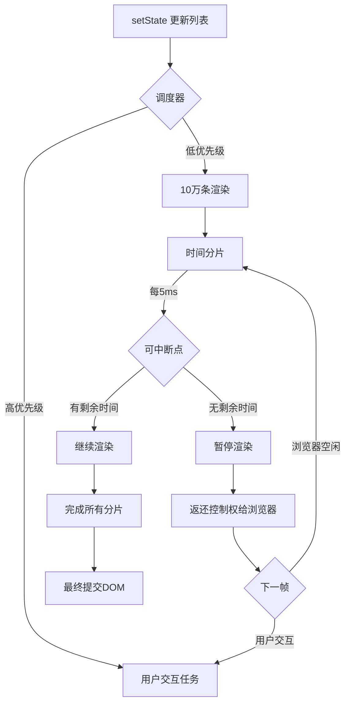
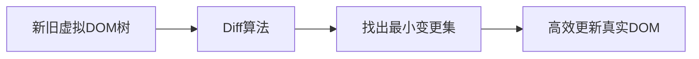
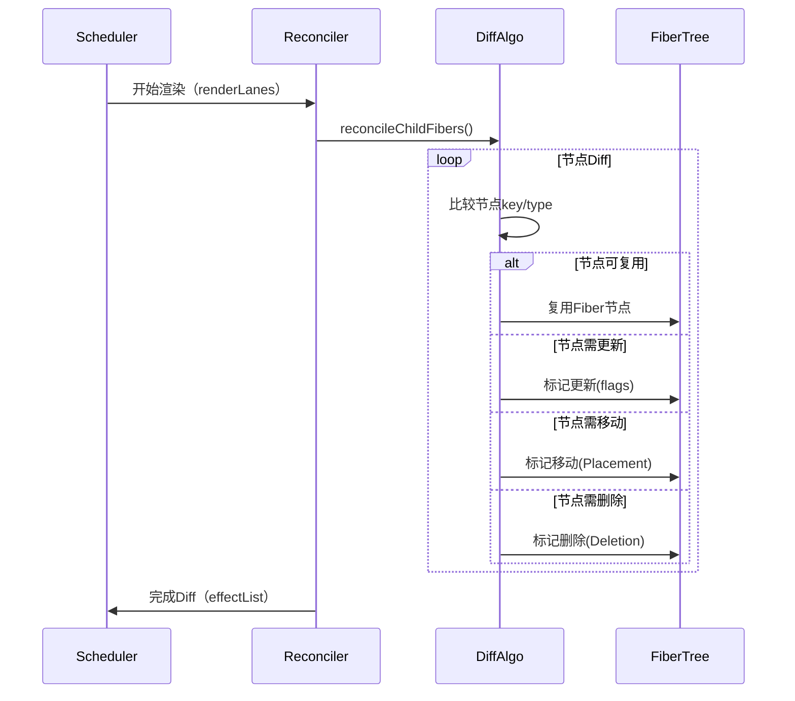

## React Fiber 架构的目标是什么？

目标： 提升性能和响应性。

体现：

- 增量渲染 fiber。允许渲染工作分成多个小任务，然后把渲染任务分散到多个帧中去执行，避免长时间渲染任务阻塞主线程。
- 优先级调度。引入优先级，使得 react 可以通过任务优先级优先处理高优任务（用户输入/动画）。
- 可中断恢复渲染。fiber 使得在渲染过程中，fiber 执行任务可中断和恢复。意味着 react 可以在处理复杂更新的时候，可以中断当前任务。处理更加紧急的任务。

源码相关概念；

- fiber 节点：每个组件对一个 fiber 节点（状态属性、子节点信息）
- 双缓冲机制：维护两颗树`当前树`和`正在执行的树`,更新的时候 react 会在 正在执行的树上操作，等待更新完成之后，在把它替换为当前的树，这样就实现平滑过度了。
- 调度器：主要复杂管理任务的优先级，确保高优先级的任务能够及时执行，避免低优先级阻塞关键流程。
- 副作用链：在渲染过程中会收集副作用节点，形成链表。渲染完成之后，统一执行，确保了副作用的顺序和一致性。

## Fiber 双缓冲机制是什么？

其核心思想是维护两棵 Fiber 树（current 树和 workInProgress 树），通过 “后台构建、前台替换” 的方式，避免渲染过程中暴露中间状态，同时减少 DOM 操作的开销。

- `current`树：对应当前屏幕已渲染的 DOM 结构，是已提交的状态稳定状态。树上的每一个 Fiber 节点都标记了当前 DOM 的属性和关系。
- `workInProgress`树：正在内存中构建的新树，用与计算最新的渲染状态（处理 props、state 更新等）。构建过程不会直接操作 DOM，而是现在内存中完成计算和差异标记。
- `alternate`:两颗树的 Fiber 节点通过`alternate`属性相互关联(currentFiber.alternate = workInprogressFiber,反之亦然)，用于复用节点信息，减少内存开销
  价值：

1. 避免中间状态暴露。workInProgress 树在内存中构建，只有当完全就绪后才替换 current 树并更新 DOM，用户看到的始终是完整、一致的界面，不会出现 “半更新” 的错乱状态。
2. 减少 DOM 操作开销。通过复用未变化的节点（利用 alternate 指针）和精准标记差异（effectTag），只更新必要的 DOM 元素，避免全量重绘。
3. 支持可中断渲染。workInProgress 树的构建过程可以被高优先级任务（如用户输入）中断，恢复时可基于已构建的部分继续，而 current 树始终保持稳定，保证界面不卡顿。

## 25.React18 的并发模式如何优化用户体验？

并发模式的本质上通过 **异步渲染**的方式来提升 React 应用的响应性。传统 React 渲染上同步的，这会导致用户在页面渲染的过程中的卡顿和延迟。

并发模式引入了**优先级调度**和**时间分片**，使得 React 可以 **暂停** 某些低优先级渲染任务，并且在高优先级任务（如用户输入或者交互）到达，能快速响应，甚至在后台继续渲染未完成的任务。这使得 React 可以更灵活管理不同任务之间的执行顺序，从而提升用户体验。

并发模式的几个关键特性：

1. **渐进式渲染(Incremental Rendering)**
   并发模式允许 React 将渲染过程切分为多个小任务，这些任务可以根据任务优先级逐步执行。

2. **优先级调度 (proiority scheduler)**
   不同的渲染任务可以根据紧急程度不同分配不同的优先级。例如，当用户输入内容，React 会优先响应用户输入，而将其他低优先级的任务（如图像加载、动画等）推迟处理。这确保用户的交互体验上是即时响应的，即时应用在后台做一些繁重的计算或者渲染。

3. **时间分片**
   并发模式下，React 会分割**渲染任务**为多个时间片，每一个时间片执行一小部分任务，然后返回浏览器线程，让浏览器做其他事情，如用户输入的响应或者界面的绘画。这种时间分片的方式使得 React 可以在保存响应性的同时，完成长时间的计算任务或者复杂的页面渲染。例如，当进行复杂动画渲染时，React 会确保不会阻塞用户的操作，让页面渲染和用户输入能够并行进行，避免页面卡顿或者长时间无响应的情况。

4. **空闲时间优化**
   当浏览器线程空闲，React 可以在空闲时段完成一些额外的渲染工作。这意味即使用户没有交互，React 也利用空闲时间预渲染下一个屏幕或计算一些复杂任务。

5. **可中断渲染**
   在并发模式中，React 允许渲染任务在执行过程中被中断并重新调度。某些渲染任务（如用户输入）可以在高优先级的情况下打断当前进行的渲染任务。这种中断渲染方式使得 React 可以优先响应用户的操作，提供更好的用户体验。

并发模式的**实际应用**：

1. suspense 允许开发者指定一个组件的加载过程，并等待时显示一个加载指示器，React 可以 react 在后台异步加载资源并在准备好时即时渲染。
2. React Server Components。 某些组件的渲染可以在服务器进行，而不是完全在浏览器渲染，使得应用首次加载更快速，通过并发模式配合，server Components 可以和客户端更好配合，优化资源的加载顺序和渲染效率，进一步提升用户的体验。

**例子** 🧩 10 万条渲染全流程



渐进式渲染：

```js
//completeWork (react-reconciler/src/ReactFiberCompleteWork.old.js)
function compeleteWork(current, wrokInProgress, reanderLanes) {
  if (commitCommit > 1000) {
    requestParticalRendering();
  }
}
```

用户感知：

1. 首屏快速显示 1000 项
2. 滚动时继续渲染可见区域
3. 不可见区域延迟渲染

优先级驱动的调度机制

1. 按紧急程度排序，高优先执行
2. 低优（如大量数据渲染）可被中断，待高优先级完成后恢复执行。
3. 这一机制确保用户交互的即时响应，同时避免长任务阻塞主线程。

```js
// scheduler/src/SchedulerPriorities.js
// 在源码中，优先级通过 scheduler 包定义的 优先级常量 区分（数值越小，优先级越高），关键级别如下：
export const ImmediatePriority = 1; // 立即执行（最高优先级，不可延迟）
export const UserBlockingPriority = 2; // 用户阻塞级（如输入、点击等交互）
export const NormalPriority = 3; // 正常优先级（普通更新）
export const LowPriority = 4; // 低优先级（可延迟的非紧急任务）
export const IdlePriority = 5; // 空闲优先级（仅在浏览器空闲时执行）
```

```js
// 源码：scheduleCallback (scheduler/src/Scheduler.js)
function scheduleCallback(priorityLevel, callback) {
  function scheduleCallback(priorityLevel, callback) {
    // 计算当前时间（基于 performance.now()）
    const currentTime = getCurrentTime();

    // 根据优先级计算过期时间：高优先级任务过期时间更短（更紧急）
    let timeout;
    switch (priorityLevel) {
      case ImmediatePriority:
        timeout = -1; // 立即过期（必须马上执行）
        break;
      case UserBlockingPriority:
        timeout = 250; // 250ms 内必须执行（用户交互容忍的最大延迟）
        break;
      case NormalPriority:
        timeout = 5000; // 5秒内执行
        break;
      case LowPriority:
        timeout = 10000; // 10秒内执行
        break;
      case IdlePriority:
        timeout = maxSigned31BitInt; // 无限期延迟（仅空闲时执行）
        break;
    }
    const expirationTime = currentTime + timeout;

    // 创建任务对象
    const newTask = {
      callback,
      priorityLevel,
      expirationTime,
      // ...其他字段（如是否已取消、是否已执行等）
    };

    // 将任务加入队列（队列按 expirationTime 升序排序，即优先级高的在前）
    pushTask(newTask);

    // 触发调度（请求主线程空闲时间执行任务）
    requestHostCallback(workLoop);
    return newTask;
  }
}
```

核心概念：渲染分为两个阶段

1. 协调阶段（可中断）
   - 计算虚拟 Dom diff
   - 构建 Filer 树
   - **可随时中断**，无副作用
2. 提交阶段（不可中断）
   - 更新真实 DOM
   - 执行生命周期
   - 原子操作、必须一次性完成
     可中断原理实现

```js
// prepareFreshStack (react-reconciler/src/ReactFiberWorkLoop.old.js)
let wrokInProgress = null;
function prepareFreshStack(root, lanes) {
  // 保存当前工作进度
  workInProgress = createWorkInProgess(root.current, null);
}

function resumeWorkInProgress() {
  // 从中断的Fiber节点连接
  const unitOfWork = workInProgress;
  wrokInProgress = unitOfWork.next;
  return uniOfWork;
}
```

中断后发生什么？

1. 保存当前 Fiber 节点的指针
2. 释放主线程给浏览器
3. 记录未完成的任务队列
4. 当浏览器空闲时：

```js
// 调度器回调
requestIdleCallback((deadline) => {
  while (deadline.timeRemaining() > 0 && workInProgress) {
    performUnitOfWork(workInProgress);
  }
});
```

## React 18 源码中可中断渲染的关键实现

相关解析：

1. 时间切片和中断判断
   - 由`scheduler.unstable_shouldYield()`检查当前时间片是否耗尽（默认每段工作不超过 5ms，避免阻塞主线程）。
   - `hasHigherPriorityWork()`检查是否有更高优先级任务（如用户输入的 Immediate 优先级），若有则立即中断。
2. 工作循环`workLoop`
   - 以 while 循环逐个处理 currentFiber（Fiber 节点），每次处理一个工作单元（performUnitOfWork）。
   - 每次循环前调用 shouldYield()，若需要中断则退出循环，保存当前 currentFiber 的状态（未完成的工作单元）。
   - 未完成的工作通过 scheduleCallback 重新调度，在下次时间片继续执行（恢复渲染）。
3. 优先级驱动的调度（scheduleUpdateOnFiber）
   - 高优先（如用户输入），直接同步执行（workLoop（false）），不允许中断，确保响应及时。
   - 普通优先级调度（如列表渲染）异步调度，允许被高优先级任务打断，平衡性能与用户体验。

```js
// 1. 调度优先级相关常量（简化）
const PriorityLevel = {
  Immediate: 1, // 同步优先级（如用户输入）
  UserBlocking: 2, // 用户阻塞级（如点击事件）
  Normal: 3, // 普通优先级（如网络请求后的更新）
  Low: 4, // 低优先级（如后台计算）
  Idle: 5, // 空闲时执行（如日志收集）
};

// 2. 判断是否需要让出主线程（核心：时间切片检查）
function shouldYield() {
  // 检查当前时间是否超过分配的时间片（通常为5ms）
  // 或存在更高优先级的任务
  return (
    scheduler.unstable_shouldYield() || // 来自scheduler包的时间片检查
    hasHigherPriorityWork() // 检查是否有更高优先级任务
  );
}

// 3. 工作循环：处理Fiber节点，支持中断与恢复
function workLoop(hasTimeRemaining, initialLane) {
  let currentFiber = workInProgress; // 当前正在处理的Fiber节点

  while (currentFiber !== null && !shouldYield()) {
    // 处理当前Fiber节点（执行beginWork，计算差异）
    currentFiber = performUnitOfWork(currentFiber);
  }

  // 如果工作未完成（currentFiber不为null），则需要再次调度
  if (currentFiber !== null) {
    // 安排下一次时间片继续处理
    scheduleCallback(NormalPriority, () => {
      workLoop(true, initialLane);
    });
  } else {
    // 所有工作单元处理完成，进入Commit阶段
    commitRoot(root);
  }
}

// 4. 执行单个工作单元（处理一个Fiber节点）
function performUnitOfWork(fiber) {
  // 1. 处理当前Fiber节点（如计算新的props、创建子节点）
  const next = beginWork(fiber, root);

  // 2. 如果当前节点没有子节点，尝试处理兄弟节点
  if (next === null) {
    return completeUnitOfWork(fiber);
  } else {
    // 有子节点，下一个工作单元为子节点
    return next;
  }
}

// 5. 启动渲染（调度入口）
function scheduleUpdateOnFiber(fiber, lane) {
  // 根据优先级调度工作循环
  if (lane === ImmediatePriority) {
    // 高优先级任务：同步执行工作循环（不中断）
    workLoop(false, lane);
  } else {
    // 普通优先级：异步调度，允许中断
    scheduleCallback(laneToPriority(lane), () => {
      workLoop(true, lane);
    });
  }
}
```

## 2.解释虚拟 DOM 的工作原理以及其性能优化的机制？

1. 原理：将 jsx 编译为一个 render 函数，执行 render 函数会生成一个 React Element 的 js 对象（也称为虚拟 dom）
   性能优化的机制：在状态发生更新的时候，会根据前后 vdom 进行对比，标记增删改的组件状态，解析完整树后在对应真实 DOM 的增删改更新。

2. 虚拟 DOM 的概念：虚拟 DOM 是一种在内存表示真实 DOM 的轻量级副本的技术。它是一个 javascript 对象，模拟了浏览器的 DOM 结构。
   工作原理：初次渲染：当 React 应用首次加载，它会构建一个虚拟 DOM，是 React 元素的 javascript 对象表示。这个虚拟 DOM 树包含了所有的 UI 组件以及它们的状态；更新组件状态：当组件的 state 或者 props 发生变化，React 会重新渲染该组件。此时 React 会构建新的虚拟 DOM 树，并与上一次渲染的虚拟 DOM 树进行对比。批量更新：一旦确认某部分需要更新，React 会将这些更新批量提交给真实 DOM。
   性能优化机制：
   Diff 算法是 React 性能优化的核心。

- 基于组件层级的比较：它假定同一层级的元素大概率不变，因此 React 可以跳过对元素类型的深度比较，优先对节点的关键属性进行比较。
- 最小化比较范围：React 不会对整体虚拟 Dom 树进行完全对比，而是只比较最近发生改变的部分。
- 假设同类元素相同：React 假设同一类型的 DOM 元素在更新时不发生重大结构变化，因此它会重用之前的 Dom 节点。这种优化策略叫做“元素类型的重用”，它避免了不必要的 Dom 元素重建。
  最小化真实 DOM 的操作
- 批量更新：React 会将多次需要更新 DOM 的操作合并成一个批量更新的过程，减少了每次更新的开销。
- 选择性更新：只更新发生变化的部分 DOM 元素。
- 局部更新：利用虚拟 DOM 的 diff，只更新实际发生变化的部分，而不重新渲染整个页面或组件。
  reconcilation 的过程
  reconcilation 是指 React 如何比较两个虚拟 DOM 树并决定如何将它们更新到真实 DOM 中。Reconciliation 也包含性能优化机制：
- 组件 key 属性：用于帮助识别那些元素被更改、添加或者删除。
- 元素类型比较：React 假设如果两个相同层级的 DOM 元素类型发生变化，那么它们的结构很可能会不同，因此它会选择重新创建整个 DOM 元素。

通过一些策略优化性能：

- shouldComponentUpdate 返回 true 才重新渲染该组件
- React.memo。对于函数组件，如果 props 不变化，则跳过渲染过程，直接复用之前的结果。
- 懒加载和代码分割。react 通过 React.lazy 和 Suspense 实现组件懒加载。

## 12.虚拟 DOM 的 diff 与原理（如层级比较、key 值作用）

diff 的基本原理

1. 同一层级比较
   - React 认为 Dom 树中每层的节点都是独立的，层级比较即在统一层级上进行节点的逐个比较。如果节点类型相同，则更新改节点；如果类型不同，则删除旧节点，插入新节点。
2. 递归比较子树
   - 如果两树类型相同，React 会继续递归比较它们的子节点，更新或者删除子节点。否则，会跳过该树比较，直接销毁并替换掉旧的子树。
3. 逐个比较节点的属性
   - 在更新节点时，会通过比较新旧节点的属性（classname、style、children 等），更新节点的属性。如果属性发生变化，React 会更新变化的部分，而不是重新渲染整个节点。
4. 对比元素类型
   - 如果节点类型（比如`<div> <span>`不同，React 会销毁旧节点，并创建一个新节点。通过这种方式，React 保证不会错误地复用不相干的组件。

层级比较和 key 的作用

- 同级比较可以大大减少不必要的渲染
- key 跟踪每个元素的身份，避免错误地复用元素。提高比较效率。避免不必要的组件的渲染。提高性能。

react 对 diff 算法的优化

1. 元素的排序：避免对所有节点的对比，只对相同类型的节点进行深度比较，跳过不相关的部分。
2. 同层比较。假设不同层级节点通常不发生变化。因此它只会在同一层级内比较节点。不同层级节点直接销毁重建。
3. 组件的复用，通过 Key 保证列表元素的复用，减少列表渲染时的性能开销。
4. 最小化更新：通过精确的差异计算，React 能够在最小化更新的同时保证页面的一致性和性能。只会发生变化的部分进行更新，从而避免大量的重复操作。



源码导读
路径:`packages/react-reconciler/src/ReactFiberBeginWork.old.js`

| 参数           | 关键作用            | 影响 diff 行为       |
| -------------- | ------------------- | -------------------- |
| current        | 提供旧 Fiber 树结构 | 决定复用可能性       |
| workInProgress | 承载新 Fiber 构建   | Diff 结果容器        |
| nextChildren   | 提供新虚拟 Dom 结构 | Diff 的目标          |
| renderLanes    | 确定渲染优先级      | 控制 diff 深度和范围 |

```js
function reconcileChildren(
  current: Fiber | null,
  workInProgress: Fiber,
  nextChildren: any,
  renderLanes: Lanes
) {
  if (current === null) {
    // 挂载阶段
    workInProgress.child = mountChildFibers(
      workInProgress,
      null,
      nextChildren,
      renderLanes
    );
  } else {
    // 更新阶段（Diff核心）
    workInProgress.child = reconcileChildFibers(
      workInProgress,
      current.child,
      nextChildren,
      renderLanes
    );
  }
}
```

### 🔥 三大策略

1️⃣ 同级比较策略

```js
function reconcileChildFibers(
  returnFiber: Fiber,
  currentFirstChild: Fiber | null,
  newChild: any,
  lanes: Lanes
): Fiber | null {
  // 策略1：单节点Diff
  if (typeof newChild === "object" && newChild !== null) {
    switch (newChild.$$typeof) {
      case REACT_ELEMENT_TYPE:
        return placeSingleChild(
          reconcileSingleElement(
            returnFiber,
            currentFirstChild,
            newChild,
            lanes
          )
        );
    }
  }

  // 策略2：多节点Diff
  if (isArray(newChild)) {
    return reconcileChildrenArray(
      returnFiber,
      currentFirstChild,
      newChild,
      lanes
    );
  }

  // ...其他类型处理
}
```

2️⃣ 组件类型判断

```js
function reconcileSingleElement(
  returnFiber: Fiber,
  currentFirstChild: Fiber | null,
  element: ReactElement,
  lanes: Lanes
): Fiber {
  const key = element.key;
  let child = currentFirstChild;

  // 遍历旧子节点
  while (child !== null) {
    if (child.key === key) {
      // KEY相同
      if (child.elementType === element.type) {
        // 类型相同 → 复用节点
        deleteRemainingChildren(returnFiber, child.sibling);
        const existing = useFiber(child, element.props);
        existing.ref = coerceRef(returnFiber, child, element);
        existing.return = returnFiber;
        return existing;
      } else {
        // 类型不同 → 删除旧节点
        deleteRemainingChildren(returnFiber, child);
        break;
      }
    } else {
      // KEY不同 → 删除旧节点
      deleteChild(returnFiber, child);
    }
    child = child.sibling;
  }

  // 创建新节点
  const created = createFiberFromElement(element, returnFiber.mode, lanes);
  created.ref = coerceRef(returnFiber, currentFirstChild, element);
  created.return = returnFiber;
  return created;
}
```

3️⃣ Key 优化策略

```js
function reconcileChildrenArray(
  returnFiber: Fiber,
  currentFirstChild: Fiber | null,
  newChildren: Array<*>,
  lanes: Lanes
): Fiber | null {
  // 生成旧节点Map {key: Fiber}
  const existingChildren = mapRemainingChildren(returnFiber, currentFirstChild);

  for (; newIdx < newChildren.length; newIdx++) {
    const newFiber = updateFromMap(
      existingChildren,
      returnFiber,
      newIdx,
      newChildren[newIdx],
      lanes
    );

    if (newFiber !== null) {
      if (shouldTrackSideEffects) {
        if (newFiber.alternate !== null) {
          // 节点复用 → 从Map中删除
          existingChildren.delete(
            newFiber.key === null ? newIdx : newFiber.key
          );
        }
      }

      // 检查节点移动
      lastPlacedIndex = placeChild(newFiber, lastPlacedIndex, newIdx);
    }
  }

  // 删除未使用的旧节点
  existingChildren.forEach((child) => deleteChild(returnFiber, child));
}
```

Diff 核心算法：`placeChild`

```js
function placeChild(
  newFiber: Fiber,
  lastPlacedIndex: number,
  newIndex: number
): number {
  newFiber.index = newIndex;

  const current = newFiber.alternate;
  if (current !== null) {
    const oldIndex = current.index;
    if (oldIndex < lastPlacedIndex) {
      // 移动节点 → 添加 Placement flag
      newFiber.flags |= Placement;
      return lastPlacedIndex;
    } else {
      // 位置不变
      return oldIndex;
    }
  } else {
    // 新增节点 → 添加 Placement flag
    newFiber.flags |= Placement;
    return lastPlacedIndex;
  }
}
```

🔄 Diff 全流程



💡 Diff 结果提交

```js
function commitMutationEffects(
  root: FiberRoot,
  firstChild: Fiber,
  committedLanes: Lanes
) {
  let fiber = firstChild;
  while (fiber !== null) {
    // 处理插入/移动
    if (fiber.flags & Placement) {
      commitPlacement(fiber);
    }
    // 处理删除
    if (fiber.flags & Deletion) {
      commitDeletion(root, fiber);
    }
    // 处理更新
    if (fiber.flags & Update) {
      commitWork(fiber);
    }
    fiber = fiber.sibling;
  }
}
```

### 总结 React18 的 diff 原理

1.双指针遍历

- 新旧同时遍历
- 通过 oldIndex 和 newIndex 判断移动

```js
// 场景1:举例 列表头部插入
// 旧 B、C
// 新 A、B、C
1. B（旧） VS A（新） 中断
2.map 保存旧， 遍历新节点，复用 B、C
3.创建A -> 标记Placement(插入头部)
```

```js
//场景2
// 旧: [A, B, C, D]
// 新: [A, C, D]

1. A 复用
2.B(旧) vs C(新) key不同，中断
3.收集旧，遍历新，复用C、D
4.删除B
```

关键设计思想

1.移动优化删除重建;位置索引追踪；批处理移动操作`commitPlacement`

2.三层优化策略

- 同级比较
- 类型比较
- key 优化

  3.Fiber 链表结构

- 通过 children、sibling、return 关联
- 增量 diff（可中断回复） ？？

  4.Lane 优先级 （也会影响 diff 的范围和深度） ？？

- 高优更新优先 Diff ？？
- 低优更新可被大断 ？？

  5.Effect 标记

- 最小化 Dom 操作
- 批量执行变更
