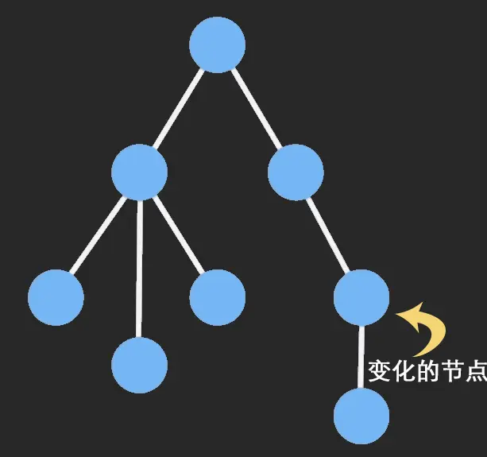
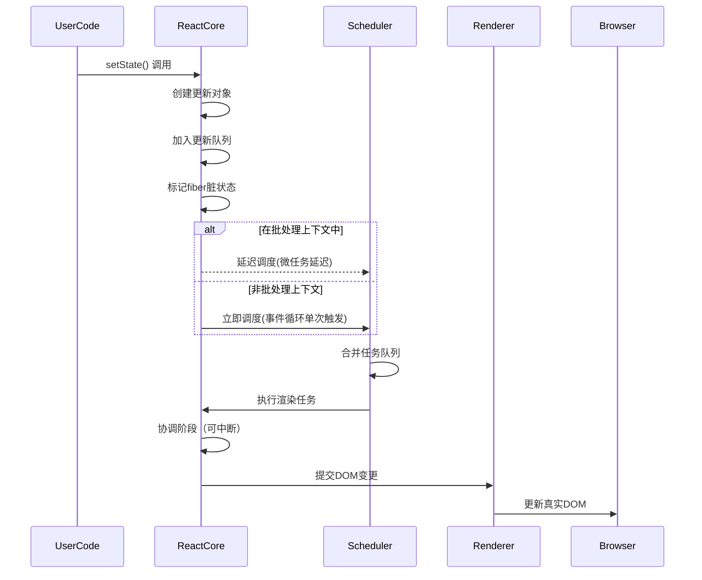
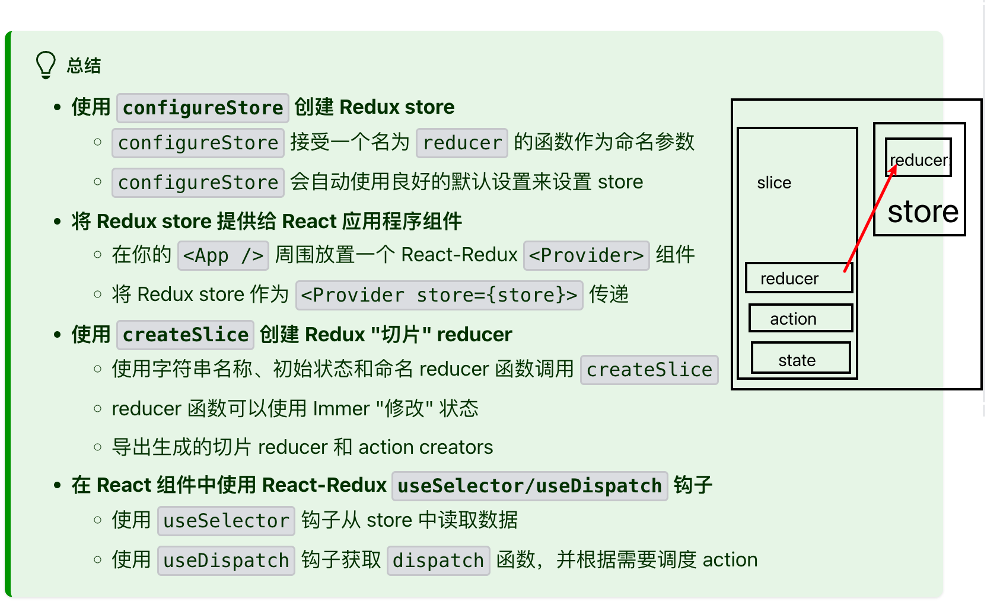

# React

欢迎来到 React 文档！

## 发展历史

| 年份 | 版本        | 关键特性                                       |
| ---- | ----------- | ---------------------------------------------- |
| 2013 | v0.3        | 开源                                           |
| 2015 | v0.14       | 拆分为 `react` 和 `react-dom`                  |
| 2016 | v15         | 首个稳定版                                     |
| 2017 | v16 (Fiber) | 新核心架构、Fragment、Portal、Error Boundaries |
| 2018 | v16.6       | `React.memo`、`lazy`、`Suspense`               |
| 2019 | v16.8       | **Hooks**                                      |
| 2020 | v17         | 过渡版本、新的 JSX 转换                        |
| 2022 | v18         | **并发渲染**、自动批处理、Suspense 改进        |
| 2024 | v19 (Beta)  | React Compiler、Actions、Web Components 支持   |

## React 的核心理念

声明式、组件化、和单向数据流

## 三大核心特性

虚拟 DOM、 生命周期管理、 hooks

## React 的 class 类有什么生命周期？

构建（constructor）： 派(getDerivedStateFromProps) -> 绘(render) -> 挂(componentDidMount)
| 方法 | 调用时机 | 用途 | 是否可调用 setState |
| ---- | ---- | ---- | ---- |
| constructor | 组件初始化 | 初始化 state，绑定方法 | ❌ |
| getDerivedStateFromProps | 每次渲染前 | 根据 props 更新 state | ❌ |
| render | 必须实现的方法 | 返回 jsx | ❌ |
| componententDidMount | 组件挂载后 | DOM 操作、网络请求、订阅 | ✅ |

变更 ： 派(getDerivedStateFromProps) -> 判(shouldComponentUpdate) -> 绘(render) -> 捕(getSnapShotBeforeUpdate) -> 更(componentDidUpdate)
| 方法 | 调用时机 | 用途 | 是否可调用 setState |
| ---- | ---- | ---- | ---- |
| getDerivedStateFromProps | 每次渲染前 | 根据 props 更新 state | ❌ |
| shouldComponentUpdate | 更新前 | 性能优化，控制是否渲染 | ❌ |
| render | 必须实现的方法 | 返回 jsx | ❌ |
| getSnapShotBeforeUpdate | Dom 更新前 | 获取 DOM 的快照信息 | ❌ |
| componentDidUpdate | 更新完成后 | DOM 操作，网络请求 | ✅ |

卸载： 清(componentWillUnmount)
| 方法 | 调用时机 | 用途 | 是否可调用 setState |
| ---- | ---- | ---- | ---- |
| componentWillUnmount | 组件卸载前 | 清理操作（计时器，订阅） | ❌ |

错误处理： 派(getDerivedStateFromError) -> 记(componentDidCatch)

| 方法                     | 调用时机           | 用途         | 是否可调用 setState |
| ------------------------ | ------------------ | ------------ | ------------------- |
| getDerivedStateFromError | 后代组件抛出错误后 | 渲染备用 UI  |                     |
| componententDidCatch     | 后代组件抛出错误后 | 记录错误形象 |                     |

附加：class 的生命周期怎么使用 hook 的对比

| 方法                     | hook                     | xx  | xx  |
| ------------------------ | ------------------------ | --- | --- |
| constructor              | useState 初始化          | xx  | xx  |
| getDerivedStateFromProps | useState+useEffect       | xx  | xx  |
| render                   | 函数组件本身             | xx  | xx  |
| componententDidMount     | useEffect                | xx  | xx  |
| shouldComponentUpdate    | useMemo                  | xx  | xx  |
| componententDidUpdate    | useEffect                | xx  | xx  |
| componententDidUnmount   | useEffect 返回的清理函数 | xx  | xx  |

## useEffect 和 useLayoutEffect

| 对比     | useEffect                      | useLayoutEffect               |
| -------- | ------------------------------ | ----------------------------- |
| 时机     | 浏览器渲染后                   | DOM 更新前，渲染前（同步）    |
| 形式     | 异步                           | 同步                          |
| 渲染阻塞 | 否                             | 是                            |
| 适用场景 | 大多数副作用（数据请求、订阅） | 读取 DOM 并同步修改（不闪烁） |
| 性能影响 | 无明显影响                     | 可能阻塞渲染                  |

## react 为什么 hooks 不能放在条件判断或者嵌套里。

核心原因：React 依赖 Hooks 的调用顺序来正确关联状态和副作用，破坏顺序会导致状态管理混乱。
具体原因：Hooks 依赖“稳定的调用顺序”。react 内部通过一个`hook链表`来管理组件的 hooks（useState、useEffect）。每次组件渲染时，react 会按顺序遍历这个链表，将每个 hook 与对应的状态/副作用关联。这个机制的前提是：**每次组件渲染时，Hooks 的调用顺序必须完全一致。**

实际后果：报错或者状态异常，开发环境监测到 hook 调用顺序不一致，并抛出明确错误：`Error:Rendered more hooks than during the previous render`.

### 总结

1. Hook 链表与状态的关联。完全依赖调用顺序，每一个 hook 按调用顺序对应链表的一个机点，节点存储该 Hook 的状态/副作用信息。
2. 顺序不一致危害：如条件、循环导致两次渲染的 hooks 调用顺序/数量不一样，链表遍历与实际调用无法匹配，最终状态错乱（读错、丢失）
3. 设计本质：React 通过”顺序匹配“而非”命名标识”管理 Hooks，是为了简化 API（无需手动命名状态）并保证 性能（链表遍历效率高）。这一设计决定 Hooks 必须在组件顶层调用，不能被条件逻辑包裹。

## react 常见的 hooks

- 状态管理：`useState` `useReducer`
- 副作用：`useEffect` `useLayoutEffect`
- 性能优化：`useCallback` `useMemo`
- 跨组件通信： `useContext`
- DOM/变量： `useRef` `useImperativeHandle`
- 调试：`useDebugValue`

## immutable.js 为什么能优化性能

核心是 “不可变数据 + 结构共享”。当数据发生改变，要保证旧数据同时可用且不变，同时为了避免 deepCopy 把所有节点都复制一遍带来的性能损耗，Immutable 使用[结构共享]().即如果对象树中一个节点发生变化，只修改这个节点和受它影响的父节点，其它节点则进行共享。请看下面动画：

函数组件

```js
import { useState } from "react";
import { Map } from "immutable";

function UserProfile() {
  // 初始化Immutable状态
  const [user, setUser] = useState(Map({ name: "Bob", age: 25 }));

  // 修改状态（返回新Map）
  const handleIncrementAge = () => {
    // 用update更新age（原状态不变，返回新状态）
    const newUser = user.update("age", (age) => age + 1);
    setUser(newUser); // 触发重渲染
  };

  return (
    <div>
      <p>Name: {user.get("name")}</p>
      <p>Age: {user.get("age")}</p>
      <button onClick={handleIncrementAge}>+1 Age</button>
    </div>
  );
}
```

性能优化- 值不变，引用不变；

```jsx
import { memo } from "react";
import { Map } from "immutable";
// 子组件：接收Immutable的user作为props
const UserInfo = memo(({ user }) => {
  console.log("UserInfo 渲染"); // 仅在user引用变化时触发
  return <p>Name: {user.get("name")}</p>;
});
// 父组件
function Parent() {
  const [user, setUser] = useState(Map({ name: "Dave" }));
  return (
    <div>
      <UserInfo user={user} />
      <button onClick={() => setUser(user.set("name", "Dave"))}>
        点击（name未实际变化，UserInfo不重渲染）
      </button>
    </div>
  );
}
```

注意事项：

- 避免面频繁使用`toJS()` 大型数据可能导致性能问题。
- 嵌套结构修改`setIn`：对于多层嵌套的`Map`和`List`，优先使用`setIn/updateIn`而非多次`get`+`set`
- 与 Redux 配合，`state`通常设计为不可变，可用 Immutable 的`Map/List`作为 state 容器，reducer 中通过`set/update`等方法返回新的 state，配合`reselect`库进一步优化性能。

## useCallback 和 useMemo

useCallback 和 useMemo 都是用于性能优化的 Hook，它们通过缓存计算结果来避免不必要的重复计算或渲染
| 特性 | useMemo | useCallback |
| ------------------------ | ------------------------ | --- |
| 返回值 | 缓存计算结果（值/对象/数组) | 缓存的函数本身 |
| 等效写法 | useMemo(()=>fn,deps) | useCallBack(fn,deps)|  
|优化目标| 避免重复计算、引用变化 | 避免函数重建、引用变化|
| 典型使用场景 | 复杂计算、稳定对象引用 | 事件处理函数、函数依赖稳定性 |
|何时使用| 计算成本高的值，useEffect 依赖，传递给子组件的 props（阻止子组件重新渲染） | props 传递给子组件，被 useEffect 依赖，需要稳定函数引用(debounce/throttle 等)|

## React 常见的性能优化手段

- 组件渲染优化
  React.memo
  shouldComponentUpdate

- hook 优化

  - useMemo
  - useCallback

- 列表渲染优化
  key 优化；虚拟列表优化`react-virtualized` `react-window`
- 代码分割和懒加载
  组件级别

```js
import LazyComponent = React.Lazy(()=>import('./HeavyComponent)')
function MyComponent(){

    return <>
    <Suspense fallback={}>
        <LazyComponent/>
    </Suspense>
     </>
}
```

路由级别

```js
  const router = CreateBrowserRouter([
      {
          path:'/lazy',
          component:React.lazy(() => import('./HeavyComponent'))
    },
    {
        path:'/',
        element:<Layout>,
        children:[
            {
                path:'dashboard',
                lazy:()=> import('./dashboard'),
            },
        ]
    }
  ])
```

- 状态管理优化

  - 拆分多个 context
  - 精细化、原子化的状态管理(zustand/jotai)

- 渲染过程优化

  - 延迟更新非关键 UI(useDeferredValue、useTransition)

- 内存优化
  - 清楚定时器，监听等资源
- 构建优化
  - treeShaking,bundle 优化，压缩等
  - 资源优化 ServiceWorker，HTTP 缓存, CDN 加速，预加载，预执行，按需加载，缓存协商等
  - SSR 优化，按需加载

## 优化策略优先级

1. 先测量：使用 Profiler 定位瓶颈(80/20 法则)
2. 关键路径优先:优化 👋 屏和核心交互
3. 渐进优化：避免过早优化
4. 权衡考虑：优化可能增加代码复杂度

### 指标：

- FP First Paint, FP
- FCP First Contentful Paint，FCP
- LCP Largest Contentful Paint,LCP
- TTI Time To Interactive，TTI
- FMP First Meaningful Paint, FMP
- FID First Input Delay， FID
- TBT Total Blocking Time, TBT

## React 虚拟 dom 的好处

1. 性能优化：最小化昂贵 DOM 操作，智能批量更新

- 真实 dom 问题：
- - 每次 dom 操作造成浏览器重排和重绘
- - Dom 对象包含数百个属性，操作成本极高
- 高效差异更新
- - 最小化更新【同级比较】【key 优化列表更新】【组件类型对比】
- 批处理更新与事务机制
- - 【虚拟 dom 作为中间缓存层，收集多次状态变更】【事件循环结束统一提交更新】【避免中间状态导致的闪烁或不一致】

2. 抽象层价值：连接声明式组件与命令式 DOM 操作
3. 跨平台能力：统一渲染抽象接口

- 同一套组件可渲染到不同环境：Web、移动端、VR、命令行界面

4. 开发体验：使声明式编程模式成为可能

- 声明式编程范式的支撑

5. 复杂应用：在动态数据驱动 UI 场景下表现卓越
   `虚拟DOM更像是react实现的必要细节，而不是其核心价值，真正的价值在于：让开发者能以声明式的方式描述UI，同时保持高性能更新`

## 1.React 的核心设计理念是什么？列举其三大核心特性？

核心设计理念是声明式、组件化、和单向数据流展开，这使得 React 在构建复杂的用户界面时更加高效、可维护。其三大核心特性 - 虚拟 DOM、 生命周期管理、 hooks

- 虚拟 DOM 提供性能优化，减少不必要的 DOM 操作。
- 组件生命周期管理 让开发者可以在特定的时间点执行操作。
- hooks 使得函数式组件能够管理状态和副作用，简化开发流程。

## 附加：Suspense 是如何工作的？

```tsx
// 使用
function Comp() {
  return <>delay</>;
}
const Lazy = React.lazy(() => delay(5000).then((x) => ({ default: Comp })));
function App() {
  return (
    <>
      <Suspense fallback={"loading"}>
        <Lazy></Lazy>
      </Suspense>
    </>
  );
}
```

Suspense 只是提供了用于加载数据的标准，`加载`->`过渡`->`完成切换`
步骤： 1.遍历到 primiay 组件，抛出异常 2.捕获，添加回调 3.展示 fallback 4.加载完成，执行回调 5.展示加载完成后的组件

## 附加：React 性能优化的最佳实践

React.memo

```tsx
// React.memo的使用

// 1.纯展示组件
function Test1({data}:props){}
return default React.memo(Test1)
// 2.渲染开销很大的组件
function Chat = React.memo(({data})=>{
    const chartData = processData(data) // 昂贵的渲染计算
    return  <svg width="600" height="400">
      {/* 复杂SVG渲染 */}
    </svg>
})
// 3.频繁重新渲染的列表项
const ListItem = React.memo(({ item, onSelect }) => (
  <li onClick={() => onSelect(item.id)}>
    {item.name} - {item.price}
  </li>
));
// 4.使用自定义比较函数
const ComplexComponent = React.memo(({config})=>{},(prevProps,nextProps)=>{
    return _.isEqual(prevProps.config, nextProps.config);
})
// 5.组合 useMemo和useCallback
const Test5 = ({data,callback})=>{
    return <></>
}
function App(){
  const items = [{},{}]
// 使用useCallback稳定函数引用
  const handleClick = useCallback(() => {
    console.log('点击');
  }, []);
  // 使用useMemo稳定对象引用
  const userData = useMemo(() => ({
    name: 'John',
    age: 30
  }), []);

    return <>

    <Test1 data='静态数据'></Test1>
    <Chat></Chat>
    {
        items.map(v=>(<ListItem/>))
    }
    <ComplexComponent></ComplexComponent>
    <Test5 data={userData} callback={handleClick}></Test5>
    </>
}
```

## 3.jsx 的本质上什么？为什么浏览器无法直接解析 jsx？

本质是：
1.js 的语法扩展 2.是 React.createElement()的调用简写 3.一个声明式的 UI 描述语法
为什么无法直接解析 jsx？因为是 js 扩展语法，浏览器只理解纯 javascript

## 4.React 与 Angular/Vue 的核心区别（如数据绑定，DOM 操作、架构设计）

| 区别     | React                                         | Angular          | Vue                                              |
| -------- | --------------------------------------------- | ---------------- | ------------------------------------------------ |
| 数据绑定 | 单向数据流                                    | 默认双向数据绑定 | 双向绑定+单向支持                                |
| DOM 操作 | 基于 vdom                                     | 真实 Dom         | 基于 vdom                                        |
| 架构设计 | 仅关注 view，其他依赖社区生态                 | 全家桶           | 提供渐进式框架                                   |
| 模版语法 | JSX                                           | 模版语法+装饰器  | 模版语法+可选 JSX                                |
| 选型     | 大型复杂应用,团队熟悉函数式编程、需要跨端能力 | xx               | 中小型/快速迭代 需要渐进式开发，对“约定大于配置” |

选型：

## 5.解释 React 的“单向数据流”特性以其实践意义

特性：数据流是单向，从父组件传递到子组件，子组件无法直接修改父组件的状态，而是通过回调函数向上传递意图。
意义：可预测性更强：状态的来源明确，组件行为跟容易追踪和测试。调试更方便：可用 React DevTools 等工具查看数据流向。更容易构建大型应用：状态提升、状态管理（Redux、Zustand ）

## 6.什么是合成事件？与原生事件有何区别？

合成是事件是 React 封装的一种事件，它模拟了浏览器的原生事件对象，但又提供了一些额外的优势。React 使用合成事件系统来处理所有事件（点击、鼠标事件、键盘事件），目的是在不同浏览器中统一处理事件，优化性能并避免内存泄漏。
特点：

- 跨浏览器一致性：不同浏览器对事件的实现和处理方式各不相同，React 封装了这些差异，使得在所有浏览器中事件的行为是一致的。通过合成事件，React 避免了浏览器差异引起的问题。
  举例各个浏览器事件的差异
  | 功能点 | IE/edge | Chrome | Safari |
  | ---- | ---- | ---- | ---- |
  | 事件对象获取 | window.event | 回调参数 e | 回调参数 e |
  | 阻止默认事件 | e.returnValue = false | e.preventDefault() | e.preventDefault() |
  | 阻止冒泡 | e.cancelBubble = true | e.stopProppagation() | e.stopProppagation() |
  | 鼠标滚轮事件 | onmousewheel | onwheel | onmousewheel |
  | 键盘事件编码 | e.keyCode | e.key | e.keyCode |
- 事件池化：React 在合成事件对象的实现中采用了事件池化的策略。这意味当事件处理完成后，React 会将事件对象重新放入池中，而不是保留每个事件的实例，从而减少内存的开销。事件池化的实现意味着事件对象的属性值只能在事件回调函数中访问，而在回调执行后，属性会被清空。 1.内存优化
  | 事件类型 | 无池化（对象数） | 有池化（对象数） | 内存节省 |
  | ---- | ---- | ---- | ---- |
  | 点击事件 | 1000 | 10 | 99% |
  | 鼠标移动 | 10000| 20 | 99.8% |
  | 滚动事件 | 5000 | 15 | 98.7% | 2.垃圾回收优化
  创建大量短期对象会增加垃圾回收频率；垃圾回收会阻塞主线程，造成页面卡顿（称 GC 卡顿） 3.高频事件性能优化

- 统一的接口：合成事件封装了标准的原生事件接口，并提供一致的 API 来访问事件的属性，如`event.target` `event.preventDefault` `event.stopPropagation`
- 事件代理：原生事件会在每个 dom 添加事件监听器。合成事件，React 会在`document`添加一个全局事件监听器，当任何子元素触发的时候，这个全局监听器会捕获到事件并将其分发给目标元素，这种方法减少了事件监听器的数量，避免了每个 DOM 元素都绑定事件监听器，从而优化性能。

## 7.React 组件化的思想如何提升代码复用率？

- 模块化，页面拆分为各个独立的部分，组件作为独立的单元可以在不同地方复用，避免重复代码。
- 可配置化。传入不同 props 在不同场景下使用
- 组合化。通过组件嵌套和组合，构建复杂 UI
- 逻辑复用。自定义 hooks 和 hoc 和 render props，可以复用逻辑而不影响组件功能。
- 提升状态。通过将共享状态提升到共同的组件，避免了状态重复管理和同步问题。
  这些设计理念和模式让 React 的组件化不仅仅是代码的复用，更是通过结构化的方式使得 UI 和和逻辑的管理变得更加高效和可维护。

## 8.解释 React 的“组件即函数”理念（函数组件和类组件的本质区别）

理念：

1. React 组件本质上是一个接受输入（props）并返回输出（UI 描述）的函数。
2. 组件的核心职责是：props -> UI
3. 组件应该是纯净的：相同输入总是产生相同输出
4. 组件应该是可组合的：像函数一样可以嵌套组合

本质区别：

- 1.语法和结构
- - 函数组件：一个普通的 javascript 函数，接受 props 作为参数并返回 jsx。没有生命周期方法、this
- - 类组件：基于 ES6 类定义，继承自 React.Component,需要手动实现 render 方法，并使用 this.state 和 this.setState 管理状态。
- 2.生命周期管理：
- - 类组件：类组件有内建的生命周期方法，可以在这些方法中执行异步操作、更新状态等。例如 `componentDidMount` `componentWillUnmount`
- - 函数组件：函数组件没有生命周期方法，但通过 React Hooks（如 useEffect）引入函数组件的副作用处理，使函数组件具备类似类组件的生命周期管理功能。useEffect 允许我们在组件挂载、更新和卸载时执行副作用。
- 3.状态管理
- - 类组件：使用 this.state 来管理状态，使用 this.setState 来更新状态。setState 是异步的，并且会触发组件的重新渲染。
- - 函数组件：函数组件原本是无状态的，但随着 React Hooks 的引入，useState 使得函数组件也可以使用状态管理。
    总结：React 的“组件即函数”理念，意味着 React 组件可以简单地用函数实现，而无需依赖复杂的类继承结构。函数组件通过其简洁的结构、易于理解的 API 和性能优势吗，成为现代 React 开发的首选方式。

### 为什么要有 React Hooks

- 类组件复用问题。需要通过（HOC、Render Props）。缺点是可能形成嵌套地域。
- 类组件逻辑分散。（数据获取、加载状态、错误处理）分散在不同的生命周期`ComponentDidMount componentDidUpdate ComponentWillUnMount`
- this 指向陷阱。需要显示`bind`或者使用箭头函数保证正确。
- 函数式组件的缺陷。只能渲染纯 UI 展示组件。

## 9.React 的严格模式（Strict Mode）解决了哪些潜在问题？

1. 过时的生命周期方法：16.3 后`ComponentWillMount` `ComponentWillReceiveProps` `ComponentWillUpdate`不在推荐使用
2. 意外的副作用：严格模式会开启双重渲染，这意味着组件的渲染和副作用函数会被执行 2 次，React 会主动触发两次渲染来确保副作用函数是纯粹的，不会影响后续的渲染过程。
3. 不安全的 findDOMNode。这个方法已经过时，推荐使用 Ref 来访问元素。
4. 不推荐字符串 refs
5. 不稳定的副作用（setState） 在 componenWillUnmount 不能使用 setState
6. 异步渲染的相关问题：react16 之后引入异步渲染（concurent rendering）严格模式可以帮助开发者提前发现一些与异步渲染相关的 bug
7. 不稳定的上下文
   总结：
   React 的严格模式是一个工具，它帮助开发者检测并解决潜在的错误和性能问题。严格模式通过对组件的双重渲染、生命周期方法的检查、不推荐的 API 使用警告等方式，确保开发者编写的代码符合 React 的最佳实践。

## 10.React 的最新版本特性（React18）

并发模式

- 渲染过程可中断，React 可在合适时机调度任务，不阻塞主线程
- 比如：输入框不会因大型渲染任务而卡顿
  自动批处理

```tsx
setCount(a + 1);
setName("aa");
```

useTransition
标记非紧急更新
新 Root Api 和 SSR 改进
支持 createRoot 替代旧版 ReactDOM.render
SSR 支持延迟加载片段、流式传输（Streaming）

## 11.调用 setState 后发生了什么？解释其异步批处理机制

基本流程：

1. 入队-> 将更新加入队列
2. 批处理-> 合并多个更新请求
3. 合并-> 计算最终状态值
4. 协调-> Fiber 树 Diff 计算
5. 提交-> 原子化 DOM 更新
   `React的批处理不是一种优化，而是保证UI一致性的必要机制。它确保无论你调用多少次setState，最终用户只会看到一次完整的UI更新`

源码导读：

1.更新入队阶段

```js
// setState 入口
enqueueSetState(inst, payload, callback) {
  const fiber = getInstance(inst);
  const eventTime = requestEventTime();
  const lane = requestUpdateLane(fiber); // 获取更新优先级

  // 创建更新对象
  const update = createUpdate(eventTime, lane);
  update.payload = payload;

  // 加入更新队列
  enqueueUpdate(fiber, update);

  // 调度更新
  scheduleUpdateOnFiber(fiber, lane, eventTime);
}
```

核心操作:

- 创建 update 对象（包含 payload 和回调）

- 将 update 加入 fiber 节点的更新队列

- 标记 fiber 为需要更新 (fiber.lanes |= lane)

  2.批处理决策阶段

```js
function scheduleUpdateOnFiber(fiber, lane, eventTime) {
  // 检查是否在批处理上下文中
  if (isInsideEventHandler) {
    // 🅰️ 批处理模式：标记为待处理
    markRootUpdated(root, lane, eventTime);
  } else {
    // 🅱️ 非批处理：立即调度
    ensureRootIsScheduled(root, eventTime);
  }
}
```

3.状态合并阶段

```js
function processUpdateQueue(workInProgress, props, instance, renderLanes) {
  const queue = workInProgress.updateQueue;
  let baseState = queue.baseState;

  // 遍历更新队列
  let update = queue.first;
  while (update !== null) {
    // 合并状态更新
    if (typeof update.payload === "function") {
      // 函数式更新
      baseState = update.payload(baseState);
    } else {
      // 对象合并
      baseState = Object.assign({}, baseState, update.payload);
    }
    update = update.next;
  }

  // 保存最终状态
  workInProgress.memoizedState = baseState;
}
```

4.协调渲染阶段

```js
function performConcurrentWorkOnRoot(root) {
  // 构建 workInProgress 树
  renderRootSync(root, lanes);

  // 执行协调算法
  workLoopSync();

  // 提交准备
  prepareFreshStack(root, lanes);
}
```

Fiber 协调流程:

调用 beginWork 处理组件更新

执行 completeWork 创建 DOM 节点

生成 effectList（变更链表）

5.提交更新阶段

```js
// 阶段1: Before mutation
commitBeforeMutationEffects();

// 阶段2: Mutation
commitMutationEffects(root, renderPriorityLevel);

// 阶段3: Layout
commitLayoutEffects(root, lanes);
```

提交三阶段:

Before mutation:

调用 getSnapshotBeforeUpdate

暂停 useLayoutEffect 清理函数

Mutation:

执行 DOM 操作（增删改）

调用 useEffect 清理函数

Layout:

调用 componentDidMount/Update

执行 useLayoutEffect 回调

更新 refs



异步批处理机制：

- 目的：减少不必要的 DOM 更新
- 多个 setState 合并，只渲染一次组件
- 特别在事件回调、生命周期表现明显
- 注意：`setState((prev)=>prev+1)`会正确叠加

## 13.声明周期的划分

附加：React 的 class 类有什么生命周期？

构建（constructor)： 派(getDerivedStateFromProps) -> 绘(render) -> 挂(componentDidMount)
| 方法 | 调用时机 | 用途 | 是否可调用 setState |
| ---- | ---- | ---- | ---- |
| constructor | 组件初始化 | 初始化 state，绑定方法 | ❌ |
| getDerivedStateFromProps | 每次渲染前 | 根据 props 更新 state | ❌ |
| render | 必须实现的方法 | 返回 jsx | ❌ |
| componententDidMount | 组件挂载后 | DOM 操作、网络请求、订阅 | ✅ |

变更 ： 派(getDerivedStateFromProps) -> 判(shouldComponentUpdate) -> 绘(render) -> 捕(getSnapShotBeforeUpdate) -> 更(componentDidUpdate)
| 方法 | 调用时机 | 用途 | 是否可调用 setState |
| ---- | ---- | ---- | ---- |
| getDerivedStateFromProps | 每次渲染前 | 根据 props 更新 state | ❌ |
| shouldComponentUpdate | 更新前 | 性能优化，控制是否渲染 | ❌ |
| render | 必须实现的方法 | 返回 jsx | ❌ |
| getSnapShotBeforeUpdate | Dom 更新前 | 获取 DOM 的快照信息 | ❌ |
| componentDidUpdate | 更新完成后 | DOM 操作，网络请求 | ✅ |

卸载： 清(componentWillUnmount)
| 方法 | 调用时机 | 用途 | 是否可调用 setState |
| ---- | ---- | ---- | ---- |
| componentWillUnmount | 组件卸载前 | 清理操作（计时器，订阅） | ❌ |

错误处理： 派(getDerivedStateFromError) -> 记(componentDidCatch)

| 方法                     | 调用时机           | 用途         | 是否可调用 setState |
| ------------------------ | ------------------ | ------------ | ------------------- |
| getDerivedStateFromError | 后代组件抛出错误后 | 渲染备用 UI  |                     |
| componententDidCatch     | 后代组件抛出错误后 | 记录错误形象 |                     |

## 14.为什么 AJAX 请求放在`componentDidMount`?

- dom 已经加载完成：该方法在组件第一次渲染完成之后调用，避免访问未渲染 DOM 的问题
- 避免重复请求：相比放在 render，componentDidMount 只执行一次，避免请求重复发器。
- 符合副作用处理规范：React 推荐将副作用（如网络请求）写在钩子中，与函数组件中的`useEffect`用法一致。

## 15.shouldComponentUpdate 的作用以及如何通过它优化性能？

`shouldComponentUpdate(nextProps,nextState)`方法是用来拦截更新用的。返回 boolean。
优化方式：

- 避免不必要渲染
- 结合不可变数据(immutable)和(PureComponent)进行优化。

## 16.React 的 key 值在列表渲染中的作用以及最佳实践

在动态渲染列表，key 帮助 React 高效识别哪些列表项改变、添加或者删除，从而避免不必要的渲染，并优化性能。

key 的作用：

- 唯一标识列表项
- 提升性能和避免不必要的渲染
- 确保组件正确复用

key 的工作原理：

react 在列表渲染时的处理流程如下：

- 对比两颗虚拟 dom 树：当组件状态或者 props 发生变化时，React 会创建新的虚拟 DOM 树，并将其与之前的虚拟 DOM 树进行对比，查找差异。
- 匹配元素。只有 key 相同才能被认为相同的。
- 更新变化的元素。根据 key 的比较结果，只更新那些需要变化的 DOM 元素，而不是重新渲染列表。

最佳实践：

- 确保元素唯一 key。
- 数组避免使用索引做 key。
- 使用稳定的 key。
- 确保 key 在同一层级内唯一。当多层嵌套列表时，可以为每一层使用不同的 key 规则

## 17.解释`forceUpdate`的使用场景和潜在风险

强制组件重新渲染，即使 state 或者 props 未发生改变。调用该方法会跳过 shouldComponentUpdate，直接进入 render

使用场景：

- 某些外部变量（非 state）变更但不触发更新的情况。
- 集成第三方非 React 库（如 canvas、地图）直接操作 dom，需要手动刷新视图。
- 性能监控仪表盘，高频（每 s 一次）不适合使用 setState

潜在风险：

- 破坏 React 的数据驱动原则：违背了"state 改变驱动 UI 更新"的思想
- 性能开销大：容易引起无意义的重渲染
- 调试困难，使用`forceUpdate`容易隐藏状态变化逻辑，不易排查问题。

函数式组件的替代方案

```js
function Comp() {
  const [updateCount, setUpdateCount] = useState(0);
  const externalData = React.useRef(null);
  const forUpdate = () => {
    setUpdateCount((pre) => pre + 1);
  };
  useEffect(() => {
    sub.subscribe((data) => {
      externalData.cur;
      forUpdate();
    });
    return () => {
      sub.unsubscribe();
    };
  }, []);
}
```

## 18.类组件中`super(props)`的作用和必要性

作用

- 正确初始化父类构造函数,确保组件的`props`能正确传递
- 访问 this.props

## 19.函数组件与类组件中`this`绑定的区别以及解决方案

类组件：

- 构造函数中使用`this.handleClick.bind(this)`
- 箭头函数自动绑定 this，使 this 始终指向当前组件实例

函数组件

- 不要绑定 this

## 20.事件处理中如何解决 this 指向问题。

- 构造函数中使用`this.handleClick.bind(this)`
- 箭头函数自动绑定 this，使 this 始终指向当前组件实例

## 21.受控组件 与 非受控组件 区别以及使用场景

| 特性     | 受控组件                               | 非受控组件                         |
| -------- | -------------------------------------- | ---------------------------------- |
| 数据管理 | 由 React 组件的状态管理                | 数据由 DOM 自身管理，通过 ref 访问 |
| 使用方式 | 每次输入变更都会通过 onchange 更新状态 | 使用 ref 获取输入框当前值          |
| 性能     | 每次输入都发触发重新渲染               | 不会频繁触发                       |
| 灵活性   | 高、能做数据验证、联动操作             | 低，难以实现复杂功能               |
| 使用场景 | 复杂表单、需要验证或者联动的场景       | 简单表单、不需要复杂交互的场景     |

## 22.高阶组件（HOC）的实现原理以及典型应用场景

原理：受组件并返回一个新的组件，增强原有组件的功能。允许复用组件逻辑。
实例：

```js
function WithLoading(Component) {
  function WithLoading(props) {
    const {isLoading} = props;
    return <>{ isLoading? <div>loading</div> :<Component {...props}></Component>}</>; }</>
  }
  return WithLoading;
}

const MyComp = ({data})=> <div>{data}</div>
const EnhanceComp = WithLoading(MyComp)
```

典型场景：

1. 权限控制：根据用户权限来决定是否渲染某个组件
2. 代码拆分：根据需要动态加载组件
3. 增强功能：例如给组件内增加缓存、请求数据的功能等。

## 23.如果通过 React.memo 优化函数组件等性能？

使用：用来包装组件、只要 props 没变，就跳过渲染。
比较原理：浅比较 如果是对象或者数组类型发生改变，会重新渲染。
自定义比较函数：

```js
const MyComponent = React.memo(
  (props) => {
    //code
  },
  (preProps, nowProps) => {
    //custom logic
    if (preProps.value !== nowProps.value) {
      return false; //不跳过渲染
    } else {
      return true; //跳过渲染。
    }
  }
);
```

## 24.解释 React 的”错误边界”机制

React 的错误边界机制允许你在应用中捕获 js 粗欧文，并展示备用 UI，不会导致整个组件树奔溃。错误边界上 react 组件，会捕获子组件树的错误。

```js
class ErrorBoundary extends React.Componnet {
  construcotr(props) {
    super(props);
    this.state = { hasError: false };
  }
  getDerivedStateFromError(error) {
    // 更新状态已渲染备份ui
    return {
      hasError: true,
    };
  }
  componentDidCatch(error, info) {
    console.log(error, info);
  }
  render() {
    if (this.state.hasError) {
      return <div>404 Not Find</div>; //备用UI
    } else {
      return <div>{this.props.children}</div>;
    }
  }
}
```

## setState 的核心实现

### 用法

1. 对象形式:`this.setState({ key: newValue })`
2. 函数形式:`this.setState((prevState, props) => ({ key: prevState.key + 1 }))`
   第二个可选参数是回调函数：`this.setState(updater, callback)`在状态更新完成且组件重新渲染后执行（用于获取最新状态）。

### 核心原理

并非直接修改`this.state`并立即更新 DOM，而是通过一套**状态更新机制+批处理**的机制实现。
核心流程：

1. 状态更新入队（不直接修改 this.state)。不是直接更新，而是将传入的“状态更新描述”入队。目的是

- 避免频繁修改状态导致频繁渲染
- `this.state`本身是一个只读快照，`this.state={}`不会触发重新渲染

2. 批处理更新策略（异步性的核心）
   将多个`setState`调用的更新请求**批处理合并** 然后一次性处理，最终只触发一次渲染。

- 何时批量更新？
- - React 控制场景下（合成事件回调、生命周期方法）`setState`是异步的。
- - 非 React 控制场景下 `setTimeout 原生事件回调` `setState`是同步的。
- 批处理更新的实现？ 通过**事务机制标记当前是否处于“批量更新模式”**，是，更新请求被暂存；离开模式，一次性处理暂存的更新。

3. 状态合并与计算

- 对象浅合并
- 函数，返回值作为下一个函数的输入值

4. 触发更新

- 计算完成后，React 会触发组件的重新渲染流程。`shouldComponentUpdate` `render` `reconcile` `commit`

## 26.函数组件和类组件的区别以及选型建议

| 区别     | 函数组件   | 类组件                       |
| -------- | ---------- | ---------------------------- |
| 语法     | class      | function                     |
| 状态管理 | this.state | useState                     |
| 性能     |            | 没有实例，相对简洁且性能更好 |

React 官方推荐函数组件，特别是自从 hooks 推出后，函数组件更灵活，简洁

## 27.如何实现父子通信？兄弟通信？

- 子->父：回调函数(参数)
- 父->子：props
- 兄弟 -> 兄弟 : 借助父组件的状态 或者 使用全局状态管理【Context 或者第三方状态管理库 Redux 等】

## 28.解释 Context API 的作用及与 Redux 的对比

ContextAPI 是 React 提供用于夸组件共享数据的机制。避免多个层级中层层传递 props

- 创建 Context `React.createContext`
- 提供数据 `Provider`
- 消费数据 `Consumer` `useContext`
  |对比|ContextAPI|Redux|
  |---|---|---|
  |用途| 传递全局数据、主题、语言设置、认证信息等。适用于小型状态管理或者较少更新状态|复杂状态管理，特别是需要在多个组件间传递并操作大量数据。适合复杂应用和中大型项目|
  |功能|提供数据传递功能,没有内建机制来处理复杂状态逻辑|提供强大状态管理机制，Store、Action、Reducer、Middleware|
  |使用场景|用户认证、主题切换|多层级状态管理、大量组件交互、复杂异步操作|

## 29.如何通过 useState 和 useEffect 实现类组件的状态与声明周期

class 的生命周期怎么使用 hook 的对比

| 方法                     | hook                     | xx  | xx  |
| ------------------------ | ------------------------ | --- | --- |
| constructor              | useState 初始化          | xx  | xx  |
| getDerivedStateFromProps | useState+useEffect       | xx  | xx  |
| render                   | 函数组件本身             | xx  | xx  |
| componententDidMount     | useEffect                | xx  | xx  |
| shouldComponentUpdate    | useMemo                  | xx  | xx  |
| componententDidUpdate    | useEffect                | xx  | xx  |
| componententDidUnmount   | useEffect 返回的清理函数 | xx  | xx  |

## 自定义 Hook 的实现原理以及典型应用场景

原理：允许函数组件复用状态逻辑，利用 React Hooks 实现共享的功能逻辑。
场景：

- 抽象重复逻辑
- 封装复杂逻辑
- 可组合型：通过组合自定义 hook，提高代码可读性，可复用性

## 31.Redux 的核心概念（Store、Action、Reducer)以及工作流程

1. Store：存储应用状态的对象。一个应用只能有一个 store，它是数据的唯一来源 `createStore`创建
2. Action:描述发生的事件和操作对象。每个`action`必须包含一个`type`字段。表示操作类型。action 还可以包含`payload`
   实例：`{type:'ADD_ITEM',playload:{id:1}}`
3. Reducer:是一个纯函数，接受当前状态和一个 action，返回新的状态。`reducer`根据`action`类型来决定如何更新`state`

```js
function itemsReducer(state = [], action) {
  switch (action.type) {
    case "ADD_ITEM": {
      return [...state, action.payload.item];
    }
    default: {
      return state;
    }
  }
}
```

Redux 的工作流程

1. 发起 Action,`dispatch(action)`
2. 传递到 Reducer `action`被发送到 reducer 中，根据 acton 类型更新 state
3. 更新 Store:新的 state 被返回并保存在 store 中。
4. 触发 UI 更新：store 的状态发生变化后，React 组件会重新渲染以反映新的状态。


redux-toolkit 的使用

```jsx
// src/app/store.js
import { configureStore } from "@reduxjs/toolkit";
import counterReducer from "../features/counter/counterSlice";
export const store = configureStore({
  reducer: {
    counter: counterReducer,
  },
});

// 将 Redux Store 提供给 React
ReactDOM.render(
  <Provider store={store}>
    <App />
  </Provider>,
  document.getElementById("root")
);

// features/counter/counterSlice.js
export interface CounterState {
  value: number;
}
const initialState: CounterState = {
  value: 0,
};
export const counterSlice = createSlice({
  name: "counter",
  initialState,
  reducers: {
    increment: (state) => {
      state.value += 1;
    },
    decrement: (state) => {
      state.value -= 1;
    },
    incrementByAmount: (state, action: PayloadAction<number>) => {
      state.value += action.payload;
    },
  },
});
export const { increment, decrement, incrementByAmount } = counterSlice.actions;
export default counterSlice.reducer;

// 使用
export function Counter() {
  const count = useSelector((state: RootState) => state.counter.value);
  const dispatch = useDispatch();

  return (
    <div>
      <div>
        <button
          aria-label="Increment value"
          onClick={() => dispatch(increment())}
        >
          Increment
        </button>
        <span>{count}</span>
        <button
          aria-label="Decrement value"
          onClick={() => dispatch(decrement())}
        >
          Decrement
        </button>
      </div>
    </div>
  );
}
```

## 32.解释 Redux 中间件(Redux-Thunk、Redux-Saga)的作用

**Redux 中间件：**

是在`dispatch`和`reducer`之间的一层，增强 Redux 功能，比如处理异步操作、日志记录、异常处理

**Redux-Thunk:**
允许`action creater`返回一个函数而不是一个对象。这个函数接受`dispatch`和`getState`，可以用来异步操作。 使得在`action creator`中进行异步请求变得容易

```js
const fetchData = () => {
  return function (dispatch) {
    fetch("/data")
      .then((res) => res.json())
      .then((data) => {
        dispatch({ type: "UPDATE_DATA", payload: data });
      });
  };
};
```

**Redux-saga**
`redux-saga`是基于 Generator 函数的中间件，用于处理复杂的异步操作、控制流程和副作用。通过`yield`表达式来暂停和恢复执行。
`redux-saga`允许更加复杂的控制流程
redux-saga 使用实例

```js
// 1. 安装依赖  npm install redux-saga
// 2. 定义 Redux Action Types
// actionTypes.js
export const FETCH_LIST = 'FETCH_LIST'; // 触发请求的 action
export const FETCH_LIST_SUCCESS = 'FETCH_LIST_SUCCESS'; // 请求成功
export const FETCH_LIST_FAILURE = 'FETCH_LIST_FAILURE'; // 请求失败

// 3. 定义 Redux Reducer
// reducer.js
import { FETCH_LIST_SUCCESS, FETCH_LIST_FAILURE } from './actionTypes';

const initialState = {
  list: [],
  loading: false,
  error: null,
};

export default function listReducer(state = initialState, action) {
  switch (action.type) {
    case FETCH_LIST:
      return { ...state, loading: true, error: null };
    case FETCH_LIST_SUCCESS:
      return { ...state, loading: false, list: action.data };
    case FETCH_LIST_FAILURE:
      return { ...state, loading: false, error: action.error };
    default:
      return state;
  }
}

// 4. 编写 Saga（核心逻辑）
// Worker saga：处理实际请求逻辑
function* fetchListSaga(action) {
  try {
    // 调用 API（阻塞等待结果）
    const params = action.payload;
    const data = yield call(api.getList, params); // 等价于 api.getList(params)
    // 分发成功 action
    yield put({ type: FETCH_LIST_SUCCESS, data });
  } catch (error) {
    // 分发失败 action
    yield put({ type: FETCH_LIST_FAILURE, error: error.message });
  }
}

// Watcher saga：监听 FETCH_LIST action，触发 worker
function* watchFetchList() {
  // 每次 FETCH_LIST 触发都执行 fetchListSaga，且自动取消前一次未完成的任务（解决竞态）
  yield takeLatest(FETCH_LIST, fetchListSaga);
}

// 导出根 saga（合并所有 watcher）
export default function* rootSaga() {
  yield all([watchFetchList()]); // all 用于并行启动多个 saga
}

// 5.配置Redux Store，集成saga中间件
// 创建 saga 中间件
const sagaMiddleware = createSagaMiddleware();
// 合并 reducers
const rootReducer = combineReducers({ list: listReducer });
// 创建 store，应用 saga 中间件
const store = createStore(rootReducer, applyMiddleware(sagaMiddleware));
// 运行根 saga（启动所有 watcher）
sagaMiddleware.run(rootSaga);
export default store;
```

## 33.React-Redux 中`connect`函数与`useSelector/useDispatch`的对比

```jsx
// connect的用法
import { connect } from "react-redux";
import { increment } from "./action";
class Counter extends Component {
  render() {
    return (
      <div>
        <div>{this.props.count}</div>
        <button onClick={this.increment}>点击</button>
      </div>
    );
  }
}
const mapStateToProps = (state) => {
  return { count: state.count };
};
const mapDispatchToProps = (dispatch) => {
  return { increment: () => dispatch(increment()) };
};
export default connect(mapStateToProps, mapDispatchToProps)(Counter);
```

```jsx
// useSelector / useDispatch
import { useSelector, useDispatch } from "react-redux";
import { increment } from "./actions";

// 函数组件
const Counter = () => {
  // 提取状态（类似 mapStateToProps）
  const count = useSelector((state) => state.counter.count);
  // 获取 dispatch 方法
  const dispatch = useDispatch();

  return (
    <div>
      <p>Count: {count}</p>
      <button onClick={() => dispatch(increment())}>+1</button>
    </div>
  );
};

export default Counter;
```

| 对比     | connect                             | useSelector/useDispatch                 |
| -------- | ----------------------------------- | --------------------------------------- |
| 功能     | 连接组件和 Redux                    | 订阅 state 和 dispatch                  |
| 性能优化 | 使用 shouldComponentUpdate 优化性能 | 每次都会订阅 Redux store 并重新渲染组件 |
| 使用场景 | 使用 class 组件                     | Hooks 函数组件                          |
| 灵活性   | 提供更多控制权                      | 简洁，较少控制                          |

## 34.如何通过`useReducer`管理复杂组件状态

`useReducer`是 React 提供的一个 Hook，用于函数组件中管理复杂的状态。使用状态逻辑比较复杂，涉及多个子值或需要根据不同`action`更新状态的场景。
使用场景：

- 状态是复杂对象 / 数组，需要频繁部分更新；
- 更新逻辑包含多条件分支或复杂计算；
- 多个状态之间存在依赖关系；
- 需要复用状态更新逻辑或跨组件共享；
- 希望状态变化可预测、便于调试。
- 例如，表单处理，动态数据更新，比如购物车添加商品`{items:newItem,totalCount,totalPrice}`

反之，对于简单的独立状态（如开关、计数器、单个输入框值），useState 更简洁高效

```jsx
const initialState = { count: 0 };
function reducer(state, action) {
  switch (action.type) {
    case "increment":
      return { count: state.count + 1 };
    case "decrement":
      return { count: state.count - 1 };
    case "incrementByAmount":
      return { count: state.count + action.payload.amount };
    default:
      return state;
  }
}
function Counter() {
  const [state, dispatch] = useReducer(reducer, initialState);
  return (
    <div>
      <div>{state.count}</div>{" "}
      <button onClick={dispatch("increment")}>点击</button>
    </div>
  );
}
```

## 35.状态管理库如(Mobx，Recoil)与 Redux 到优劣对比

| 区别       | Mobx                                           | Recoil                                                 | Redux                                      |
| ---------- | ---------------------------------------------- | ------------------------------------------------------ | ------------------------------------------ |
| 缺点       | 可能导致更难跟踪的状态流动                     | 处于较新阶段                                           | 样板代码多，较小应用显得复杂               |
| 优点       | api 直观，自动追踪依赖关系，不需要大量样板代码 | 支持细粒度状态管理，避免整个应用重新渲染，内置异步支持 | 适用大型应用，完善中间件支持，社区活跃度高 |
| 社区活跃度 | 活跃度高                                       | 活跃度中等，目前只支持 Reactor                         | 活跃度高                                   |

附： Redux 和 Mobx 的区别
|维度|Redux|Mobx|
|核心思想|基于“函数式编程”，强调可预测性和严格状态流转|基于“响应式编程”，强调间接性和开发效率|
|状态可变性|状态式**不可变的**，不能直接修改，需要通过纯函数更新|状态式**可变的**，可直接修改，由 MobX 自动跟踪变化 |
|状态更新方式|必需通过 action（描述做什么）-> reducer(纯函数，计算更新状态)的流程更新 | 直接修改状态（通常用`action`装饰器标记修改逻辑），无需手动定义 reducer |
|依赖追踪|手动追踪（通过`useSelector` `mapStateToProps` ）| 自动追踪（组件使用状态时，Mobx 自动记录依赖，状态变化时只更新依赖组件） |
|学习曲线|较陡（action、reducer、middleware、不可变性）|平缓（接近 JS 原生思维、只需理解 observable、action、observer）|
|适用场景|大型应用、需要严格状态管控（协作开发、状态回溯）|中小型应用、追求开发效率、快速迭代|

```jsx
// redux 追求严格遵循`action -> reducer -> store`的流程，状态不可变
// 1.定义动作
export const INCREMENT = "INCREMENT";
export const DECREMENT = "DECREMENT";
// action 创建函数（返回 action 对象）
export const increment = (payload) => ({
  type: INCREMENT,
  payload, // 可选参数，如步长
});

export const decrement = () => ({
  type: DECREMENT,
});

// 2. reducer纯函数
const initState = {
  count:0
}
function counterReducer = (state = initState,action) = {
  switch(action.type) {
    case INCREMENT:
      // 必须返回新对象（不可变），不能直接修改 state.count
      return { ...state, count: state.count + (action.payload || 1) };
    case DECREMENT:
      return { ...state, count: state.count - 1 };
    default:
      return state;
  }
}

// 3. 创建store
// 创建 store（唯一数据源）
const store = createStore(counterReducer);

export default store;

// 4.在组件中使用
const Counter = ()=>{
  // 手动最终依赖
  const count = useSelector((state)=>state.count)
  const dispatch = useDispatch();
  return <>
    <p>Count: {count}</p>
      {/* 触发 action 更新状态 */}
      <button onClick={() => dispatch(increment(1))}>+1</button>
      <button onClick={() => dispatch(decrement())}>-1</button>
  </>
}

import { Provider } from 'react-redux';
// 5.在根组件注入store
function App(){
  return <Provider store={store}>
    <Counter></Counter>
  </Provider>
}
```

mobx 的使用

```jsx
// 基于响应式，状态可变，自动追踪依赖，代码更简洁

class CounteStore {
  count = 0;
  constructor() {
    makeAutoObservable(this);
  }
  increment = (step = 1) => {
    this.count += step;
  };
  decrement = () => {
    this.count -= 1;
  };
}

// 实例化
export const countStore = new CounterStore();

// 2.在组件中使用，使用observer包裹组件，使其响应状态变化
import { counterStore } from "./store";
const Counter = observer(() => {
  return (
    <div>
      <p>Count: {counterStore.count}</p>
      {/* 直接调用方法修改状态 */}
      <button onClick={() => counterStore.increment(1)}>+1</button>
      <button onClick={() => counterStore.decrement()}>-1</button>
    </div>
  );
});

// 3.根组件直接使用（无需Provider注入）
```

### 总结

- Redux： 通过“不可变状态+纯函数”保证状态变化可预测，适合大型项目但代码较繁琐；
- Mobx： 通过"可变状态+自动响应"简化开发，代码简洁但需要信任开发者对状态的修改（可能导致不可预期性）

## 36.如何设计可复用的表单组件？需要考虑哪些校验与提交逻辑？

1. 表单结构：表单组件应接受必要的 props，如 initialValues（初始值）、onSubmit(提交回调)
2. 状态管理：使用 useState 或者 useReducer 管理表单字段的状态，也可以通过`useForm`或者第三方库`Formik`管理
3. 校验：字段校验可以在提交时进行，或者使用即时校验（onChange/onBlur)
4. 可复用性：表单组件应当是高度可复用的，尽量避免硬编码，字段和校验逻辑应由 props 传入。

## 37.动态组件的实现方式（如 React.lazy 与 Suspense）

```jsx
const OtherComponent = React.lazy(() => import("./OtherComponent.jsx"));
function Count() {
  return (
    <>
      <Suspense fallback={<h1>Loading</h1>}>
        <OtherComponent />
      </Suspense>
    </>
  );
}
```

## 38.如何实现组件的条件渲染和循环渲染？

```jsx
function Count(){
  const [isShow,setIsShow] = useState(true);
  const [list,setList]= useState([1,2,3]);
  reutrn  <div>
  {isShow ? <span>显示</span> : null}
  {list.map(i=> {
    return (<div>{i}</div>)
  })}
  </div>
}
```

## 39.解释“渲染属性”（Render Props）模式以及其应用场景

React Props 是 react 中一种灵活的逻辑复用模式，核心是"通过参数函数 props 传递渲染逻辑"，让组件专注于逻辑封装，同时允许使用者完全控制 UI 呈现。它特别适用解决“逻辑相同但 UI 不同”的复用问题，相比高阶组件，更加直观，更少副作用。
比如实现一个鼠标移动组件

```jsx
function MouseMovePosition() {
  const [xy, setXY] = useState({ x: 0, y: 0 });
  const handler = useCallback((ev) => {
    setXY({ x: ev.pageX, y: ev.pageY });
  }, []);
  useEffect(() => {
    window.addEventListener("mousemove", handler);
    return window.removeEventListener("mousemove", handler);
  }, []);
  return <div>{children}</div>;
}

function Component() {
  return (
    <div>
      <MouseMovePosition>
        {" "}
        {({ x, y }) => (
          <div>
            {x}
            {y}
          </div>
        )}
      </MouseMovePosition>
    </div>
  );
}
```

## 40.如何通过`forWardRef`访问子组件的 Dom 或者方法

forWardRef 是一项将`ref`自动地通过组件传递到其子组件的技巧。
ref 只能挂载到`某个class组件或者HTML元素上`

```jsx
import React, { forwardRef, useRef, useEffect } from "react";

// 1. 定义 HOC：添加日志功能，并通过 forwardRef 转发 ref
const withLog = (WrappedComponent) => {
  // 用 forwardRef 包装返回的组件，使其能接收 ref
  const EnhancedComponent = forwardRef((props, ref) => {
    // HOC 增强逻辑：打印渲染日志
    useEffect(() => {
      console.log(`[${WrappedComponent.name}] 组件渲染/更新了`);
    });

    // 将 ref 转发给被包装组件，同时传递所有 props
    return <WrappedComponent {...props} ref={ref} />;
  });

  // 为增强组件设置 displayName（便于调试）
  EnhancedComponent.displayName = `withLog(${
    WrappedComponent.name || "Component"
  })`;

  return EnhancedComponent;
};

// 2. 定义被包装的基础组件（输入框）
const Input = forwardRef((props, ref) => {
  return (
    <input
      ref={ref} // 接收转发的 ref，绑定到 input DOM 元素
      {...props}
      style={{ padding: "8px", margin: "10px" }}
    />
  );
});

// 3. 用 HOC 增强 Input 组件
const LoggedInput = withLog(Input);

// 4. 父组件：使用增强组件，并通过 ref 访问 input DOM
const ParentComponent = () => {
  const inputRef = useRef(null);

  // 点击按钮让输入框聚焦（需要访问 input DOM）
  const handleFocus = () => {
    inputRef.current?.focus(); // 正确获取 Input 组件的 DOM 元素
  };

  return (
    <div>
      <LoggedInput
        ref={inputRef} // ref 会被转发到 Input 组件的 input 元素
        placeholder="请输入内容"
      />
      <button onClick={handleFocus}>聚焦输入框</button>
    </div>
  );
};

export default ParentComponent;
```

- ref 到转发链路：父组件的`inputRef` -> `LoggedInput`-> `Input` -> 最终绑定到`input DOM`
- Input 组件本身也需要通过`forwardRef`接受`ref`,否则无法将 ref 绑定到内部 dom 上

## 41.如何通过`React.PureComponent`优化类组件性能。

优化原理：自动实现`componentDidUpdate`比较新旧属性和方法，防止不必要的更新.
场景：

- 展示类组件（列表、卡片、按钮）
- props 和 state 以基础类为主，或者引用类型但结构简单
- 需要减少父组件频繁渲染导致的冗余更新

- 避免在 render 重新创建引用类型

```jsx
render() {
  return <UserItem user={this.state.user[0]} onClick={function () {}} />;</UserItem>
}
```

- 对于嵌套对象如`{a:{a1:{a2:112}}}`深处 a2 监听不到变化，需要自己实现自定义比较

## 42.代码分割（Code Spliting）的实现方式以及 Webpack 配置要点

1. React.lazy+Supsense 懒加载
   组件级别

```jsx
const OtherComponent = React.lazy(()=>import('./xx.jsx'))
<Suspense fallback={<div>加载中...</div>}>
    <OtherComponent />
</Suspense>
```

路由级别

```js
const router = CreateBrowserRouter(
  [
    {
      path:'/',
      Component:<Index/>
    },
    {
      path:'/about',
      Component:<About/>,
      lazy:async()=>{
        await sleep(2000);
        const lazyComponent= await import('lazyComponent');
        return <lazyComponent/>
      }
    },
  ]
  ]
)
```

2. webpack 的配置要点

```js
// 1.代码使用import('xxx')时，启用该插件，将动态引入代码拆分为异步加载的chunk

// 2.核心配置代码分割optimization
module.exports = {
  optimization: {
    splitChunks: {
      chunks: "all",
      //minSize:30000,//超过多少进行分割
      //minSize:15000,//超过多少进行分割
      maxSize: 50000, //最大分片
      maxAsyncRequests: 5, //对异步文件同时加载的最大数量
      maxInitialRequests: 3, //对初始加载文件同时加载的最大数量
      cacheGroups: {
        default: {
          minChunks: 2,
          priority: -20,
        },
        vendors: {
          test: /[\\/]node_modules[\\/]/,
          priority: -10,
          reuseExistingChunk: true,
        },
      },
    },
  },
};
```

## 43.如何通过`useMemo`和`useCallback`进行性能优化

useCallback 和 useMemo 都是用于性能优化的 Hook，它们通过缓存计算结果来避免不必要的重复计算或渲染
| 特性 | useMemo | useCallback |
| ------------------------ | ------------------------ | --- |
| 返回值 | 缓存计算结果（值/对象/数组) | 缓存的函数本身 |
|优化目标| 避免重复计算、引用变化 | 避免函数重建、引用变化|
|使用场景| 计算成本高的值，useEffect 依赖，传递给子组件的 props（阻止子组件重新渲染） | props 传递给子组件，被 useEffect 依赖，需要稳定函数引用(debounce/throttle 等)|

## 44.React 应用的首屏加载优化的策略（如 SSR、预渲染）

### 一. 关键减少包的体积

1. 代码分割
   按“首屏必需”和“非必需”拆分代码，仅加载首屏所需部分。

- 路由级别分割
- 组件级别分割

1. 减少三方库提及

- 按需引入：避免全量导入第三方库（Lodash、Antd）
- 替换轻量库：用体积更小的库替代重量库（如 date-fns 替代 moment.js）
- 抽离第三方库：通过 webpack 的 splitChunks 将 node_modules 的第三方库单独打包（利用浏览器缓存、因为第三方库更新频率低）

3. Tree Shaking 移除死代码

- 配置 Webpack
- 避免使用 cjs

4. 资源压缩与优化

- js/css 压缩 `terser-webpack-plugin` `css-minimizer-webpack-plugin`
- 图片优化
- - 使用现代根式(Webp/AVIF)
- - 首屏优先使用`srcset`适配不同设备分辨率，非首屏图片用 loading=‘lazy’
- - 小图标用 svg 或者字体图标

### 二. 优化资源加载顺序与优先级

确保首屏关键资源（HTML、CSS、JS）优先加载，非关键资源延迟加载

- 1. 内联关键 CSS
- - 非首屏 CSS（如折叠面板、弹窗样式）可异步加载：`<link rel='preload' href='non-critical.css' as='style' onload="this.rel='stylesheet'"/>`
- 2. 预加载（preload）与预连接（preconnect）
- - preload `<link rel='preload' href='main.chunk.js' as='script'> </link>`
- - preconnect 提前与第三方域名（如 cdn、Api 服务器）建立连接（减少 DNS 解析/握手建立连接时间） `<link rel='preconnect' href='//cdn.example.com' crossorigin></link>`
- 3. 延迟加载非关键 JS
- - `async`或者`defer`加载非首屏 js（如统计脚本、广告 SDK）
- - async 下载后立即执行（顺序不确定）
- - defer 下载后等 hmtl 解析完在执行（按顺序）
- - 对完全非必需的 JS（如聊天插件），可在首屏加载完成后通过动态`import()`加载。

### 三. 优化渲染与交互效率

即时资源加载完成，若渲染过程耗时过长，首屏体验仍会受影响。

1. 减少首屏不必要的渲染

- 避免首屏幕加载时渲染不可见内容，可以通过条件渲染延迟加载。
- 用` React.memo``useMemo``useCallback `减少冗余渲染

2. 服务端渲染（SSR）或静态站点生成（SSG）

- SSR(如 next.js 的`getServerSideProps`):服务端提前渲染 html 并返回，无需等待 js 加载完成后再渲染
- SSG（如 next.js 的`getStaticProps`):构建时渲染生成静态 html，适用于内容变化不频繁的场景（官网、文档）
- 优势:首屏 HTML 立刻显示，减少白屏，利于 SEO

3. 骨架屏

- `react-loading-skeleton`,结合`suspense`展示

### 四.利用缓存和网络优化

通过缓存减少重复请求、利用网络特性加速资源传输

1. 浏览器缓存策略

- 静态资源(JS/CSS/图片)设置长期缓存(Cache-Control：max-age=31536000),配合内容哈希（如 main[contenthash].js）,内容不变则哈希不变。
- API 数据缓存：用`SWR`或`React Query`缓存接口数据，避免重复请求。

2. 使用 cdn 分发静态资源
3. 启用 http/2 或者 http/3 (需要服务器支持)

### 五、性能检测与持续优化

- 工具分析 （LightHouse）
- 核心指标：LCP、FCP、TTI
- 渐进式优化：优先优化影响核心指标的问题（如 LCP 元素加载过慢），再处理次要问题。

### 总结

核心思路是“减少体积、优化加载、加速渲染、利用缓存”

## 45.长列表渲染的性能优化方案

核心原则：最小化渲染 dom+避免不必要的渲染+分摊数据处理成本

### 虚拟列表

原则：只渲染可视部分

```jsx
import { FixedSizeList as List } from "react-window";
import AutoSizer from "react-virtualized-auto-sizer"; // 自适应容器尺寸
const Row = ({ index, style }) => {
  const item = data[index]; // data 是完整数据数组
  return (
    <div style={style} className="list-item">
      {item.text}
    </div>
  );
};

// 长列表组件
const LongList = ({ data }) => {
  return;
  <div>
    <AutoSizer>
      {({ height, width }) => (
        <List
          height={height} // 列表总高度
          width={width} // 列表总宽度
          itemCount={data.length} // 总数据量
          itemSize={50} // 每项高度（固定）
        >
          {Row}
        </List>
      )}
    </AutoSizer>
  </div>;
};
```

### 缓存与优化列表项

即使只渲染部分项，若 🤔 频繁重渲染（如父组件更新），仍导致性能问题。

1. React.memo 包裹列表项

```jsx
// 列表项组件（用 React.memo 缓存）
const ListItem = React.memo(({ item, onItemClick }) => {
  console.log(`渲染项：${item.id}`);
  return <div onClick={() => onItemClick(item.id)}>{item.name}</div>;
});
```

2. 缓存引用类型`props`

```jsx
const ParentList = ({ data }) => {
  // 缓存点击事件（引用不变）
  const handleItemClick = useCallback((id) => {
    console.log("点击项：", id);
  }, []); // 无依赖，永久缓存

  return (
    <div>
      {data.map((item) => (
        <ListItem
          key={item.id}
          item={item}
          onItemClick={handleItemClick} // 引用稳定
        />
      ))}
    </div>
  );
};
```

3. 避免列表项内定义函数/对象

```jsx
// 错误：每次渲染创建新函数
<ListItem onItemClick={() => handleClick(item.id)} />
```

### 数据分配与懒加载

1. 分页加载

```jsx
const newData = await fetch(`/api/data?page=${page}&size=100`);
```

2.无限滚动

```jsx
const InfiniteList = () => {
  // ...（data、page、loading 状态同上）
  const loaderRef = useRef(null);

  // 监听滚动到底部
  useEffect(() => {
    const observer = new IntersectionObserver((entries) => {
      if (entries[0].isIntersecting && !loading) {
        loadMore(); // 进入可视区域，加载更多
      }
    });
    if (loaderRef.current) observer.observe(loaderRef.current);
    return () => observer.disconnect();
  }, [loading]);

  return (
    <div>
      {data.map((item) => (
        <ListItem key={item.id} item={item} />
      ))}
      <div ref={loaderRef}>加载中...</div> {/* 触发点 */}
    </div>
  );
};
```

## 46.如何通过 Chrome DevTools 分析 react 应用的性能瓶颈

## 47.Webpack 中 Tree Shaking 对 React 组件的优化效果

## 48.如何通过`React Profiler`定位组件渲染问题

## 49.解释 React 的"批量更新"(Batching)机制以及手动触发方法

**批量更新：将多个状态更新操作合并为一次重新渲染**，避免频繁触发组件重渲染和 DOM 操作，提升应用性能。

### 一。批量更新的核心逻辑和作用

在 react 中，当组件存在多次状态更新（如连续调用 setState）时，React 不会立即执行，而是将这些更新“批量收集”，待合适时机（通常是当前事件循环的末尾）合并一次更新，只触发一次组件重渲染。

### 二、批量更新的触发场景

1. React18 之前的批量更新规则

- 自动批量更新生效的场景：
  事件处理程序（`onClick`、`onChange`、`useEffect`）
- 自动批量更新失效的场景：
  非 React 事件上下文(`setTimeout`、`promise`、`fetch回调`)

2. React18 中的批量更新规则（重要变化）
   React 18 引入了 **“自动批处理（Automatic Batching）”**，扩展了批量更新的范围：无论更新发生在 React 事件、原生事件、setTimeout、Promise 还是 fetch 回调中，默认都会进行批量更新，除非手动退出。

```jsx
const Counter = () => {
  const [count, setCount] = useState(0);

  const handleClick = () => {
    // setTimeout 回调中，React 18 会自动批量更新
    setTimeout(() => {
      setCount((c) => c + 1);
      setCount((c) => c + 1);
      // 只会触发 1 次重渲染（批量更新生效）
    }, 0);
  };

  console.log("组件渲染了");

  return <button onClick={handleClick}>更新</button>;
};
```

### 三、手动触发/退出批处理更新的方法

1. 手动触发批量更新（React 17 及之前）
   在非 React 事件上下文`setTimeout Promise`,使用`unstable_batchedUpdates()`方法包裹要批量更新的状态更新。

```jsx
const handleClick = () => {
  setTimeout(() => {
    // 手动触发批量更新
    unstable_batchedUpdates(() => {
      setCount((c) => c + 1);
      setCount((c) => c + 1);
    });
    // React 17 及之前：只会触发 1 次重渲染
  }, 0);
};
```

2. 手动退出批量更新（React 18+）
   React 18 中默认批量更新覆盖范围极广，若需 强制某一次更新立即生效（不等待批量处理），可使用 `flushSync`（从 `react-dom` 导入）。

```jsx
const handleClick = () => {
  // 第 1 次更新：使用 flushSync 强制立即生效
  flushSync(() => {
    setCount((c) => c + 1);
  });
  // 此时会触发 1 次重渲染（count 变为 1）

  // 第 2 次更新：正常批量处理
  setCount((c) => c + 1);
  // 触发第 2 次重渲染（count 变为 2）
};
```

适用场景：极少数需要“更新后立即同步获取 DOM 状态”的场景

## 50.如何避免在`render`中绑定事件导致的性能问题？

核心：**保持事件处理函数的引用稳定**

1. 函数式组件。稳定函数的应用，避免重建函数

```jsx
const [count, setCount] = useState(0);
const handleClick = useCallback(() => {
  setCount(count + 1); // 依赖 count，需加入依赖数组
}, [count]); // count 变化时，函数才重新创建
```

2. 类组件

```jsx
// 1. constructor
class ItemList extends React.Component {
  constructor(props) {
    super(props);
    // 在构造函数中绑定，引用永久不变
    this.handleItemClick = this.handleItemClick.bind(this);
  }

  // 2. 箭头函数
  handleItemClick = () => {
    this.setState((state) => ({ count: state.count + 1 }));
  };
}
```

3. 通过`data-*`属性传递参数

```jsx
const Item = ({ item, onItemClick }) => {
  return (
    <li
      onClick={onItemClick}
      data-id={item.id} // 存储参数
    >
      {item.name}
    </li>
  );
};

// 事件处理函数中获取参数
const handleItemClick = useCallback((e) => {
  const id = e.target.dataset.id; // 从事件对象中取参数
  console.log("点击了项：", id);
}, []);
```

## 51. 服务端渲染与客户端渲染的对比以及实现难点

| 对比       | CSR                              | SSR                                                                          |
| ---------- | -------------------------------- | ---------------------------------------------------------------------------- |
| 首屏       | 慢                               | 快                                                                           |
| SEO 友好性 | 差                               | 好                                                                           |
| 交互性     | 等待 js 加载完成才可交互，但连贯 | 需等待激活才具备交互性（可能点击延迟响应）                                   |
| 服务端压力 | 小，返回静态资源                 | 大，动态生成 HTML、处理数据请求、执行 JS，CPU/内存消耗高，需要优化缓存和负载 |
| 开发复杂度 | 简单                             | 难                                                                           |
| 适用场景   | 后台、社交应用                   | 首屏敏感（电商首页、博客、新闻）                                             |

## 难点

SSR 的复杂度主要源于`前后端协同渲染`的一致性要求，具体包括

1. 前后端代码共享与环境兼容。SSR 组件是在`nodejs`，缺乏`window document`的 api
2. 数据预取与状态同步。S 端必须预先获取组件所需的所有数据。且客户端‘激活’需要同步复用数据。
3. “激活”一致性。客户端激活是，JS 生成的虚拟 DOM 必须与服务端渲染的 HTML 完全一致。（标签、属性、层级）
4. 性能与缓存优化。动态渲染成本高，并发容易过载。

### 实际开发中，常采用 “混合渲染” 策略（如 SSR+CSR、SSG+ISR），平衡性能与开发成本。

## 52.如何通过 Webpack 配置实现按需加载第三方库

- 对于 es 模块库：启用 tree shaking
- 对 ui 组件：用`babel-plugin-import`等插件自动转换为按需引入

```js
//.babelrc
{
  plugins: [
    [
      "import", // 启用 babel-plugin-import
      {
        libraryName: "antd",
        libraryDirectory: "es", // 使用antd的es版本
        style: "css", // true表示导入less
      },
    ],
  ];
}
```

- 对非 es 模块库：手动导入具体文件路径
- 非首屏库：如`chart库`用动态`import`拆分 chunk

## 53.解释 React 应用的国际化（i18n）方案，以及实现思路

- 使用`react-intl`
- 全局 context 传入国际化变量`locale` `messages[locale]`
- 组件使用，所有文本资源使用变量替代 `const intl = useIntl(); intl.formatMessage({id:'username',defualtMessage:'用户名'})`
- 添加多国语言 json `const message = { 'zh-CN' }`
- 在非组件中使用`createIntl`

## 54.如何通过 Error Boundary 捕获并处理异常

在 React `Error Boundary`是一种特殊的组件，用于捕获组件树中抛出的 js 错误，并提供备用 UI 替代奔溃组件。

- 作用范围：子组件（渲染错误、生命周期、子组件构造）
- 无法捕获：
- - 自身组件错误
- - 事件处理器（onClick）
- - 异步代码错误
- - ssr 错误

- 实现（实现 2 个生命周期）

```jsx
// 必须是类组件
class ErrorBoundary extends React.Component {
  constructor(props) {
    super(props);
    // 初始化状态：默认无错误
    this.state = { hasError: false, error: null, errorInfo: null };
  }

  // 捕获子组件错误后更新状态
  static getDerivedStateFromError(error) {
    return { hasError: true }; // 触发错误 UI 渲染
  }

  // 捕获错误后执行副作用（如日志记录）
  componentDidCatch(error, errorInfo) {
    // 记录错误到日志服务（示例）
    console.error("Error Boundary 捕获到错误：", error, errorInfo);
    // 可将错误发送到后端监控（如 Sentry、阿里云监控等）
    // logErrorToService(error, errorInfo);
    // 保存错误信息到状态（可选，用于展示详细错误）
    this.setState({ error, errorInfo });
  }

  // 重置错误状态（可选：提供重试功能）
  resetError = () => {
    this.setState({ hasError: false, error: null, errorInfo: null });
  };

  render() {
    // 若有错误，渲染备用 UI
    if (this.state.hasError) {
      // 优先使用 props 传入的错误 UI，否则使用默认 UI
      return (
        this.props.fallback || (
          <div className="error-boundary">
            <h2>出错了 😢</h2>
            <p>{this.state.error?.message}</p>
            <button onClick={this.resetError}>重试</button>
          </div>
        )
      );
    }

    // 无错误时，渲染子组件
    return this.props.children;
  }
}

export default ErrorBoundary;
```

- 场景
- - 高风险模块（第三方组件、复杂表单）
- - 全局包裹
- - 自定义 fallback

## 55.大型项目如何组织 react 组件目录结构

- 用 features/ 收纳业务模块，实现 “高内聚低耦合”；
- 用 shared/ 管理跨模块资源，避免重复开发；
- 用 app/ 控制全局配置，统一应用入口。

```
src/
├── app/                     # 应用核心配置（全局状态、路由、入口等）
│   ├── store/               # 全局状态管理（如 Redux Store、Context）
│   │   ├── index.js         # 状态入口（组合 reducer、中间件）
│   │   └── rootReducer.js   # 根 reducer
│   ├── routes/              # 全局路由配置
│   │   ├── index.js         # 路由表（结合 React Router）
│   │   └── PrivateRoute.js  # 路由守卫（如登录验证）
│   └── App.js               # 应用根组件（包裹路由、全局组件）
│
├── features/                # 业务功能模块（核心目录，按领域划分）
│   ├── user/                # 用户模块（示例：用户管理、登录注册）
│   │   ├── components/      # 模块私有组件（仅用户模块使用）
│   │   │   ├── UserForm/    # 组件文件夹（每个组件单独文件夹）
│   │   │   │   ├── UserForm.jsx
│   │   │   │   ├── UserForm.module.css  # CSS Module（或 styled-components）
│   │   │   │   └── index.js             # 导出组件（简化导入）
│   │   │   └── UserList/
│   │   ├── pages/           # 模块页面（路由对应的页面组件）
│   │   │   ├── UserDetailPage.jsx
│   │   │   └── UserListPage.jsx
│   │   ├── api/             # 模块 API 请求（仅用户相关接口）
│   │   │   └── userApi.js   # 封装 fetch/axios 请求
│   │   ├── hooks/           # 模块私有 hooks（如 useUserInfo）
│   │   ├── store/           # 模块状态（如 Redux slice 或 Context）
│   │   ├── utils/           # 模块工具函数（仅用户模块使用）
│   │   └── index.js         # 模块入口（导出公共 API、组件）
│   │
│   ├── order/               # 订单模块（同 user 模块结构）
│   └── payment/             # 支付模块
│
├── shared/                  # 跨模块共享资源（全局复用）
│   ├── components/          # 全局通用组件（与业务无关，如 Button、Table）
│   │   ├── Button/
│   │   ├── Table/
│   │   └── Modal/
│   ├── hooks/               # 全局通用 hooks（如 useDebounce、useLocalStorage）
│   ├── utils/               # 全局工具函数（如日期格式化、数据校验）
│   ├── constants/           # 全局常量（如 API 地址前缀、枚举值）
│   └── styles/              # 全局样式（主题变量、基础样式、动画）
│
├── assets/                  # 静态资源（不经过编译的文件）
│   ├── images/              # 图片（png、svg 等）
│   ├── fonts/               # 字体文件
│   └── icons/               # 图标（可复用的 SVG 图标）
│
├── services/                # 全局 API 服务（基础请求配置）
│   ├── apiClient.js         # 封装 axios/fetch（设置拦截器、基础 URL 等）
│   └── errorHandler.js      # 全局错误处理（如网络错误、权限错误）
│
└── tests/                   # 测试相关（与 src 目录结构对应）
    ├── features/            # 业务模块测试
    └── shared/              # 共享资源测试
```

## 56.React Router 的核心组件（如`BrowserRouter`、`Link`、`Route`）功能以及动态路由的实现

### 一、`BrowserRouter`

1. 功能：作为整个路由系统的根组件，负责管理浏览器的历史记录（基于 history Api）,是 URL 变化不触发页面刷新。
2. 用法

```jsx
<BrowserRouter>
路由规则、导航组件等
<BrowserRouter/>
```

### 二、`Link`

1. 功能：路由导航组件，使用 React 的`a`标签创建一个链接，不会触发页面刷新，默认会附加`history.push()`方法，根据传入路径进行跳转，也可传入点击事件（如调用 `Router` 的`hash` 方法)。
2. 用法：在`React-DOM`中，需要使用 `Router` 提供的 `<Route>` 组件。

```jsx
<Link to="/">Home</Link>
```

### 三、`Routes`（路由容器）

1. 功能：作为 `Route` 组件的容器，负责匹配并渲染第一个符合条件的 Route 组件
2. 用法

```jsx
function Main() {
  return (
    <Routes>
      <Route path="/" element={<Home />} /> {/* 匹配根路径 */}
      <Route path="/about" element={<About />} /> {/* 匹配 /about */}
    </Routes>
  );
}
```

### 四、`Route`

1. 功能：作为单个路由规则，负责渲染子组件
2. 属性：

- - `path`:路由路径，默认`/`（根路径）
- - `element`:匹配时渲染的 React 组件
- - `index`:布尔值，标记索引路由（当富路由匹配但无子路由匹配时渲染）

1. 用法

```jsx
<Route path="/" element={<Home />} />
```

### 五、Naviagte(重定向)

1. 功能：用于路由重定向（从旧路径->新路径）
2. 属性
   - to：目标路径
   - replace：为 true 则替换历史路径
3. 用法

```jsx
// 访问 /old 时重定向到 /new
<Route path="/old" element={<Navigate to="/new" replace />} />
```

### 动态路由

动态路由指路径中包含**可变参数**的路由（如 /user/123、/post/react-router），用于匹配一类具有相同结构但参数不同的 URL（如用户详情页、商品详情页）。

```jsx
// 1.定义动态路由
function Main() {
  return (
    <Routes>
      {/* 动态路由：匹配 /user/1、/user/123 等路径 */}
      <Route path="/user/:userId" element={<UserDetail />} />
    </Routes>
  );
}

// 2. 在组件中获取动态参数
import { useParams } from "react-router-dom";

function UserDetail() {
  // 获取动态参数：userId（与 path 中 :userId 对应）
  const { userId } = useParams();
}

// 3. 多参数动态路由
<Route path="/post/:category/:id" element={<PostDetail />} />;
// 在组件中获取
function PostDetail() {
  const { category, id } = useParams();
  return (
    <div>
      <p>分类：{category}</p>
      <p>文章 ID：{id}</p>
    </div>
  );
}

// 4. 动态路由与嵌套路由结合
<Routes>
  {/* 父路由：动态参数 userId */}
  <Route path="/user/:userId" element={<UserLayout />}>
    {/* 子路由：匹配 /user/:userId/profile */}
    <Route path="profile" element={<UserProfile />} />
    {/* 子路由：匹配 /user/:userId/settings */}
    <Route path="settings" element={<UserSettings />} />
  </Route>
</Routes>;
```

- 场景
- - 用户/商品详情页 (user/123)
- - 分类页面：通过分类参数过滤内容 （/article/tech 、/article/life）
- - 分页路由（list?page=2）

```jsx
function AppRoutes() {
  return (
    <Routes>
      {/* 只需配置基础路径 /list，无需关心 ?page=2 等查询参数 */}
      <Route path="/list" element={<ListPage />} />
    </Routes>
  );
}

function ListPage() {
  // 1. 获取查询参数（类似 useState，返回 [当前参数对象, 更新参数的函数]）
  const [searchParams, setSearchParams] = useSearchParams();

  // 2. 从查询参数中读取 page 值（默认第 1 页）
  const currentPage = Number(searchParams.get("page")) || 1;
}
```

## 57.如何通过`React Testing Library`编写单元测试

React Testing Library（RTL）是 React 官方推荐的测试工具，核心理念是**测试用户实际看到和交互的内容**，而非组件内部实现（如状态、方法）。它鼓励模拟真实用户行为，确保测试更贴近实际使用场景。

```shell
# 核心库：提供测试API
npm install --save-dev @testing-library/react

# 扩展Jest断言（如toBeInTheDocument）
npm install --save-dev @testing-library/jest-dom

# 模拟用户交互（比fireEvent更真实，如输入时触发change事件）
npm install --save-dev @testing-library/user-event

# （可选）处理异步测试的辅助库
npm install --save-dev @testing-library/dom
```

1. 测试渲染结果
2. 测试交互行为
3. 测试异步请求
4. 测试表单交互

## 58.Next.js 的核心功能（SSR、静态生成）以及 CRA 的对比

| 维度       | Next.js                                | create-react-app                           |
| ---------- | -------------------------------------- | ------------------------------------------ |
| 渲染模式   | SSR、SSG、ISR、CSR                     | CSR                                        |
| 首屏渲染   | 优异                                   | 一般                                       |
| seo 友好   | 极佳                                   | 差                                         |
| 路由管理   | 基于文件路由                           | 手动集成`react-router`                     |
| 数据获取   | `getServerSideProps`.`getStaticProps`  | useEffect                                  |
| 后端能力   | 内置 API 路由、可快速开发接口          | 无                                         |
| 构建产物   | SSG 生成静态 HTML；SSR 生成服务端代码  | 仅生成客户端（JS、CSS）资源                |
| 部署复杂度 | 需要 node 或者静态托管                 | 静态托管（Nginx、Netlify）                 |
| 适用场景   | 内容型网站（电商首页、博客、新闻类）   | 后台、社交应用                             |
| 灵活性     | 框架约束较强（遵循路由、数据获取规范） | 更灵活（可自由拓展配置，手动处理性能优化） |

### 总结

- Next.js 是 “batteries-included” 的全功能框架，核心优势在于渲染模式多样性（SSG/SSR/ISR）和内置性能优化，适合对首屏速度、SEO 有高要求的内容型应用（如电商、博客、新闻）。
- CRA 是轻量脚手架，专注于客户端渲染的单页应用，适合交互密集、对 SEO 要求低的场景（如后台管理系统），但需手动解决路由、性能优化等问题。
- 选择时需根据应用类型：内容驱动、SEO 敏感 → 优先 Next.js；交互驱动、内部系统 → 可选择 CRA（或更灵活的 Vite 等工具）。

## 59.解释 Webpack 在 React 项目中的核心作用（如模块打包、Loader 配置）

- loader 配置解析 jsx、css 等
- 从入口打包出 chunk，打包第三方库，在模版 html 中引入 js
- 最终呈现 spa 应用

## 60.如何通过 Babel 配置支持 JSX 与 ES6+语法

```js
{
presets:[
  [
    '@babel/preset0-env',
    {
      "targets":">0.25% not dead",
      "useBuiltIns":'usage', // 控制如何自动导入polyfill
      "corejs":3
    }
  ],
  ['@babel/preset-react',{
    runtime:'automatic'
  }]
],
plugins:[
["@babel/plugin-transform-runtime", { //减少代码容易和避免全局污染
      "corejs": 3
    }]
]
}
```

## 61.React 与 TypeScript 集成等核心配置及类型定义实践

## 62.如何通过`styled-components`实现 css-in-js？

核心：实现“样式即组件”的开发方式

```shell
npm install styled-components --save
```

```js
// 1. 创建一个带样式的 div 组件
const StyledContainer = styled.div`
  width: 300px;
  padding: 20px;
  background: #f5f5f5;
  border-radius: 8px;
`;
// 3. 使用 styled 组件
function App() {
  return <StyledContainer></StyledContainer>;
}
```

## 63.解释 React 的 Server Components 特性以及适用场景

RSC 是 React18 推出来的核心特性，其核心目标是在服务器端渲染组件，减少客户端 js 体积，提升应用性能，同时保持和客户端的灵活协同。

### 核心特性与概念

- 1.服务端运行，零客户端 JS 体积
  在服务端执行并生成 UI 结构，以序列化的方式发送客户端，客户端只需要渲染结果，无需下载执行该组件的 JS 代码
- - 不能包含客户端状态的相关 API（useState、useEffect、useReducer）,也不能有游览器 api（window、document）
- - 服务端文件默认无特殊标识，客户端组件需要通过顶部添加`use client`指令申明
- 2.直接访问浏览器资源(数据库、文件系统、内部 Api)

```jsx
async function ProductList() {
  const products = await db.query("select * from product");
  return (
    <>
      <ul>
        {products.map((product) => (
          <li key={product.id}>{product.name}</li>
        ))}
      </ul>
    </>
  );
}
```

- 3.与客户端混合使用
  服务端可以导入使用客户端组件，反之亦然。形成“服务器组件为骨架、客户端组件为交互节点”的混合架构
- 服务器组件渲染静态资源（文本、图片、布局）
- 客户端组件负责处理交互逻辑（按钮点击、表单输入） `use client`声明

```jsx
// 服务器组件中使用客户端组件
import ClientButton from './ClientButton'; // 客户端组件（带'use client'）

function ProductPage() {
  // 服务器端获取数据
  const product = await getProductFromDB();
  return (
    <div>
      <h1>{product.name}</h1> {/* 服务器渲染静态内容 */}
      <ClientButton productId={product.id} /> {/* 客户端处理交互 */}
    </div>
  );
}
```

- 4.自动代码分割和按需加载
  React 会想服务器组件和客户端组件代码分割，仅向客户端发送必要的客户端 JS 代码，大幅减少初始加载的 JS 体积
- 5.与 SSR 的区别
- - SSR 生成完整 HTML 字符串，客户端下载后`hydrate`为可交互 DOM，需要下载对应组件的 JS 代码。
- - RSC 生成组件树的序列化数据，客户端按需渲染，服务端组件的 JS 不会发送给客户端。
- 适用场景
- - 静态内容展示页
- - 数据密集型页面（电商列表、数据分析报表）
- - seo 敏感页面
- - 低带宽/低性能设备
- - 大型应用的“非交互骨架” （后台管理系统，布局、导航栏等静态骨架用服务器组件实现）
- 不适用场景
- - 高交互 （表单验证、实时编辑器、动画组件）
- - 需要浏览器 Api 的组件

- 5.具体例子
  服务端发送：RSC 最终发送给客户端的是`基于 React Server Components Protocol（RSC 协议）的序列化数据结构 类似JSON`，客户端接收到后会通过 React 的核心运行时解析并重建组件树，最终渲染 DOM

```js
{
  "id": "0",
  "type": "element",
  "tag": "div",
  "props": { "className": "product-page" },
  "children": [
    {
      "type": "element",
      "tag": "h1",
      "children": [{ "type": "text", "value": "商品详情" }]
    },
    // 服务器组件：直接包含数据（无需客户端JS）
    {
      "type": "server.component",
      "id": "ProductInfo",
      "props": {
        "name": "React入门指南",
        "price": 59.9,
        "stock": 100
      }
    },
    // 客户端组件：仅包含引用和props，JS需客户端加载
    {
      "type": "client.component",
      "module": "./AddToCart.client.js", // 客户端组件路径
      "props": { "productId": 123 }
    }
  ]
}
```

客户端处理：

1. 解析序列化数据，重建组件树
2. 加载客户端组件的 js
3. 渲染和水合

   - 渲染静态内容，服务器组件对应的 vdom 直接渲染成真实 dom（无白屏）
   - 水合客户端组件：当客户端组件 js 加载完成后，React 会将其与对应的虚拟 DOM 节点绑定（水合），执行初始化逻辑（状态、事件监听），使其具有交互能力

4. 后续交互：客户端组件交互完全后客户端处理，若涉及更新数据，可通过结果获取组件状态。或触发服务端组件重新渲染。

例子

```shell
npx create-next-app@latest rsc-demo --experimental-app
cd rsc-demo
```

创建服务端组件

```jsx
// src/app/components/ProductList.jsx
// app/components/ProductList.jsx
// 服务器组件（无'use client'）

// 模拟服务器端数据获取（实际项目中可能是数据库查询）
async function fetchProducts(category) {
  // 模拟延迟
  await new Promise((resolve) => setTimeout(resolve, 500));

  // 模拟产品数据
  const products = [
    { id: 1, name: "笔记本电脑", category: "electronics", price: 5999 },
    { id: 2, name: "牛仔裤", category: "clothing", price: 299 },
    { id: 3, name: "React 指南", category: "books", price: 59 },
    { id: 4, name: "无线耳机", category: "electronics", price: 899 },
  ];

  // 根据筛选条件过滤（服务器端筛选，减少客户端数据传输）
  return category === "all"
    ? products
    : products.filter((p) => p.category === category);
}

// 服务器组件接收筛选条件作为参数
export default async function ProductList({ category }) {
  // 服务器端直接获取数据（无需客户端fetch）
  const products = await fetchProducts(category);

  return (
    <div>
      <h2>产品列表（{category === "all" ? "全部" : category}）</h2>
      <ul style={{ listStyle: "none", padding: 0 }}>
        {products.map((product) => (
          <li
            key={product.id}
            style={{
              padding: "10px",
              border: "1px solid #eee",
              margin: "5px 0",
            }}
          >
            <h3>{product.name}</h3>
            <p>分类：{product.category}</p>
            <p>价格：¥{product.price}</p>
          </li>
        ))}
      </ul>
    </div>
  );
}
```

创建客户端组件

```jsx
// app/components/Filter.client.jsx
"use client"; // 声明为客户端组件

import { useState } from "react";
import { useSearchParams, useRouter } from "next/navigation"; // 用于操作URL
// 接收一个回调函数，用于通知服务器组件筛选条件变更
export default function Filter({ onFilterChange }) {
  const searchParams = useSearchParams();
  const router = useRouter();
  // 当筛选条件变化时，调用回调通知父组件（服务器组件）
  const [category, setCategory] = useState(
    searchParams.get("category") || "all"
  );

  // 当筛选条件变化时，直接在客户端更新URL
  const handleChange = (e) => {
    const newCategory = e.target.value;
    setCategory(newCategory);

    // 客户端直接修改URL，触发服务器组件重新渲染
    const params = new URLSearchParams(searchParams);
    params.set("category", newCategory);
    router.push(`?${params.toString()}`); // 导航到新URL
  };

  return (
    <div style={{ marginBottom: "20px" }}>
      <label>筛选分类：</label>
      <select
        value={category}
        onChange={handleChange}
        style={{ marginLeft: "8px" }}
      >
        <option value="all">全部</option>
        <option value="electronics">电子产品</option>
        <option value="clothing">服装</option>
        <option value="books">图书</option>
      </select>
    </div>
  );
}
```

page.js 使用

```js
// app/page.js
// 服务器组件（页面入口）

import { Suspense } from "react";
import ProductList from "./components/ProductList";
import Filter from "./components/Filter.client";

export default function Page({ searchParams }) {
  // 从URL查询参数中获取当前筛选条件（服务器端获取）
  const currentCategory = searchParams?.category || "all";

  return (
    <main style={{ maxWidth: "800px", margin: "0 auto", padding: "20px" }}>
      <h1>服务器组件与客户端组件协作示例</h1>

      {/* 客户端组件：负责筛选交互 */}
      <Filter />

      {/* 服务器组件：负责数据获取和列表渲染，用Suspense处理异步加载 */}
      <Suspense fallback={<p>加载产品中...</p>}>
        <ProductList category={currentCategory} />
      </Suspense>
    </main>
  );
}
```

## 64.如何通过 GraphQL 优化 React 应用的数据获取？

GraphQL 作为一种声明式数据查询语言，，相比传统的 REST API，更精确地满足 React 组件的数据需求。从根本解决“过度请求”“请求冗余”“多端点协调”等问题。

### 一、精确获取数据，避免“过度请求”与“请求不足”

```graphql
# React组件需要的用户数据，仅id、name、avatar
query UserProfile($userId: ID) {
  user(id: $userId) {
    id
    name
    avatar
  }
}
```

对应 React 组件使用 Apollo Client 的`useQuery`的钩子

```jsx
import { useQuery, gql } from "@apollo/client";

const USER_QUERY = gql`
  query UserProfile($userId: ID!) {
    user(id: $userId) {
      id
      name
      avatar
    }
  }
`;

function UserProfile({ userId }) {
  const { data, loading } = useQuery(USER_QUERY, { variables: { userId } });
  if (loading) {
    return <p>Loading...</p>;
  }
  return (
    <div>
      <h1>{data.user.name}</h1>
      
    </div>
  );
}
export default UserProfile;
```

### 二、请求合并、优化

GraphQL 支持单词请求获取多类型关联数据

```graphql
query DashboardData($userId: ID!) {
  user(id: $userId) {
    name
    avatar
  }
  orders(userId: $userId, limit: 5) {
    id
    total
    date
  }
  notifications(userId: $userId, unread: true) {
    id
    content
  }
}
```

### 三、数据与组件的“声明式绑定”，提升维护性

- 组件只需要声明 query 和依赖的变量
- 库自动处理请求发送、加载状态、错误处理、缓存更新

```jsx
function ProductDetail({ productId }) {
  // 仅声明所需数据，无需手动写 fetch/axios
  const { data, error, loading } = useQuery(PRODUCT_QUERY, {
    variables: { productId },
  });

  if (loading) return <Spinner />;
  if (error) return <ErrorMessage message={error.message} />;

  // 直接使用数据渲染 UI
  return <ProductCard product={data.product} />;
}
```

### 四、自动缓存与数据复用，减少重复请求

GrapQL 客户端（Apollo Client）内置自动缓存机制：

- 首次请求数据后，结果会按”查询字段+参数“保存
- 后续相同请求直接从缓存读取，无需再次调用服务器
- 缓存数据更新时（如通过 mutation 修改数据），所有依赖该数据的组件会自动重新刷新。

```jsx
// 组件 A 请求用户信息
const { data: dataA } = useQuery(USER_QUERY, { variables: { userId: 1 } });

// 组件 B 同一页面请求相同用户信息 → 直接命中缓存，无网络请求
const { data: dataB } = useQuery(USER_QUERY, { variables: { userId: 1 } });
```

### 五、实现数据高效同步、简化状态管理

GraphQL 的`Subscription`支持基于 WebSocket 的实时数据推送，客户端可订阅数据变化。服务端在数据更新时主动推送，无需客户端轮询。

```graphql
# 订阅新通知
subscription newNotifications($userId: ID!) {
  newNotifications(userId: $uesrId) {
    id
    content
    createdAt
  }
}
```

React 使用`useSubscription`

```jsx
import { useSubscription, gql } from "@apollo/client";

const NOTIFICATION_SUBSCRIPTION = gql`
  subscription NewNotification($userId: ID!) {
    newNotification(userId: $userId) {
      id
      content
    }
  }
`;

function NotificationBell({ userId }) {
  const { data } = useSubscription(NOTIFICATION_SUBSCRIPTION, {
    variables: { userId },
  });

  // 数据更新时自动重新渲染
  return (
    <div>
      {data?.newNotification && (
        <Alert>新通知：{data.newNotification.content}</Alert>
      )}
    </div>
  );
}
```

### 总结

GraphQL 对 React 应用数据获取的优化核心在于：

1. 精确性：按需请求，减少传输量
2. 高效性：合并请求，减少网络往返
3. 声明式：数据请求与组件逻辑分离。提高开发效率。
4. 智能缓存：自动复用数据，减少重复请求
5. 实时性：通过 Subscription 简化实时数据同步

## 65.React Native 与 Web 端 React 的核心差异以及跨平台开发实践

- 核心差异：RN 与 Web React 的本质区别在于渲染目标（原生组件 vsDOM），导致组件集，样式系统，API 设计，性能瓶颈不同
- 跨平台实践：通过共享业务逻辑、抽象平台差异、使用跨平台库，在保证用户体验的前提下最大化代码复用。关键是“逻辑共享。UI 适配”

## zustand 优点

- api 极简，学习成本低
- 与 hook 深度融合 `useStore((state)=>({count:state.count}))`
- 自动优化性能，减少不必要渲染（自动跟踪组件依赖的状态字段）
- 灵活性高，支持多场景扩展（多 store、中间件、兼容不可变数据）
- 轻量无依赖，项目体积良好
- 良好的 ts 支持

### React hooks 的实践

常见问题

### 闭包陷阱

期望获取最新变量值，但实际获取的是该变量在函数创建时的“过时”的值

```js
for (var i = 0; i < 3; i++) {
  setTimeout(function () {
    console.log(i); // 输出三个 3，而不是 0, 1, 2
  }, 100);
}

// 解释：1 useEffect在函数执行被定义和执行，2 然后创建了闭包，它“记住”此刻count的值0. 3.即使count增加，回调函数仍然是最初的那个函数看到的count永远是被闭包捕获的那个初始值“0”
// 解决：1.正确依赖，销毁旧的，重新创建新的effect（和新的定时器）；2. 函数值更新，这个函数会接受最新的state作为参数。3.使用useRef， count更新，在重新赋值给 countRef
function Counter() {
  const [count, setCount] = useState(0);
  useEffect(() => {
    let t = setInterval(() => {
      console.log(count); // 0
    }, 1000);
    () => {
      clearInterval(t);
    };
  }, []);
  return (
    <div>
      <p>You clicked {count} times</p>
      <button onClick={() => setCount(count + 1)}>Click me</button>
    </div>
  );
}
```

### 依赖项异常

现象：状态变更，副作用不执行。
解决：正确跟踪依赖项，保证“完整性”和“最小范围原则”

### useRef 的滥用与误用

现象：试图拿 ref 存储“需要响应式更新的状态”，导致 UI 不刷新。
原因：`useRef.current`不是响应式的，它的作用是`跨渲染保存值`

### Hooks 最佳实践

1. 组件拆分：按逻辑维度，不是按 ui 维度

示例：将“用户数据请求+加载+错误处理”封装`useUserData`,组件调用`const {data,loading,error} = useUserData`

2. 依赖项管理：严格遵循“完整性”和“最小化”

- 完整性`useEffect useCallback useMemo`(可借助 eslint 插件强制检查)

3. 避免过度优化`useCallback useMemo`
   在以下场景使用：

- 函数传给`React.memo React.pureComponent`
- 函数作为其他 Hooks 的依赖项（如 `useEffect` 依赖的回调函数）
- useMemo 计算耗时超过`1ms`的复杂逻辑（如大数据排序）

4. 自定义 Hooks：封装复用逻辑，命名规范统一

- 命名 `useXXX`
- 单一职责，如`useRequest`负责数据请求，`useLocalStoarge`负责本地存储

5. 异步逻辑处理规范：

```js
useEffect(() => {
  // useEffect的回调函数不能是async
  async function getData() {
    try {
      let res = await fetch(`/data/${id}`);
    } catch (e) {}
  }
  getData();
}, [id]);

useEffect(()=>{},[data.name])
useEffect(()=>{},[普通值]) // 注意使用时 Object.is()
useEffect(()=>{},[refValue.current]) // ❌ 1.useRef 的变更不会触发重新渲染
```
