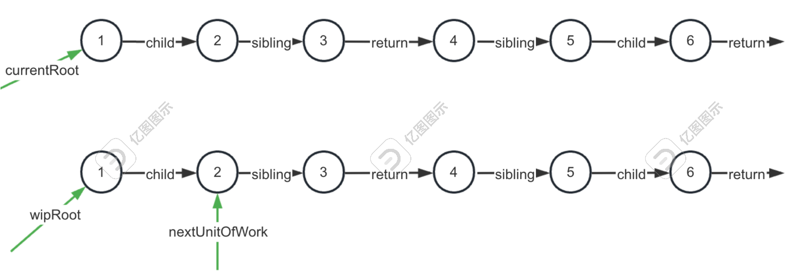

## 62. 手写 mini React 思路分析

fiber 架构原理：Fiber 架构记录 slibling，return 把树变成链表，使用 workInProgress 记录当前处理的 fiber 节点，处理每个 fiber 前判断是否到了固定的时间间隔，也就是时间分片，通过时间分片把处理 fiber 的过程放到多个任务里，这样页面内容多了也不会导致卡顿。
时间分片机制可以直接用浏览器的 requestIdleCallback 的 api 来做。
看 React 的渲染过程：

ReactElement 结构

```js
var ReactElement = function (type, key, ref, self, source, owner, props) {
  var element = {
    $$typeof: REACT_ELEMENT_TYPE,
    type: type,
    key: key,
    ref: ref,
    props: props,
    _onwer: owner,
  };

  return element;
};
```

fiber 节点

```js
function FiberNode(tag, pendingProps, key, mode) {
  this.tag = tag;
  this.key = key;
  this.elementType = null;
  this.type = null;
  this.stageNode = null; // Fiber

  this.return = null;
  this.sibling = null;
  this.index = 0;
  this.ref = null;
  this.pendingProps = pendingProps;
  this.memoizedProps = null;
  this.updateQueue = null;
  this.memoizedState = null;
  this.dependencies = null;
  this.mode = mode; // Effects
}
```

之后会根据 fiber 的类型做不同的处理：

```ts
function beginWork(current, workInProgess, renderLanes) {
  workInProgress.lanes = NoLanes;
  switch (workInProgress.tag) {
    case IndeterminateComponent: {
      return mountIndeterminateComponent(current, workInProgress);
    }

    case LazyComponent: {
    }
    case FunctionComponent: {
      // 执行函数，拿到返回值。继续reconcile他的children
    }
  }
}
```

reconcile 并不只是创建新的 Fiber 节点，当更新的时候，还会和之前的 fiber 节点做 diff，判断是新增，修改，还是删除，然后打上对应的标记
reconcile 之后，就构建出完整的链表，并且每个 fiber 节点上保存了当前的一些额外的信息。（如 effect）
之后会再次遍历构建好的 fiber 链表，处理其中的 effect，根据增删改的标记来更新 dom，这个阶段叫做 commit

整体分为两个大阶段：
reconcile：jsx-》vdom-》fiber，由 scheduler 负责调度，通过时间分片把计算分到多个任务中去。
commit：遍历 fiber，执行其中的 useEffect，增删改 dom
其中 commit 阶段也分为三个小阶段：
beforeMutation：操作 dom 之前
mutation：操作 dom
layout：操作 dom 之后

### 总结

jsx 通过 babel 或 tsc 编译为 render function，执行函数产生 React Element 的树。
React Element 会转化为 Fiber 链表，这一过程叫做 reconcile，由 React 的 scheduler 调度
reconcile 每次只处理一个 fiber 节点，通过时间分片分到多个任务里去跑，这样树再大也不会阻塞渲染
reconcile+scheduler 的过程称为 render，之后会进入 commit 阶段
commit 会将构建好的 fiber 遍历，增删改 dom，并执行 effect
它按更新 dom 前后，分为 before mutation，mutation，layout 三个小阶段。
这就是 React 的 fiber 架构的好处和渲染过程。

## 63.手写 MiniReact：代码实现

```
mkdir mini-react
cd mini-react
npm init -y
npm i --save-dev typescript
npx tsc --init
// 结合inedx.tsx mini-react.js
npx tsc
// 创建index.html
npx http-server .
```

```json
{
  "type": "div",
  "props": {
    "children": [
      {
        "type": "a",
        "props": {
          "href": "xxx",
          "children": [
            {
              "type": "TEXT_ELEMENT",
              "props": {
                "nodeValue": "link",
                "children": []
              }
            }
          ]
        }
      }
    ]
  }
}
```

接下来要把它转成 jsx
需要实现调度机制
我们用`requestIdleCallback`来代替 React 的时间分片，reconcile 对 fiber 对处理放在不同任务跑

```js
let nextUnitOfWork = null;
let wipRoot = null;
let currentRoot = null;
function render(element, container) {
  wipRoot = {
    dom: container,
    props: {
      children: [element],
    },
    alternate: currentRoot,
  };
  nextUnitOfWork = wipRoot;
}
function workLoop(deadLine) {
  let shouldYield = false;
  while (nextUnitOfWork && !shouldYield) {
    nextUnitOfWork = performUnitOfWork(nextUnitOfWork);
    shouldYield = deadline.timeRemaining() < 1;
  }
  if (!nextUnitOfWork && wipRoot) {
    commitRoot();
  }
  requestIdleCallback(workLoop);
}
requestIdleCallback(workLoop);
```

用 `nextUnitOfWork` 指向下一个要处理的 fiber 节点。每次跑的时候判断 timeRemaing 是否接近 0，是的话就中断循环，等下次 requestIdleCallback 的回调在继续处理 nextUnitOfWork 指向的 fiber 节点，这里的 dealine.timeRemaining 是 requestIdleCallback 提供的
render 方法里设置初始 nextUnitWork

render 方法里设置初始化 nextUnitOfWork，这里有两个 root，一个是当前正在处理的 fiber 链表的根`wipRoot`，一个是历史 fiber 链表的根`currentRoot`

为什么有两个 root？

- 初始化渲染生成的 fiber 链表
- 后面 setState 更新会在生成一个新的 Fiber 链表，两个 fiber 链表要做一些对比决定对 dom 节点的增删改，所以都要保存
  

performUnitWork 处理每一个 fiber 节点后，会按照 child，sibling，return 的顺序返回下一个要处理的 fiber 节点,根据函数类型调用不同的 update

```js
let wipFiber = null;
let stateHookIndex = null;
function performUnitWork(nextUnitOfWork) {
  const isFnComp = nextUnitOfWork.type instanceof Function;
  if (isFnComp) {
    updateFunctionComponent(nextUnitOfWork);
  } else {
    updateHostComponent(nextUnitOfWork);
  }

  if (nextUnitOfWork.child) {
    return nextUnitOfWork.child;
  }
  let nextFiber = nextUnitOfWork;
  while (nextFiber) {
    if (nextFiber.sibling) {
      return nextFiber.sibling;
    }
    nextFiber = nextFiber.return;
  }
}

function updateFunctionComponent(fiber) {
  wipFiber = fiber;
  stateHookIndex = 0;
  wipFiber.stateHook = [];
  wipFiber.effectHook = [];
  const children = [fiber.type(fiber.props)];
  reconcileChildren(fiber, children);
}

function updateHostComponent(fiber) {
  if (!fiber.dom) {
    fiber.dom = createDom(fiber);
  }
  reconcileChildren(fiber, fiber.props.children);
}
```

对于函数式组件，判断是否是函数式组件，是传入 props 并使用返回值继续做 reconcile。`wipFiber`是当前处理的节点，`nextUnitOfWork`是下一个要处理的节点。然后用 stateHook 存储 stateHook 的值，用 effectHook 存储 effectHook 的值。
对于原生标签，就是创建它对于的 dom 结点。具体创建过程：

```js
function createDom(fiber) {
  const dom =
    fiber.type === "TEXT_ELEMENT"
      ? document.createTextNode(fiber.props.nodeValue)
      : document.createElement(fiber.type);
  updateDom(dom, {}, fiber.props); // 注入属性方法
  return dom;
}
const isEvent = (key) => key.startsWith("on");
const isProperties = (key) => key !== "children" && !isEvent(key);
const isNew = (prev, next) => (key) => prev[key] !== next[key];
const isGone = (prev, next) => (key) => !(key in next);
function updateDom(dom, prevProps, nextProps) {
  // dom是真实的dom
  //remove old or change eventlistener
  Object.keys(pervProps)
    .filter(isEvent)
    .filter((key) => !(key in nextProps) || isNew(prevProps, nextProps)(key))
    .forEach((name) => {
      const eventType = name.toLowerCase().substring(2);
      dom.removeEventListener(eventType, pervProps[name]);
    });
  // remove old properties
  Object.keys(pervProps)
    .filter(isProperties)
    .filter(isGone(pervProps, nextProps))
    .forEach((name) => {
      dom[name] = "";
    });
  // add new or change properties
  Object.keys(nextProps)
    .filter(isProperties)
    .filter(isNew(prevProps, nextProps))
    .forEach((name) => {
      dom[name] = nextProps[name];
    });
  // add new Event
  Object.keys(nextProps)
    .filter(isEvent)
    .filter(isNew(prevProps, nextProps))
    .forEach((name) => {
      const eventType = name.toLowerCase().substring(2);
      dom.addEventListener(eventType, nextProps[name]);
    });
}
```

根据节点类似创建 dom，在根据前后的 props 更新 dom 的属性
元素或者函数式组件都 reconcile 完了，继续处理他们的子节点：
首先，拿到 alternate 的 child，依次取出 sibling，逐一和新的 fiber 节点对比
然后根据对比结果创建新的 fiber 节点，也是先 child 后 sibling
diff 的方式：类型是否相同【UPDATE】，新节点是否存在【PLACEMENT】，类型不同+类型存在【DELETIONS】

```js
let deletions = null; //要删除的节点
function render(element, container) {
  wipRoot = {
    dom: container,
    props: {
      children: [element],
    },
    alternate: currentRoot,
  };
  deletions = [];
  nextUnitOfWork = wipRoot;
}
function reconcileChildren(wipFiber, elements) {
  let index = 0;
  let oldFiber = wipFiber.alternate?.child;
  let prevSibling = null;
  while (index < elements.length || oldFiber) {
    const element = elements[index];
    const sameType = element?.type == oldFiber?.type;
    let newFiber;
    if (sameType) {
      newFiber = {
        type: oldFiber.type,
        props: element.props,
        dom: oldFiber.dom,
        return: wipFiber,
        alternate: oldFiber,
        effectTag: "UPDATE",
      };
    }
    if (element && !sameType) {
      newFiber = {
        type: element.type,
        props: element.props,
        dom: null,
        return: wipFiber,
        alternate: null,
        effectTag: "PLACEMENT",
      };
    }
    if (oldFiber && !sameType) {
      oldFiber.effectTag = "DELETION";
      deletions.push(oldFiber);
    }
    if (oldFiber) {
      oldFiber = oldFiber.sibling;
    }

    if (index == 0) {
      wipFiber.child = newFiber;
    } else if (element) {
      prevSibling.sibling = newFiber;
    }
    pervSibling = newFiber;
    index++;
  }
}
```

这样，从 wipRoot 开始，逐渐 reconcile 构建新的 fiber 机诶单。根据 FunctionComponent 还是原生标签 HostComponent 来分别执行函数和创建 dom，并且还对新旧的 fiber 节点做了 diff，搭上增删改标记。

现在，函数式组件可能会调用 useState 或者 useEffect，我们也要实现一下

```js
let stateHookIndex = null;
function useState(initalState) {
  const currentFiber = wipFiber;
  const oldHook = wipFiber.alternate?.stateHooks[stateHookIndex]; // 2.state的初始值是前面一次渲染的state值，也就是取alternate的同一位置的state
  const stateHook = {
    state: oldHook ? oldHook.state : initalState,
    queue: oldHook ? oldHook.queue : [],
  };
  stateHook.forEach((action) => {
    stateHook.state = action(stateHook.state);
  });
  stateHook.queue = [];
  stateHookindex++;
  wipFiber.stateHooks.push(stateHook); // 1.每次调用useState时会在stateHooks添加一个元素来保存state
  function setState(action) {
    const isFunction = typeof action === "function";
    stateHook.queue.push(isFunction ? action : () => action);
    wipRoot = {
      ...currentFiber,
      alternate: currentFiber,
    };
    nextUnitOfWork = wipRoot;
  }
  return [stateHook.state, setState];
}
```

然后是 useEffect

```js
function useEffect(callback, deps) {
  const effectHook = {
    callback,
    deps,
    cleanup,
  };
  wipFiber.effectHooks.push(effectHook);
}
```

这样，等 reconcile 结束，fiber 链表就构建好了，在 fiber 上打上了增删改的标记，并且也保存了要执行的 effect。接下来只要遍历这个构建好的 fiber 链表，执行增删改和 effect 函数就好了。
这个阶段是 commit
我们只需要在 reconcile 结束，没有 nextUnitOfWork 的时候执行 commit 就行了：

```js
function workloop(deadline) {
  let shouldYield = false;
  while (nextUnitOfWork && !shouldYield) {
    nextUnitOfWork = performUnitOfWork(nextUnitOfWork);
    shouldYield = dealine.timeRemaining() < 1;
  }
  if (!nextUnitOfWork && wipRoot) {
    commitRoot();
  }
  requestIdleCallback(workLoop);
}
```

在 commitRoot 中，我们需要把删除的节点都删掉，然后遍历 Fiber 链表，处理其他节点

```js
function commitRoot() {
  deletions.forEach(commitWork);
  commitWork(wipRoot.child);
  currentRoot = wipRoot;
  wipRoot = null;
  deletions = [];
}

function commitWork(fiber) {
  if (!fiber) {
    return;
  }
  // 找到顶层祖先的fibler，执行操作
  let parentFiber = fiber.return;
  while (!parentFiber.dom) {
    parentFiber = parentFiber.return;
  }
  let domParent = parentFiber.dom;
  if (fiber.effectTag === "PLACEMENT" && fiber.dom !== null) {
    domParent.appendChild(fiber.dom);
  } else if (fiber.effectTag === "UPDATE" && fiber.dom !== null) {
    updateDom(fiber.dom, fiber.alternate.props, fiber.props);
  } else if (fiber.effectTag === "DELETION") {
    commitDeletion(fiber, domParent);
  }
  commitWork(fiber.child);
  commitWork(fiber.sibling);
}

function commitDeletion(fiber, domParent) {
  if (fiber.dom) {
    domParent.removeChild(fiber.dom);
  } else {
    commitDeletion(fiber.child, domParent);
  }
}
```

此外处理 useEffect

```js
function commitRoot() {
  deletions.forEach(commitWork);
  commitWork(wipRoot.child);
  commitEffectHooks();
  currentRoot = wipRoot;
  wipRoot = null;
}
```

commitEffectHook 同样要遍历一遍 fiber，先执行一遍 clearup，在重新执行一遍 useEffect

```js
function commitEffectHooks() {
  function runCleanup(fiber) {
    if (!fiber) {
      return;
    }
    fiber.alternate?.effectHooks?.foreach((hook, index) => {
      const deps = fiber.effectHooks[index];
      if (!hook.deps || isDeepEqual(hook.deps, deps)) {
        hook.cleanup?.();
      }
    });
    runCleanup(fiber.child);
    runCleanup(fiber.sibling);
  }
  function run(fiber) {
    if (!fiber) {
      return;
    }
    fiber.effectHooks.forEach((newHook, index) => {
      if (!fiber.alternate) {
        hook.cleanup = hook.callback(); // hook? todo
        return;
      }
      if (!newHook.deps) {
        hook.cleanup = hook.callback();
      }
      if (newHook.deps.length > 0) {
        const oldHook = fiber.alternate?.effectHooks[index];
        if (!isDeepEqual(oldHook.deps, newHook.deps)) {
          newHook.cleanup = newHook.callback();
        }
      }
    });
    //遍历现在的effectHooks 没有alternate-执行返回；fiber没有依赖，执行；有依赖对比长度再看
    run(fiber.sibling);
    run(fiber.child);
  }
  runCleanup(wipRoot);
  run(wipRoot);
}

function isDepsEqual(deps, newDeps) {
  if (deps.length !== newDeps.length) {
    return false;
  }

  for (let i = 0; i < deps.length; i++) {
    if (deps[i] !== newDeps[i]) {
      return false;
    }
  }
  return true;
}
```

这样，导出 MiniReact 的所有函数

```js
(function () {
  const MiniReact = {
    createElement,
    render,
    useState,
    useEffect,
  };
  window.MiniReact = MiniReact;
})();
```

### 总结

实现 createElement，
render 为渲染 vdom，
使用 scheduler 机制去从 wipRoot 去 reconcile，nextUnitOfWork 不存在之后，去 commitRoot();
reconcile 递归的顺序是 child，sibling；根据 type 是否是函数式还是原生，是 reconcile 子节点
commitRoot 实现去增删改 dom，执行 effect 的副作用
