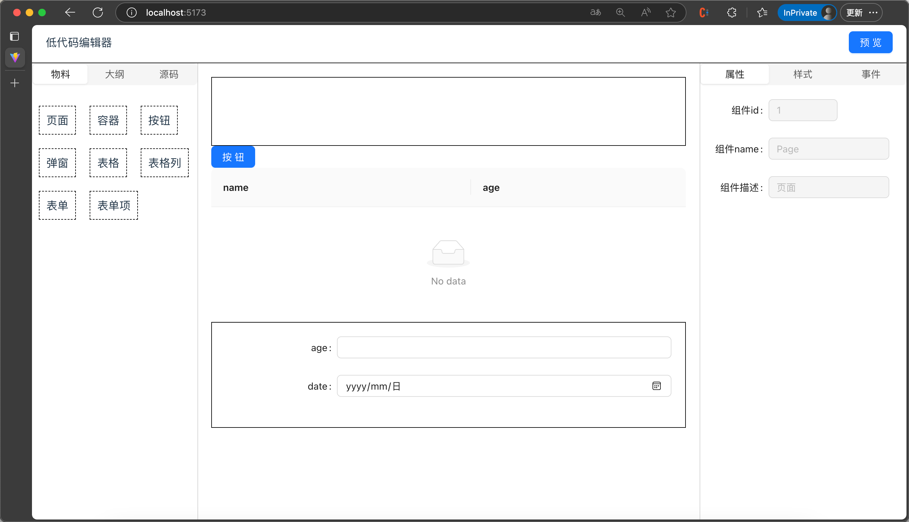
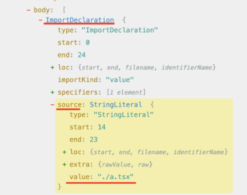

## 53.ReactPlayground 项目实战

需求：左边写代码，右边可以实时预览，右边可以看到编译后的代码


实现思路：
首先是编译，@babel/standalone,babel 的浏览器版本，可以见 tsx 编译成 js
安装

```cmd
npm i --save @babel/standalone
npm i --save-dev @types/babel_standalone
```

体验

```tsx
export function TestBabel() {
  const textAreaRef = useRef(null);

  const code = `import { useEffect, useState } from "react";

  function App() {
    const [num, setNum] = useState(() => {
      const num1 = 1 + 2;
      const num2 = 2 + 3;
      return num1 + num2
    });
  
    return (
      <div onClick={() => setNum((prevNum) => prevNum + 1)}>{num}</div>
    );
  }
  
  export default App;
    `;
  const compile = () => {
    if (!textAreaRef.current) {
      return;
    }
    const res = transform(textAreaRef.current.value, {
      presets: ["react", "typescript"],
      filename: "guang.tsx",
    });
    console.log(res.code);
  };
  return (
    <>
      <textarea
        ref={textAreaRef}
        style={{ width: "500px", height: "300px" }}
        defaultValue={code}
      ></textarea>
      <button onClick={compile}>编译</button>
    </>
  );
}
```

但编译的代码不能跑，主要是 import 语句这里，我们可以把一段 JS 代码，用 URL.createObjectUrl(new Blob(code,{type:'application/javascript'}))

所以如何编译呢，我们维护 App.tsx 通过 URL.createObjectUrl 变为一个 blob url,替换 import 的路径，使用 babel 插件。

babel 编译的阶段 `parse`/`transform`/`generate`
只要在对 Importdeclaration 的 AST 做处理，把 source.value 替换为对应文件的 blob url 就行了

比如这样写

```tsx
function App() {
  const code1 = `function add(a, b) {
        return a + b;
    }
    export { add };`;
  const url = URL.createObjectURL(
    new Blob(code1, { type: "application/javascript" })
  );
  const code = `import {add} from './add.ts';console.log(add)`;
  const transformImportSourcePlugin: PluginObject = {
    visitor: {
      ImportDeclaration(path) {
        path.node.source.value = url;
      },
    },
  };
  function onClick() {
    const res = transform(code, {
      persets: ["react", "typescript"],
      fileName: "guang.ts",
      plugins: [transformImportSourcePlugin],
    });
    console.log(res.code);
  }
  return (
    <div>
      <button onClick={onClick}>编译</button>
    </div>
  );
}
export default App;
```

这里用 babel 插件的方式对 import 的 source 做替换，用到的`npm i --save-dev @types/babel__core`,把 ImportDeclaration 的 source 的值改为 blob url

下一个问题：如果引入的是 react 和 react-dom 的包，这些也不是在左侧写的代码，这时候可以用 import maps 的机制

```html
<script type="importmap">
  {
    "imports": {
      "react": "https://esm.sh/react@18.2.0"
    }
  }
</script>
<script type="module">
  import React from "react";
  console.log(React);
</script>
```

编辑器部分怎么做？
安装 `npm install @monaco-editor/react`
体验

```tsx
export function testEditor() {
  const code = `import { useEffect, useState } from "react";

function App() {
    const [num, setNum] = useState(() => {
        const num1 = 1 + 2;
        const num2 = 2 + 3;
        return num1 + num2
    });

    return (
        <div onClick={() => setNum((prevNum) => prevNum + 1)}>{num}</div>
    );
}

export default App;
`;
  return (
    <Editor
      height="500px"
      defaultLanguage="javascript"
      defaultValue={code}
    ></Editor>
  );
}
```

预览部分，iframe，加通讯机制，左边编辑器的结果，编译后传递到 iframe 渲染

```tsx
import React from "react";
import iframeRaw from "./iframe.html?raw";
const iframeUrl = URL.createObjectURL(
  new Blob[(iframeRaw, { type: "text/html" })]()
);
const Preview = () => {
  return (
    <>
      <iframe
        src={iframeUrl}
        style={{ height: "100%", width: "100%", padding: 0, border: "none" }}
      ></iframe>
    </>
  );
};
export default Preview;
```

```html
<!DOCTYPE html>
<html lang="en">
  <head>
    <meta charset="UTF-8" />
    <meta name="viewport" content="width=device-width, initial-scale=1.0" />
    <title>Preview</title>
    <style>
      * {
        padding: 0;
        margin: 0;
      }
    </style>
  </head>
  <body>
    <script type="importmap">
      {
        "imports": {
          "react": "https://esm.sh/react@18.2.0",
          "react-dom/client": "https://esm.sh/react-dom@18.2.0"
        }
      }
    </script>
    <script></script>
    <script type="module">
      import React, { useState, useEffect } from "react";
      import ReactDOM from "react-dom/client";

      const App = () => {
        return React.createElement("div", null, "aaa");
      };

      window.addEventListener("load", () => {
        const root = document.getElementById("root");
        ReactDOM.createRoot(root).render(React.createElement(App, null));
      });
    </script>

    <div id="root">
      <div
        style="position:absolute;top: 0;left:0;width:100%;height:100%;display: flex;justify-content: center;align-items: center;"
      >
        Loading...
      </div>
    </div>
  </body>
</html>
```

### 总结

分析 playground 的实现思路
import
import maps
编辑器
iframe

## 54.ReactPlayground 布局、代码编辑器

布局可拖拽
`npm install --save allotment`

代码编辑器

- 传入`EditorFile{name,value,language}`

- Editor 的 onMount 处理 jsx 提示处理 +cmd 处理+ts 提示+ata 自动下载

- EditorProps 有如下属性 file,onChange,options

- Editor 的样式 options[预览图、滚动条]

- 根据内容下载对应包的.d.ts 文件 `npm install --save @typescript/ata -f`

## 55.ReactPlayground 多文件切换

要实现多文件切换，右侧 preview 也要拿到数据，如何实现多文件共享数据，要用到 context
PlaygroundContext.ts

```ts
interface File {
  name:string,
  value:string,
  language:string
}
export interface Files {
  [key:string]:File
}
interface PlaygroundContextProps {
  files:Files，
  selectedFiles:string,
  setSelectedFileName:(f:string)=>void,
  setFile:(f:File)=>void,
  addFile:(f:string)=>void，
  removeFile:(f:string)=>void,
  updateFileName:(oldF:string,newF:string)=>void
}

export const context = createContext<PlaygroundContextProps>({
selectedFiles:'App.tsx'
} as PlaygroundContextProps)
```

提供一个 PlaygroundProvider

- 设计 `props value = {Files,selectedFile,setFiles,setSelectedFile,addFile,removeFile,updateFile }`
- mock 文件 files 作为 provider 的初始值
- 设计 tab 切换，样式,+优化横向滚动条
- 实现 fileName2language
- 更改文件内容时需要在 editChange 更新 Files + lodash `npm install --save lodash-es  npm install --save-dev @types/lodash-es`

## 56.ReactPlayground 的 babel 编译、iframe 预览

左边编辑，右边编译和预览

使用 babel 的 transform 进行编译

```ts
// Preview/compiler.ts
import {transform} from '@babel/standalone'
export const babelTransform = (filename:string,code:string,file:File) {
  let result = '';
  try{
   result = transform(code,{
    presets:['react','typescript'],
    fileName,
    plugins:[],
    retainLines:true
  }).code!
  } catch (e) {
    console.error('compiler error',e)
  }
}
```

在 Perview 引入使用

```tsx
const { files } = useContext(PlaygroundContext);

const [compilerCode, setCompilerCode] = useState("");
useEffect(() => {
  console.log(["preview"]);
  const c = compiler(files);
  setCompilerCode(c);
}, [files]);
return (
  <div style={{ height: "100%" }}>
    <EditorView
      file={{ name: "dist.js", value: compilerCode, language: "javascript" }}
    ></EditorView>
  </div>
);
```

需要知道

- `Perview`组件要实现 1.渲染 iframe，iframe 的地址是 state 变更，getIframeUrl；2.compileCode 是 state 变更；3.需要实现 compile(files,path)
- import React 通过 importmap 实现
- import ‘./App.tsx'通过 transform 的时候，添加 plugins 控件修改 `path.node.source.value`实现修改引入，
- import ’./App'需要通过 transform(path,code,files)实现转化 jsx 为 createElement
- import './App.css'通过执行一段立即执行函数，实现函数`css2js`
- import './import-map.json'修改成`import default ${file.name}` 实现函数`json2js`
- custPlugin 在 babelTransform 里， custPlugin 会解析`jsx/tsx`会递归 babelTransform
- beforeTransfrom 对没有引入 React 进行处理，需要前置处理

## 57.实现文件的增删改

fileItem 实现双击切换编辑

```tsx
export function FileNameItem(props: FileNameItemProps) {
  const { onEditComplete } = props;

  const [isEdit, setIsEdit] = useState(create);
  const inputRef = useRef(null);

  const handleDoubleClick = (e) => {
    setIsEdit(true);
    setTimeout(() => {
      inputRef.current?.focus();
    });
  };

  return (
    <div className={cs} onClick={onClick}>
      {isEdit ? (
        <div>
          <input
            ref={inputRef}
            className={styles["tabs-item-input"]}
            onChange={(e) => {
              setName(e.target.value);
            }}
            onBlur={(e) => {
              setIsEdit(false);
              onEditComplete(name);
            }}
          ></input>
        </div>
      ) : (
        <>
          <span onDoubleClick={handleDoubleClick}>{name}</span>
        </>
      )}
    </div>
  );
}

// FileList.tsx
<FileNameItem
  onEditComplete={(newFile) => {
    console.log(v, newFile);
    updateFileName(v, newFile);
    setSelectedFileName(newFile);
  }}
></FileNameItem>;
```

添加

```tsx
const addTab = () => {
  const name = "Comp" + Math.random().toString().slice(2, 8) + ".tsx";
  addFile(name);
  setSelectedFileName(name);
  setCreate(true);
};

<FileNameItem
  onEditComplete={(newFile) => {
    console.log(v, newFile);
    updateFileName(v, newFile);
    setSelectedFileName(newFile);
    setCreate(false);
  }}
></FileNameItem>;

// FileItem.tsx
export function FileNameItem(props: FileNameItemProps) {
  const {
    value,
    active = false,
    create,
    readonly,
    onClick,
    onEditComplete,
    onRemove,
  } = props;
  const [name, setName] = useState(value);
  const [isEdit, setIsEdit] = useState(create);
  useEffect(() => {
    if (create) {
      inputRef.current?.focus();
    }
  }, [create]);
  return (
    <div className={cs} onClick={onClick}>
      {isEdit ? (
        <div>
          <input
            ref={inputRef}
            value={name}
            className={styles["tabs-item-input"]}
            onChange={(e) => {
              setName(e.target.value);
            }}
            onBlur={(e) => {
              setIsEdit(false);
              onEditComplete(name);
            }}
          ></input>
        </div>
      ) : (
        <>
          <span onDoubleClick={handleDoubleClick}>{name}</span>
        </>
      )}
    </div>
  );
}
```

删除

```tsx
// FileList.tsx
    <FileNameItem
              readonly={READ_ONLY.includes(v)}
              active={v === selectedFiles}
              onRemove={(e) => {
                e.stopPropagation();
                removeFile(v);
                setSelectedFileName(ENTRY_FILE_NAME);
              }}></FileNameItem>

// FileItem.tsx
export function FileNameItem(props: FileNameItemProps) {
  const {
    readonly,
    onRemove,
  } = props;
  return (
    <div
      {isEdit ? (
        <div>
          <input
          ></input>
        </div>
      ) : (
        <>
          <span onDoubleClick={readonly?()=>{}:handleDoubleClick}>{name}</span>

          {!readonly&&<span style={{ marginLeft: 5, display: "flex" }} onClick={onRemove}>
            <svg width="12" height="12" viewBox="0 0 24 24">
              <line stroke="#999" x1="18" y1="6" x2="6" y2="18"></line>
              <line stroke="#999" x1="6" y1="6" x2="18" y2="18"></line>
            </svg>
          </span>}
        </>
      )}
    </div>
  );
}
```

## 58.ReactPlayground 项目实战：错误显示、主题切换

- iframe 预览失败，显示
- 依赖引入失败，提示

新增 Message.tsx

```tsx
interface MessageProps {
  type: "error" | "warning";
  content: string;
}
export const Message = (props: MessageProps) => {
  const { type, content } = props;
  const [isVisible, setIsVisible] = useState(false);
  useEffect(() => {
    setIsVisible(!!content);
  }, [content]);
  return (
    <>
      {isVisible ? (
        <div className={classNames(style.msg, style[type])}>
          <pre dangerouslySetInnerHTML={{ __html: content }}></pre>
          <button
            className={classNames(style.dismiss)}
            onClick={() => setIsVisible(false)}
          >
            x
          </button>
        </div>
      ) : (
        ""
      )}
    </>
  );
};
```

```scss
.msg {
  position: absolute;
  right: 8px;
  bottom: 0;
  left: 8px;
  z-index: 10;

  display: flex;
  max-height: calc(100% - 300px);
  min-height: 40px;
  margin-bottom: 8px;
  color: var(--color);

  background-color: var(--bg-color);
  border: 2px solid #fff;
  border-radius: 6px;

  border-color: var(--color);

  &.error {
    --color: #f56c6c;
    --bg-color: #fef0f0;
  }

  &.warn {
    --color: #e6a23c;
    --bg-color: #fdf6ec;
  }
}

pre {
  padding: 12px 20px;
  margin: 0;
  overflow: auto;
  white-space: break-spaces;
}

.dismiss {
  position: absolute;
  top: 2px;
  right: 2px;

  display: block;
  width: 18px;
  height: 18px;
  padding: 0;

  font-size: 9px;
  line-height: 18px;
  color: var(--bg-color);

  text-align: center;
  cursor: pointer;
  background-color: var(--color);
  border: none;
  border-radius: 9px;
}
```

错误内容从何而来 iframe 里传出来

```html
<script>
  window.addEventListener("error", (e) => {
    window.parent.postMessage({ type: "ERROR", message: e.message });
  });
</script>
```

preview 监听错误

```tsx
// Preview.ets
useEffect(() => {
  window.addEventListener("message", handleMessage);
  return () => {
    window.removeEventListener("message", handleMessage);
  };
}, []);
```

主题切换
context 声明添加，provider 实现，index.tsx 引入初始化

```tsx
theme, setTheme;
```

scss 中

```
.light {
    --text: #444;
    --bg: #fff;
}
.dark {
    --text: #fff;
    --bg: #1a1a1a;
}
// 其他地方
background:var(--bg)
color:var(--text)
```

header 添加切换按钮

```tsx
<div>
  {theme === "light" && (
    <MoonOutlined
      className={styles[theme]}
      title="切换暗示主题"
      onClick={() => setTheme("dark")}
    ></MoonOutlined>
  )}
  {theme === "dark" && (
    <SunOutlined
      title="切换亮色主题"
      className={styles[theme]}
      onClick={() => setTheme("light")}
    ></SunOutlined>
  )}
</div>
```

编辑器的黑白样式

```tsx
<Editor options={{ theme: `vs-${theme}` }}></Editor>
```

## 59.ReactPlayground 文件分享

原理：
点击分享，把文件转成 hash，加到粘贴板上。
初始化从 url 的 hash 上拿下来进行初始化
文件太大需要压缩 ，使用`npm i --save fflate`

```ts
// 压缩方法
const compress = (code: string) => {
  const buffer = strToU8(code);
  const zipped = zlibSync(buffer, { level: 9 });
  const str = strFromU8(zipped, true); // 二进制字符串
  return btoa(str); // 二进制字符串转ascii
};

const uncompress = (base64: string) => {
  const binary = atob(base64); // 二进制字符串
  const buffer = strToU8(binary, true);
  const upzipped = unzlibSync(buffer);
  return strFromU8(upzipped);
};
```

```tsx
// PlaygroundProvider.tsx
useEffect(() => {
  const hash = compress(JSON.stringify(files));
  window.location.hash = hash;
}, [files]);
```

```tsx
// PlaygroundProvider.tsx 初始化
function getFileFromUrl() {
  const hash = window.location.hash.slice(1);
  let files;
  try {
    const str = uncompress(hash);
    files = JSON.parse(str);
  } catch (e) {}
  return files;
}
const [files, setFiles] = useState(getFileFromUrl() || initFiles);
```

Header 里加个按钮

```tsx
import copy from 'copy-to-clipboard'
console.log(styles);
export function Header() {
  const { theme, setTheme } = useContext(PlaygroundContext);
  return (
    <div className={styles.header} style={{ borderBottom: "1px solid #000" }}>
      <div className={styles.logo}>
        </img>
        <span>React Playground</span>
      </div>
      <div>{theme === "light" && <MoonOutlined className={styles[theme]} title="切换暗示主题" onClick={()=>setTheme('dark')}></MoonOutlined>}
        {theme === "dark" && <SunOutlined title="切换亮色主题" className={styles[theme]}  onClick={()=>setTheme('light')}></SunOutlined>}
      </div>
      <ShareAltOutlined onClick={()=>{
        copy(window.location.href);
        message.success('复制成功')
      }}></ShareAltOutlined>
    </div>
  );
```

实现文件下载功能

- 实现打包成 zip `npm install --save jszip`
- 触发代码下载`file-saver` `npm install --save file-saver npm install --save-dev @types/file-saver`

```ts
//utils.ts
async function downFiles(files: Files) {
  const zip = new JSzip();
  Object.keys(files).forEach((key) => {
    zip.file(key, files[key].value);
  });
  const blob = await zip.generateAsync({ type: "blob" });
  saveAs(blob, `code.zip`);
}
```

## 60 Playground 实战 使用 webworker 优化

这节我们做下性能优化

performance 发现有 long task，性能优化的目标是消除 long task.

怎么实现？

worker 的用法，文件名字改为 compiler.worker.ts,

在 Perview 组件中`import worker from 'compiler.worker?worker'`导入

```tsx
import CompilerWorker from "./worker.compiler?worker";

const compilerWokrerRef = useRef<Worker>();
useEffect(() => {
  if (!compilerWorkerRef.current) {
    compilerWorkerRef.current = new CompilerWorker();
    compilerWorkerRef.current.addEventListener("message", (e) => {
      if (data.type === "COMPILED_CODE") {
        setCompilerCode(data.data);
      } else {
        console.log("error", data.data);
      }
    });
  }
}, []);

useEffect(
  debounce(() => {
    console.log(["debounce post to worker"]);
    /* const c = compiler(files);
    setCompilerCode(c); */
    compilerWorkerRef.current?.postMessage(files);
  }, 500),
  [files]
);
```

```tsx
// compiler.wroker.ts
self.addEventListener('message',({data})=>{
try{
self.postMessage({Ï
type:'COMPILED_CODE',
data:compiler(data)
})
} catch(e) {
self.postMessage({
type:'ERROR',
data:e
})
}
})
```

最终项目成型：
