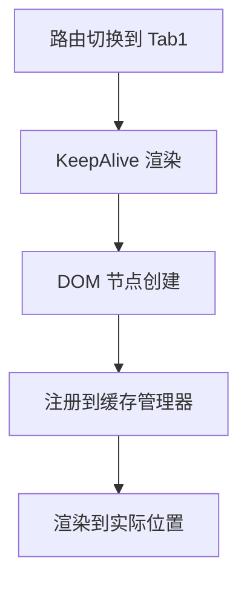
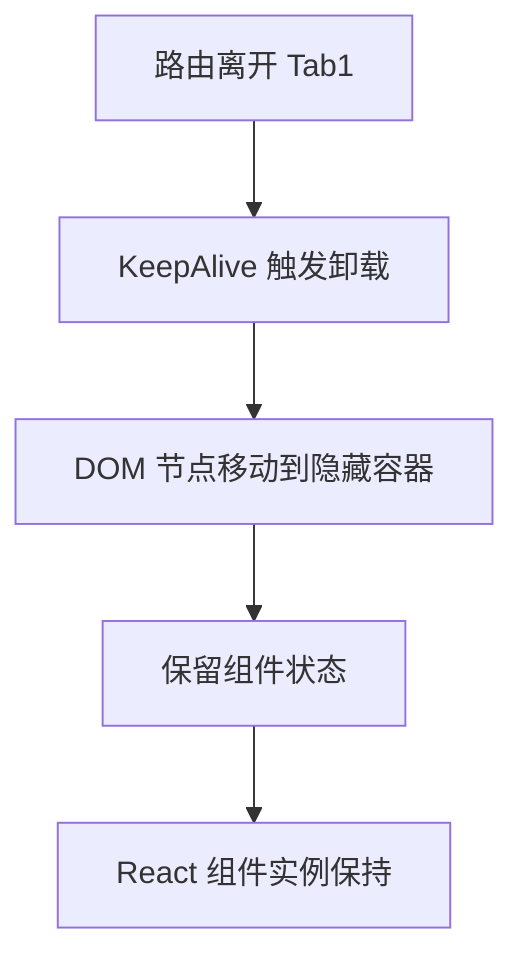
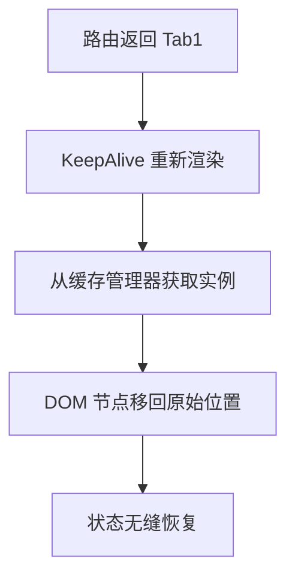

# react 中 keepAlive 的实现

## 三方库 `react-activation`

### 核心原理

1. 双容器架构(AliveScope+KeepAlive)

```tsx
<AliveScope>
  <KeepAlive name="PageA">
    <Route path="/pageA" component={PageA} />
  </KeepAlive>
</AliveScope>
```

2. DOM 节点转移技术（核心创新）

```tsx
// 伪代码实现
function cacheComponent(componentNode) {
  // 1. 从原始位置移除 DOM 节点
  const originalParent = componentNode.parentNode;
  originalParent.removeChild(componentNode);

  // 2. 存储到缓存容器
  cacheContainer.appendChild(componentNode);
}

function restoreComponent(componentNode) {
  // 1. 从缓存容器移除
  cacheContainer.removeChild(componentNode);

  // 2. 放回原始位置
  originalParent.appendChild(componentNode);
}
```

- 当组件需要缓存时，将其 DOM 节点物理转移到隐藏容器
- 恢复时在移动到原始位置
- 保留真实 DOM 状态：表达输入、滚动位置

3. 声明周期管理

```jsx
class KeepAlive extends React.Component {
  componentDidMount() {
    // 注册缓存组件
    this.id = registerCache(this.props.name, this);
  }

  componentWillUnmount() {
    // 销毁缓存
    unregisterCache(this.id);
  }

  render() {
    return (
      <div ref={this.containerRef} /* 占位容器 */>
        {shouldRender && this.props.children}
      </div>
    );
  }
}
```

### 核心工作流程

1. 创建容器

```jsx
<AliveScope>
  {/* 创建隐藏容器 */}
  <div style={{ display: "none" }} ref={cacheContainerRef} />
  <KeepAlive name="Tab1">
    <Tab1 />
  </KeepAlive>
</AliveScope>
```

2. 缓存激活流程



3. 缓存失活



4. 恢复激活



## 简易小型应用实现

- keepAlive 的组件全部保存到一个全局对象
- 路由切换实现切换隐藏

```tsx
type KeepAliveContextType = Omit<Required<KeepAliveLayoutProps>, "children">;

const keepElements: KeepAliveContextType["keepElements"] = {};
// keepAlive.tsx
interface KeepAliveLayoutProps extends PropsWithChildren {
  keepPaths: Array<string | RegExp>;
  keepElements?: Record<string, ReactNode>;
  dropByPath?: (path: string) => void;
}
const isKeepPath = (keepPaths: Array<string | RegExp>, path: string) => {
  let isKeep = false;
  for (let i = 0; i < keepPaths.length; i++) {
    let item = keepPaths[i];
    if (item === path) {
      isKeep = true;
    }
    if (item instanceof RegExp && item.test(path)) {
      isKeep = true;
    }
    if (typeof item === "string" && item.toLowerCase() === path) {
      isKeep = true;
    }
  }
  return isKeep;
};
export function useKeepOutlet() {
  const location = useLocation();
  const element = useOutlet();

  const { keepElements, keepPaths } = useContext(KeepAliveContext);
  const isKeep = isKeepPath(keepPaths, location.pathname);

  if (isKeep) {
    keepElements![location.pathname] = element;
  }

  return (
    <>
      {Object.entries(keepElements).map(([pathname, element]) => (
        <div
          key={pathname}
          style={{
            height: "100%",
            width: "100%",
            position: "relative",
            overflow: "hidden auto",
          }}
          className="keep-alive-page"
          hidden={!matchPath(location.pathname, pathname)}
        >
          {element}
        </div>
      ))}
      {!isKeep && element}
    </>
  );
}

const KeepAliveLayout: FC<KeepAliveLayoutProps> = (props) => {
  const { keepPaths, ...other } = props;
  const { keepElements, dropPaths } = useContext(KeepAliveContext);
  return;
  <KeepAliveContext.Provider
    value={{ keepPaths, keepElements, dropPath }}
    {...other}
  />;
};
```

使用

```tsx
const Layout = () => {
    const { pathname } = useLocation();

    return (
        <div>
            <div>当前路由: {pathname}</div>
            <Outlet/>
        </div>
    )
}

const Aaa = () => {
    const [count, setCount] = useState(0);

    return <div>
      <p>{count}</p>
      <p>
        <button onClick={() => setCount(count => count + 1)}>加一</button>
      </p>
      <Link to='/bbb'>去 Bbb 页面</Link><br/>
      <Link to='/ccc'>去 Ccc 页面</Link>
    </div>
};

const Bbb = () => {
    const [count, setCount] = useState(0);

    return <div>
      <p>{count}</p>
      <p><button onClick={() => setCount(count => count + 1)}>加一</button></p>
      <Link to='/'>去首页</Link>
    </div>
};

const Ccc = () => {
    return <div>
      <p>ccc</p>
      <Link to='/'>去首面</Link>
    </div>
};

const routes = [
  {
    path: "/",
    element: <Layout></Layout>,
    children: [
      {
        path: "/",
        element: <Aaa></Aaa>,
      },
      {
        path: "/bbb",
        element: <Bbb></Bbb>
      },
      {
        path: "/ccc",
        element: <Ccc></Ccc>
      }
    ]
  }
];
function App(){
  return <KeepAliveLayout  keepPaths={['aaa','bbb']}>
    <RouterProvider router={router}></RouterProvider>
  <KeepAliveLayout/>
}
```

### 方案评价

### 优势

1. 轻量简洁
2. 灵活配置
3. 无缝集成

### 潜在问题

1. 内存泄漏风险
   - 缓存组件持续增长，无自动清理机制
   - 添加 LRU
2. 性能问题
   - 所有都缓存 DOM
   - 大项目导致 DOM 过多
   - 解决方案：虚拟化渲染
3. 状态管理缺失
   - 声明周期
   - 无法订阅副作用
   - 解决方案：添加声明周期钩子
4. 路由参数处理
   - 当前使用完整路径
   - `product/1` `product/2`会创建独立缓存
   - 造成内存浪费

### 优化

```tsx
// 添加缓存清理机制
useEffect(() => {
  const keys = Object.keys(keepElement);
  if (keys.length > MAX_CACHE_SIZE) {
    const oldestKey = keys[0];
    dropPath(oldestKey);
  }
}, [keepElement]);

// 添加生命周期管理
useEffect(() => {
  if (isKeep) {
    // 触发组件激活钩子
    keepElement[pathname]?.__keepAliveHook?.activate?.();
  }
  return () => {
    // 触发组件失活钩子
    keepElement[pathname]?.__keepAliveHook?.deactivate?.();
  };
}, [isKeep, pathname]);
```
