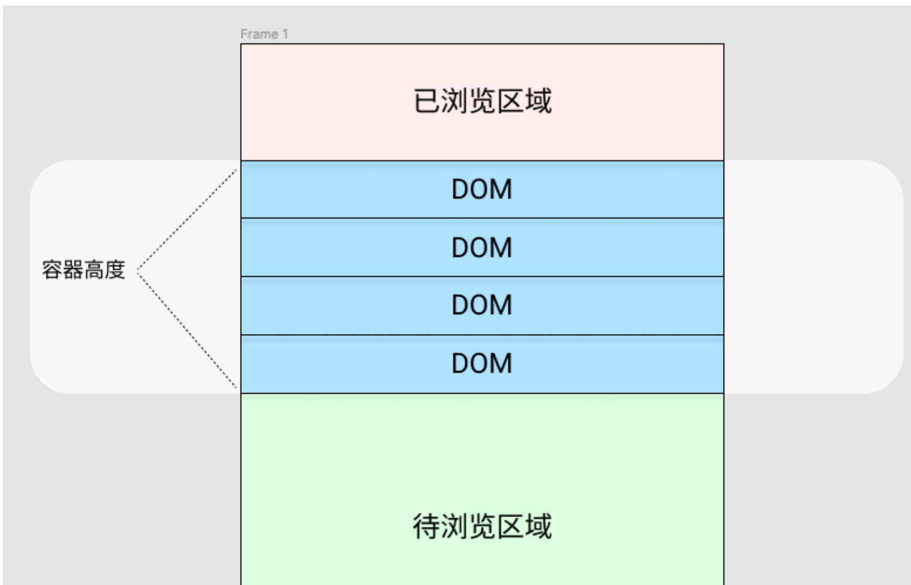

# 场景题

支付场景怎么实现。

## 如何通知用户更新？

考察：客户端与服务端通信机制的理解。不同场景下选择不同技术方案的能力。
核心原则上：保持版本的一致性，减少对用户的干扰。
方案 1:轮训

- 主动获取
- 缺点：浪费服务端资源

方案 2:webscoket

- 客户端订阅，服务端推送
- 场景：管理后台应用

方案 3:service worker

```js
if('serviceWorker' in navigator){
    window.addEventListener('load',()=> {
        navigator.serviceWorker.register('./serviceWorker.js').then(registration=>{
            console.log(`service work success: ${registration}`)
            registration.addEventListener('updatefound',()=>{
                let newWorker = registration.installing;
                newWorker.addEventListener('statechange',()=>{
                    if(newWorker.state === 'installled' && navigator.serviceWorker.controller) {
                        showUpdateNotificationFowSW(event.data.newVersion) // 弹窗，点击刷新，postMessage
                    }
                }
        },error=>{
            console.log(`service work error: ${error}`)
        });
    }, false);
}
    navigator.serviceWorker.addEventListner('message',event=>{
        if(event.data && event.data.type && event.data.type === 'update'){
            showUpdateNotificationFowSW(event.data.newVersion) // 弹窗，点击刷新，postMessage
        }
    })
}
```

## 虚拟列表的实现
虚拟列表的核心思想是只**渲染可视区域内的元素**。通过动态计算和位置调整模拟完整的列表的滚动效果。

## 核心概念
1. 视口：用户实际看得到的区域
2. 列表总高度
3. 渲染窗口：可视区域 + 缓冲区（预渲染防止滚动白屏）
4. 项位置缓存：记录每个项的位置信息。（尤其动态高度场景）

### 定高情况

1. 确认承载容量。滚动时可能渲染不及时，可能出现留白情况。我们需要在上下两边都加一个缓存用的DOM元素。`count = [totolHeight/itemSize] + bufferSize*2`。为了方便过滤该渲染的DOM，我们设置两个变量去筛选`firstItem`和`lastItem`


2. 模拟滚动高度。有限数量item撑不起上千条数据的列表，需要靠css帮忙撑开。
```html
<div class='container'>
    <!-- 哨兵元素 -->
     <div class='sentry' style={{transform:`translateY(${scrollHeight}px)`}} ></div>
</div>
```
3. 实时计算显示的元素

固定高度的情况，每个list的item所在的位置都是固定的`translateY 为 idx * itemSize`。同时需要通过`visibleList`来过滤需要渲染的元素。这个需要上方提及的`firstItem`和`lastItem`
```js
useLayoutEffect(() => {
  setVisibleList(list.slice(firstItem, lastItem));
}, [list, firstItem, lastItem]);
```
现在，只需在滚动时获取`event.target.scrollTop`,计算当前应该展示的`firstItem`，firstItem可以通过`scrollTop/itemSize`算出下标。为了让各位读者有对下面的动态高度技术有循序渐进的感觉，这里延伸出一个新的概念：【锚点元素】。这个锚点有两个属性index和offset，指向的是第一个可视元素的index，offset表示滚动高度超过这个元素的值，如果`offset > itemSize`的时候，则`index++`。
```jsx
const updateAnchorItem = useCallback(
    (container) => {
      const index = Math.floor(container.scrollTop / ELEMENT_HEIGHT);
      const offset = container.scrollTop - ELEMENT_HEIGHT * index;
      anchorItem.current = {
        index,
        offset
      }
    },
    [],
  )
 
  const scroll = useCallback(
    (event) => {
      const container = event.target;
      // const tempFirst = Math.floor(container.scrollTop / ELEMENT_HEIGHT);
      // setFirstItem(tempFirst);
			// 下面搞那么多花里胡哨，都不如上方来得简单
      const delta = container.scrollTop - lastScrollTop.current;
      lastScrollTop.current = container.scrollTop;
      const isPositive = delta >= 0;
      anchorItem.current.offset += delta;
      let tempFirst = firstItem;
      if (isPositive) {
        // 向下滚
        if (anchorItem.current.offset >= ELEMENT_HEIGHT) {
          updateAnchorItem(container);
        }
        // 更新完的index是否发生了变化
        if (anchorItem.current.index - tempFirst >= BUFFER_SIZE) {
          tempFirst = Math.min(list.length - VISIBLE_COUNT, anchorItem.current.index - BUFFER_SIZE)
          setFirstItem(tempFirst);
        }
      } else {
        // 向上滚
        if (container.scrollTop <= 0) {
          anchorItem.current = { index:0, offset: 0 };
        } else if (anchorItem.current.offset < 0) {
          updateAnchorItem(container);
        }
        // 更新完的index是否发生了变化
        if (anchorItem.current.index - firstItem < BUFFER_SIZE) {
          tempFirst = Math.max(0, anchorItem.current.index - BUFFER_SIZE)
          setFirstItem(tempFirst);
        }
      }
      setLastItem(Math.min(tempFirst + VISIBLE_COUNT + BUFFER_SIZE * 2, list.length));
			// 拉到底层，加载新的数据
      if (container.scrollTop + container.clientHeight >=
        container.scrollHeight - 10) {
        setList([...list, ...generateItems()]);
      }
    },
    [list, updateAnchorItem, firstItem],
  )
```

### 动态高度
需要解决的问题：
- 元素渲染完后，在获取高度
- 模拟滚动高度不确定，需要实时计算
- 每个可视元素Y不固定
- 当元素调整完后，对滚动条影响